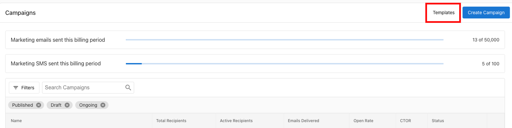
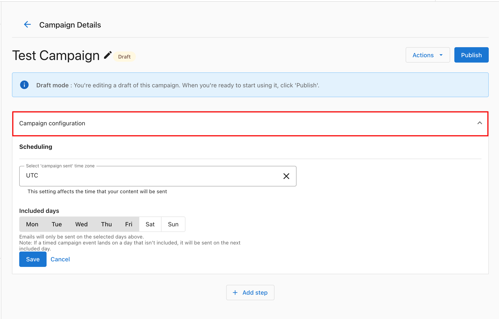
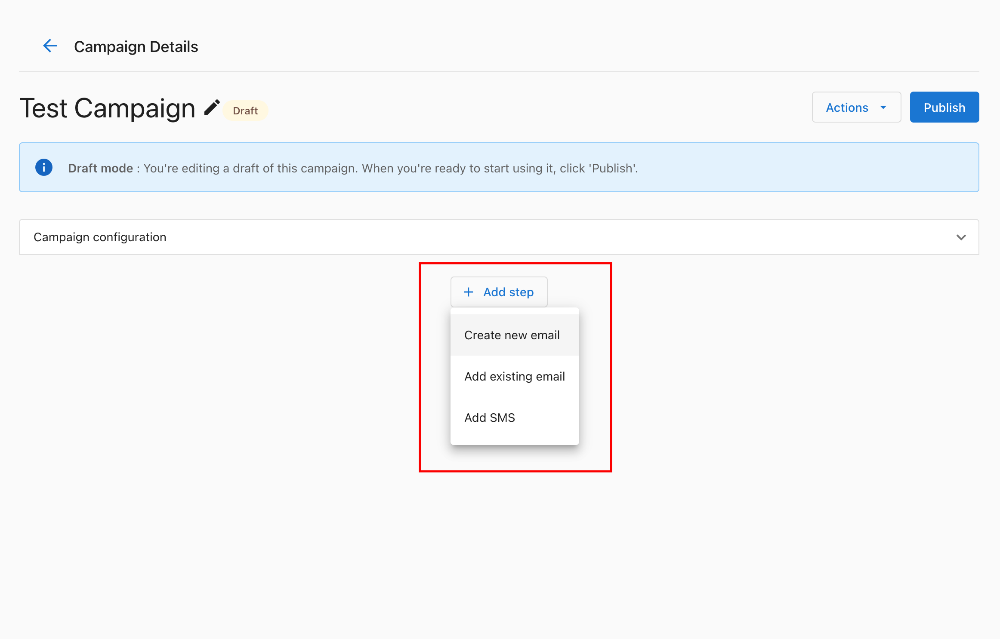
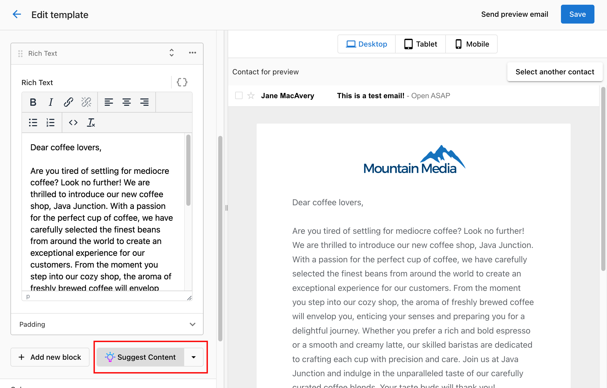
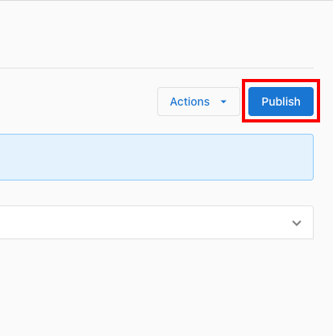
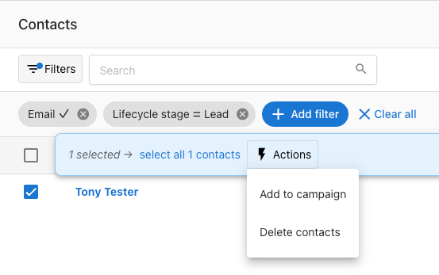

# Descripción general de Campaigns

Campaigns en Business App le permite a tus clientes ejecutar marketing por correo y SMS desde un solo lugar. El plan base incluye el envío de correos (por ejemplo, 10,000 correos por mes); el SMS requiere un complemento. Los clientes pueden crear campañas desde cero o desde plantillas, agregar pasos de correo o SMS, usar IA para generar contenido, y enviar a listas de contactos filtradas.

<iframe src="//www.youtube-nocookie.com/embed/cg0a5aRUjAk" width="560" height="315" frameBorder="0" allowFullScreen></iframe>

## ¿Por qué usar Campaigns?

- **Correo y SMS en un solo lugar**: crea campañas de varios pasos que combinen correo y SMS (se requiere el complemento de SMS para mensajes de texto).
- **Plantillas e IA**: comienza con plantillas prediseñadas o genera texto con IA.
- **Envíos dirigidos**: elige zona horaria, días de envío, y filtra contactos para que el mensaje correcto llegue a la audiencia correcta.
- **Integrado con Business App**: Campaigns convive junto con los contactos, Conversations y las automatizaciones.

## Hacer seguimiento de tus límites de envío

En la parte superior de la página Campaigns verás dos contadores que muestran cuánto de tu asignación mensual se ha usado en el período de facturación actual:

- **Marketing emails sent this billing period**: hace seguimiento del uso de correo frente a tu límite mensual (por ejemplo, 0 de 10,000)
- **Marketing SMS sent this billing period**: hace seguimiento del uso de SMS si tienes un complemento de SMS habilitado (por ejemplo, 0 de 50)

Ambos contadores se reinician al comienzo de cada período de facturación.

## Cómo usar Campaigns

**Paso 1**: ve a `Business App` → `Campaigns` → `Create Campaign`. Ponle un nombre a tu campaña y selecciona **Create**.

**O:** en la sección **Templates**, elige una plantilla desde la cual comenzar.

**Paso 2**: configura tu campaña. Establece la zona horaria y elige en qué días se envían los correos.

**Paso 3**: haz clic en **Add Step** para agregar un correo (escribe el tuyo, usa una plantilla, o usa IA) o agrega SMS.

**Paso 4**: crea tu correo. Puedes usar IA para generar el contenido del correo.

**Paso 5**: cuando estés listo, haz clic en **Publish** para iniciar tu campaña.

Para enviar tu campaña, ve a la pestaña **Contacts**. Puedes agregar filtros y enviar solo a los contactos que coincidan con tus criterios.

## Primeros pasos

1. **Abre Campaigns**: `Business App` → `Campaigns` → `Create Campaign` (o comienza desde **Templates**).
2. **Crea una campaña**: nómbrala, establece la zona horaria y los días de envío, luego usa **Add Step** para correo o SMS.
3. **Envía**: usa la pestaña **Contacts** para elegir destinatarios (con filtros si es necesario), luego publica y envía.

:::info
El plan base de Email & SMS Marketing incluye correo (por ejemplo, 10,000 correos/mes). Para enviar campañas de SMS, los clientes necesitan un **complemento de SMS** (disponible en Estados Unidos y Canadá).
:::

## Más sobre las campañas

- **[SMS campaigns](./sms-campaigns.mdx)**: complemento de SMS, creación y configuración de campañas de SMS (únicas o recurrentes), selección de audiencia, programación y cumplimiento normativo.

## Solución de problemas de campañas

### "Some contacts cannot be added to this campaign"

Este error ocurre cuando una campaña usa **campos dinámicos** (por ejemplo, una variable de personalización como `{{first_name}}`) y a uno o más contactos les falta un valor para ese campo. Los contactos con valores faltantes se excluyen.

**Cómo solucionarlo:**
- Elimina o haz opcional el campo dinámico del paso de correo, o
- Actualiza los contactos afectados en el CRM para completar los valores de campo faltantes antes de agregarlos a la campaña.

### La campaña muestra "Ongoing" pero no se entregan correos

1. Confirma que los destinatarios realmente se agregaron: abre la campaña y revisa la pestaña **Contacts** para verificar que la lista de contactos esté poblada.
2. Verifica que las direcciones de correo de los contactos sean válidas (sin errores de formato evidentes).
3. Confirma que la campaña tenga al menos un paso de correo publicado.

### Retrasos en la entrega de correo (correos diferidos)

Los correos pueden **diferirse** en lugar de enviarse de inmediato si el servidor de correo receptor los rechaza temporalmente. Esto es una parte normal de la entrega de correo; el sistema de envío reintenta automáticamente. Los correos diferidos no son fallas; generalmente se entregan dentro de unas horas. No se necesita ninguna acción a menos que un correo permanezca sin entregar por más de 24 horas.

### Las plantillas destacadas no cargan

Si la galería de plantillas aparece en blanco o no carga, revisa si la cuenta tiene información completa del **perfil de negocio**, particularmente el nombre, dirección y teléfono del negocio (NAP). Los datos de NAP faltantes pueden impedir el renderizado de la plantilla.

**Cómo solucionarlo:** ve a `Business App` → `Administration` → `Business Profile` y asegúrate de que todos los campos requeridos estén completos.

### Errores al subir imágenes

Los formatos de imagen admitidos para las campañas son **JPEG** y **PNG**. Si una carga falla:
- Confirma que el archivo sea `.jpg` o `.png` (no `.webp`, `.gif`, `.heic`, etc.)
- Mantén el tamaño del archivo por debajo de 5 MB
- Intenta volver a guardar la imagen en un editor de imágenes y volver a subirla

### Reiniciar una campaña publicada con la misma lista de contactos

Las campañas publicadas no se pueden reenviar directamente a la misma lista. Para enviar de nuevo:

1. Abre la campaña y haz clic en **Duplicate** (o usa el menú de tres puntos → **Copy campaign**).
2. Agrega tus contactos a la nueva copia.
3. Publica la copia.

## Preguntas frecuentes

¿Se puede exportar la actividad de campaña desde Email & SMS Marketing en Business App?

No. La actividad de campaña solo se puede ver en Business App. Abre una campaña y haz clic en el número debajo de **Recipients** para abrir la tabla de actividad de la campaña.

¿Cuántos correos puede enviar un negocio por mes?

Puedes enviar hasta 10,000 correos por mes de forma predeterminada. Puedes comprar un límite de envío de correo adicional en incrementos de 1,000 o 10,000 como complemento.

¿Necesito un complemento de SMS para usar SMS en Email & SMS Marketing?

Sí. Para enviar mensajes de SMS en Email & SMS Marketing, se requiere un **complemento de SMS**. Los complementos de SMS solo están disponibles en Estados Unidos y Canadá.

