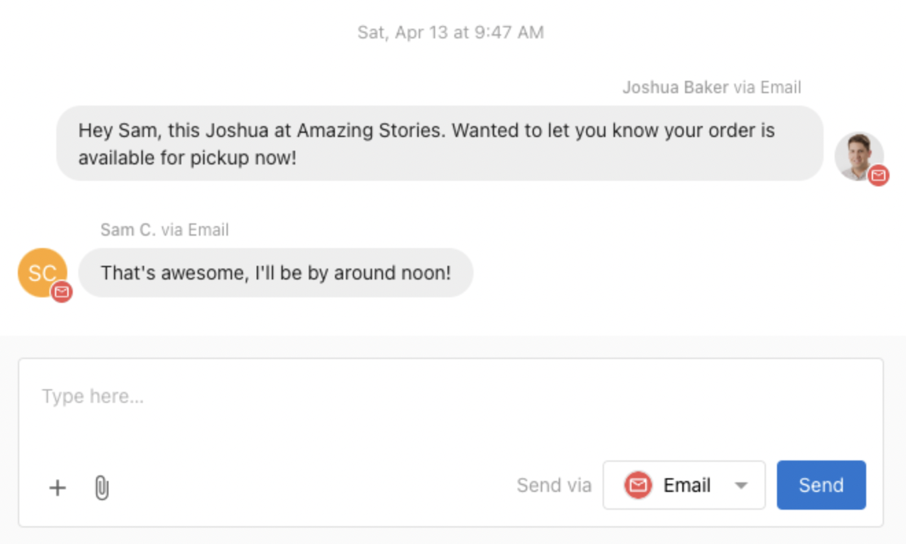

<iframe src="https://www.youtube-nocookie.com/embed/gBMk7gnG-IA" width="560" height="315" frameborder="0" allowfullscreen></iframe>

Conversations AI le permite al equipo de tu cliente enviar y recibir correos con clientes potenciales y clientes desde una dirección de correo compartida.

Cuando la cuenta de tu cliente recibe un nuevo cliente potencial desde el chat web o un formulario, y ese cliente potencial proporciona una dirección de correo como forma de contactarlo, cualquier persona del equipo de tu cliente puede responder por correo a ese cliente desde el inbox centralizado de Conversations AI, sin necesidad de abrir un cliente de correo separado.

### Funciones

- Disponible en los planes Standard, Pro, y Premium de Conversations AI
- Envía correos a los contactos usando la dirección de correo asignada de tu cliente
- Recibe las respuestas de correo de vuelta en un inbox compartido de Conversations AI, donde cualquier persona del equipo de tu cliente puede continuar la conversación
- Configura el reenvío de correo para recibir los correos enviados a la dirección de correo existente de tu cliente en Conversations AI
- Soporte de respuesta automática con IA para soporte al cliente por correo las 24 horas

## Cómo funciona el correo

### Dirección de correo asignada

A cada cuenta de cliente se le asigna una dirección de correo única de Conversations en el formato `reply+xxxxx@businessapp.io`. Todos los correos salientes de Conversations se envían desde esta dirección, y las respuestas de los clientes se enrutan automáticamente de vuelta al inbox de Conversations.

La dirección asignada es visible en `Business App` → `Administration` → `Email Configuration` → `Advanced email settings`, listada como `Forwarding address`.

### Enviar correos

Para enviar un correo a un contacto nuevo o existente:

1. Haz clic en `New Message` en Conversations
2. Ingresa la dirección de correo del destinatario
3. Escribe tu mensaje, luego selecciona `Email` en el menú desplegable `Send via`
4. Haz clic en `Send`

Cuando el cliente responde, su respuesta se enruta automáticamente de vuelta al mismo hilo de conversación, donde cualquier miembro del equipo de tu cliente puede continuar la conversación.

## Reenvío de correo

Al configurar el reenvío de correo, tu cliente puede recibir los correos enviados a una dirección que ya posee (como team@sunegocio.com) directamente en Conversations AI. Cuando un cliente envía un correo a la dirección de tu cliente, se reenvía una copia al inbox de Conversations, donde aparece como una nueva conversación. El equipo de tu cliente puede entonces leer y responder directamente desde Conversations.

Esto es útil cuando tu cliente quiere que los clientes envíen correos a una dirección familiar y de marca mientras su equipo gestiona todas las respuestas desde un solo lugar.

### Cómo configurar el reenvío

1. Encuentra la dirección de reenvío de Conversations en `Business App` → `Administration` → `Email Configuration` → `Advanced email settings`, en el campo `Forwarding address` (se ve como `reply+xxxxx@businessapp.io`)
2. Copia esta dirección
3. En los ajustes del proveedor de correo, agrega esta dirección como destino de reenvío

Una vez que el reenvío esté activo, cualquier correo enviado a la dirección de tu cliente también se entrega a Conversations.

### Reenviar desde Gmail

1. En Gmail, ve a `Settings` → `See all settings`
2. Selecciona la pestaña [Forwarding and POP/IMAP](https://mail.google.com/mail/u/0/#settings/fwdandpop)
3. Haz clic en `Add a forwarding address` y pega la dirección de reenvío de Conversations
4. Haz clic en `Next`, inicia sesión de nuevo si se requiere, y confirma
5. En Conversations, aparece un mensaje de confirmación con un enlace. Haz clic en el enlace para confirmar la solicitud de reenvío
6. Regresa a los ajustes de Forwarding de Gmail y habilita el reenvío, luego guarda los cambios

Los filtros de Gmail también se pueden usar para reenviar solo mensajes específicos.

### Reenviar desde Outlook

1. En Outlook, ve a `Settings`
2. Selecciona `Mail` → [Forwarding](https://outlook.live.com/mail/options/mail/forwarding)
3. Selecciona `Enable forwarding`, ingresa la dirección de reenvío de Conversations, y selecciona `Save`

## Ajustes de configuración de correo

La página `Business App` → `Administration` → `Email Configuration` contiene los ajustes de correo para cada cuenta de cliente.

- `Sender and reply settings`: controla el nombre del remitente, la dirección de respuesta, y la dirección de visualización usada por Campaigns y otros servicios integrados. Estos ajustes no afectan a los correos enviados a través de Conversations.
- `Advanced email settings`: contiene la dirección de reenvío de Conversations y la configuración del dominio de remitente. Se puede configurar un dominio de remitente personalizado para usar con Campaigns y otros servicios integrados. Conversations envía desde la dirección asignada `@businessapp.io`.
- `Email domains`: configuración de registros DNS (SPF, DKIM, DMARC) para dominios de remitente personalizados. Estos registros mejoran la entregabilidad de los correos enviados por Campaigns y otros servicios.

## Preguntas frecuentes

<strong>¿Puede tu cliente enviar correos de Conversations desde un dominio personalizado?</strong>

Conversations envía todos los correos desde la dirección asignada `reply+xxxxx@businessapp.io`. Se puede configurar un dominio de remitente personalizado en `Business App` → `Administration` → `Email Configuration`, pero eso se aplica a Campaigns y otros servicios integrados, no a Conversations.

Para darles a los clientes un punto de contacto familiar, configura el reenvío de correo desde la dirección de correo de tu cliente para que los mensajes entrantes lleguen a Conversations.

<strong>¿Puede cada miembro del equipo tener su propia dirección de correo?</strong>

Cada cuenta de cliente usa una dirección de correo compartida para Conversations. Cuando un miembro del equipo envía un mensaje, su nombre es visible en los detalles del remitente y la firma del correo, para que los clientes puedan ver con quién se están comunicando.

<strong>¿Qué es el área de "email configuration" en los ajustes de Business App?</strong>

La página `Email Configuration` en `Business App` → `Administration` → `Email Configuration` contiene ajustes tanto para Conversations como para otros servicios de correo. La sección `Sender and reply settings` se aplica a Campaigns y otros servicios integrados. La sección `Advanced email settings` es donde se encuentran la dirección de reenvío de Conversations y las opciones de dominio de remitente.

<strong>¿Hay un límite en cuántos correos se pueden enviar?</strong>

Sí. Hay una cuota diaria de envío de correo por cuenta de cliente. Si tu cliente no puede enviar correos, es posible que su cuenta haya alcanzado su límite diario. La cuota se reinicia cada 24 horas.

