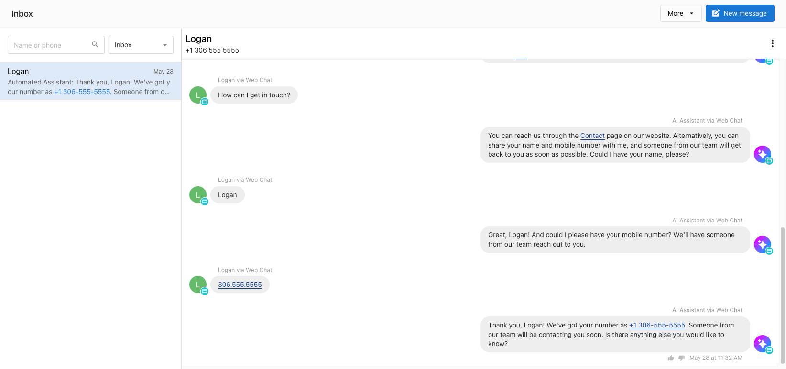

# Descripción general de Conversations

Conversations es una potente herramienta de captación de clientes potenciales y comunicación con clientes que centraliza todas las interacciones de tus clientes en un solo lugar. Permite a los negocios conectarse con los clientes a través de varios canales mientras proporciona asistencia impulsada por IA y funciones de colaboración en equipo.

## ¿Qué es Conversations?

Conversations centraliza la mensajería con clientes con integraciones de correo, Facebook, Instagram, WhatsApp, y más. Elimina la necesidad de gestionar varias herramientas de comunicación al reunir todo en una sola interfaz de equipo compartida.

## Beneficios principales

- **Comunicación centralizada**: todos los mensajes de clientes en un solo lugar en todos los canales
- **Colaboración en equipo**: conversaciones compartidas que cualquier miembro del equipo puede gestionar
- **Captación de clientes potenciales**: capta clientes potenciales de formularios del sitio web y haz seguimiento de inmediato
- **Disponibilidad 24/7**: el widget de chat impulsado por IA atiende a los clientes fuera del horario de negocio
- **Soporte multiubicación**: gestiona conversaciones en varias ubicaciones de negocio

## Funciones estándar (incluidas)

Cada cuenta de Business App incluye estas capacidades de mensajería:

### **Integración de correo**
- Envía y recibe correos desde una dirección de correo de negocio compartida
- Los miembros del equipo pueden colaborar en las conversaciones de correo
- Creación automática de contactos a partir de interacciones por correo

### **Integración de redes sociales** {#social-media-integration}
- **Páginas de Facebook**: conecta y responde a mensajes de Facebook
- **Instagram Business**: gestiona los mensajes directos de Instagram
- Disponible en todo el mundo para un servicio al cliente social sin interrupciones

### **Captación de clientes potenciales del sitio web**
- Instala formularios en sitios web de negocios para captar datos de contacto
- Crea automáticamente conversaciones a partir de los envíos de formulario
- Haz seguimiento a los clientes potenciales por correo o SMS

### **Eventos de Reputation**
- Las actividades de Reputation para **NPS feedback** y **Review matched** aparecen en Inbox como eventos de conversación.
- Las actualizaciones de NPS feedback se aplican al evento de Inbox existente para esa actividad, por lo que la conversación muestra la retroalimentación más reciente sin eventos duplicados.
- Los equipos pueden usar estos eventos para hacer seguimiento del sentimiento del cliente en el mismo Inbox usado para otras conversaciones con clientes.

### **Funciones de equipo**
- Interfaz de equipo compartida: ningún mensaje está vinculado a miembros individuales del equipo
- Todos pueden ver y participar en las conversaciones con clientes
- Entrega colaborativa de la experiencia del cliente

### **Actividad en la línea de tiempo de Inbox**
- La línea de tiempo del inbox de Conversations incluye tanto mensajes de clientes como actualizaciones de actividad generadas por el sistema.
- La actividad de Reputation aparece en la línea de tiempo cuando está disponible, incluidos los eventos de **NPS feedback** y **review matched**.
- Esto le da a los equipos contexto adicional en el mismo hilo mientras mantiene sin cambios los flujos de mensajería habituales.
### **Actividad de Reputation en Inbox**
- Las actualizaciones de NPS feedback y review matched aparecen como actividades de conversación en Inbox
- Estas actualizaciones permanecen en la misma línea de tiempo de conversación del cliente que otras interacciones
- Los equipos pueden revisar el sentimiento del cliente y el contexto de atribución de reseñas sin salir de Inbox
- Los flujos de trabajo existentes de mensajería y solicitud de reseñas continúan en la misma experiencia de Inbox
### **Eventos de actividad de Inbox**
- Los eventos de **NPS Feedback** aparecen como eventos de línea de tiempo entrantes con su ícono de evento correspondiente y el título **Contact has submitted NPS survey.**
- Los eventos de **Review Matched** aparecen como eventos de línea de tiempo entrantes con su ícono de evento correspondiente y el título **Review Matched.**
- El NPS feedback de varias líneas se muestra con los saltos de línea preservados en la línea de tiempo del inbox.

## Funciones Pro (actualización)

Conversations AI Pro y Premium desbloquean funciones avanzadas:

### **Widget de chat web asistido por IA** {#ai-assisted-web-chat-widget}
- Asistente de IA 24/7 para los visitantes del sitio web
- Responde en más de 40 idiomas, incluidos inglés, español, francés, alemán, italiano, y más
- Recopila la información de contacto del visitante para el seguimiento
- Transición fluida de la IA a agentes humanos
- Disponible en todo el mundo para cualquier sitio web

### **Mensajería SMS** (EE. UU. y Canadá)
- Mensajería SMS uno a uno ilimitada con los clientes
- Asignación automática de número de teléfono local
- Registro A2P 10DLC incluido para negocios de EE. UU.
- Integración con el CRM para la creación automática de contactos

### **Integración con WhatsApp** (internacional)
- Conecta cuentas de WhatsApp Business
- Esencial para negocios fuera de EE. UU./Canadá donde WhatsApp es preferido
- Gestiona las conversaciones de WhatsApp junto con otros canales

## Primeros pasos

1. **Habilita Conversations**: activa la función en Partner Center
2. **Conecta canales**: configura el correo, las redes sociales, y otras integraciones
3. **Configura la IA**: configura el widget de chat web y entrena la base de conocimiento de IA
4. **Capacitación del equipo**: familiariza a tu equipo con la interfaz compartida de Conversations

Conversations transforma la forma en que los negocios gestionan la comunicación con los clientes, proporcionando las herramientas necesarias para un servicio al cliente profesional y receptivo a escala.

## Disponibilidad de funciones por región

|  | Estados Unidos | Canadá | Internacional |
| --- | --- | --- | --- |
| **Mensajería SMS** | ✓ REQUIERE PRO | ✓ REQUIERE PRO | *No disponible* |
| **Captación de clientes potenciales de chat web con IA** | ✓ REQUIERE PRO | ✓ REQUIERE PRO | ✓ REQUIERE PRO |
| **Facebook Business Messenger** | ✓ | ✓ | ✓ |
| **Instagram Messenger** | ✓ | ✓ | ✓ |
| **Integración con WhatsApp** | ✓ REQUIERE PRO | ✓ REQUIERE PRO | ✓ REQUIERE PRO |
| **Correo electrónico** | ✓ | ✓ | ✓ |
| **Formularios web** | ✓ | ✓ | ✓ |

## Preguntas frecuentes

<strong>¿Conversations en Business App se puede integrar con otros CRM o sistemas de mensajería?</strong>

Los negocios pueden centralizar sus datos de clientes y contactos en el CRM de Business App usando las integraciones disponibles con Zapier, Quickbooks, y más. Además, se pueden crear automatizaciones que envíen mensajes cuando ocurran ciertos eventos.

<strong>¿Qué automatizaciones están disponibles para Conversations en Business App?</strong>

Automations en Business App incluye disparadores cuando se recibe un mensaje, y acciones para enviar un SMS o correo. Puedes crear flujos de trabajo automatizados potentes para tu negocio con el sistema Automations, junto con todas las integraciones disponibles en Business App.

<strong>¿Hay un costo por uso para el chat web asistido por IA?</strong>

No hay un costo por uso para la IA en Conversations AI. Las respuestas ilimitadas de IA de la captación de clientes potenciales de chat web asistido por IA están incluidas.

<strong>¿Qué idiomas admite la IA?</strong>

Tu asistente de IA puede responder a los clientes potenciales en más de 40 idiomas, incluidos inglés, español, francés, alemán, italiano, turco, polaco, ucraniano, ruso, japonés, chino, y muchos más.

<strong>Si instalamos el chat de Conversations AI en nuestro sitio web, ¿solo el agente de IA responderá a los clientes o los agentes reales hablarán con los clientes?</strong>

El chat web es 100% captación de clientes potenciales gestionada por IA. Los negocios pequeños están ocupados y no siempre pueden responder de inmediato; por eso el asistente de IA obtendrá el nombre y número del visitante del sitio web, y luego notificará al negocio que tiene un nuevo cliente potencial: el negocio puede responder vía SMS lo antes posible, y mover la conversación del sitio web al teléfono del cliente.

<strong>¿Cuánto sabe el chatbot sobre el negocio? ¿Puede responder preguntas?</strong>

El asistente de IA puede acceder al "conocimiento" del perfil de negocio, por lo que puede responder preguntas sobre servicios, ubicación e información de contacto, y horarios. También se puede entrenar con el texto de un sitio web de negocio. También puedes agregar "conocimiento" adicional de preguntas y respuestas en texto al asistente de IA para que pueda responder preguntas frecuentes de cualquier texto proporcionado.

<strong>¿Cómo instalo el widget de chat web?</strong>

El widget de chat web se puede instalar en cualquier sitio web. Para instalarlo, copia y pega el código de instalación del widget en el elemento `<head>` de tu sitio web, generalmente justo antes de la etiqueta de cierre `</head>`.

