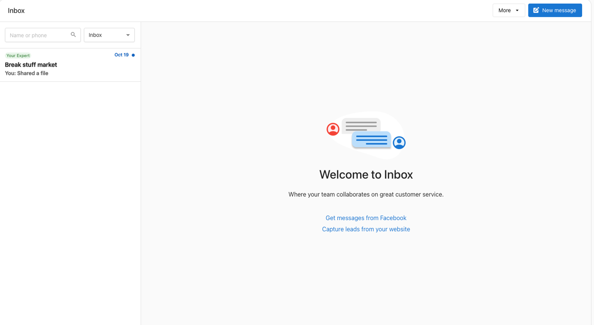
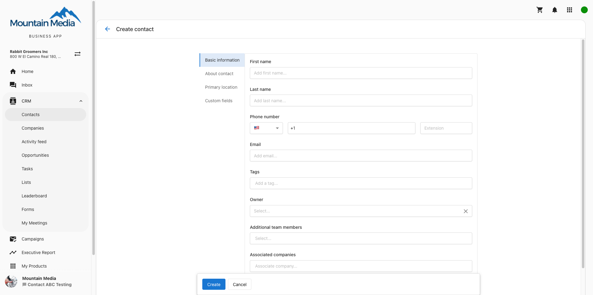
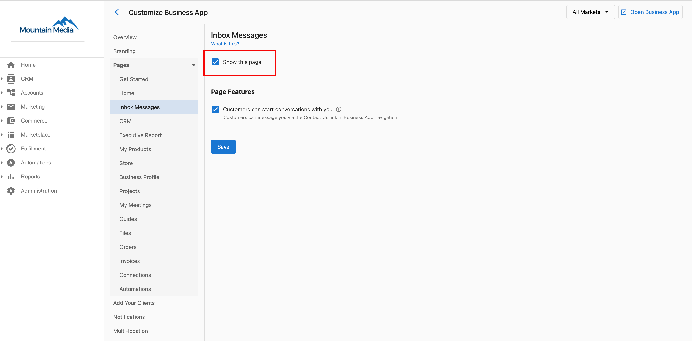

:::info
La función de mensajería SMS solo está disponible si te encuentras en Canadá o EE. UU.
:::

La mensajería SMS está incluida en los productos Conversations AI Pro y Premium, o se puede comprar como un producto independiente si no necesitas usar el widget de captación de clientes potenciales asistido por IA.

## Para negocios con sede en Estados Unidos

Los negocios con sede en EE. UU. deben registrar su negocio antes de enviar un mensaje.

El registro puede tardar algunas semanas. Una vez registrado, recibes una notificación y puedes enviar tu primer mensaje.

## Para negocios ubicados en Canadá, o negocios con sede en EE. UU. que han completado el registro

Para enviar tu primer mensaje de SMS,

1. Abre `Business App` → `Conversations AI`.
2. Haz clic en la indicación para comenzar a enviar mensajes.
3. Escribe el número de teléfono del cliente. El campo de entrada corregirá automáticamente el número de teléfono para que coincida con nuestro formato de número. Ej.: +1 (555) 555-5555.
4. Escribe un mensaje y envíalo.

### ¿Cómo agrego números de teléfono de clientes?

Cuando se envían mensajes desde Conversations AI, los contactos se crean automáticamente en los contactos de Business App.

Para agregar manualmente números de teléfono en Business App, ve a `CRM` → `Contacts` en el menú de la izquierda. Aquí puedes agregar nuevos contactos. También puedes importar clientes de forma masiva desde esta página.

### ¿Cuántos mensajes puede enviar tu cliente a sus clientes?

Con Conversations AI Pro o Premium, o el producto de SMS individual, las cuentas pueden enviar y recibir mensajes de SMS uno a uno ilimitados a los clientes. Cada operador limita el número de mensajes enviados y recibidos por día. Por ejemplo, se pueden enviar hasta 2000 segmentos de SMS y MMS por día a clientes en T-Mobile.

### ¿Qué número de teléfono se usa para enviar mensajes?

Al negocio se le asigna un número de SMS disponible según la dirección del negocio. El negocio puede compartir este número con los clientes y recibirá mensajes de texto y MMS enviados a él. No se pueden recibir llamadas en este número.

### Mi cliente no puede hacer clic en Conversations AI. ¿Cómo lo habilito?

Hay un ajuste titulado `Display Conversations AI Tab` en `Partner Center` → `Administration` → `Customize Business App` → `Conversations AI Messages`. Marca la casilla `Show this page`.

## Preguntas frecuentes

¿Por qué falta SMS Configuration para una cuenta de Conversations AI Pro en algunos países?

SMS Configuration solo aparece en mercados donde las regulaciones admitidas están cubiertas: Italia, Estados Unidos, y Australia. Las cuentas en otros países, incluidos los EAU, no muestran el ajuste.

