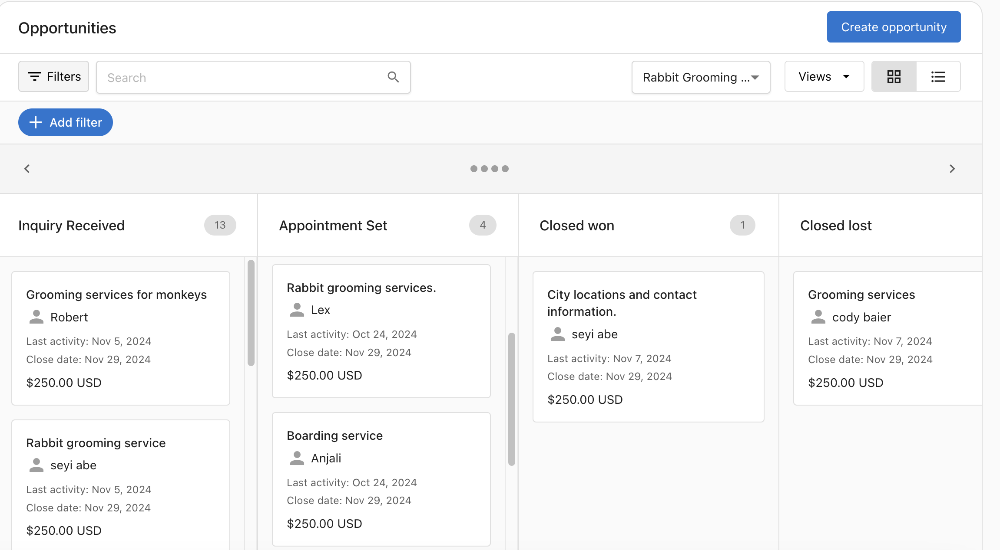

## ¿Qué es el CRM en Business App?

El CRM en Business App le da a tus clientes un lugar central para gestionar las relaciones con sus clientes. Reúne contactos, oportunidades y pipelines de venta para que los equipos puedan hacer seguimiento de clientes potenciales, mover negocios a través de etapas, y mantener los datos de clientes en un solo lugar. El CRM se integra con Conversations, formularios y otros productos de Business App para que los nuevos clientes potenciales e interacciones fluyan hacia el mismo sistema.

## ¿Por qué es importante el CRM?

El CRM ayuda a tus clientes a convertir clientes potenciales en negocios cerrados al organizar personas, empresas y oportunidades en una sola vista. Con pipelines, tareas y formularios, pueden captar clientes potenciales de la web, asignar seguimientos, y ver exactamente en qué punto está cada negocio. Para negocios con varias ubicaciones, los equipos corporativos pueden gestionar contactos y tareas en todas las ubicaciones desde una sola vista, mejorando los tiempos de respuesta y la consistencia.

## Qué incluye el CRM

### Funciones clave

- **Contacts**: almacena y gestiona personas (nombre, correo, teléfono, etiquetas); busca, filtra e importa vía CSV; sincroniza desde Conversations, Customer Voice, formularios del sitio web y Constant Contact
- **Opportunities**: haz seguimiento de posibles ventas con perfiles, vista de lista y vista de pipeline; crea y edita oportunidades; mueve negocios a través de etapas
- **Sales pipeline**: define etapas que coincidan con tu proceso de venta; establece la probabilidad de cierre por etapa; crea varios pipelines para diferentes productos o equipos
- **Forms**: crea formularios e incorpóralos en sitios web o páginas de destino; los envíos crean un contacto y una conversación para seguimiento y automatizaciones
- **Tasks**: haz seguimiento de seguimientos y actividades de venta; en configuraciones multiubicación, ve y completa tareas en todas las ubicaciones desde un solo lugar
- **Custom objects**: crea módulos personalizados para hacer seguimiento de datos específicos de la industria (equipos, propiedades, vehículos) junto con los registros estándar del CRM (requiere CRM AI Standard o Pro)
- **Booking links**: muestra un enlace de programación de reuniones en la tarjeta de contacto de Business App para que los clientes puedan agendar tiempo con un vendedor

### Funciones con IA

Con una suscripción a [CRM AI](/ai/ai-workforce/ai-sales-assistant), el CRM de Business App incluye:

- **AI Sales Assistant**: actualiza automáticamente los registros del CRM a partir de conversaciones de venta y conversa con los datos del CRM usando lenguaje natural
- **Conversation intelligence**: graba y transcribe reuniones con resúmenes generados por IA, elementos de acción y puntuación de conversación (CRM AI Pro)
- **Sales coaching**: información de coaching impulsada por IA en cada llamada con soporte para los marcos BANT, MEDDPICC y SANDLER (CRM AI Pro)

### Funciones y guías

- **[Creating and Customizing Your Sales Pipeline](../../crm/opportunities/sales-pipeline-overview.mdx)**: configurar pipelines, agregar y quitar etapas, varios pipelines
- **[Forms to capture leads in Business App](../../marketing/forms/index.mdx)**: crear formularios, agregar campos, incorporar en tu sitio, y conectar con el CRM y Conversations
- **[Managing Contacts and Tasks in Multi-Location](../../multi-location-business-app/crm/managing-contacts-tasks-multi-location.mdx)**: vista centralizada de tareas y contactos para equipos corporativos que gestionan varias ubicaciones
- **[Add a booking link to the contact card](/administration/platform-settings/customize-business-app/branding-settings#how-do-i-customize-the-contact-us-card)**: mostrar un enlace de reunión en la tarjeta de contacto del vendedor en Business App

## Pasos rápidos de configuración

Obtener valor del CRM generalmente implica algunos pasos de configuración:

### 1. **Configura un pipeline de ventas**
   - Pide a tu cliente que vaya a `Business App` → `CRM` → `Opportunities`
   - Haz clic en **Set up a pipeline** si no existe ninguno, luego agrega o ajusta etapas para que coincidan con su proceso de venta
   - Consulta [Creating and Customizing Your Sales Pipeline](../../crm/opportunities/sales-pipeline-overview.mdx) para más detalles

### 2. **Crea o importa contactos**
   - Ve a `Business App` → `CRM` → `Contacts`
   - Crea contactos manualmente o sube un CSV (hasta 5 MB) para importar de forma masiva
   - Los contactos también se pueden crear automáticamente cuando se envían formularios o cuando comienzan nuevas conversaciones

### 3. **Agrega un formulario para captar clientes potenciales**
   - Ve a `Business App` → `CRM` → `Contacts` → `Forms`
   - Crea un formulario, agrega campos, y luego usa el código de incorporación en un sitio web o página de destino
   - Los envíos crean un contacto y una conversación; usa automatizaciones para enviar respuestas o agregar contactos a campañas

### 4. **Configura un enlace de reserva (opcional)**
   - En `Partner Center` → `Administration` → `My team`, edita al vendedor y agrega un **Book a meeting link**
   - Asigna al vendedor a la cuenta para que el enlace aparezca en su tarjeta de contacto en Business App
   - Consulta [Add a booking link to the contact card](/administration/platform-settings/customize-business-app/branding-settings#how-do-i-customize-the-contact-us-card) para los pasos completos

:::tip Victoria rápida
Comienza con un pipeline simple y un formulario. Una vez que los clientes potenciales estén fluyendo hacia el CRM, agrega tareas y automatizaciones para mantener los seguimientos en curso.
:::

## Preguntas frecuentes

¿En qué se diferencian los Contacts de los usuarios de Business App?

Los contactos son personas (por ejemplo, clientes, clientes potenciales) almacenadas en el CRM; no tienen acceso a la plataforma. Los usuarios son personas que pueden iniciar sesión en Business App y usar productos. Cuando se crea una cuenta a través de Partner Center, se crea un usuario con un contacto correspondiente; en otros casos, los contactos y usuarios son independientes. Cambiar el correo de un contacto lo desasocia de cualquier usuario vinculado.

¿De dónde provienen los contactos en el CRM?

Los contactos se pueden agregar manualmente, importar vía CSV, o crear automáticamente cuando se sincronizan datos desde otros productos, por ejemplo, cuando se envía o recibe un mensaje en Conversations, se envía un formulario en el sitio web, o se crea un contacto en Customer Voice o Constant Contact.

¿Cómo configuro un pipeline de ventas?

Ve a `Business App` → `CRM` → `Opportunities` y haz clic en **Set up a pipeline**. Puedes agregar etapas, establecer la probabilidad de cierre para cada etapa, y crear varios pipelines. Las etapas **Closed Won** y **Closed Lost** son obligatorias y no se pueden eliminar. Consulta [Creating and Customizing Your Sales Pipeline](../../crm/opportunities/sales-pipeline-overview.mdx) para conocer todos los detalles.

¿Qué sucede cuando alguien envía un formulario?

Cuando se envía un formulario, se crea un contacto en el CRM y una conversación en Conversations. A partir de ahí, puedes usar automatizaciones para enviar una respuesta automática, agregar el contacto a una campaña de correo o SMS, crear una tarea, o activar otras acciones.

¿Cómo funciona la vista de tareas multiubicación?

Los equipos corporativos que gestionan varias ubicaciones pueden abrir Multi-location Business App e ir a `CRM` → `Tasks` para ver todas las tareas que se les asignaron en todas las ubicaciones en una sola vista. Esto les permite trabajar en seguimientos (por ejemplo, clientes potenciales de web chat, detractores de NPS) sin cambiar entre cuentas. Las automatizaciones pueden crear tareas cuando ocurren eventos (por ejemplo, un nuevo detractor); luego los representantes inician y completan tareas desde esta lista central.

¿Puedo agregar un enlace de reserva de reuniones a la tarjeta de contacto?

Sí. En Partner Center, ve a `Administration` → `My team`, edita al vendedor, e ingresa una URL en **Book a meeting link**. Asigna ese vendedor a la cuenta. El enlace luego aparece en su tarjeta de contacto en Business App para que los clientes puedan programar tiempo con ellos. Consulta [Add a booking link to the contact card](/administration/platform-settings/customize-business-app/branding-settings#how-do-i-customize-the-contact-us-card) para la configuración paso a paso.

¿Por qué los envíos de formulario no aparecen en el CRM?

La causa más común es usar **campos genéricos** en lugar de **campos de CRM/Contact** en el formulario. Los campos genéricos solo se exportan a una descarga CSV; no crean ni actualizan registros de contacto del CRM. Para que los envíos completen el CRM, usa los tipos de campo **CRM** o **Contact** al crear tu formulario. Ve a `Business App` → `CRM` → `Contacts` → `Forms`, abre el formulario, y revisa el tipo de cada campo.

¿Cuál es la diferencia entre los campos de CRM y los campos genéricos en los formularios?

Al agregar campos a un formulario, hay dos categorías:

- **Campos de CRM/Contact**: se asignan directamente a las propiedades del registro de contacto (nombre, correo, teléfono, etc.). Los envíos crean o actualizan un contacto en el CRM.
- **Campos genéricos**: campos de texto libre sin asignación al CRM. Los datos de estos campos solo se pueden obtener exportando el CSV del envío del formulario.

Usa campos de CRM o Contact para cualquier información que quieras que aparezca automáticamente en el registro de contacto.

¿Cómo funcionan los valores de menú desplegable en los formularios?

Los campos de menú desplegable tienen dos componentes: una **Label** y un **Value**. La Label es el texto que ve el usuario del formulario en el menú desplegable. El Value es lo que se guarda en el campo correspondiente del CRM cuando el usuario selecciona esa opción. Asegúrate de que el Value coincida exactamente con lo que espera el campo del CRM, de lo contrario los datos pueden no asignarse correctamente.

¿Puedo agregar archivos adjuntos a un formulario de Business App?

Los campos de carga de archivos no son compatibles en los formularios de Business App. Como solución alternativa, agrega un campo **Paragraph** o **Text** y pide al usuario que pegue una URL a un documento alojado en otro lugar (por ejemplo, Google Drive, Dropbox). El enlace se captura en el registro de contacto del CRM como cualquier otro campo de texto.

