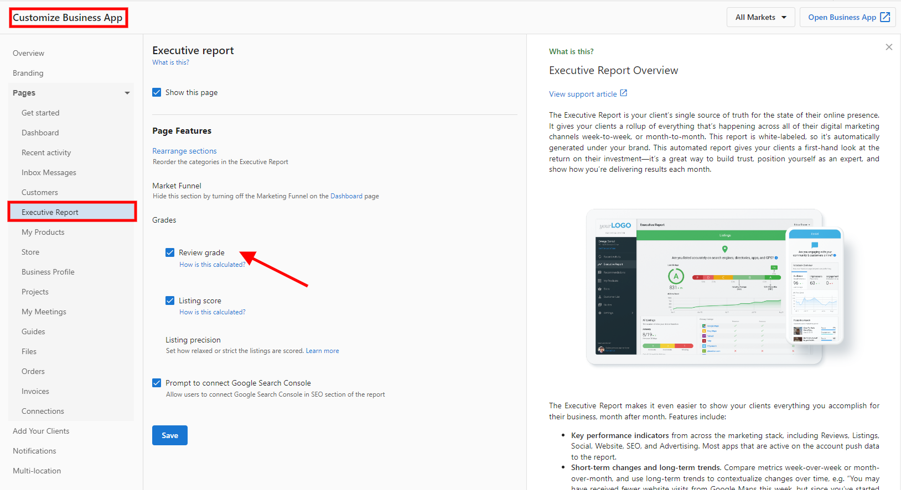
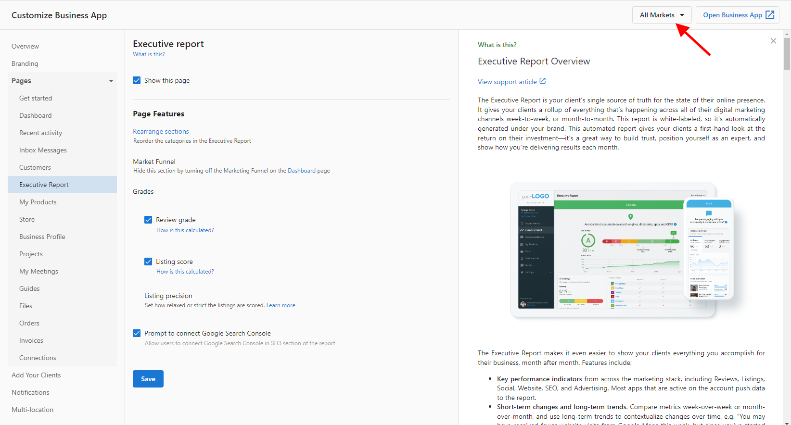

El Executive Report le muestra a tus clientes cómo están rindiendo sus negocios en varias categorías de marketing, incluida Reputation. Este artículo cubre un componente clave de los informes de reputación: el Review Grade.

## Review Grade

El Review Grade es una calificación con letra otorgada a los negocios de tus clientes para evaluar su presencia de reseñas en línea. El Review Grade se usa en el Sales Intelligence Report y el Snapshot Report para evaluar la reputación en línea de un negocio antes de asociarse con tu empresa.

El Review Grade en el Executive Report mejora la transparencia de los informes para tus clientes y muestra la comprobación de rendimiento a lo largo del tiempo.

### ¿Cómo se calcula el Review Grade?

El Review Grade se calcula según el rendimiento del negocio en cuatro categorías:

- Puntuación promedio de reseñas
- Número de fuentes de reseñas
- Reseñas encontradas
- Número de reseñas encontradas por mes

Las puntuaciones en las cuatro categorías se combinan y se comparan con el promedio de la industria para obtener la calificación final con letra usando este sistema de calificación por percentil:

- **A** = percentil 90 - 100
- **B** = percentil 75 - 89
- **C** = percentil 50 - 74
- **D** = percentil 30 - 49
- **F** = percentil 0 - 29

*Por ejemplo, si un negocio tiene una puntuación promedio de reseñas de 3.5, esto coloca al negocio en el percentil 10 en comparación con el promedio de la industria (4.32) y el líder de la industria (5). Esta categoría recibe una F. Se hacen los mismos cálculos para las otras tres categorías y una puntuación combinada resulta en un Review Grade de C.*

El Review Grade está activado de forma predeterminada.

### Cómo deshabilitar el Review Grade

No recomendamos deshabilitar el Review Grade de los Executive Reports de tus clientes; sin embargo, puedes hacerlo desde un ajuste en Partner Center.

**Para desactivar el Review Grade para todos los mercados (si corresponde):**

1. Inicia sesión en [Partner Center](https://partners.vendasta.com)
2. `Administration` → `Customize Business App` → `Executive Report` → `Review Grade`
3. Desmarca la casilla junto a `Show Review Grade Card in Executive Report for SMBs`.

Todos los mercados seguirán estos ajustes de partner. Si deseas habilitar el Review Grade para mercados seleccionados, sigue los pasos a continuación, pero asegúrate de que el ajuste esté configurado en `Enable`.

**Para desactivar el Review Grade para mercados seleccionados:**

1. Inicia sesión en [Partner Center](https://partners.vendasta.com) → `Administration` → `Customize Business App` → `Executive Report` → `Review Grade`
2. Haz clic en la pestaña `Markets`.
3. Desmarca la casilla junto a `Show Review Grade Card in Executive Report for SMBs`.

