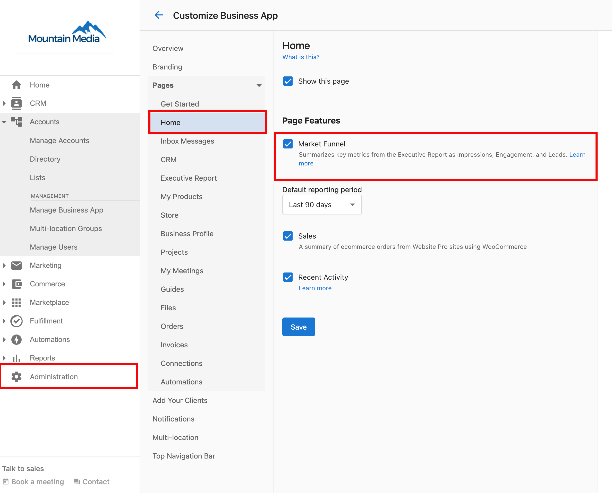

La página Home es el panel principal de tus clientes: lo primero que ven al iniciar sesión en Business App. Ofrece una vista general del rendimiento del negocio y acceso rápido a las funciones clave.

## Qué ven los clientes

- **Key Metrics**: datos de rendimiento organizados en Impressions, Engagement y Leads
- **Recent Activity**: feed en vivo de mensajes, llamadas e interacciones con clientes
- **Business Profile**: acceso rápido a la información de ubicación y la gestión de perfil
- **Products & Services**: ofertas disponibles e integración con la tienda
- **Next steps**: una lista de verificación de configuración para usuarios nuevos, junto con el resumen de trabajo de IA y las tarjetas de producto recomendadas

## Personalización del partner

Ve a `Partner Center` → `Administration` → `Customize Business App` → `Pages` → `Home` para controlar:

- **Tarjeta "AI has done the work"**: mostrar/ocultar el resumen de trabajo de IA
- **Tarjetas "Recommended for your business"**: mostrar/ocultar las tarjetas de actualización de producto
- **Tarjeta "Next steps"**: mostrar/ocultar la lista de verificación de configuración
- **Marketing Funnel**: activar/desactivar la visualización de métricas clave
- **Recent Activity**: mostrar/ocultar el feed de actividad
- **Sales Summary**: mostrar resúmenes de pedidos de comercio electrónico
- **Default Reporting Period**: establecer el período de tiempo para las métricas

## Marketing Funnel

El Marketing Funnel muestra métricas clave del Executive Report en tres categorías fáciles de entender, ayudando a tus clientes a ver cómo sus esfuerzos de marketing impulsan los resultados del negocio.

### Cómo funciona

El Marketing Funnel organiza los datos de rendimiento en:

- **Impressions**: vistas del contenido en línea (vistas de Google Business Profile, alcance en redes sociales)
- **Engagement**: interacciones con el contenido del negocio (visitas al sitio web, reseñas, llamadas)
- **Leads**: nuevos prospectos de varias fuentes (llamadas telefónicas, SMS, formularios, automatizaciones)

Esto le da a los clientes una vista clara de su rendimiento de marketing sin necesidad de profundizar en informes detallados.

### Opciones de personalización

Los partners pueden controlar la visualización del Marketing Funnel y configurar:

- **Default Reporting Period**: establece el período de tiempo (por ejemplo, últimos 90 días)
- **Show/Hide Feature**: activa/desactiva toda la sección de Marketing Funnel
- **Metrics Selection**: elige qué métricas mostrar

### Cómo deshabilitarlo

Para deshabilitar el Marketing Funnel:

1. Ve a `Partner Center` → `Administration` → `Customize Business App`
2. Ve a `Pages` → `Home`
3. Desmarca `Marketing Funnel`
4. Haz clic en `Save`

## Invitar a un miembro del equipo

La opción `Invite team member` permite a tus clientes invitar a miembros adicionales del equipo.

### Cómo invitar a un miembro del equipo

1. Inicia sesión en **Business App**.
2. Desde la **página Home**, selecciona `Invite team member` en la parte superior derecha de la página.
3. Ingresa el nombre, apellido y dirección de correo electrónico del miembro del equipo que deseas invitar.
4. Haz clic en `Send invite`.

El miembro del equipo invitado recibirá un correo electrónico con instrucciones para unirse y acceder a la cuenta de Business App.

## Relacionado

- [Setup Guide](/administration/platform-settings/customize-business-app/setup-guide): guía completa de configuración y funciones de Business App
