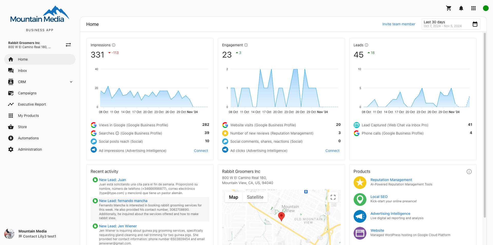

# Descripción general de Business App

Business App es el panel de cara al cliente que le da acceso a productos, servicios, informes y herramientas de comunicación, todo bajo tu marca. Sirve como un centro central donde tus clientes pueden acceder a todo lo que ofreces, incluidos los informes automatizados de comprobación de rendimiento y la gestión de productos.

## Primeros pasos con Business App

¿Listo para configurar Business App para tus clientes?

1. **[Setting up Business App](/administration/platform-settings/customize-business-app/setup-guide)**: configura la marca, las funciones, los usuarios y los permisos.
2. **[Demoing Business App to Clients](./demoing-business-app-to-clients.mdx)**: aprende a guiar a los clientes a través de su panel.

## ¿Qué es Business App?

Business App es el panel de cara al cliente que transforma la forma en que los clientes interactúan con tus servicios. Esta plataforma de marca blanca consolida todos los puntos de contacto con el cliente en una sola experiencia de marca, donde los clientes pueden:

- Acceder a su Executive Report personalizado con analíticas de negocio
- Iniciar y gestionar sus productos y servicios activos
- Comunicarse directamente con tu equipo a través de mensajería integrada
- Comprar productos adicionales a través de tu tienda de marca
- Configurar su perfil de negocio en línea y su presencia
- Supervisar el rendimiento en varias ubicaciones de negocio

## ¿Por qué es importante Business App?

Business App transforma las relaciones con los clientes al centralizar todas las interacciones y servicios en una sola plataforma de marca. La plataforma optimiza la incorporación de clientes, mejora las tasas de interacción, y ayuda a convertir prospectos en clientes de pago a través de flujos de trabajo guiados y demostración de valor.

**Beneficios clave:**

- **Experiencia unificada del cliente**: todos los servicios accesibles a través de un panel de marca
- **Mayor interacción**: comunicación y gestión de servicios centralizadas
- **Marca profesional**: solución de marca blanca totalmente personalizable
- **Crecimiento escalable**: herramientas integradas de tienda y captación
- **Soporte multiubicación**: gestiona varias ubicaciones de negocio sin problemas

## Qué pueden hacer tus clientes

En Business App, tus clientes pueden:

- Ver sus analíticas de negocio de toda la web en [su Executive Report personalizado](/business-app/executive-report)
- Ver su actividad en línea del negocio y sus métricas de rendimiento
- [Configurar su Business Profile en línea](/business-app/administration/business-profile-in-business-app) y cómo aparece su negocio en línea
- Iniciar [productos y servicios](/business-app/my-products) activos
- [Comprar nuevos productos](/business-app/store) y servicios a través de tu tienda de marca
- Enviar y recibir mensajes con clientes a través de [Conversations](/business-app/conversations/)
- [Gestionar notificaciones por correo](/business-app/administration) y preferencias de comunicación
- Supervisar y gestionar datos en línea de varios negocios con [Multi-Location Business App](/multi-location-business-app/)
- Instalar la aplicación sin marca en dispositivos móviles (iOS y Android) o la Progressive Web App (PWA) de marca blanca
- Acceder a herramientas y automatizaciones impulsadas por IA para optimizar sus flujos de trabajo

## Qué incluye

### **Funciones principales**
- **[Setup Guide](/administration/platform-settings/customize-business-app/setup-guide)**: guía completa de incorporación y configuración
- **[Home Dashboard](./home/)**: descripción general y navegación del panel del cliente
- **[Mobile App](https://docs.businessapp.io/business-app/administration/mobile-app)**: instalación y funciones de la aplicación móvil

### **Comunicación y gestión de clientes**
- **[Conversations](./conversations/)**: mensajería unificada, chat, correo, SMS y gestión de redes sociales
- **[CRM](./crm/)**: gestión de contactos, formularios, oportunidades y pipeline de ventas
- **[Campaigns](./campaigns/)**: campañas de marketing por SMS y correo

### **Analíticas e informes**
- **[Executive Report](./executive-report/)**: analíticas integrales de rendimiento de negocio
- **[My Products](./my-products/)**: seguimiento del uso y rendimiento de productos

### **Comercio electrónico y ventas**
- **[Store](./store/)**: mercado de productos y servicios de cara al cliente, y configuración

### **Administración y configuración**
- **[Administration Overview](/business-app/administration/)**: guía completa de administración y configuración
- **[Business Profile Setup](/business-app/administration/business-profile-in-business-app)**: configura la información del negocio del cliente y su presencia en línea
- **[Administration](/business-app/administration/)**: configura el correo, las integraciones, la facturación y otros ajustes de Business App
- **[Integrations Overview](./administration/integrations/index.mdx)**: conecta Business App con herramientas y servicios externos
- **[QuickBooks Integration](./administration/integrations/quickbooks.mdx)**: integración y configuración de datos financieros
- **[Google Analytics Connection](./administration/integrations/google-analytics.mdx)**: integración de analíticas del sitio web

### **Automatización y eficiencia**
- **[Automations](./automations/)**: automatización de flujos de trabajo, plantillas y disparadores
- **[Automation Templates](https://docs.businessapp.io/business-app/automations/automation-templates-in-business-app)**: plantillas de flujo de trabajo prediseñadas (documentación de Business App)
- **[Review Requesting](https://docs.businessapp.io/business-app/automations/automations-review-requesting)**: flujos de trabajo automatizados de recopilación de reseñas (documentación de Business App)

## Obtener ayuda

Para más recursos y guías de configuración detalladas:

- **[Business App Documentation Site](https://docs.businessapp.io/)**: guías completas dentro de la aplicación y tutoriales de usuario
- **[Developer API Documentation](https://developers.vendasta.com/)**: guías de integración técnica y referencias de API para el desarrollo personalizado de Business App
- **[Partner Center Overview](/partner-center/overview)**: accede a los controles de administración y las herramientas de gestión de clientes
- **[Setup Guide](/administration/platform-settings/customize-business-app/setup-guide)**: instrucciones de configuración paso a paso

### Recursos para desarrolladores

Para partners que crean integraciones personalizadas o extienden la funcionalidad de Business App:

- **[Vendasta Developer Portal](https://developers.vendasta.com/)**: documentación de API, SDK y ejemplos de integración
- **[Administration Guide](/business-app/administration/)**: configuración técnica y de integración

Cada módulo de Business App está diseñado para integrarse sin problemas con tus flujos de trabajo existentes de gestión de clientes. Haz clic en cualquier sección anterior para obtener más información sobre funciones específicas, requisitos de configuración y opciones.

## Preguntas frecuentes

### **Configuración**

¿Cómo configuro la marca y personalizo Business App para mis clientes?

Para configurar la marca y personalización de Business App:

1. **Configura la marca del partner:**
   - Ve a **Partner Center > Administration > Partner Branding**
   - Sube tu logotipo y personaliza el dominio
   - Establece un ícono de acceso directo para la instalación de la aplicación web móvil
   - Configura la marca específica del mercado si es necesario

2. **Personaliza funciones y acceso:**
   - Ve a **Partner Center > Administration > Customize Business App**
   - Habilita o deshabilita pestañas y funciones específicas
   - Configura las tarjetas de la página Home, incluida la lista de verificación **Next steps**
   - Establece las preferencias de notificación predeterminadas

Para instrucciones de configuración detalladas, consulta nuestra [guía de configuración completa](/administration/platform-settings/customize-business-app/setup-guide).

¿Cómo controlo qué pestañas y funciones están disponibles para los clientes?

Puedes personalizar el acceso a las pestañas de dos maneras:

**Para usuarios individuales:**
1. Ve a **Partner Center > Accounts > Manage Users**
2. Selecciona los usuarios a modificar
3. Haz clic en **Bulk Update x Users**
4. Configura los permisos de acceso a las pestañas

**Para ajustes globales:**
- Ve a **Partner Center > Administration > Customize Business App**
- Activa o desactiva páginas para todas las cuentas de Business App

Las pestañas disponibles incluyen: Home, Conversations, CRM, Campaigns, Executive Report, My Products, Store, Automations y Administration.

¿Cómo oculto la lista de verificación de configuración en la página Home de Business App?

Para ocultar la lista de verificación **Next steps**:

1. Ve a **Partner Center → Administration → Customize Business App → Pages → Home**
2. Desmarca la casilla de la tarjeta **"Next steps" card**
3. Guarda tus cambios

Esto oculta la lista de verificación para todos tus clientes. Las tarjetas **"AI has done the work"** y **"Recommended for your business"** tienen sus propias casillas en el mismo lugar; consulta [la experiencia de incorporación con IA](/business-app/ai-onboarding-experience#how-partners-customize-what-smbs-see).

### **Aplicación móvil y acceso**

¿Cómo instalan los clientes la aplicación móvil de Business App?

Los clientes pueden instalar la aplicación móvil de Business App desde:

**Dispositivos iOS:**
- Descarga "BusinessApp.io" desde la Apple App Store
- Inicia sesión usando su correo y una contraseña de un solo uso (OTP)
- Selecciona la cuenta de partner correcta si hay varias disponibles

**Dispositivos Android:**
- Descarga "BusinessApp.io" desde Google Play Store
- Inicia sesión usando correo y autenticación OTP
- Elige su cuenta de partner durante el inicio de sesión

**Progressive Web App (PWA):**
- Ve a la URL de Business App en el navegador móvil
- Sigue las indicaciones específicas del dispositivo para "Add to Home Screen"

:::note Ten en cuenta:
La marca de mercado no es compatible; el ícono de la pantalla de inicio utilizará el logotipo de todos los mercados.
:::

¿Por qué no recibo el correo con la OTP para el inicio de sesión en la aplicación móvil?

Si no estás recibiendo correos con la OTP:

- Revisa las carpetas de spam/correo no deseado
- Verifica que la dirección de correo sea correcta
- Espera de 2 a 3 minutos para la entrega
- Intenta reenviar el código
- Asegúrate de que tu dirección de correo esté asociada con una cuenta de Business App

Si los problemas persisten, contacta a soporte para obtener ayuda con la verificación de la cuenta.

¿Por qué veo varias cuentas de partner al iniciar sesión?

Esto es normal si tu correo está asociado con varios partners. Simplemente selecciona la cuenta de partner correcta para tu negocio. Los partners también pueden ver una cuenta de Vendasta (usada para comunicaciones de partner). Elige la cuenta que corresponda a tu relación de negocio.

### **Conversations y SMS**

¿Qué países pueden usar mensajería SMS en Business App?

La mensajería SMS en Business App actualmente está disponible solo para negocios ubicados en **Estados Unidos y Canadá**. Los negocios internacionales pueden usar:

- Web chat
- Mensajería por correo
- Facebook Messenger
- Mensajería de Instagram
- WhatsApp (donde esté disponible)

¿Cómo se le asigna un número de SMS a un negocio?

Al activar Conversations AI Pro o Premium, los negocios reciben automáticamente un número de SMS:

1. El sistema primero intenta asignar un número local según la dirección del perfil de negocio
2. Si no está disponible, se asigna un número de área vecina
3. Ve el número asignado en Business App en `Administration` → `Conversation` → `Your SMS number`
4. Contacta a soporte para asistencia con números 800 si es necesario

¿Los negocios de EE. UU. necesitan registrarse antes de enviar mensajes de SMS?

Sí, **los negocios con sede en EE. UU. deben registrarse** antes de enviar mensajes de SMS:

- El registro puede tardar varias semanas en completarse
- Una vez registrados, los usuarios reciben una notificación y pueden comenzar a enviar mensajes
- Los negocios canadienses no requieren registro

### **Integraciones y conexiones**

¿Cómo conecto servicios externos e integraciones a Business App?

Business App admite varios tipos de integración:

**Integraciones basadas en clave API:**
1. Ve a **Administration > Connections**
2. Encuentra el servicio que quieres conectar
3. Ingresa tu clave API y sigue las instrucciones de configuración

**Integraciones basadas en SSO:**
1. Ve a la pestaña **Connections**
2. Haz clic en **Connect** en el servicio deseado
3. Completa el proceso de autenticación de inicio de sesión único

**Integraciones gestionadas por el proveedor:**
- Contacta al proveedor directamente para la configuración
- Sigue la documentación específica del proveedor
- Supervisa el estado a través de Business App

Los indicadores de estado de conexión muestran: Connected, Connection Issue, o Pending.

¿Por qué mi integración muestra un estado "Connection Issue"?

Causas y soluciones comunes para problemas de integración:

- **Clave API inválida**: verifica que la clave API sea correcta y no haya expirado
- **Permisos**: asegúrate de que la clave API tenga los permisos necesarios
- **Tiempo de inactividad del servicio**: verifica si el servicio de terceros está experimentando interrupciones
- **Autenticación expirada**: vuelve a autenticar tu conexión

Intenta desconectar y volver a conectar la integración. Contacta al proveedor de servicio o a soporte de Vendasta si los problemas persisten.

### **Tienda y productos**

¿Cómo compran los clientes productos a través de la tienda de Business App?

Los clientes pueden explorar y comprar productos directamente desde Business App:

1. Ve a la pestaña **Store** en Business App
2. Explora los paquetes y productos disponibles
3. Haz clic en cualquier paquete para ver detalles, precios y funciones
4. Elige **Contact Sales** o **Add to Cart** según la configuración del paquete
5. Completa el proceso de compra o consulta

La tienda muestra todos los productos y paquetes que has publicado con materiales de marketing completos, precios y detalles del producto.

¿Pueden los clientes organizar y marcar como favoritos sus productos en Business App?

Sí, los clientes pueden fijar productos favoritos para un acceso más fácil:

1. Ve a la pestaña **My Products**
2. Haz clic en el ícono de pin junto a los productos deseados
3. Los productos fijados se mueven a la parte superior de la tarjeta Products, la navegación y la página My Products
4. Los primeros cuatro elementos fijados se muestran en su panel

Esto ayuda a los clientes con muchos productos a organizar sus servicios más usados.

### **Notificaciones y correo**

¿Qué tipos de notificaciones por correo envía Business App?

Business App envía dos tipos de notificaciones:

**Correos instantáneos** (cuando estén disponibles):
- Activación de Business App y cargas de archivos
- Nuevos mensajes y reseñas
- Actividad en redes sociales y clientes potenciales
- Actualizaciones de estado del sitio web y dominio

**Correos de resumen diario:**
- Resumen de la actividad del día anterior, incluidos mensajes, reseñas, listados, publicaciones sociales y actualizaciones de publicidad

Los partners controlan los ajustes de notificación predeterminados, y los clientes pueden modificar sus preferencias en **Settings > Notification Settings**.

¿Cómo gestionan los clientes sus preferencias de notificación?

Los clientes pueden personalizar sus notificaciones:

1. Haz clic en el menú desplegable de su nombre en Business App
2. Selecciona **Edit Profile**
3. Ve a **Notification Settings**
4. Elige entre correos instantáneos, correos de resumen diario, o ambos
5. Selecciona los tipos de notificación específicos que desea recibir

Los partners también pueden establecer las preferencias de notificación predeterminadas en **Partner Center > Administration > Customize Business App**.

### **Gestión multiubicación**

¿Cómo cambian los clientes entre varias ubicaciones de negocio?

Para clientes con varias ubicaciones:

1. **Cambiar de ubicación:**
   - Haz clic en el nombre del negocio en Business App
   - Elige la ubicación deseada en el menú desplegable
   - La interfaz se actualiza para mostrar los datos de esa ubicación

2. **Establecer la ubicación predeterminada:**
   - Selecciona los tres puntos junto a la ubicación deseada
   - Elige **Make default**
   - Esta ubicación se cargará automáticamente al acceder a Business App

¿Deberían los clientes conectar sus cuentas sociales en Business App primero?

Sí, conectar las cuentas sociales (Facebook, Google Business Profile) en Business App primero ofrece varios beneficios:

- Conecta automáticamente las cuentas a otras áreas de la plataforma como Social AI, Reputation AI y Local SEO
- Habilita estadísticas valiosas en todas las secciones de producto del Executive Report
- Impulsa los datos del Marketing Funnel incluso sin productos activos
- Optimiza el proceso general de configuración en varios productos

### **Solución de problemas**

¿Qué hago si mi Google Business Profile está suspendido?

Si un Google Business Profile está suspendido:

1. **Revisa los requisitos**: consulta las [pautas de Google Business Profile](https://support.google.com/business/answer/3038177)
2. **Corrige los problemas**: actualiza tu perfil para cumplir con todos los requisitos de las pautas
3. **Solicita el restablecimiento**: usa el [formulario oficial de Google](https://support.google.com/business/troubleshooter/2690129)
4. **Apela si se deniega**: [contacta a Google directamente](https://support.google.com/business/gethelp) si se deniega incorrectamente

**Importante**: envía solo una solicitud por cuenta para evitar demoras. Vendasta no puede apelar suspensiones en nombre de los negocios.

¿Por qué faltan algunas funciones de Business App en móvil?

No todas las funciones web están disponibles en móvil todavía:

- Las funciones principales de comunicación y CRM tienen prioridad
- Algunas funciones complejas se abren automáticamente en el navegador móvil
- Se agregan funciones adicionales en actualizaciones regulares
- Las funciones móviles actuales incluyen: Home, Conversations, Executive Report, CRM, AI Workforce, Reputation AI y Listings

Las versiones móviles completas para las funciones restantes están planificadas para futuras versiones.

¿Cómo soluciono problemas de inicio de sesión en Business App?

Pasos comunes de solución de problemas de inicio de sesión:

**Problemas de la aplicación web:**
- Borra el caché y las cookies del navegador
- Intenta con una ventana de navegación privada/incógnito
- Verifica la URL de inicio de sesión correcta para tu partner
- Revisa problemas de compatibilidad del navegador

**Problemas de la aplicación móvil:**
- Asegúrate de que la aplicación esté actualizada a la última versión
- Revisa la entrega del correo con la OTP (incluidas las carpetas de spam)
- Verifica la selección correcta del partner durante el inicio de sesión
- Reinicia la aplicación e inténtalo de nuevo

Contacta a soporte si los problemas persisten después de intentar estos pasos.

