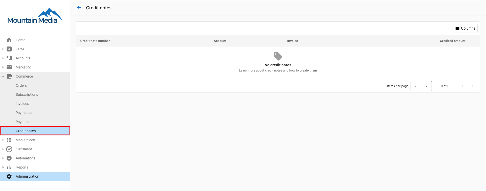
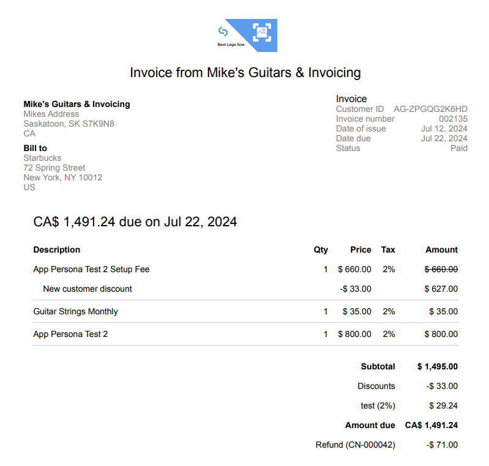

## Emitir notas de crédito {#issue-credit-notes}

Una nota de crédito es un documento que emites a un cliente para reducir el monto de una factura vencida o pagada. Esto puede ser necesario debido a un error en un pedido o factura, o para reembolsar un monto pagado por productos o servicios. Una nota de crédito actúa como lo opuesto a una factura, revirtiendo el monto que el cliente te debe.

## Motivos comunes para emitir notas de crédito

- Cobro excesivo accidental a un cliente.
- Compensar a un cliente.
- Un cliente solicitó un reembolso.
- Ofrecer un descuento en una factura vencida o pagada.

## Tipos de notas de crédito

Para una factura vencida, las **notas de crédito de ajuste** reducen el monto que se debe pagar. Para facturas ya pagadas, las **notas de crédito reembolsables** se pueden usar para emitir un reembolso a la cuenta bancaria del cliente. Las notas de crédito también ayudan a mantener un registro de todas estas transacciones inversas para informes y conciliación.

## Aplicar una nota de crédito a una factura

1. **Selecciona la factura:** ve a la factura a la que quieres aplicar una nota de crédito. Puede ser una factura vencida o pagada.
2. **Emitir nota de crédito:** haz clic en el menú kebab (tres puntos verticales) en la esquina superior derecha de la página de la factura y selecciona `Issue credit note` para cargar la página de notas de crédito.
3. **Carga automática de detalles:** los detalles de la factura original, incluidos la descripción, la cantidad, el impuesto y el monto, se cargan automáticamente en la página.
4. **Edita las líneas de artículos:**
   - Ajusta el monto del crédito, la cantidad, el impuesto, etc., en la línea de artículo que deseas acreditar.
   - Elimina otras líneas de artículos si es necesario o establece el monto del crédito en cero.
   - También puedes agregar una línea de artículo personalizada para acreditar o editar la descripción de las líneas de artículos existentes.
   - **Nota:** el monto del crédito es el monto que deseas acreditar en la factura.
5. **Selecciona el tipo de reembolso** (solo para facturas ya pagadas):
   - `Refund payment method`: inicia automáticamente un reembolso a la cuenta bancaria del cliente.
   - `Refund manually`: actualiza el registro de la factura para que puedas gestionar los reembolsos fuera de línea (por ejemplo, efectivo, cheque).
6. **Campos adicionales:**
   - Obligatorio: motivo para emitir la nota de crédito.
   - Opcional: nota interna para tu uso interno.
   - Opcional: notas de memo para brindar más contexto al cliente.
7. **Revisa y aplica:**
   - Revisa el total del crédito.
   - Haz clic en `Create and apply credit note` en la esquina superior derecha de la página.

## Preguntas frecuentes

¿Qué es una nota de crédito?

Una nota de crédito es un documento que emites a un cliente para reducir el monto adeudado en una factura. Actúa como una reversión del monto original de la factura y generalmente se emite debido a errores de facturación, reembolsos, descuentos o compensaciones.

¿Cuándo debo emitir una nota de crédito?

Generalmente emites notas de crédito por motivos como un cobro excesivo accidental, compensar a un cliente por un error o inconveniente, responder a la solicitud de reembolso de un cliente, u ofrecer un descuento en una factura vencida o pagada.

¿Cuáles son los tipos de notas de crédito?

Principalmente hay dos tipos:
- **Notas de crédito de ajuste:** se usan para facturas vencidas para reducir el monto que se debe pagar.
- **Notas de crédito reembolsables:** se usan para facturas ya pagadas y facilitan los reembolsos directamente a la cuenta bancaria del cliente.

¿Se puede emitir una nota de crédito tanto para facturas vencidas como pagadas?

Sí, las notas de crédito se pueden emitir tanto para facturas vencidas como pagadas. Las notas de crédito de ajuste se usan para facturas vencidas para ajustar el monto adeudado, mientras que las notas de crédito reembolsables se usan para facturas pagadas para iniciar reembolsos.

¿Cómo ayudan las notas de crédito con el registro y la conciliación?

Las notas de crédito mantienen un registro de todas las transacciones inversas, lo cual es esencial para informes financieros precisos y la conciliación de cuentas. Garantizan la transparencia y claridad en las transacciones financieras entre tú y tus clientes.

¿Qué sucede después de que se aplica una nota de crédito?

Después de aplicar una nota de crédito, el saldo de la factura se ajusta en consecuencia. Si la nota de crédito es para una factura pagada y se selecciona un reembolso, el proceso de reembolso se inicia automáticamente a la cuenta bancaria del cliente o manualmente según se especifique.

¿Las notas de crédito minoristas para transacciones de partner a cliente se aplican a pagos futuros?

No, las notas de crédito minoristas para transacciones de partner a cliente actualmente no se aplican a pagos futuros.

¿Se pueden usar las notas de crédito en lugar de emitir un reembolso?

Sí, las notas de crédito se pueden usar en lugar de simplemente emitir un reembolso. Ofrecen una forma alternativa de ajustar el monto adeudado o pagado.

¿Las notas de crédito se envían automáticamente a los clientes cuando se aplican?

No, las notas de crédito no se envían automáticamente cuando se aplican. Tienes la opción de enviar la nota de crédito al cliente si lo deseas.

¿Puedo emitir una nota de crédito para una transacción EFT como ACH o PAD?

Sí, puedes emitir notas de crédito en una factura pagada a través de ACH o PAD, pero solo después de que el pago se haya liquidado. Dado que los pagos ACH tardan unos días en liquidarse, debes esperar hasta que el pago esté completamente procesado antes de emitir una nota de crédito.

¿Hay un límite de cuánto puedo reembolsar a mi cliente?

No, pero los reembolsos superiores a $1000 requerirán Support on-Demand para emitir el reembolso. Envía las solicitudes de reembolso para tus clientes superiores a $1000 a support@vendasta.com.

¿Puedo cancelar o revertir un pago después de haberse realizado?

No. Una vez que se ha procesado un pago, no se puede cancelar. Para devolver fondos a un cliente, emite una nota de crédito en la factura pagada y selecciona `Refund payment method` como tipo de reembolso. El reembolso aparecerá en el estado de cuenta del cliente dentro de **5 a 10 días hábiles**.

¿Qué debo hacer si obtengo un error al crear una nota de crédito?

Causas comunes de errores en las notas de crédito:

- **El monto del crédito excede el total de la factura**: el monto de la nota de crédito no puede ser mayor que el monto original de la factura menos cualquier nota de crédito previamente emitida en esa factura. Reduce el monto del crédito e inténtalo de nuevo.
- **La factura no está en un estado reembolsable**: las notas de crédito solo se pueden emitir en facturas con estado `Due` o `Paid`. Las facturas `Void` o `Draft` no son elegibles.
- **El pago ACH/PAD aún no se ha liquidado**: para facturas pagadas mediante ACH o débito preautorizado, el pago debe liquidarse por completo antes de que se pueda emitir una nota de crédito de reembolso. Espera hasta que el estado del pago se muestre como liquidado y vuelve a intentarlo.

Si sigues viendo errores después de verificar estas condiciones, contacta a [support@vendasta.com](mailto:support@vendasta.com).

¿Cuál es la diferencia entre `Refund payment method` y `Refund manually`?

Al emitir una nota de crédito en una **factura pagada**, se te pide que elijas un tipo de reembolso:

- `Refund payment method`: inicia automáticamente un reembolso al método de pago original del cliente (tarjeta de crédito o cuenta bancaria). El cliente recibe los fondos dentro de 5 a 10 días hábiles. Úsalo para reembolsos estándar.
- `Refund manually`: registra la nota de crédito en la plataforma sin enviar fondos a través de Stripe. Úsalo cuando emites el reembolso fuera de Vendasta Payments (por ejemplo, mediante cheque o efectivo) y quieres mantener tus registros precisos.

