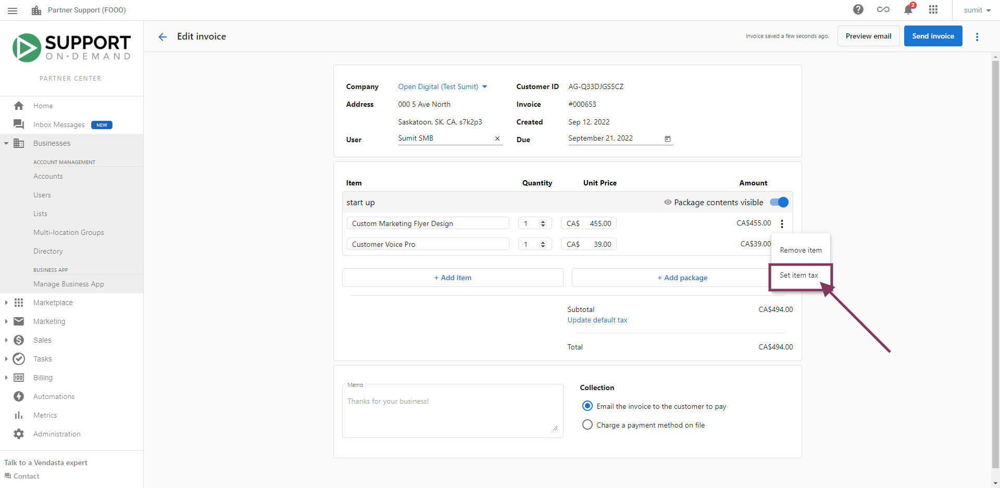

Si facturas a tus clientes o aceptas compras a través del Shopping Cart usando Vendasta Payments, puede que necesites cobrar impuestos sobre los productos y servicios que vendes. Las tasas de impuestos se pueden especificar y aplicar a las líneas de artículo de las facturas, así como a las compras del Shopping Cart y a los pedidos de venta, para asegurarte de cobrar los impuestos correspondientes a tus clientes.

Ten en cuenta que eres responsable de crear y mantener las tasas de impuestos adecuadas para las regiones en las que operas tu negocio.

*Para ver un video explicativo sobre cómo crear y aplicar tasas de impuestos, [haz clic aquí](#video-walkthrough).*

### Crear y gestionar tasas de impuestos

Para crear una tasa de impuesto, ve a `Partner Center` → `Administration` → `Tax Rates` y haz clic en **Create Tax Rate**.

Completa los siguientes valores:

- Country
- State/Province
- Tax Name
  - Los valores sugeridos incluyen GST, PST, HST, State Tax
- Rate (un porcentaje)
- Description / Tax number
  - Esta descripción opcional se mostrará en la columna de impuestos de las facturas que generes, en tus pedidos de venta y en el proceso de pago del Shopping Cart.

Según las ubicaciones de tus clientes, es posible que necesites definir cada tasa de impuesto que se aplica a un país y a un estado o región provincial. Por ejemplo, si estuvieras definiendo impuestos para aplicar en Ontario, Saskatchewan y Alberta, definirías lo siguiente:

- Canada, Ontario, HST, 13%
- Canada, Saskatchewan, GST, 5%
- Canada, Saskatchewan, PST, 5%
- Canada, Alberta, GST, 5%

### Aplicar una tasa de impuesto a una línea de artículo de una factura

Varias leyes de marketing digital y bienes digitales han cambiado desde enero de 2022, y muchos artículos deben o no deben gravarse en adelante. Con nuestra plataforma de facturación, puedes aplicar impuestos de forma selectiva a una línea de artículo de una factura o a toda una factura.

**Para comenzar a agregar impuestos a las facturas:**

1. Abre el constructor de facturas navegando a `Partner Center` → `Commerce` → `Invoices`
2. Agrega un Item o un Package si la factura está en blanco
3. Haz clic en el menú kebab **⋮** para ver más opciones en una línea de artículo

4. Establece Item Tax rate

5. Selecciona Tax Rate (Nota: para crear una tasa de impuesto, ve a `Partner Center` → `Administration` → `Tax Rates` y haz clic en **Create Tax Rate**.)

6. Revisa el Final Tax

7. Cobra o envía la factura

Alternativamente, para aplicar una tasa de impuesto a una línea de artículo en una factura, puedes hacer clic en el menú Options **⋮** de la línea de artículo, seleccionar **Set Item Tax** y elegir una tasa de impuesto para aplicar.

### Establecer una tasa de impuesto para un pedido de venta o una compra del Shopping Cart

Las tasas de impuestos que hayas definido se aplicarán automáticamente a las compras del Shopping Cart, así como a los pedidos de venta generados desde carritos de compra que contengan artículos que no se pueden comprar con tarjeta de crédito. La aplicación de las tasas de impuestos se basa en la dirección de la cuenta, según las regiones para las que hayas especificado tasas de impuestos.

Ten en cuenta que si no se han creado tasas de impuestos para una región determinada, las compras y los pedidos de venta realizados a través del Shopping Cart por clientes ubicados en esa región no tendrán una tasa de impuesto aplicada.

## Video explicativo {#video-walkthrough}

<iframe src="//www.loom.com/embed/7a58fd36374a4d4ab706ed9b4f5ac829" width="560" height="315" frameborder="0" allowfullscreen></iframe>

### Video explicativo de la aplicación de impuestos

<iframe 
  src="https://drive.google.com/file/d/1xb4inTcWSzfvAc9jGfu4Ys4PXHpI9sKx/preview" 
  width="640" 
  height="480" 
  allowFullScreen
></iframe>
