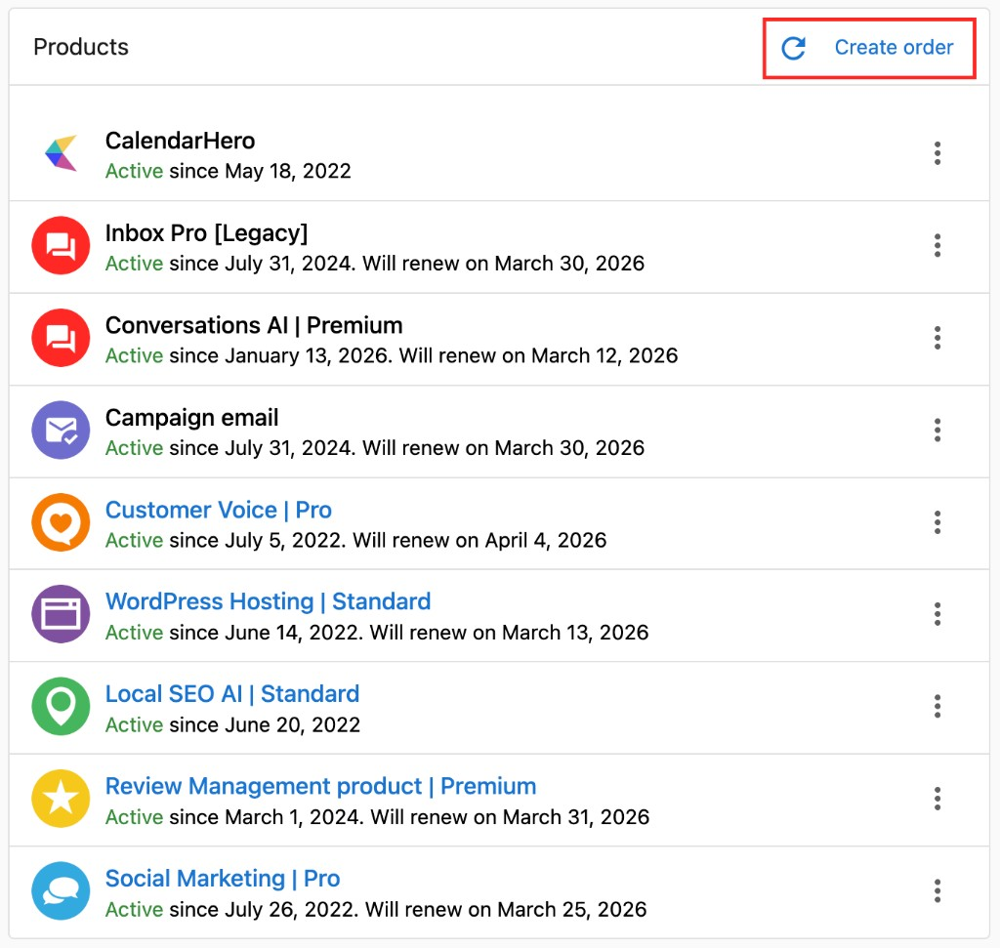
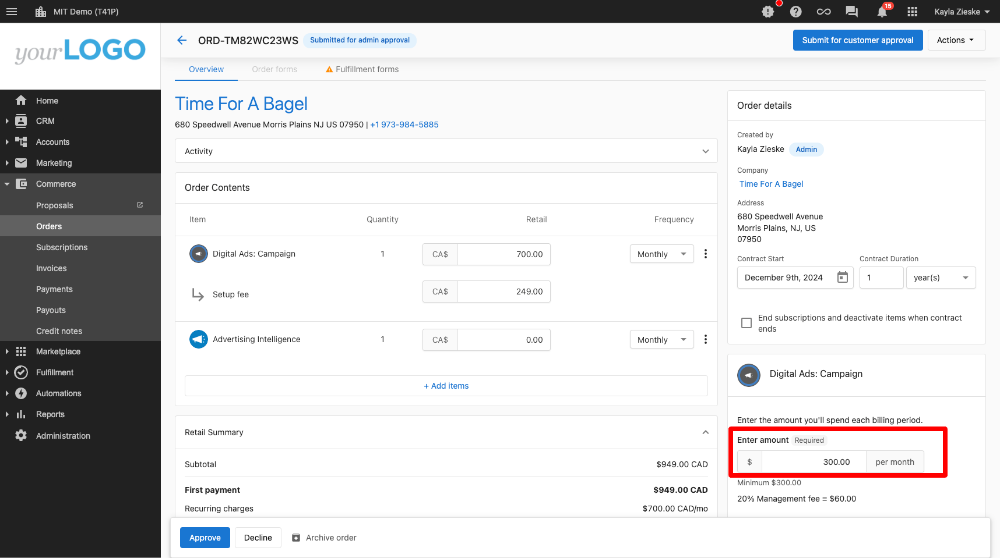
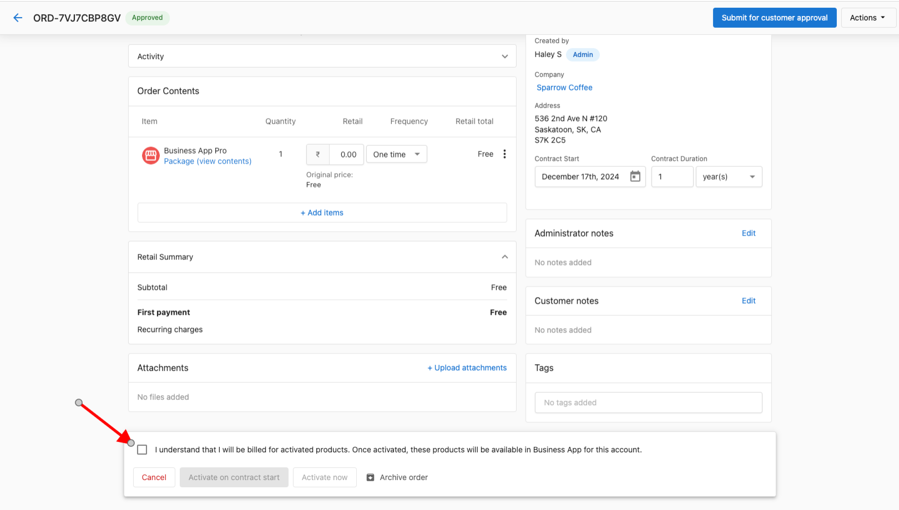
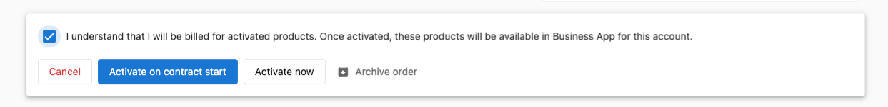
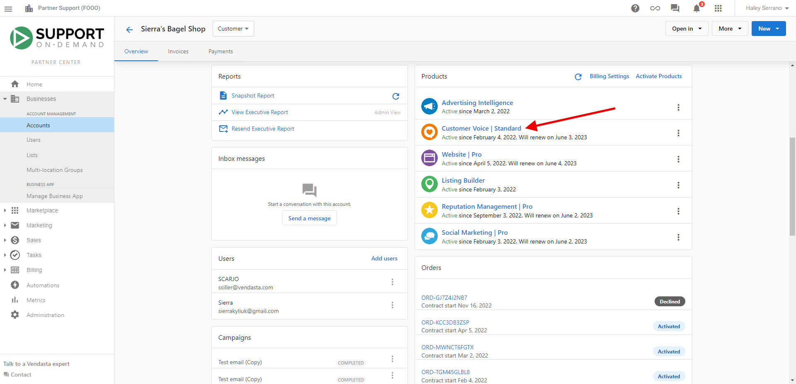

# Creating and Managing Orders

## ¿Qué son los pedidos?

Los pedidos en Partner Center son la forma principal de activar productos y servicios para tus clientes. El sistema de pedidos te permite crear pedidos de venta profesionales, gestionar el proceso de aprobación, cobrar pagos y activar productos de manera eficiente. Con flujos de trabajo simplificados y herramientas de gestión integrales, puedes optimizar todo el proceso de venta desde la creación hasta la activación.

## ¿Por qué son importantes los pedidos?

Crear pedidos te da la capacidad de activar productos a través de la plataforma de Vendasta incluso si la experiencia de compra de tus clientes ocurre fuera de Partner Center. Los pedidos crean suscripciones automáticas en el momento del procesamiento y gestionan la facturación en las fechas de renovación. El sistema reduce las tareas administrativas, mejora la colaboración entre vendedores y administradores, y garantiza que toda la información necesaria esté disponible desde el principio para minimizar errores.

Un procesamiento de pedidos adecuado también garantiza que los clientes reciban sus productos y servicios sin demoras mientras se mantienen los controles del negocio y la garantía de calidad. Comprender los estados de los pedidos ayuda a los equipos a hacer seguimiento del progreso, identificar cuellos de botella y resolver problemas rápidamente.

## Qué puedes hacer con los pedidos

Con el sistema de Orders, puedes:

- Crear pedidos de venta para cuentas individuales o pedidos masivos
- Usar flujos de trabajo simplificados con estados de borrador y funcionalidad de guardado automático
- Enviar pedidos para aprobación del cliente o del administrador
- Gestionar los procesos de aprobación, rechazo y activación de pedidos
- Agregar o quitar productos de pedidos pendientes
- Hacer seguimiento de los pedidos a través de varias etapas de estado
- Cobrar pagos directamente dentro de los pedidos
- Gestionar las condiciones de facturación y las configuraciones de precios
- Controlar cuándo y cómo se activan los productos, incluida la programación de la activación para fechas futuras
- Acceder a los productos activados mediante varios métodos
- Resolver errores de activación cuando ocurran

## Estados de pedido

Comprender los estados de los pedidos es crucial para gestionar tu proceso de ventas de manera efectiva. Estos son los estados de pedido completos y sus significados:

| **Estado** | **Qué significa** | **Notas** |
|------------|-------------------|------------|
| Drafted | El pedido se ha creado pero no se ha enviado | Los pedidos en borrador pueden ser archivados tanto por vendedores como por administradores |
| Awaiting customer approval | El pedido se envió al cliente para que lo apruebe o rechace | Los pedidos en este estado no se pueden modificar. Si hay un error, se pueden cancelar o archivar y luego duplicar para editar los detalles |
| Pending | El pedido se ha enviado a un administrador para que lo apruebe o rechace | Los pedidos pendientes requieren la acción de un administrador para avanzar al siguiente paso |
| Approved | El pedido fue aprobado por el cliente o el administrador | Estado intermedio usado para acciones como cobrar el pago antes de la activación |
| Processing | Los productos del pedido se están activando | Este estado generalmente aparece solo por unos momentos |
| Scheduled activation | El pedido fue aprobado y se estableció para activarse en una fecha futura | Los productos no se activarán hasta la fecha programada |
| Activated | Todos los productos del pedido se activaron | Los productos y servicios se han activado con éxito |
| Activation errors | Algunos productos no se pudieron activar y se necesita una acción | Pasa el cursor sobre la insignia "Activation Error" para ver los detalles. Generalmente se necesita una acción para activar correctamente los productos |
| Declined | El cliente o el administrador ha rechazado el pedido | Incluye un motivo proporcionado por quien rechazó el pedido |
| Archived | El pedido se conserva solo con fines históricos | Estos pedidos solo son visibles mediante filtrado y no son visibles en Business App |
| Cancellation request | Un vendedor o administrador ha solicitado la cancelación | Incluye un motivo para la solicitud de cancelación |
| Canceled | El pedido ha sido cancelado | Útil para hacer seguimiento de la pérdida de clientes. Nota: cancelar un pedido no cancela las suscripciones minoristas o mayoristas |
| Resubmitted | Un vendedor ha vuelto a enviar para aprobación un pedido previamente rechazado | Se usa cuando se abordan los motivos de rechazo y se vuelve a enviar |

**Se puede acceder a los pedidos a través de:**

- `Partner Center` → `Commerce` → `Orders`
- `Partner Center` → `Accounts` → `Account Details` → tarjeta `Orders`
- `Partner Center` → `Companies` → `Company Details` → tarjeta `Orders`

## Líneas de artículo de prueba

Cuando un pedido incluye un producto activado como prueba, la línea de artículo muestra una insignia **Trial**, la misma insignia que se muestra en la página Products & Services de la cuenta, y el precio se muestra como $0, ya que no se cobra ningún pago mientras el producto está en prueba.

## Crear pedidos

### Cómo crear pedidos de venta

Hay varias formas de crear pedidos de venta en Partner Center:

**Método 1: sección Commerce**
1. Ve a `Partner Center` → `Commerce` → `Orders` → `Create Order`
2. Elige la cuenta correcta
3. Agrega productos y complementos, eligiendo la Edition deseada cuando corresponda
4. Configura el precio y las cantidades minoristas
5. Haz clic en los 3 puntos junto a los productos para editar las condiciones de facturación
6. Revisa el pedido
7. Elige tu método de envío (aprobación del cliente o del administrador)

**Método 2: desde el perfil de la empresa**
1. Desde la página de perfil de una empresa, haz clic en **Orders** y selecciona **Create Order**
2. Sigue el mismo proceso descrito anteriormente

**Método 3: desde los detalles de la cuenta**
1. Ve a `Partner Center` → `Accounts` → `Manage Accounts` y visualiza una cuenta
2. Haz clic en **Order Products**
3. Selecciona los artículos que quieres pedir
4. Completa los formularios de pedido o de cumplimiento
5. Revisa y edita los precios minoristas si lo deseas
6. Selecciona **Process Order**

### Cómo usar los pedidos de venta simplificados

El flujo de trabajo de pedidos de venta simplificados ofrece una experiencia mejorada con estas funciones clave:

- **Estado de borrador**: los pedidos comienzan como borradores con guardado automático del progreso
- **Pasos reducidos**: pasos minimizados para completar un pedido
- **Funcionalidad de guardado automático**: el trabajo se guarda automáticamente a medida que avanzas
- **Visibilidad instantánea**: los formularios de pedido y las órdenes de trabajo aparecen de inmediato al seleccionar el producto
- **Validación mejorada**: ve fácilmente lo que se requiere antes de enviar
- **Ediciones masivas y línea por línea**: aplica condiciones de contrato en todo el pedido o individualmente

**Beneficios:**
- Ahorra tiempo al reducir los pasos administrativos
- Mejora la colaboración entre vendedores y administradores
- Garantiza que toda la información necesaria esté disponible desde el principio
- Hace que la gestión de pedidos sea más flexible y eficiente

### Cómo pedir productos para varias cuentas

Para pedidos masivos (disponible solo para partners con suscripciones pagas):

1. Crea una lista de cuentas en `Partner Center` → `Accounts` → `Lists`
2. Haz clic en la lista para la que quieres pedir productos
3. Haz clic en el botón **Actions** y luego en **Order Product** u **Order Add-on**
4. Selecciona el producto (o productos) que quieres pedir
5. Haz clic en **Order**

:::tip
Las activaciones masivas no están permitidas para productos que requieren un formulario de pedido.
:::

## Gestionar pedidos

### Cómo agregar productos a pedidos pendientes

Como administrador, puedes modificar pedidos pendientes antes de la aprobación:

1. Ve a `Commerce` → `Orders` y selecciona el pedido pendiente
2. Haz clic para **Add Items** o cambiar el precio
3. Realiza tus modificaciones
4. Continúa con el proceso de aprobación

:::tip
Los vendedores no pueden agregar artículos una vez que se envía un pedido, pero los administradores pueden modificar los pedidos antes de la aprobación.
:::

### Nuevas acciones de administrador

Con los pedidos de venta simplificados, los administradores pueden:

- Enviar borradores directamente sin necesidad de suplantación
- Duplicar o cancelar pedidos dentro del flujo de trabajo del pedido
- Realizar acciones clave sin necesidad de suplantar a los vendedores
- Ver y editar pedidos incluso sin permisos "can manage order" (con acceso de nivel vendedor)

### Editar un pedido después de haberlo realizado

Los pedidos solo se pueden editar libremente mientras están en estado **Draft**. Una vez enviados:

- Los **vendedores** no pueden editar el pedido en absoluto
- Los **administradores con "Can Manage Orders"** pueden agregar o quitar artículos de un pedido **Pending** antes de que se apruebe

Si necesitas cambiar algo en un pedido enviado que no está en estado Pending (por ejemplo, cambiar una fecha de inicio de contrato), debes **rechazar o cancelar el pedido** y crear uno nuevo con los detalles correctos.

### Los pedidos cancelados no se pueden restaurar

Una vez que se cancela un pedido, no se puede descancelar ni restaurar. Si necesitas volver a crear el pedido, usa la opción **Duplicate** del menú de acciones del pedido para copiarlo en un nuevo borrador, luego actualízalo según sea necesario y vuelve a enviarlo.

## Flujos de aprobación

Según la configuración del partner, los pedidos se pueden enviar a uno de dos lugares después del envío: a tu cliente para aprobación, o a un administrador para revisión interna.

### Crear pedidos para aprobación del cliente

1. Crea tu pedido siguiendo los pasos anteriores
2. Haz clic en **Send For Customer Approval**
3. Selecciona si se requiere pago
4. Elige un contacto para recibir el pedido
5. El estado del pedido se convierte en "Submitting for customer approval"

Puedes hacer seguimiento de la entrega en la tarjeta Order Activity y volver a enviar a contactos nuevos o al mismo usando el botón "Resubmit for Customer Approval".

### Crear pedidos para aprobación del administrador

1. Crea tu pedido siguiendo los pasos anteriores
2. Haz clic en **Submit**
3. El pedido entra en estado "Pending"
4. Un administrador con permisos "Can Manage Orders" debe revisar y aprobar o rechazar

### Aprobación manual del proveedor

Algunos productos de marketplace requieren que el proveedor apruebe manualmente el pedido antes de que se pueda activar. Cuando este es el caso, el pedido mostrará un indicador **"Manual vendor approval required"** en la línea de artículo relevante. No se requiere ninguna acción de tu parte, el proveedor recibe la notificación automáticamente. La activación continúa una vez que el proveedor aprueba de su parte.

Si un pedido ha estado esperando la aprobación del proveedor durante más tiempo del esperado, contacta al proveedor directamente a través de `Marketplace` → `[Producto]` → `Contact Us`.

### Reenviar el correo de aprobación

Si un cliente no ha recibido o no puede encontrar su correo de aprobación:

1. Abre el pedido en `Commerce` → `Orders`
2. Haz clic en **Resend to a customer** en la barra de herramientas del pedido
3. Confirma el contacto y envía

:::note Por qué los clientes pueden recibir el correo de aprobación más de una vez
Los pedidos que se acercan a su fecha de vencimiento activan un trabajo de reenvío de recordatorio automático (normalmente de 1 a 2 días antes del vencimiento). Si tu cliente recibe el correo de aprobación varias veces, esta es la razón. Para detener los reenvíos, pide al cliente que apruebe el pedido o cancélalo.
:::

### Cómo aprobar pedidos

Como administrador con permisos "Can Manage Orders":

1. Desde `Partner Center` → `Commerce` → `Orders`, haz clic en el **Order ID**
2. Revisa el pedido para verificar su precisión, incluyendo:
   - Cualquier advertencia en la parte superior de la página
   - El precio minorista (los cambios de precio se indicarán)
   - Los ajustes de costo mayorista para productos variables
3. Haz clic en **Approve** en la parte inferior de la pantalla
4. Haz clic en **Approve & Continue**

Después de la aprobación, el vendedor recibe una confirmación por correo electrónico.

### Cómo rechazar pedidos

1. Desde `Partner Center` → `Commerce` → `Orders`, haz clic en el **Order ID**
2. Revisa el pedido e identifica los problemas
3. Haz clic en **Decline** en la parte inferior de la pantalla
4. Ingresa un mensaje explicando por qué has rechazado el pedido
5. Haz clic en **Decline** en el modal de confirmación

## Procesar y activar pedidos

### ¿Un pedido aprobado activa automáticamente los productos?

**¡No de inmediato!** Se requieren pasos adicionales después de la aprobación:

1. **Aprueba el pedido**: revisa y aprueba el pedido primero

2. **Acuerdo de facturación**: marca la casilla para aceptar que se te facturará por los productos seleccionados

3. **Elige el momento de activación**: selecciona cuándo se deben activar los productos:
   - **Activate Immediately**: los productos se activan de inmediato
   - **Activate on Contract Start Date**: los productos se activan cuando comienza el contrato

4. **Confirmación**: los productos se activan según el momento que seleccionaste

:::tip
Los productos NO se activarán hasta que aceptes explícitamente la facturación y elijas una opción de activación.
:::

### Cómo activar pedidos

Después de aprobar un pedido, debes activarlo para habilitar los productos y crear suscripciones:

1. Desde `Partner Center` → `Commerce` → `Orders`, haz clic en el **Order ID**
2. Completa cualquier información requerida que no haya completado el vendedor (marcada con asteriscos)
3. Haz clic en la casilla **I understand...** en la parte inferior
4. Haz clic en **Activate Now**

### Cómo aprobar un pedido sin activar los productos

Algunos partners prefieren cobrar el pago antes de activar los productos, por ejemplo, durante una incorporación por etapas o cuando un cliente necesita pagar antes de que comiencen los servicios. Puedes aprobar un pedido de venta y cobrar el pago sin activar los productos dejando sin marcar la casilla de acuerdo de facturación.

**Paso a paso:**

1. Crea y envía el pedido de venta como de costumbre.
2. Al aprobar el pedido, verás una **casilla de acuerdo de facturación** ("I understand that I will be billed for activated products").
3. **Deja esta casilla sin marcar** y continúa para aprobar el pedido.
4. El pedido pasa al estado **Approved**. Los productos no se activan. El cliente se puede facturar en este punto.
5. Para activar los productos más tarde, un administrador de Partner Center debe volver al pedido, marcar la casilla de acuerdo de facturación y seleccionar una opción de momento de activación.

:::info
Los productos permanecen en estado **Approved** hasta que un administrador de Partner Center acepte explícitamente la facturación y los active. La aprobación por sí sola, sin el acuerdo de facturación, no activa la activación.
:::

## Acceder a los productos activados

Una vez que los productos están activados, hay varias formas de acceder a ellos:

### Método 1: a través de permisos
1. Ve a `Partner Center` → `Business Details` → `Clients & Prospects`
2. Encuentra el negocio y haz clic en el ícono de edición (tres puntos)
3. Ve a `Permissions` → `Settings`
4. Los productos y servicios activados se muestran en esta sección

### Método 2: a través de la suplantación
1. Ve a `Partner Center` → `Business Details` → `Clients & Prospects`
2. Encuentra el negocio y haz clic en el ícono de suplantación (tres puntos)
3. Busca el banner rojo que confirma la suplantación exitosa
4. Los productos y servicios del negocio se muestran en **Apps**

### Método 3: a través de los detalles del negocio
1. Ve a `Partner Center` → `Business Details` → `Clients & Prospects`
2. Haz clic en el nombre del negocio
3. Haz clic en la pestaña **Products & Services**
4. Todos los productos y servicios activos se muestran aquí

### Método 4: a través de la página de detalles del pedido
1. Ve a `Partner Center` → `Commerce` → `Orders`
2. Encuentra el pedido con el producto activado
3. Haz clic en **View** junto al pedido
4. Haz clic en el artículo del pedido que dice **Setup**, **Access** o **Launch**

## Después de la activación: notificaciones, reembolsos y pedidos iniciados por el cliente

### Notificaciones por correo electrónico de activación

Los correos de activación a los clientes están **desactivados de forma predeterminada**. Para notificar a los clientes cuando se activa un producto, configura una automatización:

1. Ve a `Automations` → `Create Automation`
2. Establece el disparador en un evento de activación de pedido o producto
3. Agrega una acción **Send Email** o **Send Notification** dirigida al contacto del cliente

Esto reemplaza el comportamiento heredado del correo de activación y te da control total sobre el contenido y el momento del mensaje.

### Los reembolsos por pedidos rechazados son automáticos

Si un pedido falla al activarse y es rechazado, cualquier pago cobrado por ese pedido se reembolsa automáticamente como una **nota de crédito**. No necesitas solicitar un reembolso manualmente.

Para encontrar la nota de crédito:
- Ve a `Administration` → `My billing` para ver el crédito aplicado a tu cuenta
- Ve a `Commerce` → `Financial Documents` → `Credit Notes` para el documento formal de la nota de crédito

### Revisar los pedidos iniciados por el cliente antes de la activación

Si tus clientes pueden realizar pedidos ellos mismos (a través de la tienda), esos pedidos se activan automáticamente de forma predeterminada. Para retener los pedidos iniciados por el cliente para revisión del partner antes de la activación:

1. Ve a `Administration` → `Order Settings` → `Default Content`
2. Agrega un formulario personalizado con una sección **Administrative Questions** a cada pedido
3. Marca un campo obligatorio como oculto para el cliente; el pedido no se puede activar hasta que un administrador complete ese campo

Esto efectivamente condiciona la activación a que un administrador complete el campo interno, dándote un paso de revisión antes de que los productos se activen.

### Precios escalonados y activaciones masivas

Si tus productos usan precios escalonados (donde el primer nivel es gratuito y el precio aumenta con el volumen), activar grandes lotes de cuentas a la vez puede activar el nivel superior de forma inesperada. **Recomendación:** usa un **descuento de unidad gratuita** en lugar de un primer nivel gratuito para evitar cargos no deseados durante las activaciones masivas.

## Gestionar errores de activación

### ¿Qué es un error de activación?

El estado **Activation Error** aparece cuando hay un problema al activar uno o más artículos en un pedido. Este estado garantiza que estés al tanto de los problemas que requieren atención antes de que el pedido se pueda activar por completo.

### Cómo resolver errores de activación

1. **Abre el pedido** con estado Activation Error
2. **Revisa la tarjeta Fulfillment** en el pedido:
   - Aparece una insignia roja junto a los artículos afectados
   - Pasa el cursor sobre la insignia para ver los detalles del error
3. **Obtén información adicional**:
   - Ve al Account Group
   - Revisa el motivo de rechazo en la tarjeta Products
4. **Toma la acción correctiva**:
   - Selecciona `Edit and resubmit` en el menú (ícono kebab), **O**
   - Descarta el error, resuelve el problema y envía un nuevo pedido
5. **Completa el proceso**:
   - Después de enviar el pedido corregido y revisar las suscripciones
   - Regresa al pedido con error
   - Selecciona el menú kebab y elige `Ignore All Errors`
   - El estado se actualiza a **Activated**

:::warning
Ignora los errores solo después de revisar y resolver los problemas que podrían afectar la entrega del producto.
:::

## Buenas prácticas

- Mantén los pedidos enfocados en las necesidades y requisitos del cliente
- Usa precios consistentes en todo tu equipo
- Revisa todos los detalles del pedido antes de enviarlo para prevenir errores de activación
- Utiliza los pedidos masivos para mayor eficiencia cuando corresponda
- Aprovecha los flujos de trabajo simplificados para reducir la sobrecarga administrativa
- Asegúrate de que todos los campos requeridos estén completos antes de enviar
- Usa los estados de borrador para guardar el progreso en pedidos complejos

## Preguntas frecuentes

¿Puedo transferir un producto pedido en la cuenta equivocada?

No. Si pides un producto en la cuenta equivocada, deberá cancelarse y volver a pedirse en la cuenta correcta. Para solicitar un ajuste de facturación, contacta a support@vendasta.com.

¿Cuál es la diferencia entre la aprobación del cliente y la aprobación del administrador?

La aprobación del cliente envía el pedido directamente a tu contacto de cliente seleccionado para su revisión y aprobación. La aprobación del administrador envía el pedido a administradores con permisos "Can Manage Orders" para revisión interna antes de la interacción con el cliente.

¿Puedo editar un pedido después de enviarlo?

Los vendedores no pueden editar pedidos una vez enviados. Sin embargo, los administradores pueden agregar o quitar artículos de pedidos pendientes antes de la aprobación. Alternativamente, los pedidos se pueden rechazar y recrear con correcciones.

¿Cómo sé si un producto requiere un formulario de pedido?

Los productos que requieren formularios de pedido mostrarán campos de formulario durante el proceso de creación del pedido. Estos productos no se pueden activar mediante pedidos masivos y deben pedirse individualmente.

¿Qué sucede si no puedo encontrar un producto en la lista de pedidos?

Asegúrate de haber comenzado a vender el producto primero. Puede tardar unos minutos en aparecer después de que comiences a venderlo. Actualiza tu navegador si has comenzado a vender el producto recientemente.

¿Puedo exportar mis pedidos a un archivo CSV?

¡Sí! Puedes exportar la tabla de pedidos a un archivo CSV. Ve a `Partner Center` → `Commerce` → `Orders` y haz clic en el botón **Export** en la esquina superior derecha de la página.

¿Activation Error detendrá la activación de todo mi pedido?

Puede afectar solo a artículos específicos con errores, pero el pedido permanece en estado Activation Error hasta que se resuelva o se ignore.

¿Puedo corregir solo un artículo y dejar otros en error?

Sí. Puedes editar y volver a enviar líneas de artículo individuales en los detalles de la cuenta, y luego elegir ignorar errores específicos en el pedido después de revisarlos.

¿Dónde puedo encontrar los detalles del error?

Los detalles aparecen en la tarjeta Fulfillment (tooltip de la insignia roja) y en la tarjeta Products de los detalles de la cuenta.

¿Cuándo debo usar "Ignore All Errors"?

Úsalo solo después de confirmar que los problemas restantes no afectarán los servicios de tu cliente.

¿Puedo prevenir los errores de activación?

La mayoría de los errores ocurren debido a información faltante, entradas de formulario incorrectas o problemas de configuración de cuenta. Revisar todos los detalles del pedido antes de enviarlo puede ayudar a prevenirlos.

¿Qué sucede si selecciono "Activate on Contract Start Date"?

Los productos se programarán para activarse cuando comience oficialmente el contrato. Asegúrate de que la fecha de inicio esté configurada correctamente para evitar demoras.

¿Cuánto dura el estado Processing?

El estado Processing generalmente aparece solo por unos momentos mientras los productos se activan en el sistema.

¿Puedo cambiar el momento de activación después de la aprobación?

Una vez que hayas aceptado las condiciones de facturación y seleccionado el momento de activación, no puedes cambiarlo. Necesitarías crear un nuevo pedido si se requiere un momento diferente.

¿Cuál es la diferencia entre los pedidos Canceled y Archived?

Los pedidos Canceled están marcados específicamente como cancelados (útil para hacer seguimiento de la pérdida de clientes), mientras que los pedidos Archived simplemente se mueven fuera de la vista activa con fines históricos. Ninguno de los dos estados cancela las suscripciones existentes.

¿Puedo deshabilitar la activación automática cuando un cliente paga durante la aprobación?

No. Cuando un cliente paga durante el paso de aprobación, la activación del producto se activa automáticamente; esto no se puede deshabilitar. Si necesitas retrasar la activación después del pago, usa una de estas soluciones alternativas:

- **Establece una fecha de inicio de contrato futura** en las líneas de artículo del pedido para que los productos se activen en esa fecha en lugar de inmediatamente
- **Usa un flujo de factura manual** en lugar del flujo de pago de aprobación del cliente, y luego activa manualmente cuando estés listo

El formulario de pedido de MatchCraft Ads Express muestra una página de tiempo de espera agotado: ¿qué hago?

Esto sucede cuando MatchCraft Ads Express aún no está activado en la cuenta antes de acceder al formulario de pedido. Para resolverlo:

1. Activa **MatchCraft Ads Express** en la cuenta primero
2. Luego envía el pedido; el formulario de pedido se cargará correctamente

"Proceed to next step" aparece en gris para un producto complementario: ¿por qué?

Esto generalmente significa que el producto principal está **suspendido** en Vendor Center. Para resolverlo:

1. Ve a `Vendor Center` → `Products` y revisa si el producto principal está suspendido
2. Reanuda las activaciones en ese producto
3. Regresa al pedido; el botón "Proceed to next step" debería activarse

Un pedido muestra el estado "Deferred": ¿qué significa?

**Deferred** significa que el correo de aprobación del pedido no se pudo entregar al destinatario. Esto generalmente es un problema de entregabilidad de correo electrónico. Para resolverlo:

- Verifica que la dirección de correo electrónico del destinatario sea correcta y accesible
- Confirma que tu dominio de envío tenga registros **SPF** y **DMARC** válidos configurados
- Intenta reenviar el pedido a un contacto o dirección de correo electrónico diferente

Si se confirma la entregabilidad pero el problema persiste, contacta a soporte.

