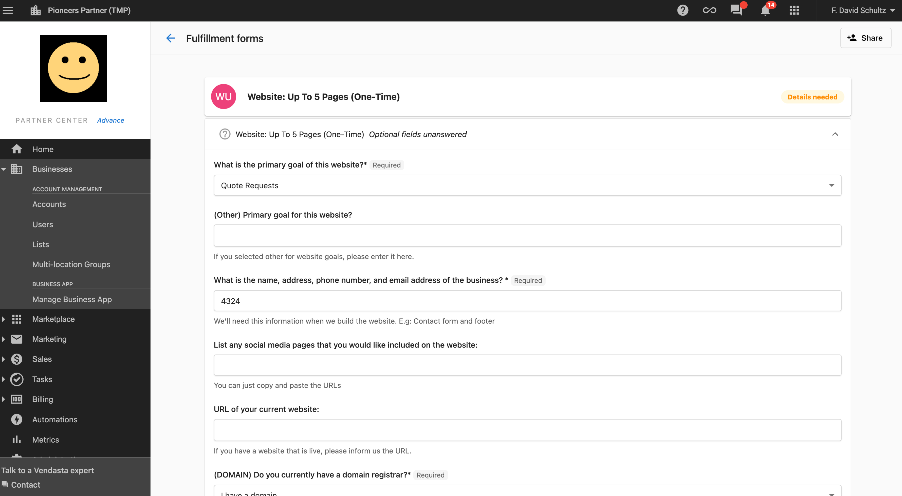
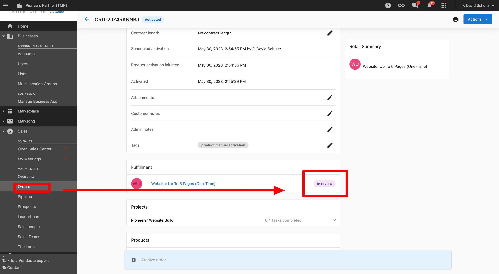

# Order Configuration and Administration

## ¿Qué son Order Configuration and Administration?

La configuración y administración de pedidos abarca la configuración y gestión de los flujos de trabajo de pedidos, los permisos de usuario, los procesos de cumplimiento y los ajustes del sistema que controlan cómo tu equipo crea y gestiona los pedidos. Esto incluye configurar las capacidades de los vendedores, establecer formularios de cumplimiento para información adicional del cliente, gestionar notificaciones por correo electrónico y establecer niveles de permiso en los diferentes roles de usuario.

## ¿Por qué es importante la configuración de pedidos?

Una configuración de pedidos adecuada garantiza que tu equipo opere de manera eficiente mientras mantiene los controles y estándares de calidad apropiados. Al configurar los flujos de trabajo, los permisos y los procesos según las necesidades de tu negocio, puedes optimizar las operaciones, reducir errores y garantizar el cumplimiento de tus prácticas comerciales. La flexibilidad de configuración te permite adaptar el sistema a tus procesos de venta específicos y a la estructura de tu equipo.

## Qué puedes hacer con la configuración de pedidos

Con la configuración y administración de pedidos, puedes:

- Configurar los flujos de trabajo de pedidos y los procesos de envío
- Establecer permisos de usuario y niveles de acceso
- Habilitar o deshabilitar funciones específicas de pedidos para diferentes tipos de usuario
- Crear y gestionar formularios de cumplimiento para recopilar información del cliente
- Personalizar las notificaciones por correo electrónico para los procesos de pedidos
- Configurar las capacidades de cobro de pagos
- Configurar contenido predeterminado y formularios personalizados
- Gestionar los Terms of Service para las aprobaciones de clientes
- Controlar las acciones y capacidades de los vendedores

:::info Actualización de la experiencia de Orders: julio de 2025
El flujo de trabajo de Orders en Partner Center se rediseñó en julio de 2025. Si ves referencias al flujo anterior de "Sales Orders", los pasos pueden diferir de tu interfaz actual.
:::

## Cómo configurar Order Configuration

### Acceder a Order Configuration

Para acceder a los ajustes de configuración de pedidos:
`Partner Center` → `Administration` → `Order Settings`

### Productos independientes vs. solo paquetes

De forma predeterminada, los vendedores pueden agregar productos individuales (independientes) a los pedidos. Para restringir a los vendedores a vender solo paquetes:

1. Ve a `Administration` → `Order Settings`
2. En **For Salespeople**, habilita **"Prevent salespeople from selling standalone products on opportunities and orders"**

Cuando está habilitado, los vendedores solo pueden agregar paquetes preconfigurados a los pedidos. Los administradores no se ven afectados por esta restricción.

### Límite de categoría de empresa para el envío de pedidos

Los pedidos creados desde un perfil de **CRM Company** requieren que la empresa tenga **10 o menos categorías de negocio** asignadas. Si no puedes enviar un pedido desde una empresa, revisa el número de categorías de la empresa:

1. Abre el registro de la empresa en **CRM > Companies**
2. Revisa las categorías enumeradas en el perfil
3. Elimina categorías hasta que queden 10 o menos, y luego vuelve a intentar enviar el pedido

### Gasto publicitario (precio variable) en paquetes

Los productos con precio variable, como el gasto publicitario para productos de publicidad digital, **no pueden tener su monto ajustado cuando se agrupan dentro de un paquete**. El monto de gasto publicitario está fijo al valor establecido cuando se configuró el paquete.

**Solución alternativa:** si necesitas establecer un monto de gasto publicitario personalizado, pide el producto como un artículo independiente fuera del paquete. Los pedidos independientes permiten establecer el monto variable por pedido.

### Opciones de configuración del flujo de trabajo

**Para vendedores:**
- Quitar Terms and Conditions al reenviar pedidos para aprobación del cliente
- Permitir ediciones a los formularios de pedido hasta la activación
- Requerir que los vendedores completen todos los campos antes de enviar los pedidos
- Prevenir que los vendedores vendan productos independientes en oportunidades y pedidos
- Prevenir que los vendedores agreguen etiquetas a los pedidos
- Permitir que los clientes envíen pedidos a administradores directamente desde el Store

**Acciones de envío del vendedor:**
- Permitir que los vendedores envíen pedidos directamente a los administradores
- Permitir que los vendedores cobren métodos de pago guardados al enviar el pedido
- Permitir que los vendedores envíen pedidos a los clientes para aprobación
- Habilitar que los pedidos enviados para aprobación acepten pago

**Acciones de envío del administrador:**
- Permitir que los administradores omitan el flujo de aprobación y activen pedidos instantáneamente

**Contenido predeterminado:**
- Agregar formularios personalizados a cada pedido solo para uso interno
- Los campos personalizados no se comparten con los proveedores

**Terms of Service del cliente:**
- Personalizar los Terms of Service que aparecen al enviar pedidos para aprobación del cliente

**Notificaciones por correo electrónico:**
- Contract Awaiting Approval (enviado a los clientes)
- Order Processed
- Order Declined

## Permisos de usuario y niveles de acceso

### Capacidades de los vendedores

Los usuarios de ventas tienen la capacidad de:
- Crear y enviar pedidos
- Archivar pedidos en borrador
- Editar pedidos hasta el envío
- Solicitar cancelación
- Reenviar pedidos rechazados
- Cobrar instantáneamente o enviar pedidos para aprobación (según los ajustes)
- Cobrar pedidos en los mercados a los que tienen acceso, incluidos todos los mercados cuando su acceso de usuario está configurado para cobertura de todos los mercados

### Administradores sin permiso "Can Manage Orders"

- Tienen el mismo nivel de acceso que los vendedores
- No pueden aprobar, rechazar ni activar pedidos
- Pueden crear y editar pedidos como los usuarios de ventas

### Administradores con permiso "Can Manage Orders"

Además de las capacidades de vendedor, pueden:
- Aprobar, rechazar y cancelar pedidos o solicitudes de cancelación
- Activar y archivar pedidos en borrador
- Editar pedidos enviados hasta la activación
- Ingresar correos electrónicos en copia y cobrar instantáneamente (al usar Vendasta Payments)
- Enviar pedidos para aprobación del cliente con cobro de pago (al usar Vendasta Payments)

### Administradores con permiso "Can Manage Marketplace"

- Obtienen visibilidad de los precios mayoristas y resúmenes en los pedidos
- Pueden ver información de costos no disponible para otros usuarios

### Administradores con permiso "Can Manage Company Billing"

- Pueden ingresar una tarjeta de crédito de la empresa si no hay ninguna presente en el pedido
- Pueden gestionar aspectos relacionados con la facturación del procesamiento de pedidos

## Formularios de cumplimiento

### ¿Qué son los formularios de cumplimiento?

Los formularios de cumplimiento se usan para obtener detalles adicionales de los clientes para completar los pedidos. Al crear un pedido en Partner Center, puedes seleccionar un formulario para que se complete y envíe a fin de recibir la información necesaria para cumplir el pedido.

### Cómo configurar los formularios de cumplimiento

**Durante la creación del pedido:**
1. Crea tu pedido en Partner Center
2. Ve a la sección Fulfillment Form
3. Selecciona el formulario adecuado para el pedido
4. Envía el pedido para activar la entrega del formulario

**Experiencia del cliente:**
1. El cliente recibe un correo electrónico y una notificación con un enlace al formulario
2. El cliente completa el formulario con la información requerida
3. El cliente puede compartir el formulario con otras personas que tengan información adicional
4. El cliente envía el formulario completo

### Proceso de finalización del formulario

**Campos obligatorios:**
- Todos los campos obligatorios deben completarse antes de enviar
- Los campos obligatorios están marcados con un asterisco (*)
- El formulario no se puede enviar hasta que se proporcione toda la información obligatoria

**Compartir el formulario:**
1. Haz clic en el botón "Share" en la parte superior del formulario
2. Ingresa la dirección de correo electrónico de la persona con quien compartir
3. Haz clic en "Share"
4. El destinatario recibe un correo electrónico con un enlace de acceso al formulario

### Seguimiento del estado del formulario

**Estados del formulario:**
- **Not Started**: formulario enviado pero aún no abierto por el cliente
- **In Progress**: el cliente ha comenzado pero no ha enviado el formulario
- **Completed**: formulario enviado con éxito con toda la información requerida

**Acceso al seguimiento:**
- El estado del formulario se puede hacer seguimiento desde la página Order Details en Partner Center
- Actualizaciones en tiempo real sobre el progreso y finalización del formulario

### Notificaciones de formularios de cumplimiento

**Notificaciones para el partner:**
- Notificación cuando el cliente envía el formulario
- Alerta cuando el formulario permanece incompleto después de un período especificado

**Notificaciones para el cliente:**
- Notificación cuando necesitan completar un formulario
- Actualizaciones cuando se ven o completan formularios compartidos

## Buenas prácticas de configuración

### Configuración del flujo de trabajo
- Configura los flujos de trabajo según tus procesos de negocio
- Habilita las acciones de envío adecuadas para diferentes tipos de usuario
- Configura las notificaciones por correo electrónico para mantener informadas a las partes interesadas
- Personaliza los Terms of Service para reflejar los términos de tu negocio

### Gestión de permisos
- Asigna los niveles de permiso adecuados según los roles del puesto
- Revisa regularmente los permisos de usuario para asegurarte de que sigan siendo apropiados
- Usa el permiso "Can Manage Orders" para los usuarios que necesitan capacidades de aprobación
- Limita los permisos de facturación a las partes interesadas financieras adecuadas

### Formularios de cumplimiento
- Usa formularios de cumplimiento para pedidos que requieran información adicional del cliente
- Asegúrate de que los formularios sean claros y especifiquen todos los campos requeridos
- Configura las notificaciones adecuadas para el seguimiento de finalización del formulario
- Capacita a los clientes en las capacidades de compartir formularios para requisitos complejos

### Configuración de correo electrónico y notificaciones
- Configura las notificaciones por correo electrónico para mantener informadas a todas las partes interesadas
- Personaliza el contenido de las notificaciones según tu marca y estilo de comunicación
- Configura los destinatarios de notificación adecuados para diferentes tipos de pedido
- Prueba la entrega de notificaciones para garantizar un flujo de comunicación adecuado

¿Puedo cambiar los permisos de pedidos después de que se han establecido?

Sí, los permisos de pedidos se pueden modificar en cualquier momento a través de la sección `Administration` → `Order Settings`. Los cambios entran en vigor de inmediato para los usuarios afectados.

¿Qué sucede si un cliente no completa un formulario de cumplimiento?

Los partners reciben notificaciones cuando los formularios permanecen incompletos. Por lo general, el pedido no se puede procesar por completo hasta que se envíe toda la información de cumplimiento requerida.

¿Pueden varias personas trabajar en el mismo formulario de cumplimiento?

Sí, los clientes pueden compartir los formularios de cumplimiento con otras personas que puedan tener información adicional necesaria para completarlos. Todos los destinatarios pueden acceder y contribuir al formulario.

¿Cómo sé si un usuario tiene los permisos correctos para la gestión de pedidos?

Los permisos de usuario se pueden revisar en la sección de administración. Los usuarios con el permiso "Can Manage Orders" pueden aprobar, rechazar y activar pedidos, mientras que los que no tienen este permiso tienen acceso a nivel de vendedor.

¿Puedo personalizar las plantillas de correo electrónico para las notificaciones de pedidos?

Sí, las notificaciones por correo electrónico para Contract Awaiting Approval, Order Processed y Order Declined se pueden personalizar a través de los ajustes de configuración de pedidos.

¿Cuál es la diferencia entre los formularios personalizados internos y los formularios de cumplimiento?

Los formularios personalizados internos son solo para uso interno y no se comparten con los proveedores, mientras que los formularios de cumplimiento se envían a los clientes para recopilar información adicional necesaria para completar los pedidos.

¿Puedo evitar que los vendedores realicen ciertas acciones?

Sí, la configuración del flujo de trabajo te permite controlar varias capacidades de los vendedores, incluyendo evitar que vendan productos independientes, agreguen etiquetas o realicen otras acciones específicas.

¿Cómo configuro el cobro de pagos del cliente para los vendedores?

Habilita "Orders sent for approval by salespeople can accept payment" en la configuración de Salesperson Submit Actions. Esto permite a los vendedores enviar pedidos que pueden cobrar pagos de clientes durante la aprobación.

¿Los administradores pueden omitir el flujo de aprobación normal?

Sí, las acciones de envío del administrador se pueden configurar para permitir que los administradores omitan el flujo de aprobación y activen pedidos instantáneamente cuando sea apropiado.

