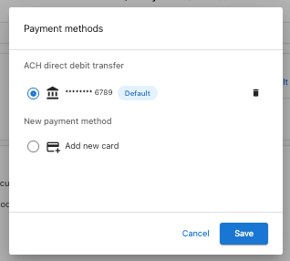
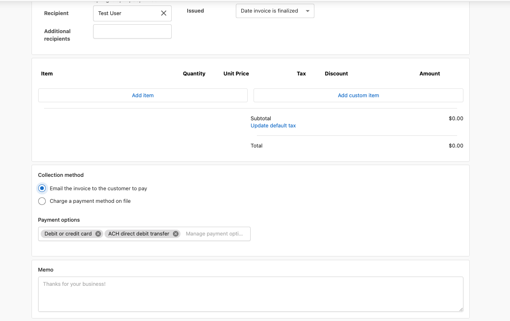
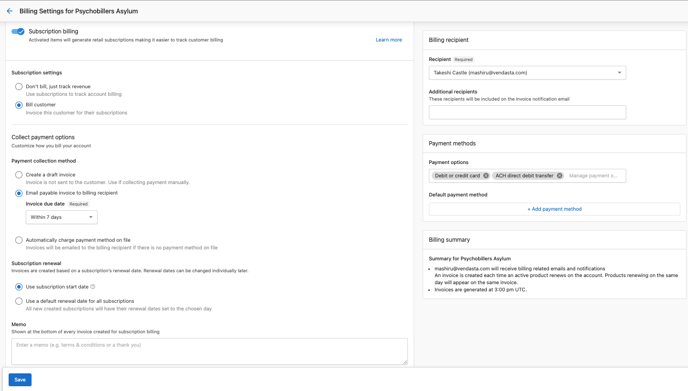
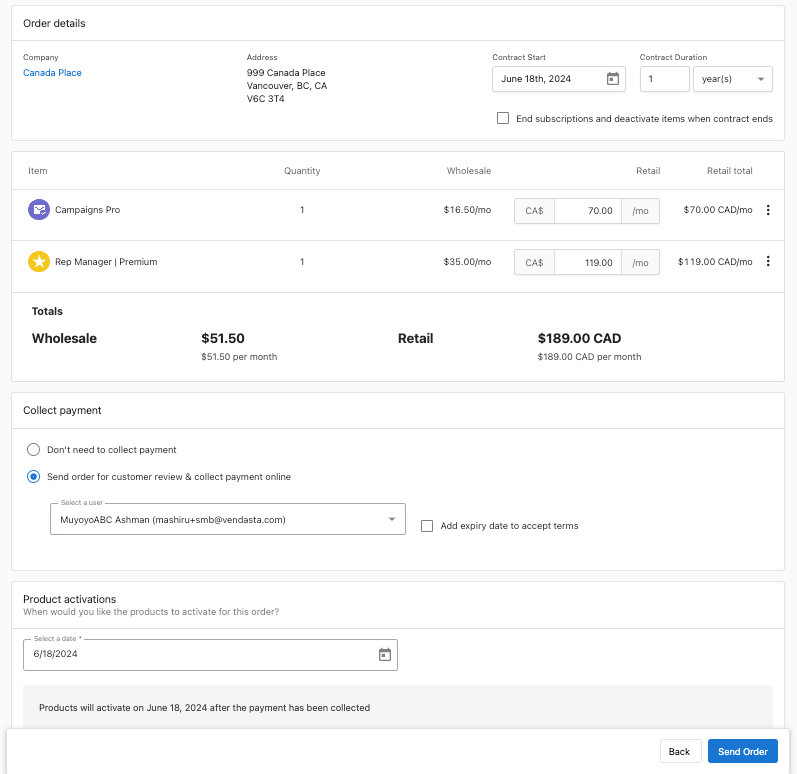
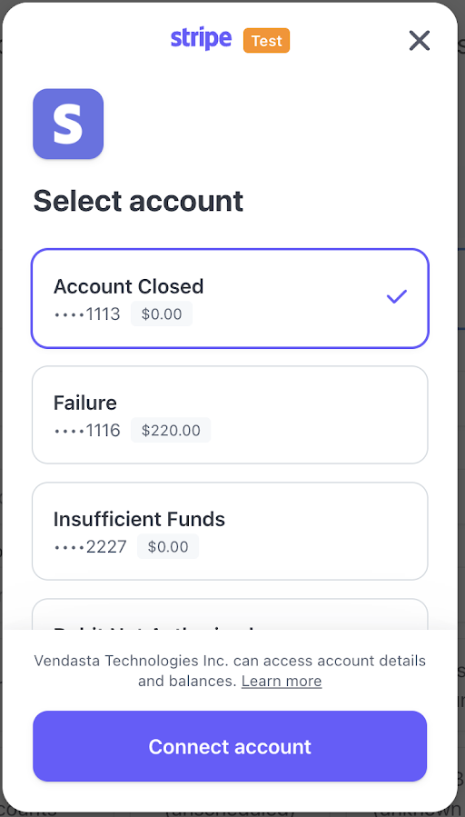

## Descripción general

Vendasta ofrece una solución optimizada para facturar a clientes mediante pagos de débito directo ACH facilitados por Stripe. Esta funcionalidad te permite crear facturas y facilitar pagos usando la red Automated Clearing House (ACH).

<iframe width="560" height="315" src="https://www.youtube.com/embed/QxHVZPZ3p5A?si=FzARS_FtFzcig_vA" title="YouTube video player" frameborder="0" allow="accelerometer; autoplay; clipboard-write; encrypted-media; gyroscope; picture-in-picture; web-share" referrerpolicy="strict-origin-when-cross-origin" allowfullscreen></iframe>

## Requisitos previos para los pagos ACH

Antes de aprovechar los pagos ACH con Vendasta, asegúrate de lo siguiente:

1. Vendasta Payments está configurado.
2. Tu agencia tiene su sede en EE. UU. y presta servicios a clientes también ubicados en EE. UU.

## Cumplimiento y mandatos

El cumplimiento de las regulaciones, incluidas las establecidas por la National Automated Clearing House Association (NACHA) y la legislación federal, exige que se establezca un Authorization Agreement con los clientes antes de cobrar en sus cuentas bancarias. Vendasta Payments, en asociación con Stripe, facilita este proceso presentando a los clientes un acuerdo de autorización al iniciar pagos ACH. Este acuerdo otorga permiso para cargos automáticos futuros, pero es recomendable obtener el consentimiento explícito de los clientes antes de debitar sus cuentas.

**Acuerdo de ejemplo:**

Acuerdo ACH:
*Gracias por registrarte para débitos directos de \<Partner\>. Has autorizado a \<Partner\>, y, si corresponde, a sus entidades afiliadas, a debitar la cuenta bancaria especificada anteriormente por cualquier monto adeudado por cargos derivados de tu uso de los servicios de \<Partner\> y/o la compra de productos de \<Partner\>, de conformidad con el sitio web y los términos de \<Partner\>, hasta que se revoque esta autorización.*

*Has autorizado a \<Partner\>, y, si corresponde, a sus entidades afiliadas, a debitar tu cuenta bancaria periódicamente si y cuando uses los servicios de \<Partner\> o compres más de uno de los productos de \<Partner\> periódicamente de conformidad con los términos de \<Partner\>. Los pagos que queden fuera de los débitos periódicos autorizados anteriormente solo se debitarán después de obtener tu autorización.*

*Puedes modificar o cancelar esta autorización en cualquier momento notificando a \<Partner\> con 30 (treinta) días de anticipación.*

*[Consulta estos términos en Stripe.com](https://stripe.com/en-ca/legal/end-customer-ach-payments-authorization)*

## Tarifas asociadas con los pagos ACH

Las transacciones procesadas mediante ACH conllevan las siguientes tarifas:

1. 1% del monto de la factura.
2. Tarifa de verificación instantánea de $1.
3. $4.00 por cada pago de débito directo ACH fallido.
4. $15.00 por cada pago de débito directo ACH en disputa.

## Solicitar pagos ACH en una factura

1. Crea una factura (única o recurrente) para una cuenta de cliente y selecciona `Email the invoice to the customer to pay` en el método de cobro. En las opciones de pago, selecciona `Debit or Credit Cards` y/o `ACH direct debit transfer`. Puedes seleccionar una o ambas opciones según cómo quieras que pague tu cliente.
   - También puedes cobrar automáticamente un método de pago registrado. Selecciona `Charge a payment method on file` y elige el método de pago deseado.
   
   
   - Para registrar el método de pago del cliente, primero envíale una factura y pídele que pague y acepte un mandato de autorización que te otorgue permiso para cargos automáticos posteriores.

2. Envía la factura a tu cliente para que pague. 

3. Según las opciones que hayas seleccionado, tu cliente verá una o varias opciones de pago. Con la opción ACH, verá `US Bank Account`.
   a. A tu cliente se le pedirá que inicie sesión y acepte el acuerdo de mandato, que puede darte autorización para cobrar automáticamente facturas futuras.

## Solicitar pagos ACH en la facturación de suscripciones

1. Selecciona la cuenta del cliente y ve a `Subscriptions` → `Billing Settings` para habilitar la facturación de suscripciones si aún no lo has hecho.

2. Selecciona el método de cobro `Email the invoice to the customer to pay` y, en las opciones de pago, selecciona `Debit or Credit Cards` y/o `ACH direct debit transfer`. Puedes seleccionar una o ambas opciones según cómo quieras que pague tu cliente. 
   - También puedes cobrar automáticamente un método de pago registrado. En las opciones de pago, selecciona `Automatically charge payment method on file` y elige el método de pago predeterminado.
   
   

3. Guarda los cambios.

4. Todas las facturas generadas por la facturación de suscripciones se establecerán con las opciones de pago configuradas de forma predeterminada.

5. Las opciones de pago configuradas también serán las predeterminadas para las nuevas facturas manuales que crees en la cuenta.

## Cobrar el pago de un pedido

Puedes solicitar el pago a los clientes usando ACH o débitos preautorizados (PAD) antes de que se activen los productos y se incurran en cargos mayoristas. Los clientes ingresarán su información de pago tal como lo harían con una factura. Los productos se activan automáticamente una vez que el pago se procesa con éxito.

Para configurar este proceso:

1. Habilita la facturación de suscripciones:
   - Ve a la cuenta del cliente.
   - Ve a `Subscriptions` → `Billing settings` y habilita la facturación de suscripciones si aún no está activa. Consulta [Subscription Management](../subscriptions/subscription-management.mdx) para la configuración detallada de la facturación de suscripciones si es necesario.

2. Configura las opciones de pago:
   - Selecciona `Email the invoice to the customer to pay` en el método de cobro.
   - Elige `Debit or Credit Cards` y/o `ACH direct debit transfer` en las opciones de pago, según tu preferencia para los pagos de clientes.

3. Guarda los cambios.

4. Pide y envía el producto:
   - Ve a Partner Center, pide el producto deseado y envíalo al cliente para su revisión y pago.

Los clientes verán las opciones de pago configuradas en el paso 2 y podrán proceder en consecuencia.

## Flujo de trabajo de ACH

Los pagos ACH tardan hasta 5 días en procesarse y pagarse a tu cuenta. A diferencia de los pagos con tarjeta que son instantáneos, los pagos ACH pueden ser un poco difíciles de rastrear. Por lo tanto, es importante conocer el flujo de trabajo para este tipo de pago.

**Flujo de trabajo:**

- Envía una factura a tu cliente para que realice el pago mediante ACH.
- Tu cliente ingresará los datos de su cuenta bancaria y aceptará el Authorization agreement que te otorga un mandato para pagos futuros.
- Se realiza el pago.
  - Si eliges la opción de cobro automático, se realiza un cargo directo a la cuenta bancaria del cliente.
- Cuando se realiza un pago ACH, se crea una entrada de pago en estado pendiente, ya que el pago tarda un tiempo en procesarse por completo. Ve a `Billing` → `Payments` para ver la entrada de pago.
- Los pagos ACH pueden tardar hasta 5 días hábiles. Cuando se reciben los fondos, el pago se marca como exitoso; si no se reciben, marca el pago como fallido.
- El estado de la factura también se actualiza.

Para conocer en detalle cómo se ve el flujo de trabajo en Stripe, consulta su [guía de ACH](https://docs.stripe.com/payments/ach-direct-debit).

:::note
El nombre de Vendasta aparece brevemente en el flujo de pago del cliente (ver ejemplo a continuación).
:::

## Disputas y reembolsos

Cabe señalar que Vendasta no tiene una relación contractual con tus clientes y no es responsable de ninguna transacción en disputa.

**Disputas**
Para minimizar disputas y contracargos, obtén siempre el consentimiento explícito de tus clientes antes de debitar sus tarjetas o cuentas bancarias.

- **Ventana de disputa:**
  - Los clientes pueden disputar un pago a través de su banco hasta 60 días calendario después de un débito de una cuenta personal, o hasta 2 días hábiles para una cuenta comercial.
- **Gestión de disputas:**
  - Las disputas de débito directo ACH son finales, sin proceso de apelación. Si una disputa tiene éxito, debes contactar directamente al cliente para resolver el problema.
  - Una disputa exitosa invalida el mandato asociado, evitando su reutilización. Para volver a intentar un cargo, resuelve la disputa y obtén una nueva autorización de mandato.
  - Si se disputa un pago posterior, Stripe bloquea la cuenta bancaria para uso futuro.

Consulta el artículo de soporte de Stripe [aquí](https://support.stripe.com/questions/respond-to-or-contest-an-ach-direct-debit-dispute-as-a-merchant) si es necesario.

**Reembolsos**

- **Ventana de reembolso:**
  - Los reembolsos de pagos de débito directo ACH se pueden enviar hasta 180 días después de la fecha del pago original.
  - Los reembolsos tardan al menos 3 días hábiles en procesarse.
- **Reembolsos anticipados:**
  - Si solicitas un reembolso para un pago que aún no se ha completado (dentro de unas horas de haber creado el Payment Intent), Stripe cancela el pago original al no enviar el cargo al banco, anulando efectivamente la transacción en lugar de procesar un reembolso.
  - Consulta [Emitir notas de crédito a clientes](../credit-notes/index.mdx#issue-credit-notes) para saber cómo emitir un reembolso.
