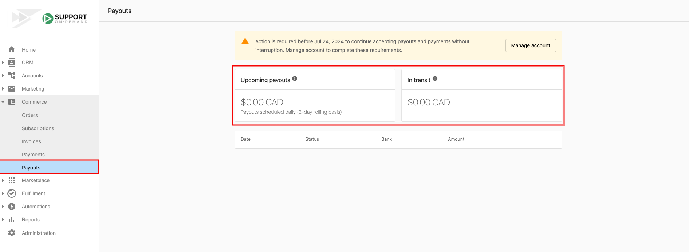

# Gestionar pagos a tu cuenta

## ¿Qué son los pagos a tu cuenta (Payouts)?

Los Payouts transfieren automáticamente tus ingresos ganados desde Partner Center Commerce a tu cuenta bancaria designada. Cuando los clientes pagan por tus servicios a través de Vendasta Payments, esos fondos se procesan y luego se te pagan según tu cronograma de pagos configurado y los ajustes de tu cuenta bancaria.

## ¿Por qué son importantes los Payouts?

Los Payouts garantizan que recibas tus ingresos ganados de manera oportuna y confiable. El sistema gestiona las conversiones de moneda, administra varias cuentas bancarias para diferentes monedas y proporciona transparencia sobre cuándo puedes esperar recibir tus fondos. Este proceso automatizado elimina la necesidad de cobro manual de pagos y proporciona un flujo de caja predecible para tu negocio.

## Qué puedes hacer con Payouts

Con el sistema de Payouts, puedes:

- Configurar una o varias cuentas bancarias para recibir pagos
- Configurar cuentas bancarias para diferentes monedas y evitar tarifas de conversión
- Hacer seguimiento del estado de los pagos actuales y pasados
- Supervisar los próximos cronogramas de pago
- Ver el historial detallado de pagos y los desgloses de transacciones
- Actualizar la información de la cuenta bancaria cuando sea necesario

## Cómo consultar el estado de un Payout

Para consultar el estado de tu pago a tu cuenta:

1. Ve a `Partner Center` → `Commerce` → `Payouts`
2. Ve los próximos pagos y los fondos en tránsito en la parte superior de la página
3. Revisa el desglose de todos los pagos y su estado a continuación

El estado de tu pago mostrará:
- **Upcoming payouts**: transferencias futuras programadas
- **In transit**: pagos que se están procesando actualmente
- **Completed**: pagos depositados con éxito
- **Processing**: pagos que están siendo gestionados por tu banco

## Cronograma de pagos

Tu cronograma de pagos lo determina Stripe según tu ubicación, moneda, historial de transacciones e industria, no Vendasta.

**Expectativas de plazo:**
- **Primer pago:** aproximadamente 7 días después de agregar tu cuenta bancaria y recibir tu primer pago exitoso. Algunas industrias pueden ver un retraso inicial de 14 días.
- **Pagos regulares:** entre 2 y 7 días hábiles después del primer pago, en un cronograma continuo.

:::info
Cambiar tu ajuste de pago a "daily" actualiza tu cronograma de pagos futuro; no envía un pago de inmediato.
:::

:::note
Vendasta no controla el momento de los pagos. Si necesitas acceso más rápido a los fondos, contacta a tu banco para preguntar sobre las opciones de Instant Payout, sujetas a la aprobación de tu banco.
:::

¿Qué pasa si mi pago se retrasa o falta?

Si un pago no ha llegado en su fecha de entrega esperada, varios factores podrían estar involucrados:

**Fecha de pago cambiada y pospuesta:** tu próxima fecha de pago esperada se ha actualizado debido a problemas de verificación de cuenta. Revisa tu [panel de Stripe](https://dashboard.stripe.com/account/verifications) y tu correo electrónico por si se solicitó información adicional.

**Pago faltante (menos de 5 días hábiles):** tu pago ha salido de Stripe y está siendo procesado por tu banco. Los bancos pueden agregar días de procesamiento adicionales, incluidos fines de semana y días festivos.

**Pago faltante (más de 5 días hábiles):** contacta a tu banco con la siguiente información: datos de la cuenta bancaria, fecha esperada, monto exacto y pagador (Stripe). Consulta [Cómo verificar el estado de un pago con tu banco](https://support.stripe.com/questions/payouts-being-processed-at-your-bank).

Si tu banco no puede localizar el pago faltante después de 5 días hábiles, contacta a [soporte de Stripe](https://support.stripe.com/contact/login).

¿Qué pasa si los datos de mi cuenta bancaria son incorrectos?

**Cuenta bancaria actualizada durante el tránsito:** si actualizas tu cuenta bancaria mientras un pago está en tránsito, [irá a tu cuenta bancaria anterior](https://support.stripe.com/questions/updating-your-bank-account-while-a-payout-is-in-transit).

**Datos incorrectos ingresados:** puedes [actualizar los datos de tu cuenta bancaria](https://support.stripe.com/questions/update-existing-bank-account-information) desde tu panel de Stripe.

**Cuenta bancaria cerrada:** si tu pago se envía a una cuenta cerrada, [regresará automáticamente a tu cuenta de Stripe](https://support.stripe.com/questions/payout-sent-to-a-closed-bank-account).

¿Qué es una reserva en mi cuenta?

Una [reserva](https://support.stripe.com/topics/reserves) es una parte de tus fondos que Stripe retiene temporalmente para mitigar riesgos potenciales. Esto puede afectar tu cronograma de pagos y los montos. Revisa tu panel de Stripe para obtener detalles sobre cualquier reserva en tu cuenta.

¿Qué países admiten Vendasta Payments?

Vendasta Payments actualmente admite estos países: US, CA, AU, GB, NZ, CZ. Si el ajuste del país de contacto de facturación está fuera de estos seis, verás "Vendasta Payments is currently unsupported in your area".

¿Por qué mi monto de pago es más bajo de lo esperado?

Tu pago representa el monto neto después de deducir lo siguiente de tu saldo de Stripe:

- **Tarifas de procesamiento de Stripe**: cobradas por transacción (por ejemplo, tarifas de tarjeta de crédito, tarifas ACH). Se deducen antes de que los fondos se agreguen a tu saldo.
- **Reembolsos emitidos**: cualquier reembolso que hayas emitido a los clientes reduce tu saldo disponible.
- **Contracargos**: los pagos en disputa que se decidieron a favor del cliente se deducen, junto con cualquier tarifa de disputa asociada.
- **Reservas**: Stripe puede retener temporalmente una parte de tus fondos como reserva para cubrir riesgos potenciales. Revisa tu panel de Stripe para obtener detalles.

Para revisar el desglose de un pago específico, ve a `Partner Center` → `Commerce` → `Payouts` y haz clic en el pago para ver los detalles de la transacción.

¿Qué sucede con mis pagos si mi cuenta está suspendida?

Si tu cuenta de Vendasta Payments está suspendida, los pagos se pausan hasta que se resuelva la suspensión. Los fondos ya presentes en tu saldo de Stripe se retienen y se liberarán una vez que la cuenta vuelva a estar en buen estado.

Para resolver una suspensión, contacta a [billingsupport@vendasta.com](mailto:billingsupport@vendasta.com) para obtener ayuda.

