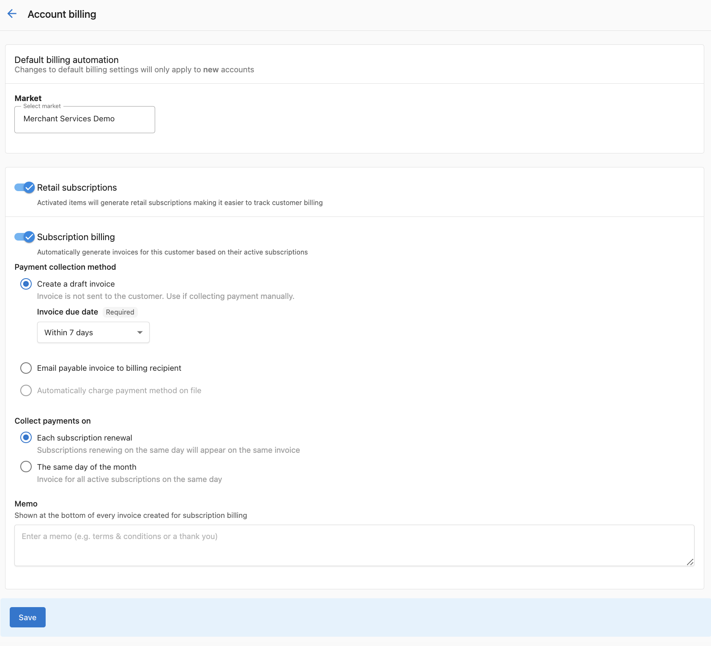
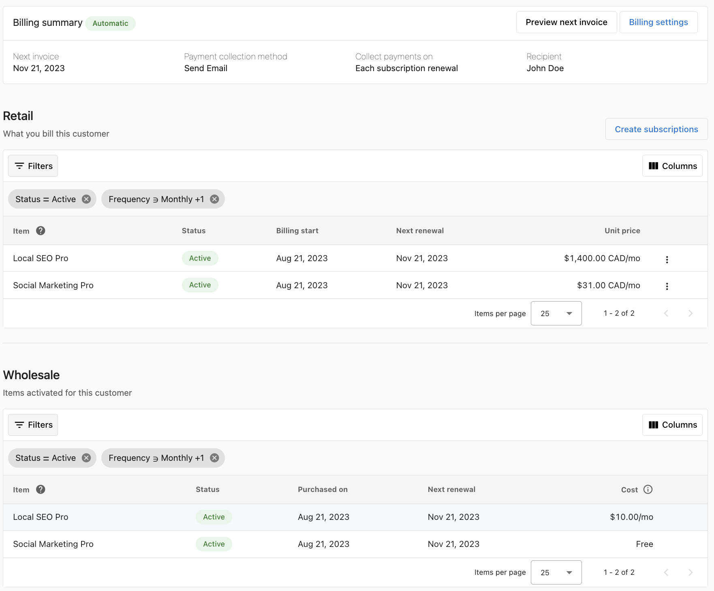
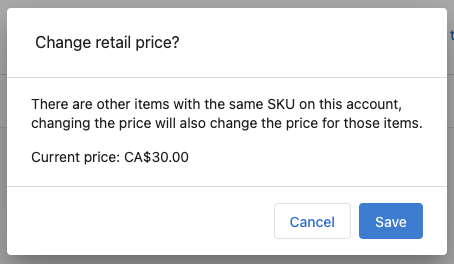
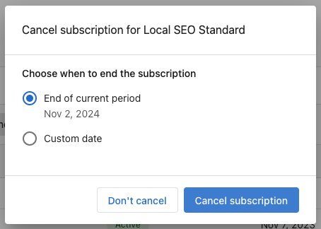
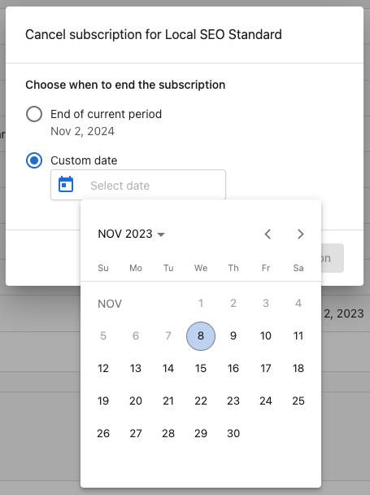
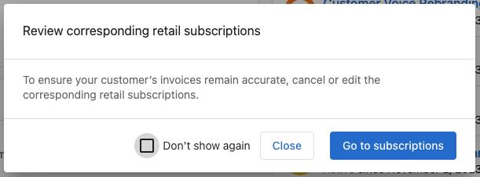

<iframe src="//www.loom.com/embed/76b0b4515c6b45b1a84d628ec8a0c9a0" width="560" height="315" frameborder="0" allowfullscreen></iframe>

## ¿Qué es la gestión de suscripciones?

La gestión de suscripciones en la plataforma Commerce de Vendasta ofrece facturación recurrente automatizada para tus clientes, generando facturas de clientes directamente a partir de los pedidos.

La facturación de suscripciones es un modelo de facturación recurrente en el que los clientes son facturados regularmente (mensual o anualmente) para continuar accediendo a productos y servicios. Cada producto o servicio activado crea suscripciones equivalentes tanto para transacciones de partner a Vendasta (suscripciones mayoristas) como para transacciones de partner a cliente (suscripciones minoristas).

## ¿Por qué usar la gestión de suscripciones?

La facturación de suscripciones ofrece ventajas significativas sobre los métodos de facturación tradicionales:

### Beneficios clave

- **Facturación optimizada y facturación automatizada**: la facturación recurrente automatizada genera facturas de clientes a partir de los pedidos, ahorrando tiempo y esfuerzo
- **Precios de venta personalizables**: anula los precios predeterminados de la tienda y vende a precios negociados a nivel de cliente con facturación recurrente automática
- **Programación de facturas personalizada**: personaliza las condiciones de pago, las fechas de vencimiento, los métodos de pago y las notas de memo para una facturación profesional
- **Transparencia financiera mejorada**: vista integral de los costos y los ingresos minoristas por cuenta de cliente en una interfaz consolidada
- **Control completo**: control total sobre las suscripciones de los clientes: ve, actualiza o cancela suscripciones sin esfuerzo
- **Vista previa de la próxima factura**: una función de vista previa única te permite ver las próximas facturas de los clientes antes de que se envíen

## Cómo configurar la facturación de suscripciones

### Opción 1: configuración predeterminada para todas las cuentas nuevas

Configura ajustes predeterminados que se apliquen a todas las cuentas creadas después de guardar. Las cuentas existentes se pueden configurar individualmente.

1. `Enable Retail Subscriptions`: activa el botón `Retail Subscriptions` para asegurarte de que se cree una suscripción cada vez que actives un producto
2. `Enable Subscription Billing`: activa el botón `Subscription billing` para activar la facturación de clientes (opcional)
3. `Setup Payment Collection`:
   - `Don't bill, just track revenue`: crea suscripciones y hace seguimiento de los ingresos sin generar facturas de clientes
   - `Create a draft invoice`: crea la factura y la guarda como borrador para enviarla manualmente
   - `Email payable invoice to billing recipient`: genera y envía la factura por correo electrónico al cliente para su pago

4. `Configure Subscription Renewal`: las facturas se envían a las 3:00 p. m. UTC en los días de renovación. Las suscripciones que compartan un día de renovación se consolidarán en una sola factura

5. `Set Default Renewal Date`: alinea todas las suscripciones para que tengan el mismo día de renovación y así aparezcan en la misma factura

6. `Add Default Memo`: ingresa una nota predeterminada que se agrega a todas las facturas generadas a partir de suscripciones

7. Haz clic en `Save` para aplicar los ajustes a todas las cuentas recién creadas

### Opción 2: ajustes de facturación a nivel de cuenta

Configura los ajustes de facturación para cuentas de clientes individuales:

1. Ve a la cuenta del cliente en Partner Center
2. Haz clic en `Subscriptions` en el panel superior
3. Haz clic en `Billing Settings` en la esquina superior derecha
4. `Enable Retail Subscriptions`: actívalo para crear suscripciones al activar productos
5. `Enable Subscription Billing`: actívalo para activar la facturación de clientes
6. `Setup Payment Collection Options`:
   - `Don't bill, just track revenue`: hace seguimiento de los ingresos recurrentes sin generar facturas de clientes
   - `Create a draft invoice`: envío manual de facturas
   - `Email payable invoice to billing recipient`: correo automático al cliente
   - `Automatically charge payment method on file`: cobro automático de tarjeta de crédito (requiere un método de pago guardado, ya que si no hay ninguno registrado, las facturas se envían solo por correo electrónico de forma predeterminada)

:::note
Se debe agregar un método de pago a la cuenta **antes** de habilitar el cobro automático. Si no hay un método de pago registrado, las facturas se enviarán solo por correo electrónico de forma predeterminada.
:::

7. `Configure Collection Timing`:
   - `Each subscription renewal`: factura en el día de renovación del producto
   - `Same day of the month`: consolida todas las renovaciones en una sola factura mensual

8. `Add Account Memo`: nota personalizada para las facturas de esta cuenta
9. Haz clic en `Save` para aplicar los ajustes solo a esta cuenta

## Gestionar suscripciones existentes

### Descripción general de los ajustes de facturación

Al ver una suscripción, la información de facturación muestra la configuración especificada al crear la suscripción. Es posible que necesites editar esta información para tarjetas de crédito actualizadas o cambios de método de pago.

#### Ajustes predeterminados
De forma predeterminada, las suscripciones se facturan automáticamente usando el procesador de pagos preconfigurado el primer día del ciclo de facturación.

#### Ajustes a nivel de cuenta
Configura ajustes específicos para gestionar las suscripciones a nivel de cuenta.

### Cómo editar precios de suscripción

Puedes editar los precios de suscripción en cualquier momento. La plataforma muestra cuándo entran en vigor los nuevos precios: los cambios no se aplican al ciclo de facturación actual.

:::note
Cambiar el precio de un producto en tu catálogo **no** actualiza automáticamente las suscripciones activas existentes. Para aplicar un nuevo precio a una suscripción existente, debes editar la suscripción directamente siguiendo los pasos a continuación. Las nuevas suscripciones creadas después del cambio de precio del catálogo reflejarán automáticamente el precio actualizado.
:::

**Para editar el precio de una suscripción:**

1. Encuentra la suscripción en `Commerce` → `Subscriptions`
2. Haz clic en la suscripción que quieres modificar
3. Haz clic en el botón `EDIT PRICE` junto al precio actual
4. Ingresa el nuevo precio de suscripción en los campos correspondientes
5. Haz clic en `SAVE`

Aparecerá un ícono de cambio de precio junto al precio, indicando que ocurrirá un cambio de precio en el próximo ciclo de facturación.

:::note
Si un producto se puede activar más de una vez en una cuenta, los cambios de precio en una suscripción minorista se aplicarán a las demás.
:::

### Cómo cancelar suscripciones

Puedes cancelar suscripciones en cualquier momento con dos opciones:

#### Cancelar al final del período
Permite que la suscripción permanezca activa hasta el final del ciclo de facturación actual.

#### Cancelar con fecha personalizada
Especifica una fecha específica en la que debe finalizar la suscripción.

**Para cancelar una suscripción:**

1. Ve al menú kebab (⋮) en la suscripción minorista que deseas cancelar
2. Selecciona `Cancel Subscription`
3. Elige el momento de la cancelación (fin de período o fecha personalizada)
4. Selecciona qué productos cancelar (permite la cancelación parcial)
5. Confirma la cancelación

:::note
Al cancelar una suscripción, puedes seleccionar qué productos cancelar, lo que te permite mantener algunos productos activos mientras cancelas otros.
:::

### Cómo agregar productos a las suscripciones

**Para agregar productos a una suscripción existente:**

1. Ve a la suscripción en `Commerce` → `Subscriptions`
2. Haz clic en la suscripción que quieres modificar
3. Haz clic en `ADD PRODUCTS`
4. Selecciona los productos adicionales a agregar
5. Configura los ajustes del producto según sea necesario
6. Haz clic en `SAVE`

Los productos recién agregados se prorratearán por el tiempo restante en el ciclo de facturación actual.

### Cómo quitar productos de las suscripciones

**Para quitar productos sin cancelar toda la suscripción:**

1. Ve a la suscripción en `Commerce` → `Subscriptions`
2. Haz clic en la suscripción que quieres modificar
3. Encuentra el producto que deseas quitar
4. Haz clic en el ícono de menú (tres puntos) junto al producto
5. Selecciona `Remove`
6. Confirma la eliminación

Quitar productos sigue las mismas reglas de cancelación que cancelar suscripciones: puedes elegir quitar el producto al final del período de facturación o en una fecha específica.

## Preguntas frecuentes

Si vendo un paquete, ¿mi cliente recibe una factura o varias?

Los artículos en un paquete que comparten una frecuencia de facturación se facturan juntos, por lo que un paquete de productos mensuales genera un solo cargo mensual por el total del paquete en lugar de un cargo por producto.

Los paquetes admiten frecuencias mixtas, y los artículos en diferentes ciclos se facturan en sus propios ciclos. Un paquete que contiene productos mensuales y un producto anual genera el cargo mensual cada mes y el cargo anual una vez al año. La suscripción minorista refleja el ciclo de facturación propio de cada artículo.

La vista de suscripción enumera cada producto por separado, lo que puede parecer varios cargos. Revisa el monto de la próxima factura en lugar de la lista de productos para ver lo que realmente se le facturará al cliente.

Si un cliente tiene productos que se activaron en fechas diferentes y quieres que todo llegue en una sola factura, establece `Use a specific renewal date` en tus ajustes de facturación. Consulta [Primeros pasos con suscripciones y facturación de clientes](/getting-started/getting-started-guides/getting-started-with-subscriptions-and-client-billing).

¿Quién puede usar la facturación de suscripciones?

Todos los partners en la plataforma de Vendasta pueden usar las suscripciones minoristas para gestionar la facturación de sus clientes, tengan o no habilitados los servicios de comerciante. Puedes hacer seguimiento fácilmente de los ingresos recurrentes en cada cuenta a la que vendes.

¿Cómo recibo el pago de mi cliente?

Las suscripciones minoristas generarán facturas para tus clientes según los ajustes de facturación que hayas configurado para la cuenta. El pago se cobra según el método de cobro de pago que elijas:

- **Facturas en borrador**: envías manualmente las facturas a los clientes
- **Facturas por correo electrónico**: los clientes reciben las facturas por correo electrónico y pueden pagar en línea
- **Cobro automático**: los métodos de pago registrados se cobran automáticamente

¿Cómo vendo productos personalizados?

Para productos personalizados, agrégalos a tu tienda en la plataforma:

1. En Partner Center, ve a `Marketplace` → `Products`
2. Haz clic en `Create Product` en la esquina superior derecha
3. Después de crear el producto, agrégalo a un pedido o actívalo para tu cliente

¿Qué sucede con las actualizaciones y degradaciones de versión de productos?

Cada versión crea su propia suscripción minorista. Debes cancelar la versión anterior para que no se agregue a la próxima factura de tu cliente.

Consulta los pasos de cancelación de suscripción anteriores para saber cómo cancelar una suscripción.

¿Qué debo hacer cuando falla la activación de un producto o se rechazan los pedidos?

Cuando los productos en un pedido no se activan debido a un pago fallido, rechazo del proveedor, etc., la suscripción minorista creada debe cancelarse manualmente para que no se agregue a la factura del cliente.

Consulta los pasos de cancelación de suscripción anteriores para saber cómo cancelar una suscripción.

¿La facturación de suscripciones detendrá mis facturas recurrentes?

No. Las facturas recurrentes no se ven afectadas por la facturación de suscripciones. Sin embargo, asegúrate de no facturar dos veces a tu cliente por los mismos productos con suscripciones minoristas y facturas recurrentes.

Uso "bill by active": ¿cómo me afecta la facturación de suscripciones?

La opción de facturación "Bill by active" se actualizará para admitir la facturación de suscripciones y todas sus funciones. La facturación de tu cliente no se verá afectada; en cambio, tendrás acceso a nuevas funciones:

- Ahora se muestran los precios de suscripción minorista
- Las suscripciones minoristas se pueden gestionar (editar precio, cancelar suscripción)
- Las próximas facturas se pueden previsualizar
- La nueva sección de suscripciones mayoristas proporciona un contexto completo de costos e ingresos

:::note
Con la facturación de suscripciones, asegúrate de dejar de facturar a tu cliente cuando canceles un producto o servicio siguiendo los pasos de cancelación de suscripción.
:::

¿Cómo cambio el precio de una suscripción minorista?

El precio unitario de una suscripción minorista es el monto que se le facturará al cliente en cada período de facturación. El precio unitario se puede editar mientras la suscripción está activa, y los cambios se aplican a todos los períodos de facturación posteriores.

1. Abre la suscripción minorista que deseas editar haciendo clic en la fila o seleccionando `View subscription` en el menú kebab
2. Haz clic en el precio unitario de la suscripción minorista
3. Ingresa el nuevo precio y haz clic en guardar

Si un producto se puede activar más de una vez en una cuenta, los cambios de precio en una suscripción minorista se aplicarán a las demás.

Cancelé un producto, ¿cómo detengo la facturación de mi cliente?

Puedes cancelar la suscripción minorista de un producto o servicio para detener la facturación de tu cliente. El estado cambiará a Inactive. Todas las demás suscripciones Active seguirán generando facturas.

Sigue los pasos de cancelación de suscripción en la sección de gestión anterior.

¿Cuándo ocurre el primer cargo de facturación para una nueva suscripción?

Las suscripciones no se cobran en el mes de creación. El primer cargo automático ocurre en la próxima fecha de renovación después de que se crea la suscripción.

Por ejemplo, si creas una suscripción el 15 de marzo con una renovación mensual, el primer cargo automático será el 15 de abril.

Para facturar a tu cliente de inmediato en el mes de creación, emite manualmente una factura desde la suscripción.

¿Qué sucede cuando finaliza una prueba de suscripción?

Las suscripciones de prueba no se convierten automáticamente en suscripciones pagas cuando finaliza el período de prueba. Una vez que expira la prueba, los servicios ya no estarán disponibles para el cliente a menos que actualices manualmente a un plan pagado.

Para continuar el servicio después de una prueba, actualiza la suscripción antes o cuando finalice la prueba.

:::tip
Crear una suscripción de prueba no requiere una tarjeta de crédito registrada, lo que facilita comenzar una prueba sin información de pago.
:::

¿Hay límites en las cantidades de suscripción?

Las suscripciones admiten cantidades de 1 a 99 unidades por suscripción. Para pedidos más grandes, ajusta el precio unitario para reflejar el valor total del pedido y crea una sola suscripción.

¿Cuáles son las limitaciones del nivel Free para las suscripciones?

Los partners en el nivel Free tienen acceso limitado a las funciones de suscripción:

- **Precios**: solo precios minoristas, no hay precios de descuento mayorista disponibles
- **Mensajería SMS**: los negocios asociados con una cuenta de Partner Free no pueden reclamar un número de SMS ni enviar mensajes a través de Business App
- **Personalización de marca blanca**: no puedes aplicar ni gestionar ajustes de marca blanca en el nivel Free. Si tenías productos de marca blanca activos antes de una degradación, permanecerán como están pero no se pueden modificar hasta que actualices

Para acceder a estas funciones nuevamente, actualiza a un nivel de suscripción pago contactando a tu representante de Vendasta.

:::note
Si tu cuenta ha sido suspendida o enviada a cobranza, es posible que se haya degradado automáticamente al nivel Free. Contacta a tu representante de Vendasta para conversar sobre la actualización a un plan pago.
:::

## Notas importantes

- Las facturas de renovación de suscripción se envían a las 3:00 p. m. UTC en los días de renovación
- Las suscripciones que compartan un día de renovación se consolidarán en una sola factura
- Los cambios de precio no se aplican al ciclo de facturación actual
- Los productos recién agregados se prorratean por el tiempo de facturación restante
- Las eliminaciones de productos siguen las mismas reglas de tiempo que la cancelación de suscripción
- Los ajustes predeterminados se aplican solo a las cuentas recién creadas después de guardar
- Los ajustes a nivel de cuenta anulan los ajustes predeterminados para cuentas específicas
- Las nuevas suscripciones no se cobran en el mes de creación: el primer cargo automático ocurre en la próxima fecha de renovación
- Si no hay un método de pago registrado, las facturas se envían solo por correo electrónico de forma predeterminada
