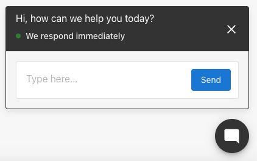
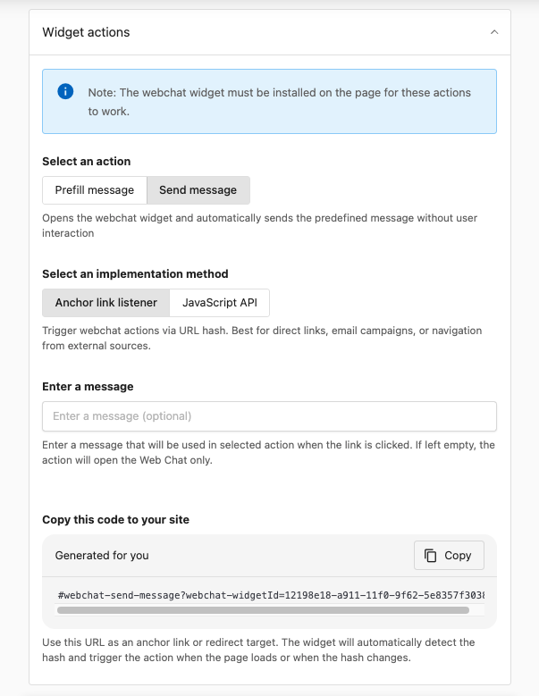

# Widget de chat web asistido por IA para partners de Vendasta

Como partner de Vendasta, tienes acceso a un widget de captación de clientes potenciales impulsado por IA de forma gratuita para tu sitio web. Aprende a instalarlo rápidamente con nuestro video instructivo.

<iframe 
  src="//www.youtube-nocookie.com/embed/8AYwfqI4L88" 
  width="560" 
  height="315" 
  frameborder="0" 
  allowfullscreen=""
></iframe>

Este potente widget es similar a la versión de Conversations AI que puedes vender a tus clientes. Una vez instalado en tu sitio web, el asistente de IA actúa como un útil primer respondiente ante los visitantes del sitio web, responde preguntas, recopila información de contacto y entrega nuevos clientes potenciales a tu CRM.

## Sitios web multiubicación

Si tú o tus clientes manejan una marca o franquicia con un sitio web principal que abarca varias ubicaciones, usa el **widget de chat web multiubicación** en su lugar. Agrega un único widget en el que los visitantes eligen su ubicación y chatean con el AI Chat Receptionist propio de esa ubicación, de modo que cada conversación y cliente potencial se mantenga con el negocio correcto.

Aprende a configurarlo en [Widget de chat web multiubicación](/multi-location-business-app/conversations/multi-location-web-chat).

## Crear y gestionar widgets de chat web

Puedes tener más de un widget de chat web y asignar un AI employee distinto a cada uno, por ejemplo, un widget de ventas en tu página de precios y un widget de soporte en tu página de ayuda.

1. En Partner Center, ve a `Conversations` → `More` → `Conversations Settings`. La página se abre en la tarjeta **Web Chat**. `Administration` → `Conversations Settings` lleva a la misma página.
2. En la tarjeta **Web Chat**, haz clic en **Manage widgets** para abrir la página **Web Chat configuration**. Esta página enumera todos los widgets junto con sus **Assigned Employees**, **Status** y **Widget type**.
3. Haz clic en **New Web Chat** para crear un widget y asígnale un **Widget name** para identificarlo internamente.

Desde la página **Web Chat configuration** también puedes gestionar los widgets existentes usando el menú `⋮` en cada fila:

- **Edit**: cambia el AI employee, los mensajes o la apariencia del widget
- **Embed**: copia el código de instalación para tu sitio
- **Delete**: elimina un widget que ya no uses

:::note
El widget **System** es el widget de Chat Receptionist integrado y no se puede eliminar. Su menú `⋮` solo ofrece **Edit**, sin opción de **Embed**, así que para obtener un widget que se pueda incrustar necesitas crear un **New Web Chat**. Los widgets que creas tú mismo se marcan como **Standard**.
:::

## Asignar un AI employee

Cada widget de chat web es gestionado por un AI employee asignado: ya sea el Chat Receptionist listo para usar o un AI employee personalizado que hayas creado.

1. Abre el widget desde la página **Web Chat configuration** (haz clic en su nombre o usa el menú `⋮` y elige **Edit**).
2. En la tarjeta **AI employee**, haz clic en **Select employee**.
3. En el cuadro de diálogo **Select employee**, elige el Chat Receptionist o uno de tus AI employees personalizados, luego haz clic en **Ok**.
4. Haz clic en **Configure** en la tarjeta **AI employee** para ajustar el conocimiento, la personalidad o las capacidades de ese empleado.
5. Haz clic en **Next** para guardar el widget.

Un widget puede tener solo un AI employee a la vez, pero el mismo empleado se puede asignar a varios widgets. Si un widget muestra una advertencia de **No assigned employee**, asigna uno antes de instalarlo. Para crear un empleado especializado, consulta [Crear AI employees personalizados](../ai/ai-workforce/custom-ai-employees.md).

## Widget Actions
Las Widget Actions te permiten crear enlaces directos que abren automáticamente el widget de chat web con mensajes predefinidos. Esto es ideal para campañas de correo electrónico, páginas de destino, páginas de soporte o cualquier escenario en el que quieras dirigir a los visitantes para que inicien un chat con un mensaje específico.

:::note
El widget de chat web debe estar instalado en la página para que estas acciones funcionen.
:::

### Tipos de acción

Hay dos tipos de acciones de widget que puedes configurar:

- **Prefill message**: abre el widget y precarga el campo de mensaje con tu texto predefinido. El visitante debe hacer clic en Enviar para enviar realmente el mensaje.
- **Send message**: abre el widget y envía automáticamente el mensaje predefinido sin requerir ninguna interacción del usuario. Es ideal para una interacción inmediata.

### Métodos de implementación

Puedes activar las acciones del widget usando dos métodos:

**Anchor link listener** (recomendado para la mayoría de los casos de uso):
- Ideal para: enlaces directos, campañas de correo electrónico, navegación desde fuentes externas
- Usa el formato de hash de URL: `#webchat-send-message?webchat-widgetId={widget-id}` o `#webchat-prefill-message?webchat-widgetId={widget-id}`
- El widget detecta automáticamente el hash cuando se carga la página o cuando cambia el hash

**JavaScript API**:
- Ideal para: integraciones personalizadas, contenido dinámico, activación programática
- Te permite activar acciones de forma programática desde tu propio código JavaScript

### Pasos de configuración

1. En Partner Center, ve a `Conversations` → `More` → `Conversations Settings`, abre la página **Web Chat configuration** y luego abre **Widget Actions**
2. Selecciona un tipo de acción: **Prefill message** o **Send message**
3. Selecciona un método de implementación: **Anchor link listener** o **JavaScript API**
4. Ingresa un mensaje opcional que se usará cuando se haga clic en el enlace
5. Copia el código generado y úsalo como enlace de anclaje o destino de redirección

El código generado tendrá un aspecto como: `#webchat-send-message?webchat-widgetId=fedf2e7a-30fb-11f0-941a-ea112a20`

### Casos de uso

- **Campañas de correo electrónico**: incluye un enlace de "Chatea con nosotros" que abra el widget con un mensaje como "Me interesan sus servicios"
- **Páginas de destino**: agrega llamados a la acción que abran el chat con mensajes específicos según el contexto
- **Páginas de soporte**: crea enlaces que abran el chat con preguntas de soporte precargadas
- **Páginas de producto**: permite que los visitantes pregunten sobre productos específicos con consultas precargadas
