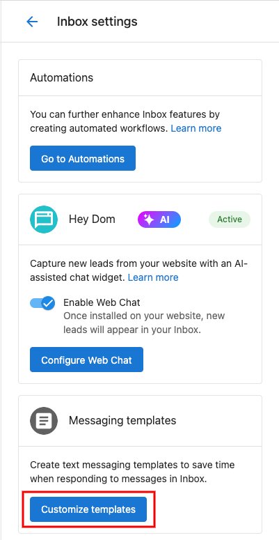
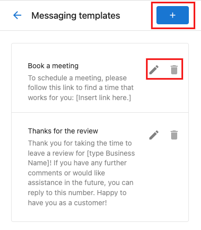
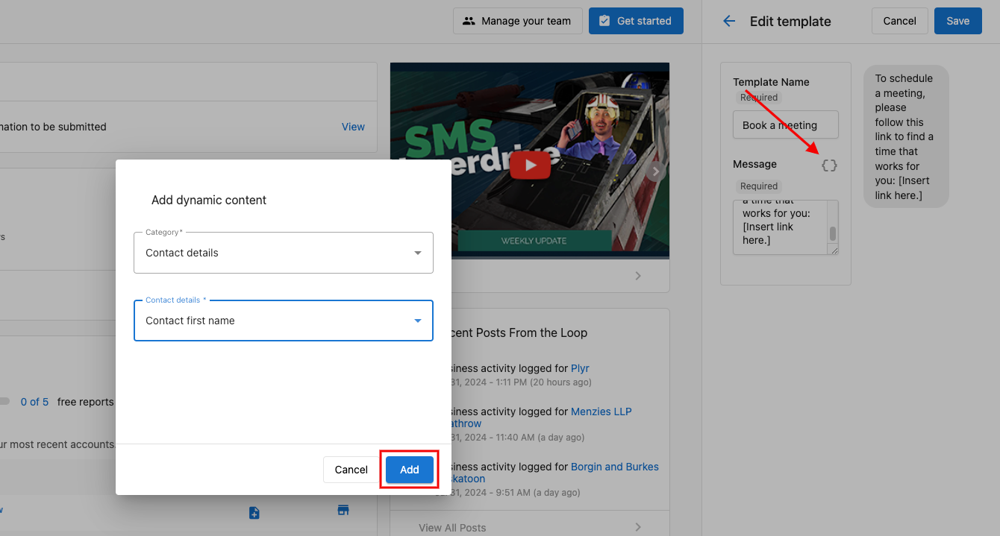
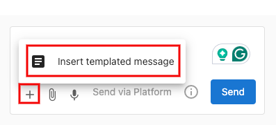
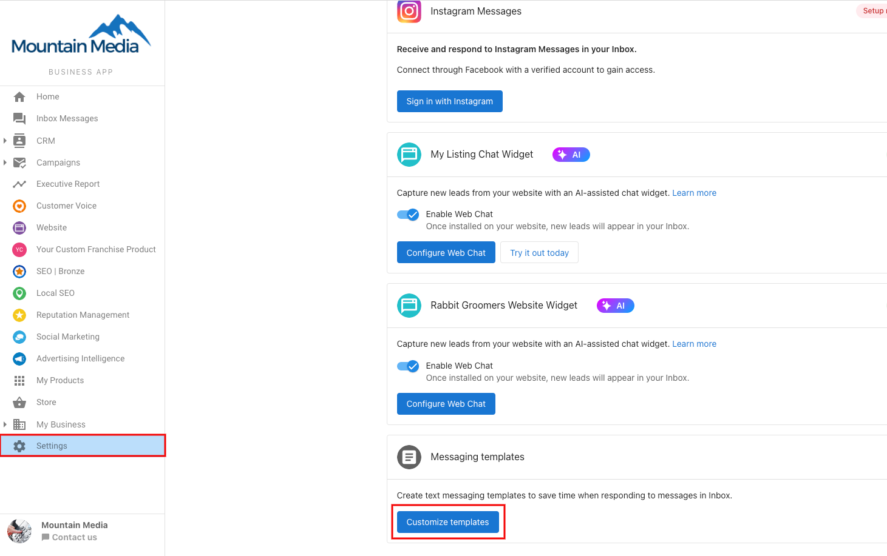

Ahorra tiempo y mantén la consistencia en tus comunicaciones creando plantillas de mensajes reutilizables. Agrega componentes dinámicos para personalizar automáticamente cada mensaje, haciendo que tus respuestas sean eficientes y personales a la vez.

## Usar plantillas de Conversations

Así es como configurar y usar plantillas de mensajes:

1. Ve a `Partner Center` → `Conversations` → `Settings` → `Customize Templates`

2. Crea nuevas plantillas, edita las existentes o elimina las que no uses con el ícono de papelera

3. Haz tus plantillas dinámicas haciendo clic en el ícono de componente dinámico en el editor. Elige tus componentes y haz clic en `Add`

4. Para usar una plantilla al enviar un mensaje, haz clic en el botón `+` en la parte inferior de tu editor de mensajes y selecciona `Insert Templated Message`

## Plantillas de Business App

¿Necesitas personalizar las plantillas en Business App? Sigue los mismos pasos en `Business App` → `Administration` → `Conversation` → `Customize Templates`

