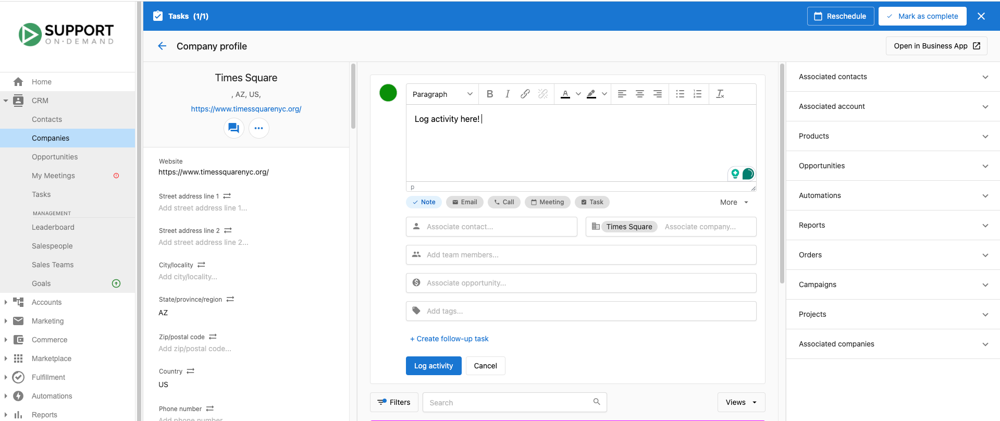

import { GraduationCapIcon } from '@site/src/components/Icons';

# Empresas

La sección Companies en el CRM de Vendasta proporciona herramientas completas para gestionar tus relaciones comerciales de manera efectiva. Este centro centralizado te permite hacer seguimiento de la información de la empresa, registrar actividades, y supervisar la interacción a lo largo de tu proceso de ventas. Con funciones avanzadas como la puntuación de clientes potenciales y el registro de actividades, puedes priorizar prospectos y mantener registros detallados de todas las interacciones. La sección Companies sirve como tu espacio de trabajo principal para construir y nutrir relaciones comerciales que impulsan el crecimiento de ingresos.

## ¿Por qué usar empresas?

Las empresas en el CRM te permiten mantener registros completos, puntuar clientes potenciales para una mejor priorización, y garantizar que no se pierda ninguna interacción comercial importante.

## Qué incluye

- **Registro de actividad**: haz seguimiento de las comunicaciones de venta y crea registros de actividad detallados
- **Puntuación de clientes potenciales**: priorización automatizada de clientes potenciales según el perfil de comprador y la intención (configurado en `Administration` → `Score`)
- **Encontrar clientes potenciales**: descubre e identifica oportunidades comerciales potenciales usando la búsqueda de negocios locales
- **Filtrado y búsqueda avanzados**: filtra empresas por varios criterios y busca en múltiples campos
- **Relaciones de empresa padre-hijo**: gestiona jerarquías corporativas y filtra empresas hijas por su empresa padre
- **[Campos de empresa predeterminados del CRM](./crm-default-company-fields.mdx)**: campos estándar disponibles para hacer seguimiento de la información de la empresa
- Gestión de empresas vs. cuentas: comprende la relación entre las cuentas de facturación y las empresas del CRM

## Primeros pasos

1. **Navega a empresas**
   - Ve a `Partner Center` → `CRM` → `Companies`
   - Accede a tu espacio de trabajo de gestión de relaciones comerciales

2. **Configura los perfiles de empresa**
   - Agrega nueva información de empresa usando los campos predeterminados
   - Configura campos personalizados según las necesidades de tu negocio

3. **Configura la puntuación de clientes potenciales**
   - Navega a `Partner Center` → `Administration` → `Score`
   - Configura criterios de puntuación positivos y negativos
   - Habilita la priorización automatizada de clientes potenciales

4. **Comienza a registrar actividades**
   - Haz clic en las páginas de perfil de la empresa
   - Registra comunicaciones y actividades de venta
   - Haz seguimiento de la interacción a lo largo del proceso de ventas

## Registro de actividad para empresas

A lo largo del proceso de ventas, tus vendedores deben registrar sus comunicaciones y crear oportunidades de venta en el CRM. Esto les ayudará a entender dónde enfocar su tiempo y esfuerzo a medida que su lista de clientes continúa creciendo.

### Cómo registrar actividades

Para registrar una actividad para un contacto, haz clic en la página de perfil de un contacto:

- En el medio de la página, localiza el registrador de actividad y haz clic en `Share an update` para explorar varias opciones
- Selecciona el tipo de actividad e indica si te comunicaste exitosamente con el cliente
- Agrega notas detalladas sobre la actividad
- Indica si se requiere seguimiento. Si se requiere seguimiento, crea tareas para darle seguimiento

### Opciones de actividad manual

- **Notes**: comparte cualquier información relevante sobre las empresas a través de la función de notas
- **Email**: registra actividades de correo electrónico dentro del CRM. Haz seguimiento de correos entrantes, salientes, y reenviados
- **Call**: registra actividades de llamadas dentro del CRM. Haz seguimiento de llamadas entrantes y salientes, el estado de la llamada, y el resultado de las llamadas
- **Meeting**: supervisa todas las reuniones, incluida la duración, el estado, el resultado, y los participantes
- **Task**: crea tareas para actividades futuras. Registra el trabajo a realizar, la prioridad, y asígnala
- **More**: SMS | Inbox | LinkedIn - registra comunicación externa desde SMS, Inbox, o LinkedIn a través del botón "more"
- **Creación de tareas**: especifica un título de tarea, proporciona las instrucciones necesarias, y elige el tipo de tarea (por ejemplo, una llamada). También puedes establecer una prioridad si la tarea es urgente

### Acciones de la plataforma registradas automáticamente

- Contacto/empresa creado
- Cuando se cambia el vendedor asignado
- Oportunidades cerradas perdidas/ganadas
- Correo electrónico capturado automáticamente desde BCC/reenvío automático
- Todas las actividades de venta desde SSC

También puedes configurar automatizaciones/Zapier para que las actividades se registren automáticamente.

## Cargar archivos a empresas

Puedes cargar archivos directamente a los registros de empresa para mantener una documentación organizada:

1. Abre la página de perfil de una empresa
2. Navega a la sección `Files`
3. Haz clic en `Add a file` para cargar documentos, imágenes, u otros archivos
4. Consulta los resúmenes generados por IA para una mejor organización de archivos

Aprende más sobre [carga de archivos](../file/crm-file-upload.mdx) y los tipos de archivo admitidos.

## Filtrado y búsqueda de empresas

La interfaz de Companies ofrece potentes capacidades de filtrado y búsqueda para ayudarte a gestionar de manera efectiva grandes cantidades de prospectos:

### **Búsqueda rápida**
- **Nombre de la empresa**: busca por nombres de empresa completos o parciales
- **URL del sitio web**: encuentra empresas por sus dominios de sitio web
- **Números de teléfono**: busca usando números de teléfono completos o parciales
- **Información de dirección**: filtra por ciudad, estado, o código postal

### **Filtros avanzados**
- **Puntuación de clientes potenciales**: filtra por rangos de puntuación de clientes potenciales (prioridad alta, media, baja)
- **Fechas de actividad**: encuentra empresas según la fecha del último contacto o la línea de tiempo de actividad
- **Vendedor asignado**: consulta empresas asignadas a miembros específicos del equipo
- **Etapa del ciclo de vida**: filtra por etapa del prospecto (cliente potencial, calificado, cliente, etc.)
- **Empresa padre**: filtra para mostrar empresas hijas que pertenecen a una empresa padre específica
- **Etiquetas**: filtra por etiquetas de empresa aplicadas para la categorización
- **Fecha de creación**: encuentra empresas recientemente agregadas o históricas
- **Fuente de registro**: filtra por cómo ingresaron las empresas a tu CRM (formulario, importación, manual)

## Reglas de formato de etiquetas

Las etiquetas te ayudan a organizar y filtrar los registros de empresa. Para funcionar correctamente en filtros y búsquedas, las etiquetas deben seguir estas reglas de formato:

- **Límite de caracteres**: 50 caracteres máximo
- **Caracteres permitidos**: letras (A-Z, a-z), números (0-9), guiones (`-`), espacios, y guiones bajos (`_`)
- **Caracteres especiales**: no compatibles; las etiquetas que contengan caracteres como `@`, `#`, `&`, `!`, o `%` pueden parecer que se guardan pero no funcionarán correctamente en filtros o búsquedas

**Buenas prácticas:**
- Mantén las etiquetas cortas y descriptivas (por ejemplo, `hot-lead`, `enterprise`, `renewal-q3`)
- Establece una convención de etiquetado consistente con tu equipo para mantener los filtros predecibles

:::warning
Las etiquetas con caracteres no compatibles pueden parecer que se guardan correctamente pero fallarán silenciosamente en el filtrado y la búsqueda. Si un filtro de etiquetas no devuelve los resultados esperados, verifica las etiquetas de esos registros en busca de caracteres especiales.
:::

## Gestión de jerarquías de empresas

El CRM admite relaciones de empresa padre-hijo, lo que te permite organizar y gestionar jerarquías corporativas de manera efectiva. Esta función es especialmente útil para hacer seguimiento de negocios con múltiples ubicaciones, operaciones de franquicia, o estructuras corporativas con empresas subsidiarias.

### Configurar relaciones padre-hijo

**Para establecer una relación de empresa padre:**
1. Navega a la página de perfil de una empresa
2. Edita la información de la empresa
3. Establece el campo **Parent company** para vincular la empresa con su organización padre
4. Guarda los cambios para establecer la jerarquía

**Casos de uso comunes:**
- **Operaciones de franquicia**: vincula ubicaciones de franquicia individuales con la empresa de franquicia principal
- **Subsidiarias corporativas**: conecta empresas subsidiarias con su corporación padre
- **Negocios con múltiples ubicaciones**: organiza sucursales bajo una empresa central
- **Grupos empresariales**: agrupa empresas relacionadas bajo una empresa matriz

### Encontrar empresas hijas

Una vez establecidas las relaciones padre-hijo, puedes encontrar fácilmente todas las empresas dentro de una jerarquía corporativa:

**Usando el filtro Parent company:**
1. Ve a `CRM` → `Companies`
2. Haz clic en `Add filter` y selecciona **Parent company**
3. Elige la empresa padre del menú desplegable
4. Consulta todas las empresas hijas que pertenecen a la organización padre seleccionada

Esta capacidad de filtrado te ayuda a:
- **Gestionar cuentas corporativas**: consulta todas las ubicaciones o subsidiarias a la vez
- **Hacer seguimiento de relaciones comerciales**: comprende el alcance completo de las asociaciones corporativas
- **Coordinar esfuerzos de venta**: garantiza una comunicación consistente en todas las entidades de la empresa
- **Analizar el rendimiento**: compara métricas entre diferentes partes de la misma organización

## Entender empresas vs. cuentas

<iframe 
  src="//www.youtube-nocookie.com/embed/rmTpHfkWqv0" 
  width="560" 
  height="315" 
  frameBorder="0" 
  allowFullScreen
></iframe>

Dentro de la plataforma de Vendasta, "Accounts" y "Companies" cumplen roles distintos en cómo interactúas con la plataforma.

### Cuentas: relación de facturación

Una cuenta en Vendasta es una entidad heredada. Es el registro administrativo que abarca la facturación, el aprovisionamiento de servicios, y los datos históricos de los clientes.

**Aspectos clave de las cuentas:**
- **Centro de facturación**: las cuentas están estrechamente integradas con los sistemas de facturación donde se gestionan todas las transacciones financieras, la activación de productos, las facturas, y los detalles de facturación
- **Base de back-end**: aunque no son directamente visibles en el front end, las cuentas respaldan numerosas funciones esenciales detrás de escena
- **Funciones heredadas**: muchas de las funciones y procesos originales de la plataforma están diseñados en torno a la estructura de la cuenta, como Opportunities, Orders, y Snapshot Reports

### Empresas: relación con el cliente

Una empresa es un concepto más nuevo introducido con el sistema CRM actualizado, diseñado para servir como la interfaz principal para gestionar las relaciones con los clientes. Se enfocan en la interacción con el cliente, la gestión de ventas, y los detalles operativos que respaldan el crecimiento y el mantenimiento de tus conexiones comerciales.

**Beneficios de las empresas:**
- **Enfocadas en el CRM**: las empresas se centran en gestionar tus interacciones y oportunidades con los clientes
- **Visibilidad y acceso**: proporcionan una experiencia de usuario más intuitiva y optimizada para las actividades de gestión de relaciones
- **Datos completos**: capturan la mayoría de la información de las cuentas mientras son tu espacio de trabajo principal

### Los roles distintos

**Las cuentas** se usan principalmente para gestionar tus asuntos financieros en Vendasta. Esto abarca los detalles de facturación, las activaciones de productos, y los historiales de pago. Cuando se cambia la información comercial de una cuenta, se sincroniza con los detalles de la empresa y viceversa.

**Las empresas** se centran en construir y mantener relaciones con los clientes. Te ayudan a hacer seguimiento de clientes potenciales y gestionar las interacciones continuas con los clientes a través de la línea de tiempo de actividad. Esta es la interfaz con la que interactuarás con más frecuencia.

<iframe 
  src="//www.youtube-nocookie.com/embed/t0Qqm5GF91U" 
  width="560" 
  height="315" 
  frameBorder="0" 
  allowFullScreen
></iframe>

## Encontrar clientes potenciales

<iframe 
  src="//www.youtube-nocookie.com/embed/HIX19D6jWM4" 
  width="560" 
  height="315" 
  frameBorder="0" 
  allowFullScreen
></iframe>

Identificar y calificar clientes potenciales dentro de tu mercado local es crucial para cualquier vendedor enfocado en negocios locales. La función "Find Leads" te permite descubrir prospectos potenciales buscando negocios locales y analizando su rendimiento digital, incluido el estado de reclamo de su Google Business Profile, las reseñas de Google, el rendimiento del sitio web, y otros indicadores clave. Esta herramienta te permite crear nuevos registros de empresa de forma masiva para negocios que muestren potencial.

### Cómo usar la función "Find Leads"

1. **Accede al buscador de clientes potenciales**
   - Ve a `CRM` → `Companies`
   - Haz clic en `Find Leads` (anteriormente "Find Accounts")

2. **Busca prospectos potenciales**
   - Ingresa un tipo de negocio y ubicación (por ejemplo, "restaurantes en Denver, CO")
   - Usa términos de búsqueda específicos para una mejor segmentación:
     - **Términos de industria**: "consultorios dentales", "talleres de reparación de autos", "bufetes de abogados"
     - **Áreas geográficas**: ciudad, estado, códigos postales, o vecindarios
     - **Nombres de negocio**: busca negocios específicos o competidores

3. **Revisa los resultados de búsqueda**
   - Explora hasta 20 resultados por búsqueda (limitación de la API de Google)
   - Las empresas ya presentes en tu CRM se indican claramente
   - Consulta información clave del negocio:
     - Nombre y dirección del negocio
     - Estado de reclamo del Google Business Profile
     - Puntuación y cantidad de reseñas de Google
     - Disponibilidad del sitio web
     - Número de teléfono

4. **Selecciona y crea empresas**
   - Marca negocios individuales o usa "select all" para la selección masiva
   - Haz clic en `Create companies` para agregar los prospectos seleccionados a tu CRM
   - La deduplicación automática evita agregar empresas existentes

5. **Comienza a prospectar**
   - Haz clic en `View companies` para acceder a los registros recién creados
   - Comienza las actividades de contacto y construcción de relaciones

### Consejos de búsqueda avanzada

**Estrategias de búsqueda efectivas:**
- **Búsquedas amplias**: "restaurantes" o "tiendas minoristas" para exploración de mercado
- **Segmentación de nicho**: "restaurantes veganos" o "concesionarios de autos de lujo" para mercados especializados
- **Precisión geográfica**: incluye vecindarios específicos o códigos postales
- **Investigación competitiva**: busca negocios similares a tus clientes existentes

**Indicadores de resultados de búsqueda:**
- ✅ **Marca de verificación verde**: la empresa ya existe en tu CRM
- ⭐ **Calificación de estrellas**: puntuación de reseñas de Google y número de reseñas
- 🌐 **Ícono de globo**: presencia de sitio web detectada
- 📞 **Ícono de teléfono**: número de teléfono disponible
- 🏢 **Ícono de edificio**: estado de reclamo del Google Business Profile

## Capacidades de puntuación de clientes potenciales

La puntuación de clientes potenciales le da a los representantes de cara al cliente herramientas precisas y personalizables de priorización de clientes potenciales. Esta función permite a los usuarios del CRM crear diferentes puntuaciones como campo de contacto o empresa según el ajuste del perfil de comprador y la intención del comprador. Al incorporar estas dimensiones críticas, los representantes pueden priorizar eficientemente su alcance, mejorando sus posibilidades de cerrar negocios.

**Configuración**: la puntuación de clientes potenciales se configura en `Partner Center` → `Administration` → `Score`. Consulta la [documentación de Score](../../administration/data-management/score/index.mdx) para obtener instrucciones detalladas de configuración.

**Disponibilidad**: la puntuación de clientes potenciales funciona de forma predeterminada para todos los usuarios con la suscripción Professional o superior.

## Eliminación masiva de empresas

Puedes eliminar varios registros de empresa a la vez para limpiar los datos del CRM.

:::warning
La eliminación masiva es **permanente y no se puede deshacer**. Cualquier nota adjunta a las empresas eliminadas se pierde y no se puede recuperar, incluso si vuelves a crear la empresa más adelante. Exporta cualquier registro que puedas necesitar antes de eliminar.
:::

**Límites:** las empresas se eliminan en lotes de **100 registros** a la vez.

**Pasos:**

1. Ve a `Partner Center` → `CRM` → `Companies`.
2. Aumenta el ajuste de elementos por página para mostrar más registros (hasta 100).
3. Usa filtros o búsqueda para reducir a los registros que quieres eliminar.
4. Haz clic en la casilla de verificación de la esquina superior izquierda para seleccionar todos los registros visibles.
5. Haz clic en `Actions` → `Delete`.
6. En la ventana modal de confirmación, escribe `Delete` y confirma.

Repite para lotes adicionales si necesitas eliminar más de 100 empresas.

## Recrear una empresa eliminada

Si una empresa se eliminó accidentalmente, puedes activar el sistema para recrearla, siempre que la cuenta asociada todavía exista en Partner Center.

**Qué se recupera:**
- El registro de la empresa (con un nuevo ID de empresa)
- La información del perfil de negocio sincronizada desde la cuenta

**Qué NO se recupera:**
- Las notas y el historial de actividad del registro de empresa eliminado
- El ID de empresa original (se asigna uno nuevo)

**Cómo recrear:**

1. Ve a la cuenta asociada en `Partner Center` → `Accounts` → `Manage Accounts`.
2. Abre la cuenta y haz clic en **Edit Account**.
3. Realiza un cambio menor en el perfil de negocio; el enfoque recomendado es agregar una etiqueta y luego eliminarla.
4. Guarda la cuenta.

Guardar activa una sincronización que recrea el registro de la empresa vinculado a esa cuenta. La empresa recreada tendrá una línea de tiempo de actividad nueva sin notas anteriores.

{/* growth-engine callout — commented out 2026-08-19 (Cal, Learn tab refresh) because the
    Your growth engine path is hidden until its remaining steps and Snapshot videos ship.
    Restore at relaunch; see training/growth-engine/index.mdx. */}
{/*

  <GraduationCapIcon size={26} />
  
    New to running the full sales motion? Take the <a href="/learn/growth-engine" style={{color: '#3C9A63', fontWeight: 600}}>Your growth engine</a> course in Vendasta Learn — Beginner, 6 lessons.
  

*/}
