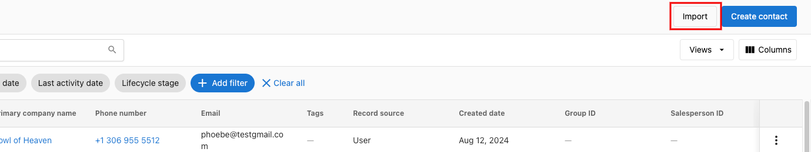
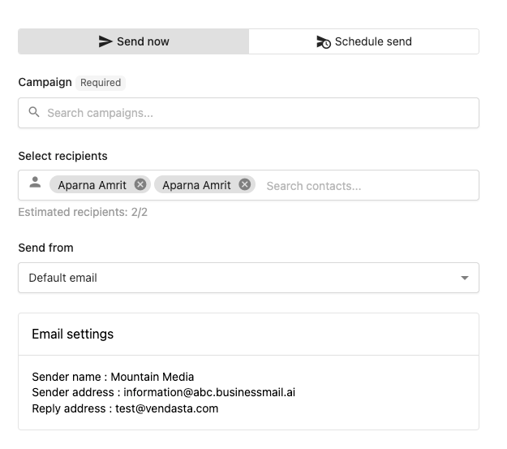
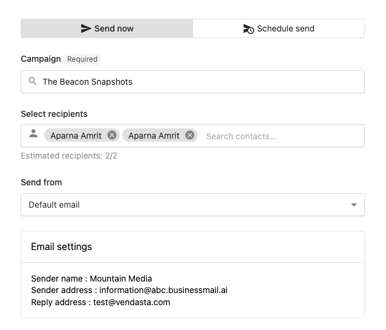
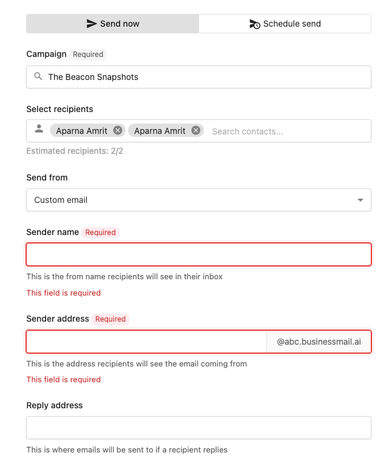
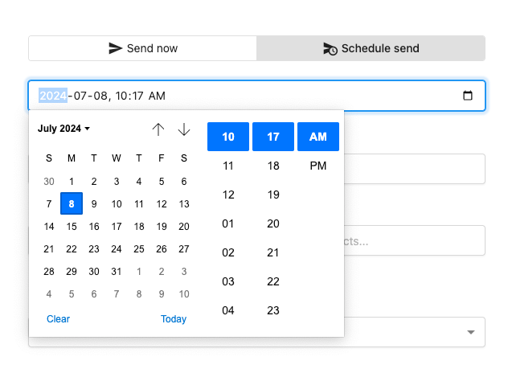
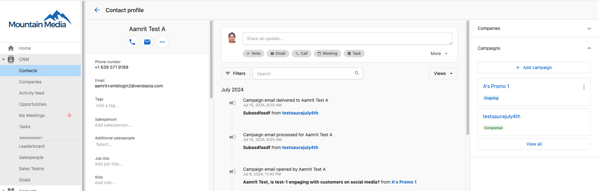
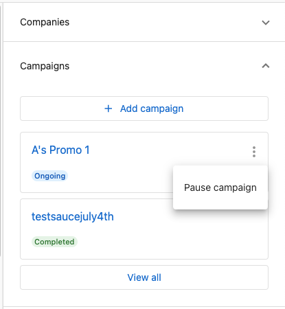
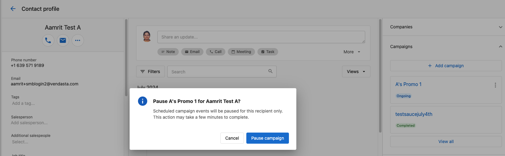
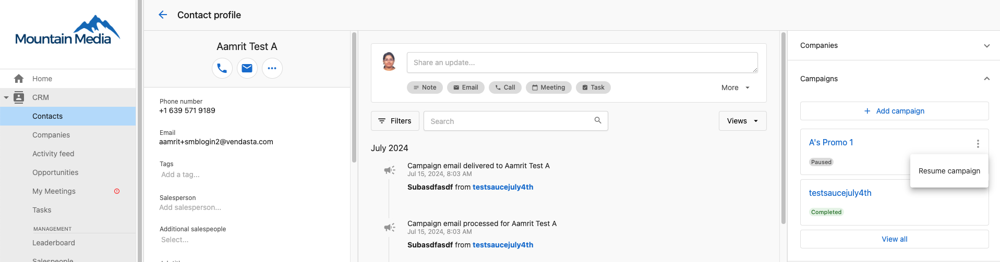

# Contactos

Gestiona tus contactos de manera efectiva con el sistema CRM de Vendasta. Esta completa solución de gestión de contactos te permite importar y exportar contactos de forma masiva, programar campañas de correo electrónico dirigidas, y personalizar los campos de contacto según las necesidades de tu negocio. La sección Contacts proporciona potentes herramientas para organizar, segmentar, e interactuar con tu audiencia a lo largo del recorrido del cliente. Con la programación avanzada de campañas y la gestión de campos de contacto, puedes garantizar una comunicación oportuna y mantener registros detallados de todas las interacciones con los prospectos.

## ¿Por qué usar contactos?

La sección Contacts elimina los procesos manuales a través de capacidades de importación/exportación masiva y programación automatizada de campañas, garantizando una comunicación consistente con tu audiencia mientras mantienes registros de contacto completos.

## Qué incluye

- **Importación y exportación**: agrega o actualiza de manera eficiente múltiples contactos y empresas de forma masiva a través de archivos CSV
- **Gestión de campañas**: controla la entrega y programación de campañas para contactos individuales o grupos
- **Personalización de campos de contacto**: campos estándar y personalizados para hacer seguimiento de información detallada de contacto
- **[Campos de contacto predeterminados del CRM](./crm-default-contact-fields.mdx)**: campos estándar disponibles para hacer seguimiento de la información de contacto

## Primeros pasos

1. **Navega a contactos**
   - Ve a `Partner Center` → `CRM` → `Contacts`
   - Accede a tu espacio de trabajo de gestión de contactos

2. **Importa contactos existentes**
   - Usa la importación masiva para agregar múltiples contactos a la vez
   - Asigna los campos durante el proceso de importación para una transferencia de datos precisa
   - El contacto se deduplicará según el ID de contacto, ID externo, correo electrónico, o número de teléfono durante la importación

3. **Configura los campos de contacto**
   - Revisa los campos de contacto predeterminados disponibles
   - Personaliza los campos según los requisitos de tu negocio

4. **Envía tu primer correo electrónico de marketing**
   - Selecciona contactos para la segmentación de campañas
   - Navega a `Partner Center` → `Contacts` > selecciona contactos
   - Haz clic en `Actions` → `Add to Campaign`
   - Aprende más sobre [enviar correos electrónicos de marketing](../../marketing/campaigns/send-marketing-emails.mdx)

## Importar y exportar contactos y empresas

En el CRM de Vendasta, puedes agregar o actualizar de manera eficiente múltiples contactos y empresas a la vez importándolos en un solo archivo. Esta potente función optimiza la gestión de contactos y garantiza la precisión de los datos a través de la asignación adecuada de campos durante el proceso de importación.

### Importaciones en Partner Center vs. Business App

Las reglas de importación difieren según dónde importes:

| | Importación en Partner Center | Importación en Business App |
|---|---|---|
| Flujo | B2B: los contactos están vinculados a empresas | B2C: los contactos pueden ser independientes |
| ¿Se requiere el nombre de la empresa? | Sí, en la primera fila de contacto | No |
| Caso de uso | CRM de ventas, gestión de cuentas | Listas orientadas al consumidor/cliente |

Si estás importando contactos para trabajo de ventas B2B, importa a través de **Partner Center > CRM > Contacts**. Si estás gestionando contactos de consumidores para un cliente de Business App, importa a través de Business App.

### Antes de comenzar

Antes de iniciar una importación:

- Asegúrate de tener permiso para gestionar contactos y empresas del CRM
- Confirma que cada entrada de contacto incluya al menos uno de los siguientes: nombre, apellido, correo electrónico, o número de teléfono
- **Nombre de empresa (regla de la primera fila)**: en las importaciones de Partner Center, el nombre de la empresa debe estar presente en la **primera** fila de contacto. No es necesario que aparezca en cada fila subsiguiente, pero la primera fila lo requiere o la importación fallará con "Company name is required".
- **Categorías de negocio**: si tu CSV incluye una categoría de negocio, selecciónala del menú desplegable durante la asignación de campos; no la escribas como texto libre. Las categorías de texto libre no se asignan a la lista de categorías del CRM y romperán silenciosamente la sincronización posterior.
- **Sin filas en blanco**: las filas en blanco en tu CSV causan errores de "No company or contact found". Elimina todas las filas vacías antes de importar.
- **Columnas de nombre**: los nombres de contacto se almacenan como campos separados de **First name** y **Last name**, no como un único campo de nombre combinado. Un CSV con una sola columna "Name" no se puede asignar; divídela en dos columnas antes de importar.
- **Límites de importación**: el tamaño máximo de archivo es de 5 MB, lo que generalmente permite hasta 35,000 contactos por importación
- Prepara tus datos con identificadores únicos para las actualizaciones masivas (Contact ID, External ID, o correo electrónico)

### Lógica de deduplicación y coincidencia

El CRM usa deduplicación inteligente para evitar registros duplicados durante la importación:

**Jerarquía de coincidencia de contactos** (verificada en este orden):
1. **Contact ID**: coincidencia exacta con un Contact ID existente en el CRM (máxima prioridad)
2. **External ID**: coincidencia en el campo External ID si se proporciona
3. **Dirección de correo electrónico**: coincidencia en la dirección de correo electrónico principal (el método más común)
4. **Número de teléfono**: coincidencia en el número de teléfono principal si no hay correo electrónico disponible

**Cómo funciona la deduplicación:**
- Si se encuentra una coincidencia usando cualquiera de estos criterios, el sistema **actualizará el contacto existente** en lugar de crear un duplicado
- Si no se encuentra una coincidencia, se crea un **nuevo registro de contacto**
- El sistema procesa las coincidencias en el orden mencionado anteriormente (Contact ID primero, número de teléfono al final)
- Puedes elegir si deseas actualizar los registros existentes u omitirlos durante el proceso de importación

**Buenas prácticas para la deduplicación:**
- Incluye el Contact ID en tu CSV para coincidencias exactas garantizadas durante las actualizaciones masivas
- Usa un formato de correo electrónico consistente para garantizar una coincidencia adecuada
- Limpia el formato del número de teléfono antes de importar (elimina espacios, guiones, paréntesis)
- Incluye el External ID si estás sincronizando con otro sistema

### Cómo exportar contactos y empresas

Para exportar todos los contactos o empresas del CRM:

1. Navega a `CRM` → `Contacts` (o `Companies`)
2. Haz clic en la casilla de verificación en la esquina superior izquierda para seleccionar los registros de la página actual, luego haz clic en el enlace azul `select all [N] contacts` para seleccionar todos los registros

3. Haz clic en `Actions` → `Export`

### Cómo importar registros del CRM

Para importar registros, sigue estos pasos:

**Paso 1: cargar el CSV**

Para importar registros del CRM, ve a CRM > Contacts en Partner Center. En la esquina superior derecha de la tabla Contacts, haz clic en Import. Esto abre la página de historial de importación, donde se muestran todas las cargas anteriores.

:::caution
Los archivos de importación cargados se eliminan automáticamente después de 30 días. Después de este período, los archivos ya no se pueden descargar del historial de importación. Guarda una copia local de cualquier archivo de importación que puedas necesitar consultar más adelante.
:::

En la parte superior de la página, verás la opción Import from a CSV con un botón que dice Start an import. Haz clic en esto para comenzar.

Carga tu archivo CSV que contenga los contactos o empresas que quieres importar. Puedes usar la plantilla CSV opcional para asegurarte de que tu archivo tenga el formato correcto. Después de cargar el archivo, haz clic en Next y sigue los pasos para asignar tus campos y completar la importación.

:::caution Nota
Los usuarios solo verán las importaciones que su usuario haya realizado.
:::

**Paso 2: asignar campos**

- Asigna los campos de tu archivo CSV a los campos correspondientes en el CRM para contactos y empresas. El sistema intentará asignar automáticamente las columnas a los campos existentes del CRM, pero puedes ajustar manualmente estas asignaciones según sea necesario
- Para cada columna, elige si se relaciona con un contacto o una empresa, luego selecciona el campo específico del CRM al que asignarla. Una vez que hayas completado la asignación, haz clic en `Next`

:::info
Los valores asignados a un campo con opciones predefinidas (como Lifecycle stage) o a Tags se emparejan automáticamente con la opción definida más cercana, independientemente de las mayúsculas y minúsculas, así que un valor CSV como "lead" coincide con una opción "Lead".
:::

**Paso 3: revisar la importación**

- Revisa los registros que se importarán y la configuración de deduplicación
- **Elige el comportamiento de actualización**:
  - "Update existing records": sobrescribe los datos de contacto existentes cuando se encuentran coincidencias
  - "Skip existing records": deja los contactos existentes sin cambios, solo importa los nuevos
- Después de confirmar tus ajustes, haz clic en `Finish`

Después de completar la importación, puedes volver a la tabla de contactos o empresas para ver los registros recién creados. Los registros agregados a través de este proceso se crearán con la fuente de registro "Bulk import" y el desglose de fuente de registro 1 con el ID de importación masiva para fácil referencia.

### Asignación masiva de vendedores durante la importación

Puedes asignar vendedores a empresas durante una importación de CSV incluyendo una columna `SalespersonID`. Esto evita la reasignación manual después de la importación.

**Cómo encontrar el ID de un vendedor:**

1. Ve a `Partner Center` → `Administration` → `My team`.
2. Haz clic en los tres puntos junto al vendedor y selecciona **Edit Salesperson**.
3. El UID del vendedor aparece en la barra de URL del navegador; copia el valor después de `/salespeople/`.

**Cómo usarlo en tu CSV:**

1. Agrega una columna llamada `SalespersonID` a tu CSV de importación.
2. Pega el UID de cada vendedor en la columna para las filas (empresas) que debería poseer.
3. Durante la importación, asigna la columna `SalespersonID` al campo del CRM **Salesperson**.

Para asignar varios vendedores a una sola empresa, agrega columnas adicionales llamadas `AdditionalSalespersonID1`, `AdditionalSalespersonID2`, etc., y asígnalas durante la importación.

### Proceso de actualización masiva

Para realizar actualizaciones masivas de contactos existentes:

1. **Exporta los contactos existentes**
   - Sigue los pasos en [Cómo exportar contactos y empresas](#cómo-exportar-contactos-y-empresas) anteriores para descargar tus datos de contacto actuales

2. **Prepara el archivo de actualización**
   - **Importante**: conserva la columna `Contact ID` de tu exportación; esto garantiza una coincidencia exacta
   - Modifica solo los campos que quieres actualizar
   - No cambies el Contact ID, la fecha de creación, u otros campos del sistema
   - Guarda en formato CSV

3. **Importa con actualizaciones**
   - Usa el proceso de importación descrito anteriormente
   - El sistema hará coincidir según el Contact ID para actualizaciones precisas
   - Elige "Update existing records" en el paso 3
   - Selecciona qué campos actualizar para evitar sobrescribir datos importantes

**Consejo profesional**: para actualizaciones masivas grandes, puedes exportar segmentos de contactos específicos usando filtros, actualizar solo esos registros, e importarlos de nuevo para actualizaciones dirigidas.

### Errores comunes de importación

| Error | Causa más probable | Solución |
|-------|-------------------|-----|
| "Company name is required" | La primera fila de contacto en el CSV no tiene nombre de empresa | Agrega un nombre de empresa a la primera fila. Las filas subsiguientes no lo requieren. |
| "No company or contact found" | Filas en blanco en el CSV, o el archivo está mal formado | Elimina todas las filas vacías. Ábrelo en un editor de texto para verificar caracteres ocultos. |
| Fallas al analizar el CSV | El archivo se guardó en el formato o la codificación incorrecta | Guarda como **CSV UTF-8** y asegúrate de que no haya celdas combinadas ni formato especial. |
| La categoría no se sincroniza | La categoría se ingresó como texto libre en lugar de seleccionarse del menú desplegable | Vuelve a importar y selecciona la categoría del menú desplegable durante la asignación de campos. |

## Gestión de campañas

### Programa campañas para una interacción óptima

Al crear una campaña de marketing por correo electrónico, tienes la capacidad de programarla para una fecha y hora posterior. Esta función garantiza una comunicación oportuna y consistente con tu audiencia sin necesidad de intervención manual. Al programar tus correos electrónicos, puedes optimizar la interacción y gestionar tu tiempo de manera más efectiva, asegurando que tus mensajes lleguen a tu audiencia en el momento perfecto.

#### Cómo programar campañas para contactos del CRM

**Paso 1:** navega a `Partner Center` → `Contacts` > selecciona los contactos a los que deseas enviar las campañas. Haz clic en `Actions` → `Add to Campaign`.

**Paso 2:** programa la campaña para ahora, o para una fecha/hora posterior.

**Paso 3:** selecciona las campañas.

**Paso 4:** selecciona el tipo de correo electrónico (predeterminado, personalizado, o del vendedor asignado). Si se selecciona el correo predeterminado, los detalles se extraerán de tu configuración de correo electrónico.

- Si se selecciona un correo electrónico personalizado:

- Si se selecciona un vendedor:

**Paso 5:** la opción `schedule send` te permitirá elegir una fecha y hora para el envío de las campañas.

### Pausar o reanudar campañas para contactos individuales

Puedes pausar o reanudar campañas para un contacto individual en el CRM. Esto es útil cuando un contacto no está disponible temporalmente o solicita una pausa en las comunicaciones.

#### Cómo pausar campañas para un contacto

1. Navega a la sección `Contacts` de tu CRM
2. Encuentra y selecciona el contacto para el cual deseas pausar las campañas
3. Haz clic en la pestaña `Campaigns` en los detalles del contacto

4. Haz clic en el menú de tres puntos para acceder a más opciones

5. Selecciona `Pause Campaigns` en el menú desplegable

6. Confirma tu acción cuando se te solicite

Una vez que pausas las campañas para un contacto, todas las campañas activas para ese contacto se suspenderán hasta que decidas reanudarlas. El contacto no recibirá ningún correo electrónico, tarea, o notificación de campaña durante este período.

#### Cómo reanudar campañas para un contacto

Para reanudar campañas para un contacto:

1. Navega a la sección `Contacts` de tu CRM
2. Encuentra y selecciona el contacto cuyas campañas deseas reanudar
3. Haz clic en la pestaña `Campaigns` en los detalles del contacto
4. Haz clic en el menú de tres puntos para acceder a más opciones
5. Selecciona `Resume Campaigns` en el menú desplegable

6. Confirma tu acción cuando se te solicite

Después de reanudar las campañas, el contacto comenzará a recibir de nuevo correos electrónicos, tareas, y notificaciones de campaña según los horarios de las campañas.

## Cargar archivos a contactos

Puedes cargar archivos directamente a los registros de contacto para mantener una documentación organizada:

1. Abre la página de perfil de un contacto
2. Navega a la sección `Files`
3. Haz clic en `Add a file` para cargar documentos, imágenes, u otros archivos
4. Consulta los resúmenes generados por IA para una mejor organización de archivos

Aprende más sobre [carga de archivos](../file/crm-file-upload.mdx) y los tipos de archivo admitidos.

## Eliminación masiva de contactos

Puedes eliminar varios registros de contacto a la vez para limpiar los datos del CRM.

:::warning
La eliminación masiva es **permanente y no se puede deshacer**. Exporta cualquier registro que puedas necesitar antes de eliminar.
:::

**Límites:** los contactos se eliminan en lotes de **100 registros** a la vez.

**Pasos:**

1. Ve a `Partner Center` → `CRM` → `Contacts`.
2. Aumenta el ajuste de elementos por página para mostrar más registros (hasta 100).
3. Usa filtros o búsqueda para reducir a los registros que quieres eliminar.
4. Haz clic en la casilla de verificación de la esquina superior izquierda para seleccionar todos los registros visibles.
5. Haz clic en `Actions` → `Delete`.
6. En la ventana modal de confirmación, escribe `Delete` y confirma.

Repite para lotes adicionales si necesitas eliminar más de 100 contactos.

## Reglas de formato de etiquetas

Las etiquetas te ayudan a organizar y filtrar los registros de contacto. Para funcionar correctamente en filtros y búsquedas, las etiquetas deben seguir estas reglas de formato:

- **Límite de caracteres**: 50 caracteres máximo
- **Caracteres permitidos**: letras (A-Z, a-z), números (0-9), guiones (`-`), espacios, y guiones bajos (`_`)
- **Caracteres especiales**: no compatibles; las etiquetas que contengan caracteres como `@`, `#`, `&`, `!`, o `%` pueden parecer que se guardan pero no funcionarán correctamente en filtros o búsquedas

:::warning
Las etiquetas con caracteres no compatibles pueden parecer que se guardan correctamente pero fallarán silenciosamente en el filtrado y la búsqueda. Si un filtro de etiquetas no devuelve los resultados esperados, verifica las etiquetas de esos registros en busca de caracteres especiales.
:::

## Gestión de campos de contacto

El CRM proporciona campos de contacto predeterminados completos que te ayudan a almacenar y hacer seguimiento de información importante sobre tus contactos. Estos campos se pueden personalizar según las necesidades específicas de tu negocio y garantizar que captures toda la información relevante de los prospectos a lo largo de tu proceso de ventas.

### Crear campos de contacto personalizados

Más allá de los campos de contacto predeterminados, puedes crear campos personalizados para captar información específica de tu negocio:

**Tipos de campos personalizados disponibles:**
- **Text**: texto de una o varias líneas para nombres, descripciones, o notas. También puedes definir una lista de opciones predefinidas para mantener la integridad de los datos (por ejemplo, "Hot", "Warm", "Cold" para la temperatura del cliente potencial)
- **Number**: números enteros como la cantidad de empleados, puntuaciones, o cantidades
- **Decimal number**: números con decimales para ingresos, porcentajes, o mediciones precisas
- **Email**: direcciones de correo electrónico adicionales para diferentes propósitos
- **Phone number**: números de teléfono adicionales para varios métodos de contacto
- **Date**: fechas importantes como la renovación del contrato, fechas de seguimiento, o aniversarios
- **Date and time**: marcas de tiempo específicas para citas, plazos, o eventos programados
- **True or false**: puntos de datos de sí/no o booleanos para criterios de calificación o indicadores de estado

**Cómo crear campos personalizados:**
1. Navega a `Administration` → `CRM objects`
2. Selecciona "Contact" en la barra lateral
3. Haz clic en "Create field"
4. Elige el tipo de campo que coincida con tus necesidades de datos
5. Configura las propiedades del campo:
     - **Field label**: nombre visible que se muestra en la interfaz
     - **External Identifier**: identificador del sistema (no se puede cambiar después de guardar)
     - **Description**: información adicional sobre el propósito del campo
     - **Read only**: si el campo se puede actualizar a través de la interfaz
     - **Field options** (solo campos de texto): define una lista de valores predefinidos para garantizar la consistencia de los datos

**Buenas prácticas para campos personalizados:**
- Planifica tus campos personalizados antes de crearlos; los identificadores externos no se pueden cambiar después de guardar
- Usa etiquetas claras y descriptivas que tu equipo entienda
- Agrupa los campos relacionados de manera lógica (por ejemplo, todos los campos de calificación juntos)
- Para los campos de texto, usa opciones predefinidas cuando quieras una entrada de datos consistente (por ejemplo, el campo "Industry" con opciones como "Healthcare", "Technology", "Retail")
- Considera hacer obligatorios los campos de calificación importantes
- Prueba los campos personalizados con algunos contactos de muestra antes de implementarlos para tu equipo
- Documenta los propósitos y usos de los campos personalizados para la capacitación del equipo

**Ejemplos de opciones de campos de texto:**
- **Lead Source**: "Website", "Referral", "Cold Call", "Trade Show", "Social Media"
- **Industry**: "Healthcare", "Technology", "Retail", "Manufacturing", "Financial Services"
- **Company Size**: "1-10 employees", "11-50 employees", "51-200 employees", "200+ employees"
- **Lead Temperature**: "Hot", "Warm", "Cold"
- **Decision Timeline**: "Immediate", "1-3 months", "3-6 months", "6+ months"

**Visibilidad de los campos:**
- Los campos personalizados aparecen en los registros de contacto junto a los campos predeterminados
- Los campos personalizados están disponibles en importaciones/exportaciones, informes, y flujos de trabajo de automatización
- Todos los campos personalizados son buscables y se pueden usar en el filtrado de listas

## Preguntas frecuentes

¿Cuál es el número máximo de contactos que puedo importar en Partner Center?

El número máximo de contactos que puedes importar a la vez depende del tamaño del archivo y los campos incluidos. El límite de tamaño de archivo es de 5 MB, lo que generalmente permite hasta 35,000 contactos por importación.

Para importar contactos:
1. Navega a `Partner Center`
2. Ve a `CRM` → `Contacts`
3. Selecciona `Import` para cargar tu archivo

Asegúrate de que tu archivo cumpla con los requisitos de tamaño y formato antes de importar.

¿Qué pasa cuando pauso las campañas para un contacto?

Cuando pausas las campañas para un contacto, todas las campañas activas para ese contacto se suspenderán. El contacto no recibirá ningún correo electrónico, tarea, o notificación de campaña durante este período hasta que reanudes las campañas.

¿Puedo programar campañas para varios contactos a la vez?

Sí, puedes seleccionar varios contactos de la tabla de contactos y usar la opción `Actions` → `Add to Campaign` para programar campañas para todos los contactos seleccionados simultáneamente.

¿Qué información se requiere al importar contactos?

Cada entrada de contacto debe incluir al menos uno de los siguientes: nombre, apellido, correo electrónico, o número de teléfono. Para las empresas, se requiere el nombre de la empresa.

