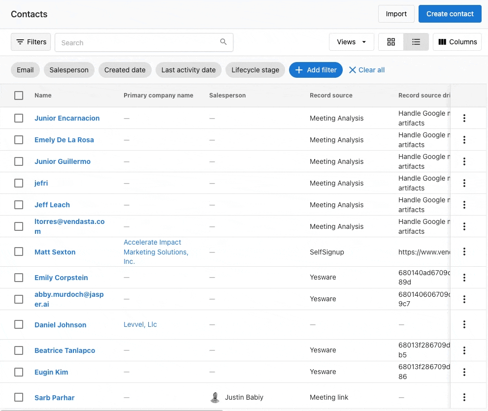

Usa esta guía para iniciar una campaña de correo electrónico de Yesware (también conocida como secuencia de correo electrónico o campaña de goteo) directamente desde la tabla `CRM` → `Contacts` en Partner Center. Puedes seleccionar contactos, agregarlos a una campaña de Yesware existente, y opcionalmente activar acciones adicionales usando Vendasta Automations.

:::note
Aunque puedes agregar contactos a campañas de Yesware y ver actividades clave en la línea de tiempo del contacto desde el CRM de Vendasta, debes crear y gestionar esas campañas en la plataforma de Yesware.
:::

## Requisitos previos y configuración para la integración de Yesware y el CRM de Vendasta

Antes de poder enviar una campaña de Yesware a los contactos, asegúrate de que:

- tu plan de suscripción tenga acceso a Yesware (por ejemplo, Professional, Premium, o Custom)
- el complemento de Yesware para Chrome (Gmail) u Outlook esté instalado y conectado a tu bandeja de entrada
- ya exista una campaña de Yesware en Yesware

## Cómo lanzar campañas de Yesware desde la tabla de contactos del CRM de Vendasta

1. Ve a `Partner Center` → `CRM` → `Contacts`.
2. Selecciona uno o más contactos en la tabla.
3. Haz clic en `Actions` → `Add to Yesware Campaign`.
4. Elige la campaña de Yesware deseada del menú desplegable (campañas creadas previamente en Yesware).
5. Confirma para agregar los contactos seleccionados a la campaña.

:::note
Puedes agregar hasta 100 contactos a la vez desde la tabla de contactos. La acción no se aplica a `Select all` más allá de los primeros 100.
:::

También puedes usar el menú de acciones de fila (tres puntos) de un contacto individual y elegir `Add to Yesware Campaign`.

:::info
Si un contacto seleccionado ya está activo en una campaña diferente de Yesware, verás un error y deberás eliminarlo de la otra campaña primero.
:::

### Buenas prácticas de entregabilidad de correo electrónico para campañas de Yesware

- Verifica tu dominio de correo electrónico y revisa la reputación de envío en tu proveedor de correo.
- Mantén los volúmenes diarios dentro de los límites de Gmail/Outlook para evitar retrasos.
- Usa líneas de asunto claras y contenido relevante; evita frases que activen filtros de spam como "free", "limited time", "exclusive", etc.

:::warning
Las campañas de Yesware se envían directamente a través de las bandejas de entrada de Gmail u Outlook del usuario. Aunque esto puede ayudar con las aperturas y los clics, también significa que están sujetas a los límites diarios de envío de los proveedores de correo electrónico y a cualquier otra restricción que pueda aplicar.
:::

## Cómo lanzar campañas de Yesware usando las automatizaciones de Vendasta

Las automatizaciones te dan otra forma de lanzar campañas de Yesware más allá de la tabla de contactos. Cualquier campaña de Yesware existente se puede activar mediante una automatización usando el paso `Send a Yesware campaign for the contact`.

Ejemplos de activadores incluyen:
- Cuando un contacto se agrega a una lista específica
- Cuando un contacto completa un formulario específico
- Cuando un contacto abre un correo electrónico específico
- Cuando un contacto responde a un correo electrónico específico

:::info
Solo se pueden seleccionar campañas de Yesware existentes en Automations. La creación y el uso compartido de campañas todavía deben gestionarse directamente dentro de Yesware.
:::

**Guías relacionadas de automatización:**
- [Descripción general de automatizaciones](../../automations/index.mdx): aprende a crear tu primer flujo de trabajo de automatización
- [Referencia de pasos de automatización](../../automations/my-automations/automation-steps-reference.mdx): encuentra el paso "Send a Yesware campaign" y otras acciones de contacto
- [Plantillas de automatización para la nutrición de clientes potenciales](../../automations/templates/index.mdx): flujos de trabajo prediseñados que pueden activar campañas de Yesware

## Preguntas frecuentes

¿Puedo enviar campañas de Yesware tanto desde Vendasta Partner Center como desde Business App?

Sí. Agregar contactos a una campaña de Yesware está disponible tanto en Partner Center como en Business App.

¿Dónde creo y gestiono las campañas de correo electrónico de Yesware?

Las campañas se crean en Yesware (Gmail/Outlook). Una vez creadas, aparecen en el menú desplegable `Add to Yesware Campaign` y en Automations dentro de Vendasta.

¿Cómo elimino a un contacto de una campaña activa de Yesware?

Elimina al destinatario en la pestaña Recipients de la campaña de Yesware, luego agrégalo a una nueva campaña desde Vendasta.

¿Puedo hacer seguimiento de los resultados y las analíticas de las campañas de Yesware en el CRM de Vendasta?

Las actividades de respuesta de Yesware se registran en la línea de tiempo del contacto en el CRM de Vendasta. Es posible que la finalización de la campaña sin una respuesta no cree una actividad.

¿Cuál es la diferencia entre las campañas de Yesware y las campañas de correo electrónico de Vendasta?

Las campañas de Yesware se envían desde tu bandeja de entrada personal de Gmail/Outlook con tasas de apertura más altas pero límites de volumen más bajos. Las campañas de correo electrónico de Vendasta se envían desde servidores de marketing con mayor capacidad de volumen pero pueden tener una conexión personal más baja. Yesware es mejor para el alcance de ventas, mientras que las campañas de Vendasta funcionan mejor para boletines de marketing y comunicaciones masivas.

¿Cuántos contactos puedo agregar a una campaña de Yesware desde Vendasta?

Puedes agregar hasta 100 contactos a la vez desde la tabla de contactos. Para listas más grandes, deberás seleccionar contactos en lotes de 100 o usar Vendasta Automations para agregar contactos a lo largo del tiempo según activadores.

¿La integración de Yesware funciona igual con Outlook y Gmail?

Sí, las campañas de Yesware lanzadas desde Vendasta funcionan tanto con Gmail como con Outlook. Sin embargo, cada proveedor de correo electrónico tiene diferentes límites diarios de envío (Gmail: 500/día para Google Workspace, Outlook: varía según el plan). El complemento de Yesware debe estar instalado y conectado a tu bandeja de entrada primero.

¿Puedo programar campañas de Yesware para enviarlas más tarde desde Vendasta?

La programación se gestiona dentro de las propias campañas de Yesware, no desde Vendasta. Puedes agregar contactos a una campaña desde Vendasta, pero los controles de tiempo y programación se gestionan en la plataforma de Yesware donde creas la secuencia de la campaña.

¿Por qué no veo mi campaña de Yesware en el menú desplegable de Vendasta?

Asegúrate de que: 1) la campaña exista en Yesware, 2) hayas iniciado sesión en la misma cuenta de correo electrónico en ambas plataformas, 3) la integración de Yesware esté conectada correctamente. Las campañas recién creadas pueden tardar unos minutos en aparecer en los menús desplegables de Vendasta.

¿Qué pasa si agrego el mismo contacto a varias campañas de Yesware?

Un contacto solo puede estar "Active" en una campaña de Yesware a la vez. Si intentas agregar a alguien que ya está activo en otra campaña, obtendrás un error. Debes eliminarlo de la campaña actual o esperar hasta que la complete antes de agregarlo a una nueva.

¿Puedo usar campos personalizados del CRM de Vendasta en campañas de Yesware?

Las campañas de Yesware extraen la información de contacto de los contactos de tu proveedor de correo electrónico, no directamente de los campos del CRM de Vendasta. Para usar datos de Vendasta en Yesware, necesitarás sincronizar o exportar la información de contacto a tus contactos de Gmail/Outlook primero.

