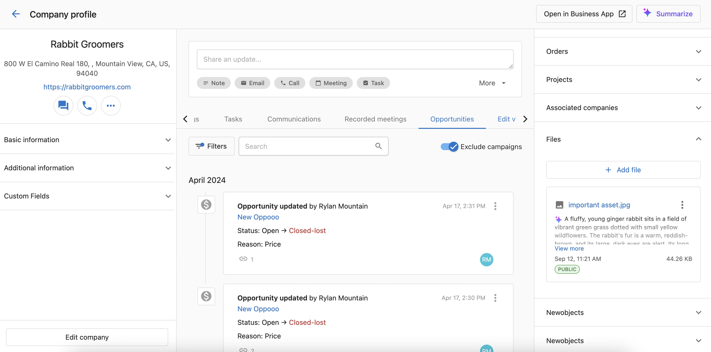
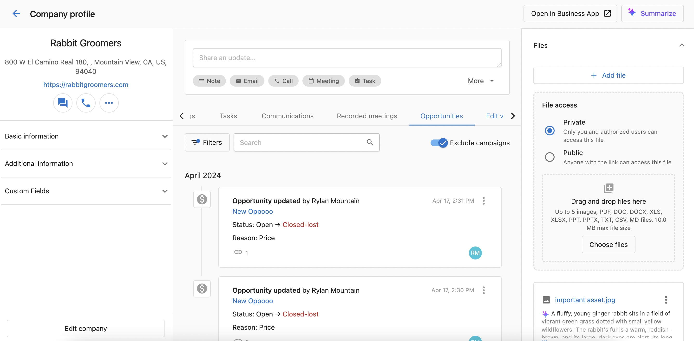

## Descripción general

Carga archivos, incluidos PDFs, imágenes, documentos, hojas de cálculo, y más, y asócialos con cualquier `Contact`, `Company`, u `Opportunity` en el CRM. Después de cargar, aparece automáticamente un resumen generado por IA del contenido del archivo.

---

## Por qué es importante

- **Mejora el contexto y la organización**  
  Los archivos se vinculan correctamente a los objetos del CRM para un acceso y revisión más fáciles.

- **Mejora la capacidad de descubrimiento de archivos**  
  Los resúmenes generados por IA te ayudan a entender el contenido de un vistazo, sin necesidad de abrir el archivo.

- **Habilita la recopilación automática de archivos**  
  La compatibilidad con cargas de archivos basadas en formularios permite a los prospectos enviar documentos directamente a través de formularios de captación de clientes potenciales, organizando automáticamente los archivos en el CRM con resúmenes de IA.

---

## Dónde encontrarlo

Esta función está disponible tanto en **Partner Center** como en **Business App**.

- Navega a cualquier registro de `Contact`, `Company`, u `Opportunity`
- Abre la sección `Files` para ver o cargar

---

## Cómo cargar un archivo en el CRM

**Pasos (Partner Center y Business App):**

1. Abre un registro del CRM (Contact o Company en Partner Center; Contact, Company, u Opportunity en Business App)
2. Ve a la sección `Files`
3. Haz clic en `Add a file`
4. Carga un archivo compatible (por ejemplo, PDF, PNG, JPEG)
5. Después de cargar, aparece automáticamente un resumen generado por IA

:::info
Business App admite la carga de archivos a los registros de `Opportunity` además de Contacts y Companies.
:::
---

## Cómo cargar un archivo al registrar una actividad

**Pasos:**

1. Navega a un registro de `Contact` o `Company`
2. Haz clic en el registrador de actividad (`Log Activity`)
3. Haz clic en `Add a file`
4. Carga un archivo compatible
5. Registra la actividad

Los archivos cargados aparecerán en:
- La sección `Files`
- La línea de tiempo de actividad bajo el registro asociado

---

## Cómo cargar archivos a través de formularios

Puedes habilitar la carga de archivos directamente a través de CRM Forms, permitiendo que los prospectos y clientes envíen documentos durante los envíos de formularios.

**Pasos para configurar la carga de archivos en formularios:**

1. Navega a `Marketing` → `Forms`
2. Crea un nuevo formulario o edita uno existente
3. En el generador de formularios, haz clic en `Add fields`
4. Busca `File` y selecciona el tipo de campo de carga de archivos
5. Arrastra el campo de archivo a la ubicación deseada en el formulario
6. Configura los ajustes del campo:
   - Establece la etiqueta del campo (por ejemplo, "Upload Document", "Attach Resume")
   - Agrega texto de ayuda para tus clientes
   - Configura los ajustes de visibilidad (opcional)
7. Haz clic en `Save` para agregar el campo a tu formulario

**Cuando se envían formularios con archivos:**
- Los archivos se adjuntan automáticamente a los registros de Contact y Company creados
- Se crean resúmenes generados por IA para cada archivo cargado
- Los archivos aparecen en la sección `Files` de los registros del CRM correspondientes
- Los envíos de formularios activan los flujos de trabajo de automatización normales con los datos del archivo incluidos

**Casos de uso para la carga de archivos en formularios:**
- **Formularios de calificación de clientes potenciales**: permite a los prospectos cargar RFPs, documentos de requisitos, o planes de negocio
- **Formularios de solicitud**: habilita el envío de archivos para solicitudes de empleo, solicitudes de proveedores, o solicitudes de asociación
- **Solicitudes de soporte**: permite a los clientes adjuntar capturas de pantalla, registros, o documentación con las solicitudes de soporte
- **Formularios de incorporación**: recopila los documentos necesarios durante los procesos de incorporación de clientes
- **Solicitudes de cotización**: permite a los prospectos cargar especificaciones, planos, o documentos de requisitos

---

## Preguntas frecuentes (FAQ)

¿Qué tipos de archivo admiten resúmenes generados por IA?

Los resúmenes de IA son compatibles con los siguientes tipos de archivo:  
- **Imágenes**: PNG, JPEG  
- **Documentos**: PDF, DOC, DOCX, TXT, MD  
- **Hojas de cálculo**: XLS, XLSX, CSV  
- **Presentaciones**: PPT, PPTX  

¿Esta función está disponible tanto en Partner Center como en Business App?

Sí.  
- Partner Center: Contacts y Companies  
- Business App: Contacts, Companies, y Opportunities  

¿Puedo cargar varios archivos a la vez?

No. Solo se puede cargar un archivo a la vez.

¿Puedo eliminar o reemplazar un archivo cargado?

Sí. Puedes eliminar archivos directamente desde la sección `Files`. Cargar una nueva versión generará un nuevo resumen de IA.

¿Cuánto tiempo tarda en generarse el resumen de IA?

Los resúmenes generalmente aparecen unos segundos después de cargar, dependiendo del tamaño y formato del archivo.

¿Dónde aparecen los archivos cargados en el CRM?

Los archivos aparecen en la sección `Files` del registro (Contact, Company, u Opportunity), y bajo cualquier actividad asociada si se cargaron durante el registro.

¿Cargar un archivo durante el registro de actividad lo asocia con el registro del CRM?

Sí. El archivo se vinculará al Contact o Company correspondiente y será visible tanto en la sección de actividad como en la de archivos.

¿Puedo buscar archivos por el contenido del resumen de IA?

Los resúmenes no son buscables.

¿Puedo editar o personalizar el resumen generado por IA?

No. Los resúmenes se generan automáticamente y no se pueden editar manualmente.

¿Los archivos cargados son públicos o privados?

Puedes elegir la visibilidad del archivo antes de cargarlo:

- **Private**: solo tú y los usuarios autorizados pueden acceder al archivo.
- **Public**: cualquier persona con el enlace del archivo puede acceder a él, incluso sin acceso al CRM.

¿Cómo funciona la carga de archivos en formularios?

¡Sí! Ahora puedes incluir campos de carga de archivos en CRM Forms. Cuando los visitantes envían formularios con archivos, estos se adjuntan automáticamente a los registros de Contact y Company creados con resúmenes generados por IA.

**Cómo funciona:**
1. Agrega un tipo de campo "File" a cualquier formulario usando el generador de formularios
2. Configura la etiqueta del campo y el texto de ayuda para los usuarios
3. Cuando se envían los formularios, los archivos cargados se adjuntan a los registros del CRM
4. Los resúmenes de IA se generan automáticamente para todos los tipos de archivo compatibles

**Características clave:**
- **Tipos de archivo compatibles**: imágenes (PNG, JPEG), documentos (PDF, DOC, DOCX, TXT, MD), hojas de cálculo (XLS, XLSX, CSV), presentaciones (PPT, PPTX)
- **Un archivo por campo**: cada campo de carga de archivos acepta un archivo por envío
- **Organización automática**: los archivos aparecen en la sección `Files` de los registros de Contact y Company
- **Resúmenes de IA**: se generan automáticamente para facilitar la identificación y búsqueda de archivos
- **Integración con automatización**: las cargas de archivos pueden activar flujos de trabajo de automatización y usarse en procesos de seguimiento
- **Control de visibilidad**: los archivos siguen las reglas estándar de visibilidad del CRM (acceso privado/público)

**Casos de uso comunes:**
- Documentos de calificación de clientes potenciales (RFPs, requisitos)
- Solicitudes de empleo y currículums  
- Tickets de soporte con archivos adjuntos
- Documentación de incorporación
- Especificaciones de solicitudes de cotización

¿Qué pasa si cargo un tipo de archivo no compatible?

Los archivos no compatibles no se cargan, o se cargan sin generar un resumen.

¿Puedo automatizar acciones según los archivos cargados?

No por el momento.

¿Hay un límite de tamaño de archivo para las cargas?

Sí, el tamaño máximo de archivo es de 10.0 MB, hasta 5 imágenes, y los tipos de archivo compatibles incluyen PDF, DOC, DOCX, XLS, XLSX, PPT, PPTX, TXT, CSV, y archivos MD.

