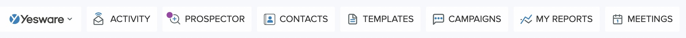
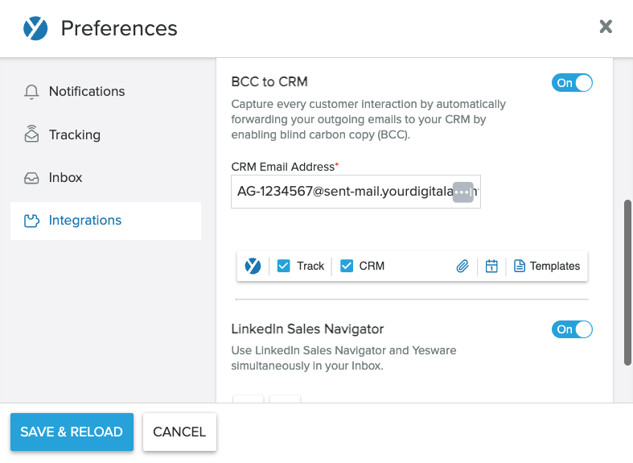

# Descripción general del CRM

El CRM de Vendasta ofrece herramientas completas para gestionar las relaciones con los clientes, hacer seguimiento de las interacciones, y nutrir a los prospectos de negocio. Diseñado para optimizar los procesos de venta y mejorar la interacción con los clientes, el CRM se integra sin problemas con tus flujos de trabajo existentes. Esta plataforma centralizada te ayuda a organizar contactos, hacer seguimiento de oportunidades, y automatizar comunicaciones para impulsar el crecimiento de ingresos.

## ¿Por qué usar el CRM?

Transforma tu proceso de ventas con herramientas de gestión de relaciones que mantienen a tu equipo organizado y a tus prospectos comprometidos. El CRM de Vendasta elimina los silos de datos, automatiza tareas rutinarias, y proporciona información que te ayuda a cerrar más negocios más rápido.

## Qué incluye

- **[Contactos](./contacts/index.mdx)**: gestiona personas, importa/exporta, y ejecuta campañas
- **[Empresas](./companies/index.mdx)**: gestiona organizaciones, asocia contactos y oportunidades
- **[Listas](./lists/index.mdx)**: segmenta contactos y empresas con listas estáticas o inteligentes
- **[Formularios](../business-app/crm/forms-to-capture-leads.mdx)**: captura clientes potenciales de tu sitio web directamente al CRM
- **[Carga de archivos](./file/crm-file-upload.mdx)**: carga archivos a contactos y empresas con resúmenes generados por IA
- **[Tareas](./tasks/index.mdx)**: planifica y completa actividades de venta
- **[Oportunidades](./opportunities/index.mdx)**: haz seguimiento y gestiona negocios en vistas de tabla o tablero
- **[Objetos personalizados](./custom-objects.mdx)**: crea módulos personalizados para hacer seguimiento de datos específicos de la industria como equipos, propiedades, o vehículos
- **[Diseños de campo](/administration/data-management/crm-objects/field-layouts)**: agrupa, reordena, y oculta campos para controlar cómo se presentan los registros
- **[Mis reuniones](./my-meetings/index.mdx)**: programa y gestiona citas con prospectos, con inteligencia de conversación y resúmenes generados por IA
- **[Feed de actividad](./activity-feed/index.mdx)**: haz seguimiento de todas las interacciones y el historial de interacción
- **Historial de cambios de campo**: consulta un registro de auditoría completo de cada actualización de campo (qué cambió, los valores anterior y nuevo, y quién o qué hizo la actualización), disponible desde la suscripción Starter en adelante
- **[Equipos de venta](./sales-teams/index.mdx)**: organiza y gestiona el rendimiento de tu equipo de ventas
- **[Tabla de clasificación](./leaderboard/index.mdx)**: supervisa el rendimiento de ventas y las clasificaciones del equipo

### CRM AI

CRM AI agrega automatización inteligente a tu CRM con el [AI Sales Assistant](/ai/ai-workforce/ai-sales-assistant). Con una suscripción de CRM AI, puedes actualizar automáticamente los registros del CRM a partir de conversaciones de venta, chatear con los datos de tu CRM usando lenguaje natural, y acceder a inteligencia de conversación con asesoramiento de ventas en cada llamada. Consulta [Ediciones de CRM AI](/ai/ai-workforce/ai-sales-assistant#crm-ai-editions) para conocer los planes disponibles.

## Primeros pasos

1. **Ve al CRM en Partner Center**
   - Navega a `Partner Center` y haz clic en `CRM`
   - Elige entre las vistas `Contacts` y `Companies`

2. **Configura tu vista de Companies**
   - Personaliza las columnas para mostrar la información que te importa
   - Habilita, muestra, y reordena las columnas según tus preferencias
   - Configura filtros para enfocarte en tus cuentas asignadas

3. **Crea tu primer contacto**
   - Haz clic en `Create contact` en la esquina superior derecha
   - Completa el nombre, el correo electrónico, y el número de teléfono (se recomienda el correo electrónico)
   - El sistema verificará automáticamente si hay duplicados

4. **Importa datos existentes**
   - Usa la importación masiva para agregar tus contactos y empresas existentes
   - Asigna los campos durante la importación para garantizar la precisión de los datos

## Configura tu vista

:::note Actualización de captura de pantalla pendiente
Las capturas de pantalla de este documento pueden mostrar elementos de interfaz desactualizados. La funcionalidad descrita sigue siendo precisa, pero los elementos visuales pueden diferir de la interfaz actual del CRM.
:::

Navega a `CRM` → `Companies`. Ahora estás en la página de la empresa. Lo primero que debes hacer es preguntarte qué información te importa. Hay muchísima información disponible, y querrás considerar qué datos son relevantes para ti. Puedes configurar tu vista habilitando, mostrando, y reordenando las columnas. Por ejemplo, si el sitio web no es importante para ti pero la dirección sí, marca las casillas según tus preferencias. También puedes querer ver si una empresa ha reclamado su Google Business Profile, lo cual estará disponible si has creado un Snapshot Report.

## Búsqueda, filtrado, y ordenamiento

Puedes encontrar la empresa que tienes asignada haciendo clic en el botón `Add filter`, y luego buscando `Salesperson`. Después puedes encontrarte a ti mismo usando tu nombre o correo electrónico.

Si conoces el nombre de la empresa, puedes encontrarla buscando en la barra de búsqueda de la tabla, donde también puedes buscar una empresa por número de teléfono, sitio web, dirección, y otros datos de contacto.

También puedes ver cuándo te comunicaste por última vez con tus clientes actuales revisando la `last activity date`. Puedes ordenar y ver si hay clientes con los que no te has puesto al día, para mantener las conversaciones frescas.

## Captura automática de correo electrónico

Con Vendasta, puedes registrar automáticamente en el CRM los correos electrónicos enviados desde fuera mediante la dirección de BCC y la dirección de reenvío.

:::note Referencias de configuración de correo electrónico
Las instrucciones de configuración de correo electrónico a continuación hacen referencia a identificadores específicos como "Partner ID" y "Account Group ID". Verifica que sigan siendo precisos para tu configuración actual, ya que parte de la terminología y los procesos pueden haberse actualizado.
:::

Los correos electrónicos que se registran en el CRM de Vendasta incluirán el asunto y el contenido del correo con una longitud máxima de 4000 caracteres. El correo registrado se asociará automáticamente con el registro de contacto del destinatario y su registro de empresa principal asociado.

### Requisitos para registrar correos electrónicos en el CRM mediante la dirección de BCC y de reenvío

**Tu correo electrónico debe cumplir los siguientes criterios para poder registrarse en el CRM:**

- La dirección de correo electrónico desde la que envías el correo debe pertenecer a un usuario de la plataforma
- La dirección de correo electrónico del destinatario debe ser un registro de contacto en el CRM
- Es importante tener en cuenta que no existe un formato estándar para un correo reenviado. Si Vendasta no puede procesar el formato de tu correo, este no se registrará en el CRM de Vendasta

### Registrar correos electrónicos enviados

Cuando envías un correo electrónico desde tu cliente de correo, agrega la `dirección de BCC` a la `línea de BCC` del correo. Después de enviarlo, el correo se registrará automáticamente en el CRM de Vendasta.

**Para tu CRM en Partner Center:**

- Si estás configurando esto para tu propio CRM en `Partner Center`, puedes usar tu `Partner ID` como prefijo de la dirección de correo electrónico, siguiendo este formato: [Partner ID]@sent-mail.yourdigitalagents.com
  - Por ejemplo, si tu `Partner ID` es VEND, tu dirección de correo de BCC será VEND@sent-mail.yourdigitalagents.com

**Para el CRM del cliente en Business App:**

- Si estás configurando esto para el CRM de tu cliente en `Business App`, debes usar el `account group ID` como prefijo de la dirección de correo electrónico, siguiendo este formato: [Account Group ID]@sent-mail.yourdigitalagents.com
- Por ejemplo, si el `account group ID` de tu cliente es AG-1234567, la dirección de correo de BCC de tu cliente será AG-1234567@sent-mail.yourdigitalagents.com

### Agregar la dirección de BCC automáticamente a la línea de BCC del correo mediante Yesware

Hay muchos programas que te permiten agregar la dirección de BCC automáticamente. En Vendasta, puedes configurar esto a través de Yesware, si tienes acceso a Yesware en tu suscripción. Así es como se hace:

- `Marketplace` → `My Purchases` → haz clic en `Yesware`
- Instala la [extensión de Yesware para Chrome](https://chrome.google.com/webstore/detail/yesware-for-chrome/gkjnkapjmjfpipfcccnjbjcbgdnahpjp?hl=en)
- Permite que `Yesware` acceda a tu `Gmail`
- Cuando esto esté completo, actualiza tu pestaña de `Gmail` y deberías ver las opciones de `Yesware` en la parte superior de tu bandeja de entrada

- Usando el menú desplegable de `Yesware` en la esquina superior izquierda de `Gmail`, selecciona `Preferences`
- Ve a la sección `Integrations`
- Activa `BCC to CRM`
- Ingresa tu dirección de BCC única
- Haz clic en `Save & Reload`
- Asegúrate de que el botón `CRM` esté marcado cuando envíes un correo electrónico
- El botón `CRM` permanecerá marcado en adelante, y tus correos se registrarán sin problemas directamente en el CRM de Vendasta

### Registrar correos electrónicos recibidos

Puedes usar una dirección de reenvío para registrar una respuesta de correo electrónico o cualquier correo entrante de tus clientes. Antes de comenzar, debes asegurarte de que tu cliente de correo electrónico admita el reenvío automático. Si tu cliente de correo no admite el reenvío automático, puedes reenviar los correos manualmente para que se registren en el CRM de Vendasta.

Aprende a configurar el reenvío automático en [**Outlook**](https://support.microsoft.com/en-au/office/turn-on-automatic-forwarding-in-outlook-7f2670a1-7fff-4475-8a3c-5822d63b0c8e), [**Gmail**](https://support.google.com/mail/answer/10957?hl=en), [**Apple Mail**](https://support.apple.com/en-hk/guide/icloud/mm6b1a3960/icloud), o [**Yahoo! Mail**](https://help.yahoo.com/kb/SLN29133.html).

**Para tu CRM en Partner Center:**

- Si estás configurando esto para tu propio CRM en `Partner Center`, puedes usar tu `Partner ID` como prefijo de la dirección de correo electrónico, de esta forma: [Partner ID]@received-mail.yourdigitalagents.com
  - Por ejemplo, si tu `Partner ID` es VEND, tu dirección de correo de reenvío será VEND@received-mail.yourdigitalagents.com

**Para el CRM del cliente en Business App:**

- Si estás configurando esto para el CRM de tu cliente en `Business App`, debes usar el `account group ID` como prefijo de la dirección de correo electrónico, de esta forma: [Account Group ID]@received-mail.yourdigitalagents.com
  - Por ejemplo, si el `account group ID` de tu cliente es AG-1234567, la dirección de correo de reenvío de tu cliente será AG-1234567@received-mail.yourdigitalagents.com

El correo reenviado se registrará en el registro del contacto, así como en la empresa principal asociada en el CRM de Vendasta.

### Nota sobre privacidad y seguridad

Al configurar una regla de reenvío automático, es importante saber que Vendasta recibirá una copia de todos los correos electrónicos que recibas. Sin embargo, queremos asegurarte que nuestro sistema automatizado está diseñado pensando en tu privacidad. El sistema descarta cualquier correo que no incluya al menos la dirección de correo electrónico de un contacto, garantizando que solo se registren las comunicaciones relevantes.

Además, podemos confirmar que la implementación no conserva una copia del contenido de esos correos en nuestros registros ni en las tablas de auditoría. Esta medida es fundamental para evitar que se almacene en nuestra base de datos cualquier información sensible, como detalles médicos enviados a través de un correo de trabajo. Nuestra prioridad es respetar tu privacidad y seguridad, garantizando que el CRM de Vendasta siga siendo una herramienta segura y confiable para gestionar tus interacciones con clientes.

## Fuentes de registros

Puedes ver la fuente de un registro para entender cómo se creó o consultar su historial de propiedades para hacer seguimiento de las actualizaciones a lo largo del tiempo. Los valores de fuente a continuación indican la herramienta o el proceso que actualizó el registro. Por ejemplo, un registro puede haberse creado mediante una importación o haber tenido sus valores de propiedad modificados a través de un flujo de trabajo.

**Los registros se pueden actualizar a través de las siguientes fuentes:**

- **`CRM UI`:** creación manual de una empresa o contacto en el CRM de Vendasta.
- **`Account Group`:** se crea cuando se crea un account group (solo para registros de empresa).
- **`Find-Businesses`:** se crea usando la función `find businesses` (solo para registros de empresa).
- **`User`:** se crea cuando se agrega un usuario de account group (solo para registros de contacto).
- **`Legacy Customer List`:** se crea a partir de la lista de clientes heredada en `Business App` (solo para registros de contacto), `Customer Voice`, `WordPress Hosting`, o la integración de productos de `Marketplace`.
- **`Bulk Import`:** se agrega a través del proceso de importación masiva mediante carga de CSV.
- **`Web Chat`:** se crea a través del widget de captura de clientes potenciales con IA.
- **`Form`:** se crea cuando un usuario completa un formulario creado con el generador de formularios. Los envíos de formularios sobrescriben automáticamente los campos correspondientes del CRM con los valores enviados.
- **`Facebook Messenger`:** se crea a partir de conversaciones iniciadas a través de `Facebook Messenger`.
- **`Google Business Messages`:** se crea a partir de conversaciones en `Google Business Messages`.
- **`Instagram Messaging`:** se crea a partir de mensajes directos de `Instagram`.
- **`WhatsApp`:** se crea a partir de conversaciones iniciadas a través de `WhatsApp`, o cuando se sincronizan contactos desde una libreta de contactos de `WhatsApp` conectada.
- **`Inbox`:** se crea manualmente en `Inbox` de Vendasta.
- **`SMS`:** registros de conversaciones iniciadas a través de SMS entrante.
- **`Email`:** se crea a partir de conversaciones de correo electrónico entrante recibidas en `Inbox`.
- **`GingrApp`:** se crea a través de la integración con `Gingr`.
- **`Jobber`:** se crea a través de la integración con `Jobber`.
- **`HubSpot`:** se crea o actualiza a través de la integración con `HubSpot` mediante sincronización bidireccional de registros de contacto y empresa.

## Historial de cambios de campo

Cada actualización de campo en tu CRM queda registrada en **Field Change History**. Ya sea que un campo se haya actualizado mediante el envío de un formulario, el AI Sales Assistant, un compañero de equipo, o el sistema, puedes ver exactamente cuál era el valor anterior, a qué cambió, y quién o qué hizo la actualización.

Para ver el Field Change History de cualquier registro:

1. Ve a `Business App` → `CRM`
2. Abre cualquier registro de contacto, empresa, u oportunidad
3. Haz clic en el **ícono de historial** en la esquina superior derecha
4. Revisa el registro de cambios, incluido el valor anterior, el valor nuevo, y la fuente de cada actualización

Field Change History está disponible para todos los usuarios con una suscripción Starter o superior.

## Preguntas frecuentes

¿Hay algún límite en la grabación de reuniones?

CRM AI Pro incluye 750 minutos de grabación de reuniones. Disfruta de grabación ilimitada como bonificación hasta mediados de 2026, después de lo cual los excesos se facturarán a aproximadamente $0.04 por minuto.

¿Quién puede ver estas nuevas pestañas en Partner Center? ¿Puedo cambiar esto?

Sí, puedes controlar quién puede ver las nuevas pestañas en `Partner Center` para usuarios con roles de administrador. Así se hace:

1. **Navega a la página My Teams**:
   - Comienza navegando a la página [`My Teams`](https://partners.vendasta.com/my-team) en `Partner Center`.

2. **Edita la configuración del usuario**:
   - Localiza al usuario cuya visibilidad de pestañas quieres controlar.
   - Haz clic en el menú de acciones de la fila (a menudo representado por tres puntos o un ícono similar) junto a su nombre.
   - Selecciona `Edit member` en el menú para modificar su configuración.

3. **Ajusta los permisos de administrador**:
   - En la configuración del usuario, busca la sección llamada `Admin`.
   - Haz clic en `Show more permissions` para expandir la lista de permisos disponibles.

4. **Configura permisos específicos**:
   - Verás varias configuraciones de permisos. Enfócate en las siguientes tres para controlar la visibilidad de las pestañas del CRM:
     - **Can manage contacts in the platform**: habilitar este permiso controla si el usuario puede ver y gestionar la página de contactos, incluida la capacidad de crear, editar, y eliminar contactos.
     - **Can manage activities in the platform**: este permiso permite al usuario crear, editar, y eliminar actividades, incluidas las tareas.
     - **Can manage companies in the platform**: al habilitar esto, el usuario gana o pierde la capacidad de ver la página de empresas y de crear, editar, o eliminar información de la empresa.

Ajustar estos permisos controlará efectivamente la capacidad del usuario para ver e interactuar con páginas y funciones específicas dentro de `Partner Center`, asegurando que tenga acceso solo a las herramientas necesarias para su rol.

¿Un contacto tiene acceso como lo tiene un usuario?

De forma predeterminada, un contacto no obtiene acceso automáticamente al `Business App` de la empresa; sin embargo, puedes darle acceso fácilmente enviando una invitación. Así se hace:

1. **Navega a la instancia de Business App**:
   - Comienza yendo a la página de perfil de la empresa que corresponde a la instancia específica de `Business App` a la que quieres que el contacto acceda.

2. **Accede a la sección de contactos**:
   - En la página de perfil de la empresa, busca la opción `Contacts` en el panel de asociación, generalmente ubicado en el lado derecho de la página.

3. **Localiza o agrega el contacto**:
   - Busca el contacto al que quieres dar acceso dentro de la lista de contactos.
   - Si el contacto no aparece en la lista, haz clic en `Add Contact` para asociar un nuevo contacto con la empresa.

4. **Envía la invitación**:
   - Una vez que encuentres o agregues el contacto, revisa su tarjeta de información para ver un botón `Invite to Business App`. La invitación envía al contacto un [correo de onboarding](/business-app/ai-onboarding-experience); puedes previsualizarlo y agregar un mensaje introductorio personalizado antes de enviarlo.
   - Si en cambio ves una fecha de último inicio de sesión, esto indica que el contacto ya tiene acceso a `Business App`.

Seguir estos pasos te permitirá gestionar el acceso al `Business App` de la empresa, asegurando que los contactos correctos tengan los permisos necesarios.

¿Por qué un campo de texto del CRM autocompleta con valores de otros contactos?

Cuando escribes en un campo de texto del CRM, es posible que veas sugerencias de autocompletado extraídas de valores ingresados previamente en ese mismo campo en otros contactos. Este es un comportamiento esperado en toda la plataforma: el autocompletado se basa en una lista global de valores usados previamente para cada campo, no en el contacto específico que estás editando. No es un error. Puedes ignorar o descartar la sugerencia y escribir el valor correcto.

¿Por qué usaría empresas en lugar de cuentas en este momento?

Las cuentas y las empresas tienen propósitos distintos:

- **Cuentas:** se usan principalmente para gestionar tus asuntos financieros dentro de Vendasta. Esto abarca los detalles de facturación, las activaciones de productos, y los historiales de pago. Para iniciar estos procesos, necesitarás crear una cuenta a partir de la empresa si aún no se ha creado.

- **Empresas:** se centran en construir y mantener relaciones con los clientes. Te ayudan a hacer seguimiento de clientes potenciales y gestionar las interacciones continuas con los clientes a través de la línea de tiempo de actividad.

Entonces, si tu rol gira en torno a funciones administrativas, la gestión de problemas de facturación, y la gestión de pedidos, opta por **Cuentas**. Proporcionan las herramientas necesarias para una gestión financiera y una administración operativa efectivas.

Si tu trabajo se enfoca en generar nuevas ventas, nutrir relaciones con clientes, y aumentar los ingresos, **Empresas** es más adecuado. Ofrecen los recursos y el marco de trabajo para hacer seguimiento de clientes potenciales, mantener relaciones con clientes, e impulsar las ventas.

Aunque avanzamos hacia la integración de las funciones de cuentas en las páginas de empresas, actualmente la elección entre usar cuentas o empresas depende en gran medida de tus funciones laborales específicas. Las cuentas están diseñadas para tareas financieras y administrativas, mientras que las empresas son ideales para actividades de ventas, CRM, y crecimiento de ingresos.

