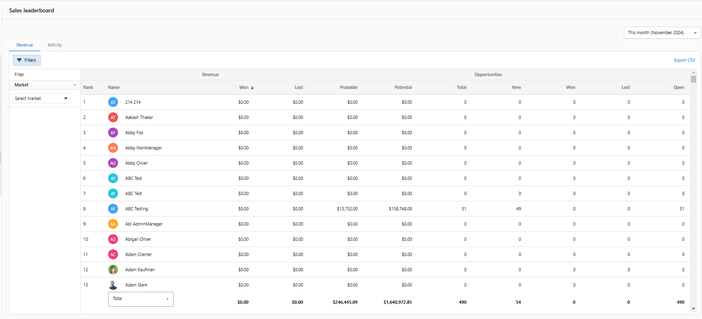

La tabla de clasificación de ventas te ayuda a ti y a tu equipo a comparar métricas de rendimiento y fomentar la competencia sana dentro de tu equipo. Este completo sistema de seguimiento de rendimiento muestra a todos tus vendedores y las métricas de ingresos importantes en un formato fácil de entender. Con opciones de filtrado avanzadas y capacidades de exportación, la tabla de clasificación proporciona información valiosa sobre el rendimiento del equipo y los logros individuales. La tabla de clasificación sirve tanto como herramienta motivacional como fuente de datos para decisiones estratégicas de gestión de ventas.

## ¿Por qué usar la tabla de clasificación?

Transforma el rendimiento de tu equipo de ventas con métricas visuales que impulsan la competencia y la responsabilidad. La tabla de clasificación elimina las conjeturas en la evaluación del rendimiento y proporciona información clara y medible que ayuda a los gerentes de venta a asesorar a sus equipos de forma más efectiva, a la vez que motiva a los vendedores a lograr mejores resultados.

## Qué incluye

- Seguimiento de métricas de rendimiento y funciones de comparación de equipo
- Filtrado basado en equipos de venta y mercados
- Análisis de rango de fechas personalizado
- Capacidades de exportación a CSV para informes externos

## Primeros pasos

1. **Navega a la tabla de clasificación**
   - Ve a `Partner Center` → `CRM` → `Leaderboard`
   - Accede a tu panel de rendimiento de ventas

2. **Revisa el rendimiento del equipo**
   - Consulta a todos tus vendedores y sus métricas de ingresos
   - Compara el rendimiento en todo tu equipo

3. **Aplica filtros**
   - Filtra la tabla de clasificación según equipos de venta y mercados
   - Ajusta para rangos de fechas personalizados y analizar períodos específicos

4. **Exporta datos**
   - Exporta la tabla de clasificación a formato CSV
   - Aprovecha la información en tus propios sistemas de informes

## Métricas de rendimiento y funciones

Tu tabla de clasificación muestra a todos tus vendedores y las métricas de ingresos importantes. Puedes filtrar tu tabla de clasificación según los equipos de venta y los mercados, y puedes ajustar para rangos de fechas personalizados. Tu tabla de clasificación también se puede exportar a un CSV para que puedas aprovechar la información en tus propios informes.

  <iframe 
    src="https://www.youtube-nocookie.com/embed/PKTo_YFGNPU" 
    width="560" 
    height="315" 
    frameBorder="0" 
    allowFullScreen
  ></iframe>

## Capacidades de comparación de equipo

La tabla de clasificación proporciona visibilidad completa del rendimiento de ventas de tu equipo, con la capacidad de comparar métricas entre diferentes miembros del equipo, períodos, y segmentos de mercado. Esto ayuda a identificar a los mejores desempeños, hacer seguimiento del progreso a lo largo del tiempo, y garantizar la responsabilidad en toda tu organización de ventas.

## Preguntas frecuentes (FAQ)

¿La tabla de clasificación es visible en Business App?

No. La tabla de clasificación es una herramienta de gestión orientada al partner, disponible en Partner Center para hacer seguimiento del rendimiento del equipo de ventas. No es visible para los clientes en Business App.

