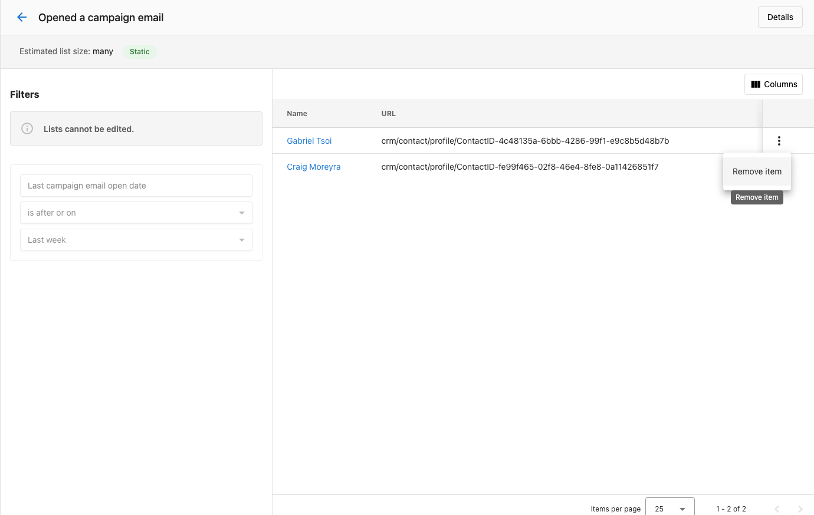
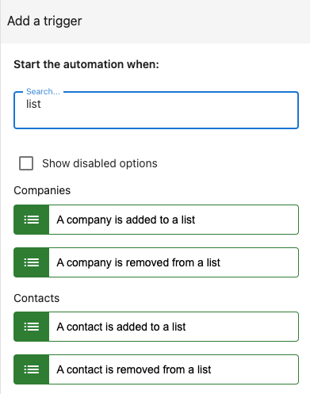
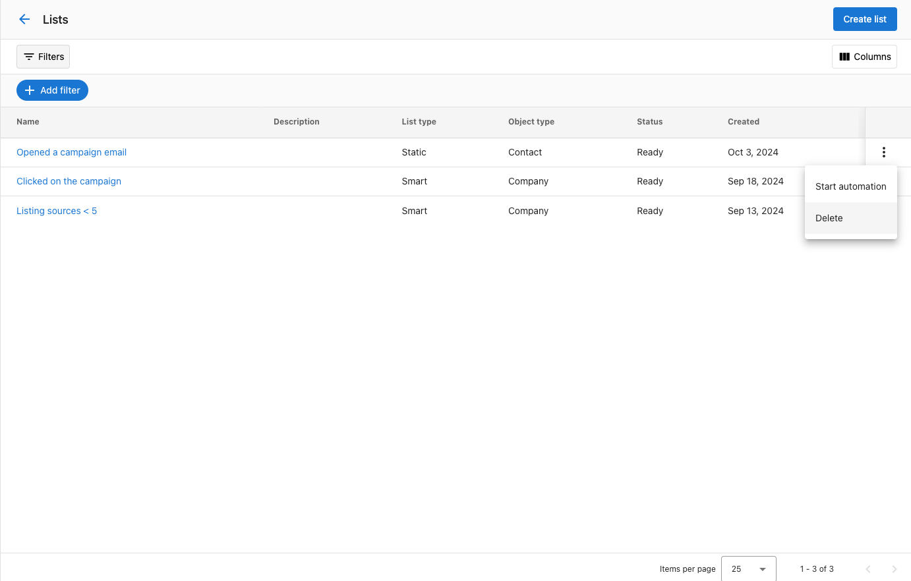

# Listas

Las listas en el CRM te ayudan a organizar y gestionar tus contactos, empresas, y oportunidades de manera eficiente. Esta potente función te permite crear listas estáticas o actualizadas dinámicamente que se comparten entre los miembros del equipo para mejorar la colaboración. Con la capacidad de iniciar automatizaciones basadas en estas listas o activar automatizaciones cuando se agregan contactos, las listas hacen que la nutrición de clientes potenciales y las acciones masivas sean mucho más simples y eficientes. La función Lists sirve como base para campañas de marketing dirigidas y flujos de trabajo automatizados que impulsan una mejor interacción y tasas de conversión.

## ¿Por qué usar listas?

Transforma tu gestión de clientes potenciales con agrupaciones organizadas y dirigidas que permiten la nutrición automatizada y campañas más efectivas. Las listas eliminan la clasificación manual y permiten la segmentación en tiempo real, garantizando que tus esfuerzos de marketing lleguen a la audiencia correcta en el momento correcto mientras se reduce la carga administrativa.

## Qué incluye

- Listas estáticas para grupos fijos gestionados manualmente (por ejemplo, asistentes a un evento)
- Listas inteligentes que se actualizan automáticamente según el comportamiento y los criterios del contacto
- Activadores de automatización cuando se agregan o eliminan contactos o empresas de las listas
- Capacidades de uso compartido en equipo para la gestión colaborativa de listas
- Integración con campañas de marketing y acciones masivas

## Primeros pasos

1. **Navega a listas**
   - Ve a `Partner Center` → `CRM` → `Lists`
   - Accede a tu espacio de trabajo de gestión de listas

2. **Elige el tipo de lista**
   - Crea `Static Lists` para grupos fijos (por ejemplo, asistentes a un evento)
   - Crea `Smart Lists` para segmentación dinámica basada en reglas

3. **Configura tu primera lista**
   - Aplica filtros para crear los criterios iniciales de la lista
   - Define reglas para las listas inteligentes o entradas manuales para las listas estáticas

4. **Configura automatizaciones**
   - Configura automatizaciones basadas en la pertenencia a la lista
   - Configura activadores cuando se agregan contactos a las listas

## Listas estáticas vs. listas inteligentes

Hay dos tipos de listas en el CRM:

**Listas estáticas:** los usuarios pueden establecer un filtro para crear una lista inicial de empresas o contactos, y luego agregar o eliminar entradas manualmente. Esta lista no cambia automáticamente, lo que la hace útil para grupos fijos, como dirigirse a los asistentes de un evento específico.

**Listas inteligentes:** las listas inteligentes se actualizan automáticamente según las reglas que estableces, como la forma en que los contactos interactúan con los correos electrónicos. Por ejemplo, un especialista en marketing podría crear una lista inteligente que incluya automáticamente a los contactos que hicieron clic en tu correo electrónico de marketing o que coincidan con tu perfil de comprador. A medida que cambian los comportamientos o detalles del cliente, la lista se actualiza en tiempo real, ayudando al especialista en marketing a hacer seguimiento de los clientes potenciales interesados y nutrirlos automáticamente sin actualizaciones manuales.

## Cómo usar listas en el CRM

Navega a `Partner Center` → `CRM` → `Lists`.

Haz clic en `Create`. Se te dará la opción de crear una lista estática o inteligente.

## Crear una lista estática

**1. Especifica filtros:** usa filtros para seleccionar los contactos o empresas que quieres agregar inicialmente. Puedes filtrar por criterios como ubicación, industria, historial de interacción, o cualquier campo personalizado que hayas configurado.

**2. Haz clic en Save:** una vez que hayas aplicado los filtros, haz clic en `Save`.

**Nota:** puede tomar algo de tiempo para que la lista estática se complete totalmente con los contactos o empresas seleccionados, dependiendo del tamaño de tus datos de CRM.

**3. Gestiona la lista manualmente:**

- **Agregar contactos/empresas:** después de crear la lista, puedes agregar manualmente nuevos contactos o empresas yendo a la tabla de contactos o de empresas, seleccionando los registros que te gustaría agregar a una lista, y luego seleccionando una lista para asignarlos.

**4. Eliminar contactos/empresas:** de manera similar, puedes eliminar manualmente cualquier contacto o empresa seleccionando el registro en la lista y haciendo clic en la opción de eliminar.

## Crear una lista inteligente

**1. Especifica filtros:** define reglas dinámicas para la lista, como la interacción del contacto, las aperturas de correo electrónico, u otros comportamientos. Por ejemplo, puedes crear una regla para "empresas que tienen un contacto que ha abierto un correo electrónico de marketing en estas dos semanas" y "empresas que tienen una calificación de listado de C, D, o F".

**2. Haz clic en Save:** una vez guardada, la lista inteligente se actualizará automáticamente según los criterios que hayas establecido. Los contactos y empresas se agregarán o eliminarán en tiempo real a medida que cambien sus detalles o comportamientos. No necesitas gestionar esta lista manualmente.

## Activar automatizaciones desde la lista

Este proceso es el mismo tanto para las listas estáticas como para las inteligentes:

**1. Localiza la lista:**
- En la pantalla de la tabla de listas, encuentra la lista para la que quieres automatizar acciones.

**2. Inicia la automatización:**
- Haz clic en el menú de acciones (tres puntos) junto a la lista y selecciona `Start Automation`.

**3. Elige la automatización:**

a. Dependiendo de si tu lista es para contactos o empresas, verás una lista de automatizaciones disponibles con los activadores `Manually trigger for contact` o `Manually trigger for company`.

b. Selecciona la automatización que quieres ejecutar, y comenzará de inmediato para todas las entradas de la lista.

## ¿Cómo automatizo acciones cuando se agregan o eliminan contactos o empresas de una lista?

Puedes configurar automatizaciones para activar acciones específicas cuando un contacto o empresa se agrega o elimina de una lista. Hay cuatro activadores de automatización disponibles para esto:

1. Cuando se agrega un contacto a una lista
2. Cuando se elimina un contacto de una lista
3. Cuando se agrega una empresa a una lista
4. Cuando se elimina una empresa de una lista

Estos activadores te permiten automatizar flujos de trabajo, como enviar correos electrónicos de seguimiento, notificar a un equipo de ventas, o mover un contacto a otra etapa del CRM cuando se une o abandona una lista. Simplemente configura la automatización con el activador apropiado, y el sistema se encargará del resto según tus criterios.

:::info Profundiza más
¿Quieres ver este activador construido de principio a fin? [Pon a tu equipo de trabajo con IA en piloto automático](/learn/ai-workforce/autopilot) combina una lista inteligente con el activador "contacto agregado a una lista" para iniciar una campaña de nutrición real por sí sola.
:::

## ¿Cómo elimino una lista?

**1. Localiza la lista:**
- En la pantalla de `List Table`, encuentra la lista que quieres eliminar.

**2. Haz clic en eliminar:**
- Haz clic en el menú de acciones (tres puntos) junto a la lista y selecciona `Delete`.

**3. Confirma la eliminación:**
- En la ventana modal de confirmación, escribe `Delete` y haz clic en `Delete` para confirmar.

## Preguntas frecuentes

¿Esto estará disponible para mis clientes?

Sí, esto también está disponible para tus clientes en `Business App`.

¿Puedo compartir listas con los miembros de mi equipo?

Sí, tanto las listas estáticas como las inteligentes se pueden compartir en todo tu equipo. Esto garantiza que todos trabajen con la misma información actualizada y ayuda a mejorar la colaboración.

¿Cuál es la diferencia entre una lista estática y una lista inteligente?

Una lista estática se gestiona manualmente y no cambia a menos que la actualices. Es excelente para grupos fijos como los asistentes a un evento. Una lista inteligente se actualiza automáticamente según las reglas que estableces, como la interacción o los comportamientos del contacto, lo que la hace ideal para la segmentación dinámica.

¿Cómo configuro automatizaciones para mis listas?

Puedes configurar automatizaciones fácilmente yendo a la lista, haciendo clic en el menú de acciones (tres puntos), y seleccionando `Start Automation`. Desde allí, elige la automatización que quieres ejecutar, y se activará para todas las entradas de la lista. También puedes configurar una automatización para realizar acciones automáticamente cuando se agregan/eliminan contactos/empresas de la lista.

¿Hay un límite de cuántas listas puedo crear?

No hay un límite específico en el número de listas que puedes crear, así que puedes organizar tus contactos o empresas según lo necesites para diferentes campañas o flujos de trabajo.

¿Se puede agregar una lista del CRM a una campaña?

Sí, pero el flujo de trabajo específico es diferente al de agregar una lista de cuentas. Puedes iniciar una campaña desde una lista del CRM desde **CRM > Lists > haz clic en los tres puntos junto a la lista deseada > More Actions > selecciona una cuenta de servicio para realizar esta acción > Campaigns and Emails > Start a campaign for this contact**.

