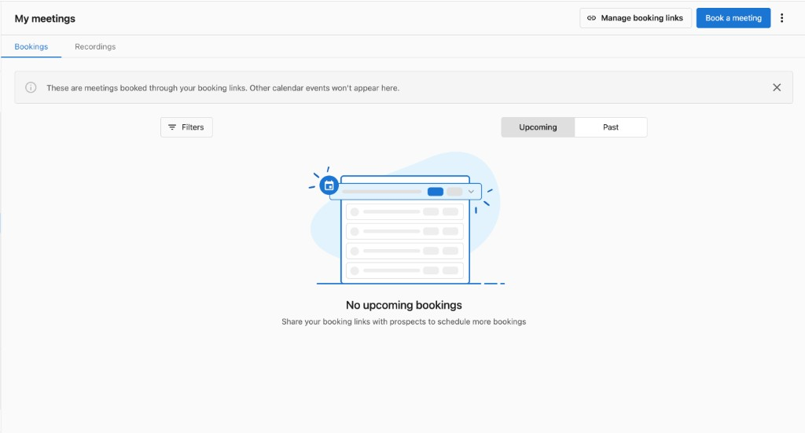
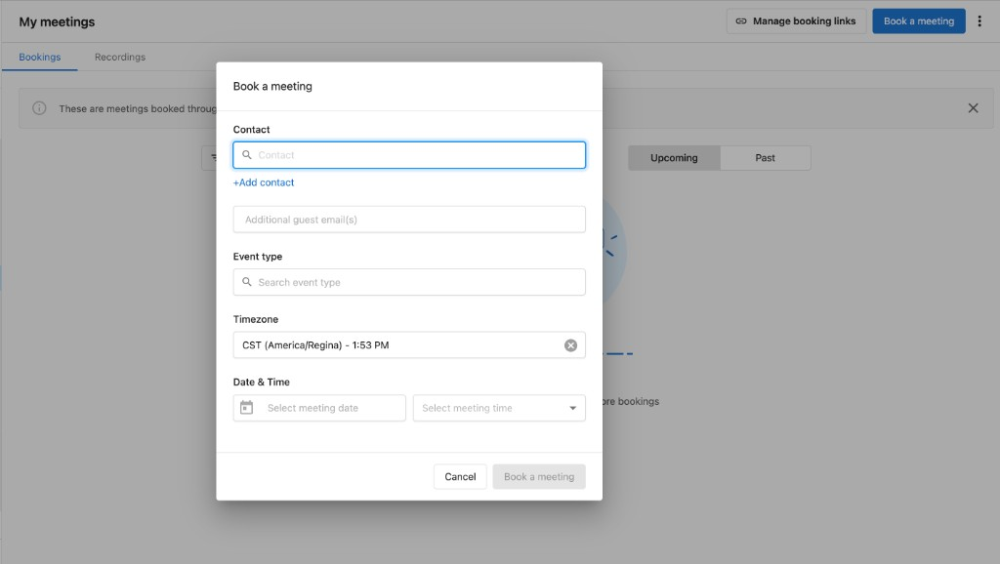
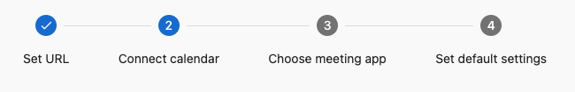
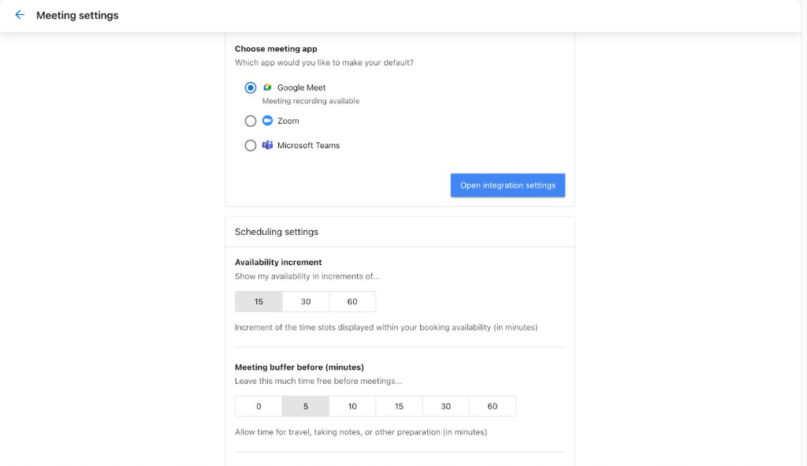
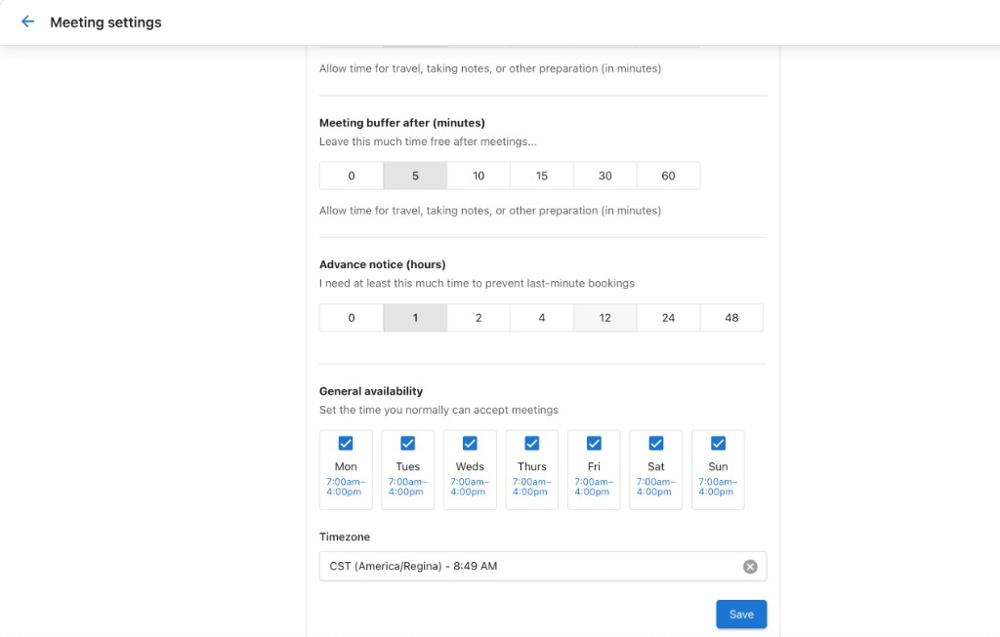
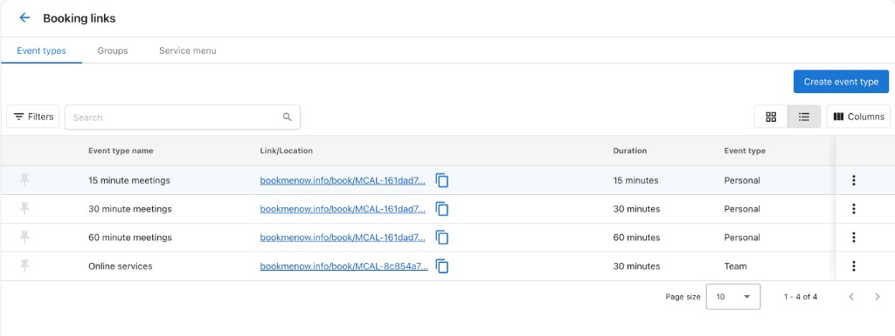
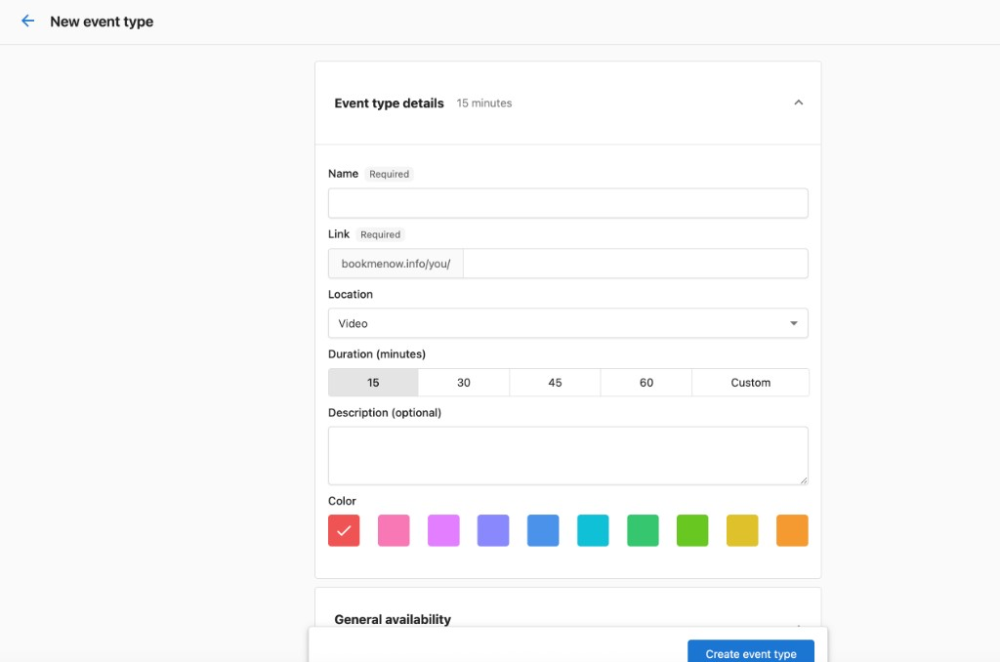
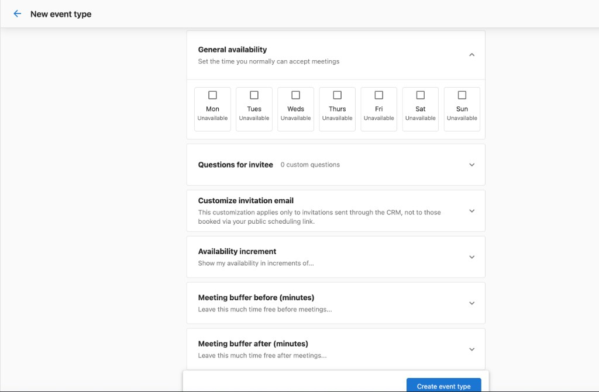

# Mis reuniones

Las reuniones no necesariamente se ajustan a un formato único para todos, por eso el Meeting Scheduler te permite crear tus propios enlaces de reserva. ¿Quieres una reunión rápida de café de 15 minutos? ¡Puedes! ¿Qué tal una llamada de consulta de 60 minutos? También te cubrimos.

## Crear un enlace de reserva

1. Ve a `CRM` → `My Meetings`
2. Haz clic en `Book a meeting`

3. Completa el formulario **Book a meeting** con los siguientes detalles:
   - **Contact**: busca un contacto existente o haz clic en **+Add contact** para crear uno
   - **Additional guest email(s)**: agrega direcciones de correo electrónico para otros asistentes
   - **Event type**: busca y selecciona el tipo de reunión
   - **Timezone**: confirma o cambia la zona horaria de la reunión
   - **Date & Time**: selecciona la fecha y hora de la reunión

4. Haz clic en **Book a meeting** para confirmar.

Una vez reservada, la reunión aparece en la pestaña **Bookings** de la página **My Meetings**. Desde aquí puedes **unirte (Join)** a la reunión directamente o hacer clic en **Edit** para hacer cambios. Usa los interruptores **Upcoming** y **Past** para filtrar tu vista, y cambia a la pestaña **Recordings** para revisar las grabaciones de reuniones pasadas.

## Configuración inicial

Cuando inicies sesión por primera vez en **My Meetings**, se te guiará a través de un asistente de configuración para ajustar tus preferencias de reunión. El asistente te lleva a través de cuatro pasos:

1. **Set URL**: personaliza tu URL de reserva personal.
2. **Connect calendar**: vincula tu Google Calendar o tu calendario de Microsoft 365 / Outlook.
3. **Choose meeting app**: selecciona tu app de reunión predeterminada (Google Meet, Zoom, o Microsoft Teams).
4. **Set default settings**: configura tus preferencias de programación, como disponibilidad, tiempos de margen, y zona horaria.

Una vez completada la configuración, puedes actualizar cualquiera de estos ajustes en cualquier momento desde **Meeting settings**.

## Configuración de la reunión

Para configurar tus preferencias generales de reunión, haz clic en el **menú de tres puntos** en la esquina superior derecha de la página **My Meetings** y selecciona **Meeting settings**.

Desde aquí puedes configurar:

- **General meeting URL**: personaliza la URL que las personas usan para reservar reuniones contigo. Debe ser algo corto y fácil de recordar.
- **Calendar settings**: conecta tu Google Calendar o tu calendario de Microsoft 365 / Outlook para verificar conflictos y crear eventos.

- **Choose meeting app**: selecciona tu app de reunión predeterminada entre Google Meet, Zoom, o Microsoft Teams.
- **Scheduling settings**: controla cómo se muestra tu disponibilidad:
  - **Availability increment**: muestra los horarios en incrementos de 5, 10, 15, 30, 60, o 90 minutos.
  - **Meeting buffer before/after**: establece un tiempo de margen antes y después de las reuniones para desplazamiento, notas, o preparación.

- **Advance notice**: establece el tiempo mínimo de anticipación requerido para evitar reservas de último momento.
- **General availability**: selecciona qué días de la semana puedes aceptar reuniones y establece tus horas disponibles.
- **Timezone**: confirma o cambia tu zona horaria.

## Gestionar enlaces de reserva

Haz clic en **Manage booking links** para ver todos tus tipos de evento. Esta página enumera cada tipo de evento junto con su enlace, duración, y si es un evento personal o de equipo.

### Crear un nuevo tipo de evento

Haz clic en **Create event type** para configurar un nuevo tipo de reunión. Completa los detalles del tipo de evento:

- **Name**: dale un nombre al tipo de evento.
- **Link**: se genera automáticamente un enlace de reserva único.
- **Location**: elige dónde se realiza la reunión:
  - **Video**: la reunión se realiza por videoconferencia (se inserta automáticamente un enlace de Google Meet, Zoom, o Microsoft Teams).
  - **In Person**: la reunión se realiza en una ubicación física. Elige quién establece la dirección:
    - **I'll set the location**: tú proporcionas la dirección (precompletada desde tu perfil de negocio). Opcionalmente habilita **Include video conferencing** para convertirla en una reunión híbrida.
    - **Invitee sets the location**: la persona que reserva proporciona su dirección al momento de la reserva. Útil para llamadas de servicio en el sitio.
- **Duration**: selecciona una duración de 15, 30, 45, o 60 minutos, o establece una duración personalizada.
- **Description**: agrega una descripción opcional.
- **Color**: elige un color para ayudar a identificar este tipo de evento.

También puedes configurar opciones adicionales para cada tipo de evento. Los ajustes configurados aquí anulan tus valores predeterminados a nivel de usuario solo para este tipo de evento:

- **General availability**: anula tu disponibilidad predeterminada para este tipo de evento específico.
- **Questions for invitee**: agrega preguntas personalizadas que los invitados responden al reservar. Hacer que **Phone Number** y/o **Email** sean campos obligatorios controla qué canales están disponibles para las confirmaciones y los recordatorios.

  Elige un **canal de confirmación** (**Email**, **SMS**, o **Both**) para la confirmación que reciben los invitados cuando reservan. Elige un **canal de recordatorio** de la misma manera; de forma predeterminada usa tu canal de confirmación hasta que lo cambies, después de lo cual los dos funcionan de forma independiente, por ejemplo, una confirmación por Email con un recordatorio por SMS.

  - Desactivar el requisito de **Phone Number** deshabilita **SMS** y **Both** en ambos controles de canal, y cualquier selección actual de SMS/Both vuelve a Email.
  - Desactivar el requisito de **Email** deshabilita **Email** y **Both** en ambos controles de canal, y cualquier selección actual de Email/Both vuelve a SMS.
  - Si tanto **Phone Number** como **Email** están desactivados, todas las opciones de canal se deshabilitan y aparece una advertencia en línea; el tipo de evento no se puede guardar hasta que se seleccione al menos un canal.

  Establece el **tiempo de anticipación del recordatorio** (un número entero más una unidad: minutos, horas, o días) para controlar con cuánta anticipación a la reunión se envía el recordatorio. El valor predeterminado es 24 horas, y el máximo es 10 días; los valores ingresados por encima del máximo se ajustan automáticamente, y cambiar de unidad vuelve a ajustar el valor. Solo se puede configurar un recordatorio por tipo de evento.

  :::note
  Las confirmaciones y recordatorios por SMS requieren una suscripción activa a Conversations AI Pro o Premium (Reputation AI Premium y Campaigns Pro también desbloquean esto), y el número de teléfono del negocio debe estar registrado primero. Configúralo en `Administration` → `SMS Configuration`.
  :::

- **Customize invitation email**: personaliza el asunto y el cuerpo del correo electrónico enviado cuando solicitas una reunión a través de la página de Contacts del CRM.
- **Availability increment**: anula el incremento de horario predeterminado (5, 10, 15, 30, 60, o 90 minutos).
- **Meeting buffer before/after**: anula los tiempos de margen predeterminados.
- **Advance notice**: anula el tiempo mínimo de anticipación requerido para evitar reservas de último momento.
- **Add to my website**: obtén un código de inserción para agregar tu formulario de reserva directamente a un sitio web como un widget en línea. Copia y pega el código en el HTML de tu sitio donde quieras que aparezca el formulario de reserva.

- **Limit future meetings**: controla hasta qué punto en el futuro se pueden programar las reuniones. Establece límites por días, semanas, meses, o elige un rango de fechas personalizado. Cuando se alcanza el límite, no se muestran horarios más allá de ese punto.

Una vez que crees un nuevo tipo de evento, aparece como una opción cuando vayas a reservar una reunión.

:::note
Si se elimina un tipo de reunión, no se cancelará ninguna cita ya reservada usando ese enlace. El enlace se desactivará y ya no permitirá nuevas reservas. Si se eliminó por error, no hay forma de restaurarlo; deberás crear un nuevo enlace de reserva.
:::
