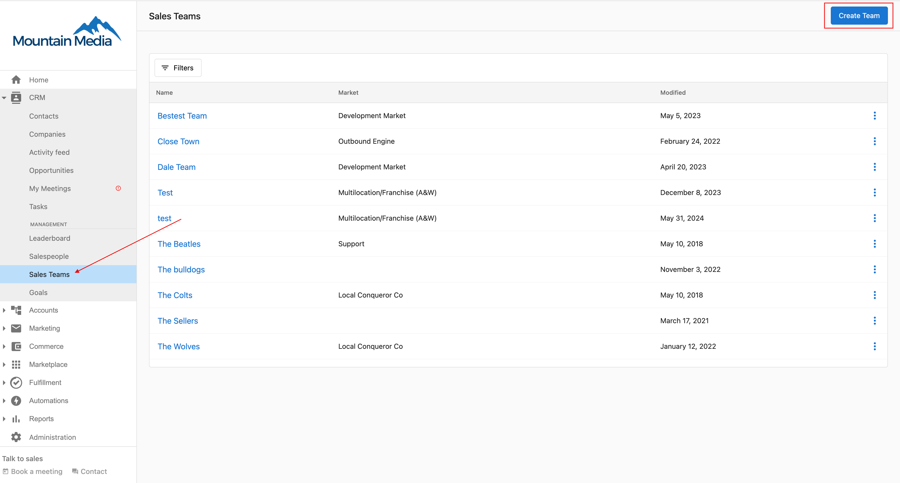
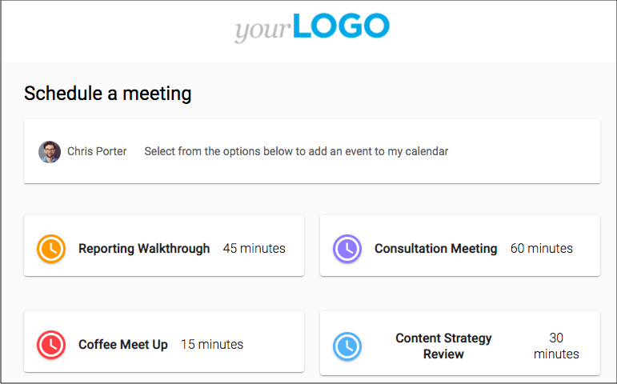

# Enlaces de reserva de equipo

Los enlaces de reserva de equipo te permiten crear un solo enlace de reserva que distribuirá reuniones a un equipo de usuarios. Por ejemplo, tu negocio podría hacer una llamada de calificación antes de entregar un prospecto a un vendedor. Puedes crear un enlace de reserva de equipo para tu equipo de calificación y dejar que My Meetings distribuya reuniones aleatoriamente entre los miembros del equipo. Esta página explica cómo configurar y gestionar los enlaces de reserva de equipo.

## Crear enlaces de reserva de equipo

Necesitarás permisos de administrador para configurar enlaces de reserva de equipo.

Primero, necesitarás crear un Sales Team en `Partner Center`. Para hacer esto, navega a `CRM` → `Sales Teams` en el menú de la izquierda y haz clic en `Create Team`.

Para crear un enlace de reserva de equipo:

1. Inicia sesión en `Partner Center`
2. Navega a `My Meetings`
3. Haz clic en `Admin` (esta opción solo está disponible para usuarios con el rol de administrador asignado para la sección My Meetings)
4. Haz clic en `TEAM BOOKING LINKS`

## Crear un nuevo enlace de reserva de equipo

1. Haz clic en `+ New Team booking` para iniciar el proceso

2. Configura los siguientes campos en el formulario:

- **Event Title**: esto es lo que verán los clientes cuando reserven una reunión
- **Event Link Name**: esto crea la URL de tu enlace de reserva (por ejemplo, /team-meeting)
- **Description**: información opcional sobre la reunión
- **Duration**: duración de la reunión
- **Team Members**: selecciona a los miembros del equipo a incluir en este enlace de reserva (consulta la sección de personalización de calendario a continuación para más detalles)

3. Haz clic en `SAVE` para crear el enlace de reserva de equipo

## Métodos de asignación

Al crear un enlace de reserva de equipo, puedes elegir cómo se distribuirán las reuniones entre los miembros del equipo. Selecciona con qué miembros del equipo se puede reservar este servicio y cómo se asignan las reuniones.

Hay cuatro opciones de asignación:

### 1. Round robin
Las reuniones se asignan a los miembros del equipo en una secuencia rotativa, garantizando una distribución equitativa de las reservas entre todos los miembros del equipo disponibles. Este método proporciona la distribución de carga de trabajo más equilibrada.

**Cómo funciona:**
- A los miembros del equipo se les asignan reuniones en un orden predeterminado (por ejemplo, Miembro A, luego Miembro B, luego Miembro C, y de vuelta al Miembro A)
- Cada miembro del equipo obtiene un número igual de reuniones a lo largo del tiempo
- El sistema hace seguimiento automáticamente de la rotación y asigna la próxima reunión a la siguiente persona en la secuencia
- Solo se incluyen en la rotación los miembros del equipo disponibles (según la disponibilidad del calendario)

### 2. Priority assignment
Las reuniones se asignan según una jerarquía de prioridad que estableces para los miembros del equipo. Los miembros de mayor prioridad reciben reuniones primero, y los de menor prioridad reciben reservas solo cuando los de mayor prioridad no están disponibles.

**Cómo funciona:**
- Asigna niveles de prioridad a cada miembro del equipo (1 = prioridad más alta, 2 = segunda prioridad, etc.)
- El sistema siempre intenta asignar reuniones al miembro disponible de mayor prioridad primero
- Si el miembro de mayor prioridad no está disponible, el sistema pasa al siguiente nivel de prioridad
- Útil para estructuras de equipo senior/junior o cuando ciertos miembros del equipo deben gestionar la mayoría de las reservas

**Ideal para:**
- Equipos con diferentes niveles de experiencia
- Situaciones donde ciertos miembros del equipo deben ser el contacto principal
- Asignación jerárquica basada en experiencia o antigüedad

### 3. Client selection
Permite que la persona que reserva la reunión elija con qué miembro específico del equipo quiere reunirse entre las opciones disponibles.

**Cómo funciona:**
- La página de reserva muestra a los miembros del equipo disponibles con sus nombres y, potencialmente, fotos/biografías
- El cliente selecciona su miembro del equipo preferido durante el proceso de reserva
- Solo se mostrarán como opciones los miembros del equipo que estén disponibles en el horario seleccionado
- Ofrece la máxima flexibilidad y elección para el cliente

**Ideal para:**
- Negocios orientados al servicio donde los clientes pueden tener preferencias
- Equipos donde los miembros tienen diferentes especializaciones o áreas de experiencia
- Construir relaciones personales entre los clientes y miembros específicos del equipo
- Situaciones donde la comodidad y elección del cliente son prioridades

### 4. Multi host
Varios miembros del equipo asisten a la misma reunión juntos, en lugar de que se asigne solo a una persona.

**Cómo funciona:**
- Todos los miembros del equipo seleccionados son invitados a cada reunión reservada
- La reunión aparece en los calendarios de todos los miembros del equipo participantes
- El invitado ve los nombres de todos los hosts en la página de reserva antes de confirmar
- Solo se muestran los horarios en los que **todos** los hosts seleccionados están disponibles simultáneamente
- El sistema verifica la disponibilidad de todos los miembros del equipo seleccionados antes de permitir la reserva

**Límites y requisitos:**
- Máximo **5 hosts** por tipo de evento multi-host
- Todos los hosts seleccionados deben tener su calendario conectado para una verificación precisa de disponibilidad. Los hosts sin un calendario conectado se excluyen de las verificaciones de disponibilidad.

**Ideal para:**
- Procesos de venta complejos que requieren varias partes interesadas (por ejemplo, vendedor + ingeniero de soluciones)
- Sesiones de capacitación o consultas que necesitan varios expertos
- Sesiones de incorporación que se benefician de varias perspectivas del equipo

## Seleccionar miembros del equipo

Para todos los métodos de asignación, necesitas seleccionar qué miembros del equipo pueden participar en el enlace de reserva:

1. **Agregar miembros del equipo**: haz clic en el campo de selección de miembros del equipo y elige entre tus miembros de equipo disponibles
2. **Eliminar miembros del equipo**: haz clic en la "X" junto al nombre de cualquier miembro del equipo para eliminarlo del enlace de reserva
3. **Requisitos de los miembros del equipo**: cada miembro del equipo seleccionado debe tener su calendario conectado y correctamente configurado

**Consideraciones importantes:**
- Solo los miembros del equipo con calendarios conectados se mostrarán como disponibles para reservar
- Se respetan la configuración de disponibilidad individual y los horarios de trabajo de los miembros del equipo
- Para las asignaciones Multi host, todos los miembros del equipo seleccionados deben estar disponibles para que sea posible la reserva

## Gestionar la disponibilidad

Puedes establecer días y horarios específicos en los que los miembros del equipo están disponibles para reservas.

Los miembros del equipo se pueden asignar a diferentes días y períodos de tiempo. Por ejemplo, algunos miembros del equipo podrían estar disponibles de lunes a miércoles mientras que otros están disponibles de jueves a viernes.

## Personalización de calendario

Tienes control total sobre qué calendarios de miembros del equipo se incluyen en tu enlace de reserva de equipo y cómo se gestiona su disponibilidad:

### Seleccionar miembros del equipo para la inclusión de calendario

Al crear o editar un enlace de reserva de equipo, puedes personalizar qué miembros del equipo participan:

**Agregar miembros del equipo:**
1. En la sección "Team Members" de la configuración del enlace de reserva
2. Haz clic en "Add Team Member" o selecciona del menú desplegable
3. Elige personas específicas de tu Sales Team
4. Solo se verificará la disponibilidad de los calendarios de los miembros del equipo seleccionados

**Eliminar miembros del equipo:**
- Haz clic en la "X" o el botón de eliminar junto al nombre de cualquier miembro del equipo
- Los miembros eliminados ya no recibirán reservas a través de este enlace
- Sus reuniones ya reservadas no se ven afectadas

### Requisitos de integración de calendario

Para que los miembros del equipo aparezcan como disponibles para reservar:
- **Conexión de calendario**: cada miembro del equipo debe tener su calendario personal conectado a My Meetings (Google Calendar, Outlook, etc.)
- **Sincronización de disponibilidad**: los calendarios de los miembros del equipo se verifican automáticamente en busca de conflictos cuando los prospectos intentan reservar
- **Configuración de permisos**: los miembros del equipo deben otorgar permisos de acceso al calendario durante la configuración inicial

### Gestionar la disponibilidad de calendario individual

Cada miembro del equipo incluido en el enlace de reserva de equipo mantiene el control individual:

**Bloqueo de calendario:**
- Los eventos marcados como "ocupado" en los calendarios personales bloquean automáticamente la disponibilidad
- Los eventos de todo el día impiden reservas durante todo el día
- Los eventos privados se respetan sin revelar detalles a los prospectos

**Configuración de tiempo de margen:**
- Se aplican las preferencias de tiempo de margen individuales (por ejemplo, 15 minutos antes/después de las reuniones)
- Los miembros del equipo pueden establecer diferentes tiempos de margen para diferentes tipos de reunión
- Los tiempos de margen evitan reservas consecutivas

**Cumplimiento de horarios de trabajo:**
- Se respetan los horarios de trabajo individuales de cada miembro del equipo
- Si alguien establece disponibilidad de 9 AM a 5 PM, se bloquean las reservas fuera de esas horas
- Diferentes miembros del equipo pueden tener diferentes preferencias de horario de trabajo

### Opciones avanzadas de personalización de calendario

**Disponibilidad condicional:**
- **Enrutamiento basado en habilidades**: asigna diferentes miembros del equipo a diferentes tipos de reunión según su experiencia
- **Límites de capacidad**: establece un número máximo de reuniones por día/semana para miembros individuales del equipo
- **Ponderación de prioridad**: da prioridad a ciertos miembros del equipo para prospectos de alto valor

**Resolución de conflictos de calendario:**
- **Verificación en tiempo real**: el sistema verifica todos los calendarios seleccionados antes de mostrar los horarios disponibles
- **Exclusiones automáticas**: los miembros del equipo con conflictos se excluyen temporalmente de la asignación
- **Opciones alternativas**: si no hay miembros del equipo disponibles, el sistema puede mostrar horarios alternativos

### Buenas prácticas para la gestión de calendario

**Recomendaciones de configuración:**
- Asegúrate de que todos los miembros del equipo tengan calendarios correctamente sincronizados antes de agregarlos a los enlaces de reserva de equipo
- Prueba los enlaces de reserva con cada miembro del equipo para verificar la integración del calendario
- Establece expectativas claras con los miembros del equipo sobre el mantenimiento del calendario

**Mantenimiento continuo:**
- Revisa regularmente la inclusión de miembros del equipo según los cambios de rol
- Supervisa la distribución de reservas para garantizar una asignación justa
- Actualiza la composición del equipo cuando los miembros se unan o abandonen el equipo
- Verifica si hay problemas de sincronización de calendario si las reservas no se distribuyen correctamente

**Coordinación del equipo:**
- Anima a los miembros del equipo a mantener actualizados sus calendarios personales
- Establece protocolos para manejar conflictos de programación
- Crea reglas de asignación de respaldo para cuando los miembros principales del equipo no estén disponibles

## Configuración de zona horaria

Puedes elegir cómo se gestiona la configuración de zona horaria para las reservas de equipo.

Las opciones incluyen:
- Usar la zona horaria de la empresa
- Ajustar a la zona horaria del visitante
- Establecer una zona horaria específica

## Personalizar tu página de reserva

Personaliza la página de reserva de equipo con colores personalizados y preguntas de reserva.

Puedes agregar preguntas personalizadas que los visitantes deben completar al reservar una reunión. Esta información estará disponible para el miembro del equipo que reciba la reserva.

### Canales de confirmación y recordatorio

Hacer que **Phone Number** y/o **Email** sean campos obligatorios (en las preguntas de reserva) controla qué canales están disponibles para las confirmaciones y los recordatorios.

- Elige un **canal de confirmación** (**Email**, **SMS**, o **Both**) para la confirmación que reciben los invitados cuando reservan.
- Elige un **canal de recordatorio** de la misma manera. De forma predeterminada usa tu canal de confirmación hasta que lo cambies, después de lo cual los dos canales funcionan de forma independiente, por ejemplo, una confirmación por Email con un recordatorio por SMS.
- Desactivar el requisito de **Phone Number** deshabilita **SMS** y **Both** en ambos controles de canal, y cualquier selección actual de SMS/Both vuelve a Email. Desactivar el requisito de **Email** deshabilita **Email** y **Both**, y vuelve a SMS.
- Si tanto **Phone Number** como **Email** están desactivados, todas las opciones de canal se deshabilitan y aparece una advertencia en línea; el tipo de evento no se puede guardar hasta que se seleccione al menos un canal.
- Establece el **tiempo de anticipación del recordatorio** (un número entero más una unidad: minutos, horas, o días) para controlar con cuánta anticipación a la reunión se envía el recordatorio. El valor predeterminado es 24 horas, y el máximo es 10 días; los valores por encima del máximo se ajustan automáticamente, y cambiar de unidad vuelve a ajustar el valor. Solo se puede configurar un recordatorio por tipo de evento.

## Ver y compartir tu enlace de reserva de equipo

Después de crear un enlace de reserva de equipo, puedes verlo y compartirlo con prospectos y clientes.

1. Haz clic en el botón `VIEW` para ver cómo aparece tu página de reserva a los visitantes
2. Usa el botón `COPY LINK` para copiar la URL de reserva a tu portapapeles
3. Comparte el enlace por correo electrónico, redes sociales, o agrégalo a tu sitio web

## Supervisar el rendimiento

Los administradores pueden supervisar el rendimiento de los enlaces de reserva de equipo viendo el panel, que muestra métricas como:

- Número de reuniones reservadas
- Distribución de reuniones entre los miembros del equipo
- Tasas de conversión de reserva
- Horarios de reserva populares

Usa estos datos para optimizar la disponibilidad de tu equipo y mejorar la experiencia de reserva para tus clientes.
