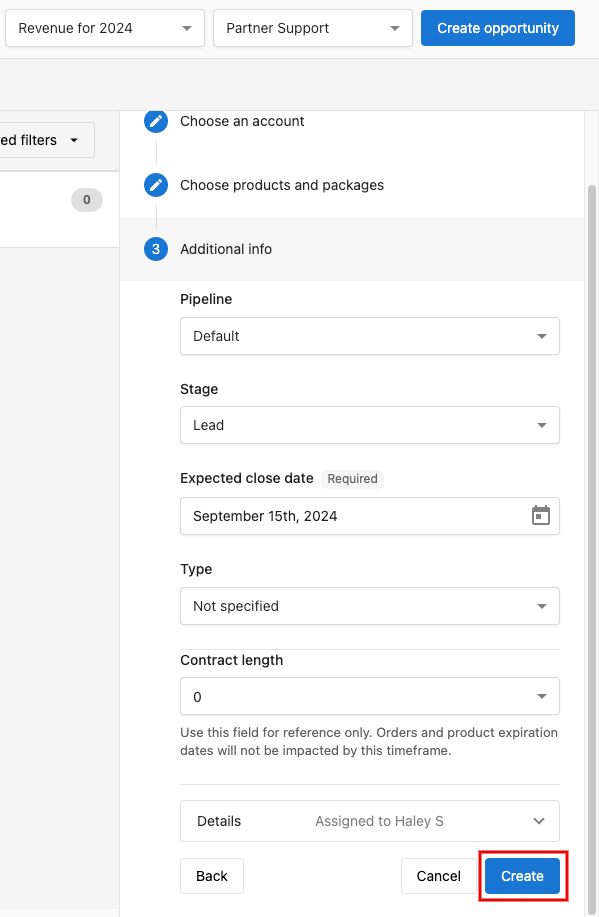

En el CRM de Vendasta, las oportunidades son un elemento crucial del pipeline de ventas, que te permiten hacer seguimiento y gestionar de manera efectiva el potencial de cada prospecto. Este artículo te guiará a través del proceso de crear y editar oportunidades dentro del pipeline de ventas, garantizando que puedas supervisar y capitalizar con precisión cada venta potencial. Al entender cómo gestionar las oportunidades, estarás mejor preparado para priorizar tus esfuerzos e impulsar resultados exitosos en tu proceso de ventas.

## Cómo crear oportunidades desde el tablero de pipeline

**Paso 1:** ve a `Partner Center` → `CRM` → `Opportunities` → `Board`

**Paso 2:** haz clic en `Create opportunity`

**Paso 3:** selecciona el campo `Account`, elige una cuenta para la oportunidad, luego haz clic en `Next` → `Add Items`.

**Paso 4:** marca las casillas junto a los productos o paquetes que quieres agregar y haz clic en `Select` para confirmar.

**Paso 5:** haz clic en `Next` para continuar.

**Paso 6:** agrega cualquier información de venta adicional, como:
- `Pipeline`
- `Stage`
- `Expected close date`
- `Type`
- `Contract length`

**Paso 7:** haz clic en `Create` para agregar la oportunidad a tu pipeline.

## Acceder a una oportunidad

1. Ve a `Partner Center` → `CRM` → `Opportunities` → `Board` (alternativamente, ve a `CRM` → `Companies` → `Company Name` → `Opportunities`)
2. Haz clic en la oportunidad a la que quieres acceder.
3. La oportunidad se abre en un panel lateral para que puedas acceder o editarla.

## Editar una oportunidad

Desde una oportunidad abierta, haz clic en cada sección de la información de la oportunidad para editarla.

Campos de la oportunidad:
- `Opportunity name`
- `Expected close`
- `Contract Length`
- `Assignee`
- `Subscribers`
- `Pipeline`
- `Stage`
- `Type`

Además, también puedes hacer clic en `Create order` para agregar automáticamente los productos de la oportunidad a un nuevo pedido para la cuenta, o `Create invoice` para crear una [factura](/commerce/invoices/create-and-send-invoices#creating-an-invoice-from-an-opportunity) para esos productos que permanece vinculada a la oportunidad y muestra su estado de pago en vivo.

:::info
Ten en cuenta que no es posible eliminar oportunidades en Partner Center una vez creadas. La oportunidad solo se puede marcar como ganada o perdida.
:::
