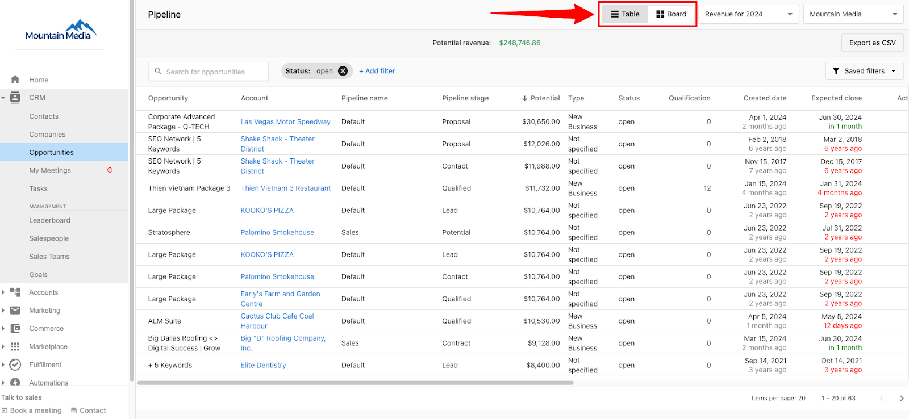
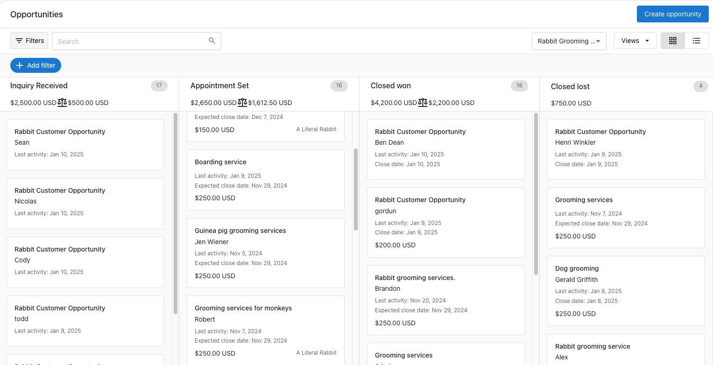
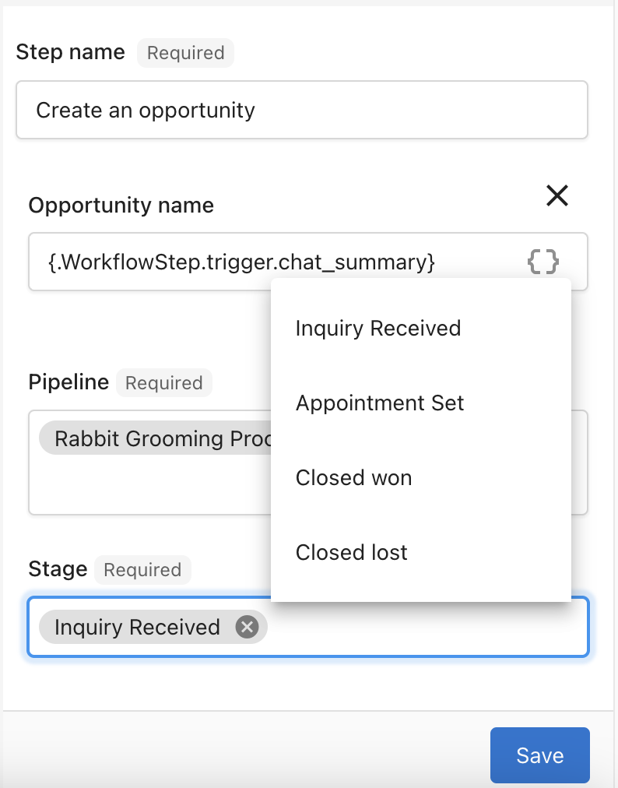

El pipeline de ventas es una herramienta vital para guiar a los clientes potenciales desde prospectos hasta clientes que pagan, dándote una vista clara del estado de cada oportunidad. Entender en qué etapa se encuentran tus oportunidades te ayuda a tomar los pasos necesarios para cerrar negocios, hacer seguimiento de los ingresos potenciales, y apoyar a tu equipo para impulsar más ventas. La capacidad del pipeline de organizar, filtrar, y visualizar oportunidades lo convierte en un recurso indispensable, ayudándote a enfocar tu tiempo y esfuerzo donde generan el mayor retorno.

## Vista de tabla

La vista de tabla es una excelente forma de obtener una lista completa de tus propias oportunidades de venta o las de un equipo.

- Para acceder a la vista de tabla, inicia sesión en `Partner Center` y navega a `CRM` → `Opportunities` → `Table`
- En esta vista, tienes una variedad de opciones sobre cómo quieres filtrar u organizar la lista de oportunidades.
- Encontrarás un cuadro de búsqueda encima del pipeline, que te permite buscar tipos específicos de oportunidades.
  - **Nota:** actualmente, solo puedes buscar tipos de oportunidad, por ejemplo, Website Creation, Visibility & SEO. No podrás buscar por ninguna otra categoría en este momento.

## Opciones de ordenamiento de la tabla

- Puedes ordenar las columnas de la tabla del pipeline en orden descendente o ascendente. Haz clic en el nombre de la columna que quieres ordenar una vez para orden descendente, o dos veces para orden ascendente.
- También puedes ordenar el pipeline usando el menú desplegable en la parte superior derecha. Esto te permite ordenar por fecha de cierre esperada y duración del contrato para tener una idea de tus ingresos mensuales. Por ejemplo: si se espera que una oportunidad de 6 meses se cierre el 1 de mayo, verías eso reflejado en tus ingresos potenciales de mayo a octubre.

## Vista de tablero

- La vista de tablero es una interfaz visual que te permite ver las oportunidades de un vistazo, incluida la etapa del pipeline en la que se encuentra cada oportunidad.
- Para acceder a la vista de tablero, inicia sesión en `Partner Center`. Ve a `CRM` → `Opportunities` → `Board`
- En esta vista, puedes arrastrar y soltar oportunidades para hacerlas transicionar entre etapas.

## Mover oportunidades

- En la vista de tablero de la pestaña Pipeline, cada oportunidad activa aparecerá en el tablero. Estas se dividen en varias etapas del pipeline.
- Para mover oportunidades a diferentes etapas, simplemente haz clic y mantén presionada la oportunidad que quieres mover. Desde allí, arrástrala a su nueva etapa.
- Hacer clic en el nombre de una oportunidad te llevará a la página de detalles de la oportunidad.

## Opciones de ordenamiento del tablero

- Puedes ordenar el tablero del pipeline usando el menú de opciones de ordenamiento y hacer clic en la flecha para alternar entre orden descendente o ascendente

Categorías de ordenamiento:

- Potential Revenue
- Expected close date
- Actual close date
- Last connected date
- Last sales activity
- Opportunity name
- Created date
- Assigned date
- Qualification

## Personalización de filtros

- Para agregar filtros a tu vista de tabla, haz clic en `+ Add Filter` en la parte superior del pipeline. También puedes eliminar un filtro haciendo clic en la X junto al nombre del filtro.

Tienes una variedad de opciones de filtrado para elegir, incluidas:

- Account
- Type
- Salespeople
- Salesteam
- Status
- Packages
- Products
- Tag
- Expected close date
- Actual close
- Created
- Assigned

## Crear una nueva etapa de pipeline

El pipeline predeterminado incluye cuatro etapas: "Lead", "Contact", "Qualified", y "Proposal". El porcentaje predeterminado es 0%, 20%, 40%, y 60% respectivamente, y te mostrará la previsión de ingresos según el porcentaje de las etapas del pipeline.

¿El pipeline predeterminado no se ajusta a tu negocio? No te preocupes, tienes la flexibilidad de crear pipelines personalizados y definir tus propios porcentajes de previsión.

## Crear pipelines en Vendasta

1. Inicia sesión en `Partner Center` y abre el pipeline yendo a `CRM` → `Opportunities` → `Board`
2. Haz clic en el menú desplegable de vista de pipeline y selecciona `Manage Pipelines`
3. Haz clic en `Create Pipeline`
4. Dale a tu pipeline un nombre fácilmente identificable.
5. Agrega las etapas de tu pipeline.
6. Asigna porcentajes predeterminados para cada etapa del pipeline. Estos aparecen en tu pipeline en orden de la probabilidad de éxito que les asignes.
7. Haz clic en `Save` para guardar tu nuevo pipeline.

## Seguimiento de ingresos totales y ponderados

El CRM de Vendasta ofrece una función mejorada que muestra tanto los ingresos totales como los ponderados para cada etapa de tu pipeline de ventas. Estos datos de ingresos se calculan usando la probabilidad asignada a cada etapa, dándote una vista clara y accionable de los resultados esperados en cada punto de tu proceso de ventas.

### El ícono de balanza

El ícono de balanza/escala (⚖) en el pipeline representa los **ingresos ponderados**, no los ingresos potenciales totales. Los ingresos ponderados se calculan como:

**Ingresos ponderados = valor de la oportunidad × probabilidad de la etapa %**

Por ejemplo, una oportunidad de $10,000 en una etapa con 40% de probabilidad contribuye $4,000 al total ponderado. El ícono de balanza suma estos valores ponderados en todas las oportunidades abiertas, dándote una previsión realista basada en la probabilidad de cierre en lugar de un total en el mejor de los casos.

### Qué significa esto para ti

Con esta función, puedes:

- **Hacer seguimiento del rendimiento**: demuestra fácilmente los ingresos totales y esperados generados para tus clientes de negocios locales
- **Mejorar la previsión**: entiende el valor potencial de los negocios en curso y toma decisiones informadas para impulsar las ventas
- **Mejorar la transparencia**: muestra la comprobación de rendimiento cuantificando el impacto de tu CRM en la generación de ingresos

Al incorporar las métricas de ingresos totales y ponderados en las etapas de tu pipeline, tendrás una representación más precisa de tu rendimiento de ventas y resultados potenciales.

### Flexibilidad para crear oportunidades en la etapa correcta del pipeline

Entiendes que no todos los contactos comienzan en el mismo punto de su recorrido como cliente. Algunos clientes potenciales ya están más avanzados cuando ingresan a tu CRM, por ejemplo, si un contacto ya ha reservado una cita. Para abordar esto, el CRM de Vendasta te permite crear oportunidades directamente en la etapa más apropiada del pipeline.

#### Beneficios clave

- **Personaliza según la madurez**: refleja la posición real de un contacto en su recorrido asignando las oportunidades a la etapa de pipeline correcta
- **Optimiza la automatización**: ahorra tiempo y evita ajustes manuales configurando las oportunidades para que comiencen donde corresponde
- **Mejora la precisión del flujo de trabajo**: asegúrate de que tu pipeline refleje con precisión el progreso de cada cliente potencial y oportunidad

Esta flexibilidad adicional garantiza que la configuración de tu CRM se alinee perfectamente con las diversas necesidades de tu base de clientes, mejorando la eficiencia de tus procesos de automatización.

## Preguntas frecuentes

¿Por qué mis ingresos ponderados son más bajos que mis ingresos totales?

Esto es esperado. Los ingresos ponderados reflejan la probabilidad de cierre de cada negocio. Responde a "¿qué podemos esperar de manera realista?" en lugar de "¿cuáles son nuestros ingresos máximos posibles?". Un pipeline con $100,000 en valor total de oportunidades en etapas con un promedio de 30% de probabilidad mostrará $30,000 en ingresos ponderados.

Para aumentar los ingresos ponderados, cierra más negocios (moviéndolos a etapas de mayor probabilidad) o revisa la configuración de probabilidad de tus etapas.

¿Cómo establezco o cambio las probabilidades de etapa?

Las probabilidades de etapa se establecen cuando creas o editas un pipeline:

1. Ve a `Partner Center` → `CRM` → `Opportunities` → `Board`.
2. Haz clic en el menú desplegable del pipeline y selecciona `Manage Pipelines`.
3. Haz clic en los tres puntos junto al pipeline y selecciona `Edit`.
4. Ajusta el porcentaje de cada etapa.
5. Haz clic en `Save`.

Los cambios se aplican a los cálculos de ingresos ponderados en todas las oportunidades abiertas de ese pipeline.

