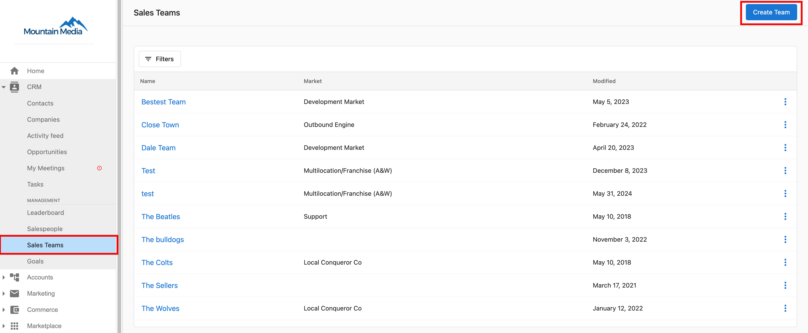
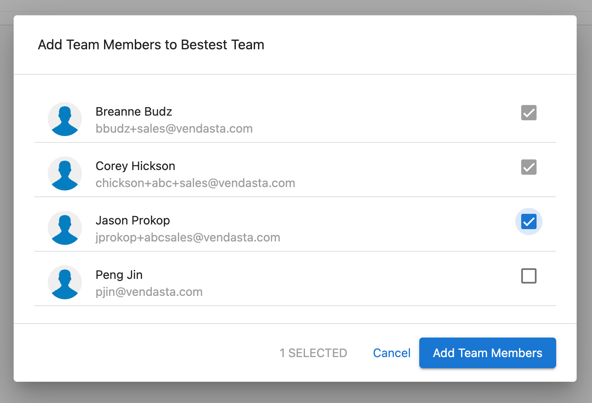

Organiza tus operaciones de venta de manera efectiva agrupando a tus vendedores en equipos. Los Sales Teams en el CRM de Vendasta te permiten gestionar mejor tu fuerza de ventas, hacer seguimiento del rendimiento del equipo, y crear estrategias de venta dirigidas. Esta estructura organizativa permite un asesoramiento más efectivo, la comparación de rendimiento, y la asignación de recursos en toda tu organización de ventas. Los equipos de venta proporcionan la base para la venta colaborativa y ayudan a garantizar estándares de rendimiento consistentes en diferentes segmentos de mercado o líneas de productos.

## ¿Por qué usar equipos de venta?

Los equipos de venta te permiten agrupar a los vendedores, hacer seguimiento del rendimiento por equipo, y enfocar el asesoramiento y la asignación de recursos donde se necesitan. Esto crea una responsabilidad clara en toda tu organización de ventas.

## Qué incluye

- Guía paso a paso para crear y gestionar equipos de venta
- Instrucciones para agregar vendedores a los equipos
- Capacidades de filtrado de equipos de venta para gerentes
- Organización de equipos basada en mercados

## Primeros pasos

1. **Verifica los requisitos de suscripción**
   - Asegúrate de que tu nivel de suscripción admita equipos de venta
   - Revisa las funciones de gestión de equipos disponibles

2. **Crea tu primer equipo de venta**
   - Planifica la estructura del equipo según territorios o especializaciones
   - Establece convenciones de nomenclatura para los equipos

3. **Agrega vendedores a los equipos**
   - Asigna a los vendedores existentes a los equipos apropiados
   - Configura los ajustes y permisos específicos del equipo

4. **Supervisa el rendimiento del equipo**
   - Usa el filtrado basado en equipos en los informes y paneles
   - Haz seguimiento de las métricas de rendimiento por equipo

## Creación y gestión de equipos

Para agrupar a tus vendedores en equipos, primero deberás crear los equipos de venta y luego agregar vendedores a los equipos. Este enfoque organizativo permite una gestión de ventas más efectiva a través de jerarquías de equipo estructuradas y seguimiento del rendimiento.

:::info
Los equipos de venta solo están disponibles en ciertos [niveles de suscripción](https://www.vendasta.com/pricing/).
:::

## Crear equipos de venta

Para crear un equipo de venta:

1. Ve a `Partner Center` → `CRM` → [Sales Teams](https://partners.vendasta.com/st/sales-teams).
2. Haz clic en `Create Team`.  
   
3. Ingresa un nombre para el equipo de venta, y selecciona el `Market`.
4. Haz clic en `Create`.

<a style={{fontSize: '16px', fontWeight: 'bold', color: '#ffffff', backgroundColor: '#33ace2', textDecoration: 'none', borderRadius: '5px', padding: '10px 30px 9px 30px', border: '1px solid #33ACE2', display: 'inline-block', textAlign: 'center'}} href="https://partners.vendasta.com/st/sales-teams" target="_blank" rel="noopener">Crear equipo de venta</a>

## Agregar vendedores a los equipos de venta

Para agregar vendedores a un equipo de venta:

1. Ve a `Partner Center` → `CRM` → [Sales Teams](https://partners.vendasta.com/st/sales-teams).
2. Encuentra el equipo de venta al que quieres agregar vendedores. Haz clic en el nombre del equipo → `Add Team Member`.  
   
3. Selecciona los vendedores que quieres agregar al equipo.
   :::info
   ¿No encuentras a un vendedor en la lista? Asegúrate de haber [creado un perfil de vendedor](/administration/my-account/my-team#create-a-salesperson) para ellos.
   :::
4. Haz clic en `Add Team Members`.  
   

Los vendedores que seleccionaste ahora estarán agrupados en el equipo de venta. Los gerentes de venta pueden filtrar a sus vendedores por equipo de venta (para su mercado) dentro de `Partner Center` → `CRM` → `Salespeople`.
