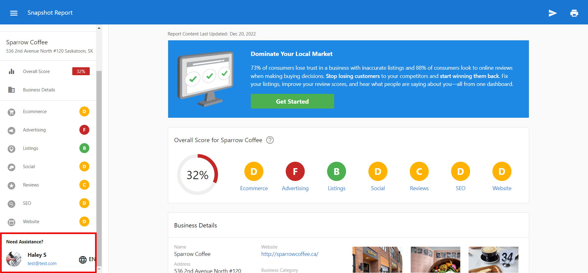
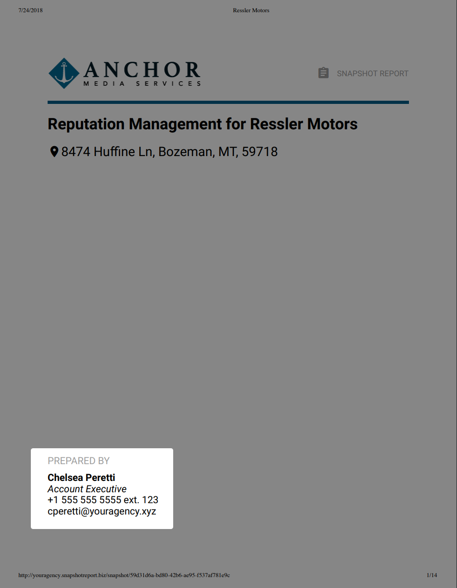
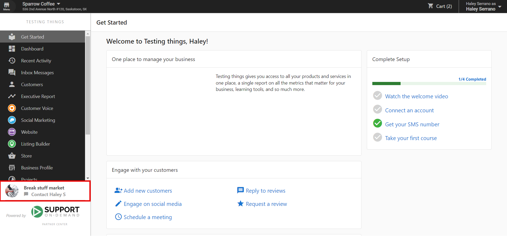
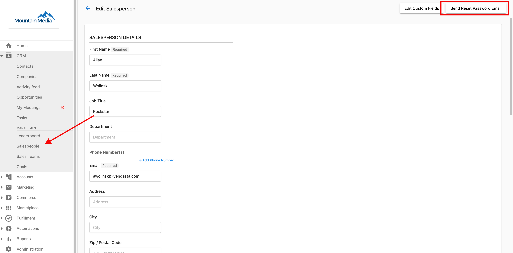
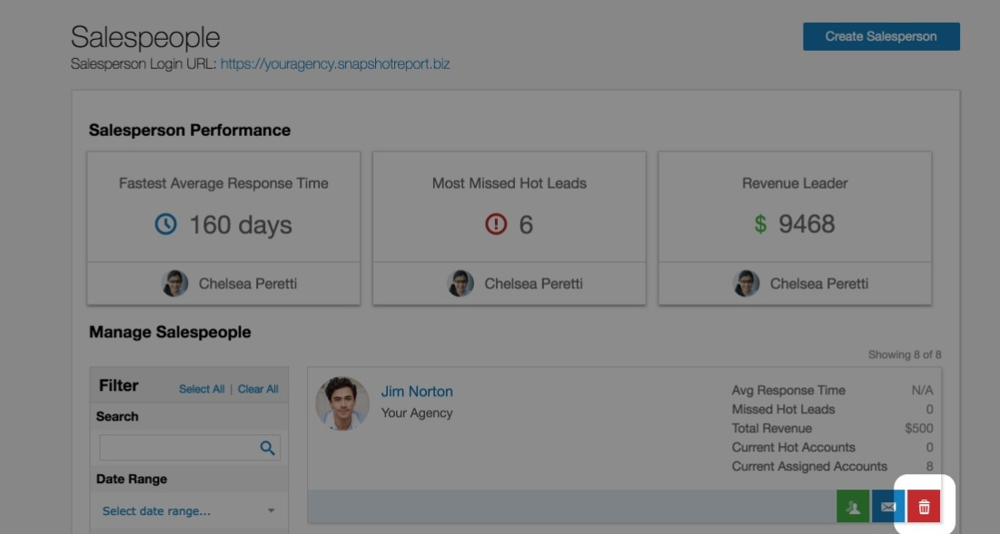

# Vendedores

En el CRM de Vendasta, los vendedores son los usuarios principales que interactúan con los clientes y gestionan cuentas. Este completo sistema de gestión cubre los perfiles de vendedores, las credenciales, y la información de contacto para garantizar relaciones efectivas con los clientes. Los perfiles de vendedores permiten experiencias personalizadas, conectan a los representantes con sus herramientas, y proporcionan la base para comunicaciones personalizadas con los clientes. La sección Salespeople sirve como el centro central para gestionar el acceso, los permisos, y la información de perfil de tu equipo de ventas.

## ¿Por qué usar la gestión de vendedores?

La gestión de vendedores elimina la carga administrativa mientras permite interacciones personalizadas con los clientes y una representación profesional en todos los puntos de contacto.

## Qué incluye

- **Gestión de contraseñas**: gestión de credenciales y procedimientos de restablecimiento de contraseña para el acceso del equipo de ventas
- **Gestión de información de contacto**: actualizaciones de perfil y datos de contacto para una representación profesional ante los clientes
- **Administración de vendedores**: procedimientos apropiados para agregar, editar, y eliminar vendedores del sistema
- **Capacidades de integración**: conecta a los vendedores con `Snapshot Reports`, `Business App`, y la personalización de campañas

## Primeros pasos

1. **Navega a la gestión de vendedores**
   - Ve a **Partner Center > Administration > My Team**
   - Accede a tu espacio de trabajo de gestión de equipo de ventas

2. **Edita un perfil de vendedor**
   - Encuentra al vendedor que quieres editar
   - Haz clic en el ícono **⋮** (tres puntos) junto a su nombre
   - Selecciona **Edit Salesperson**

3. **Configura los detalles del vendedor**
   - Edita el nombre y la información de contacto
   - Actualiza la descripción del puesto
   - Desplázate hacia abajo hasta la sección de foto del vendedor para agregar una foto
   - Configura los permisos del vendedor

4. **Conecta integraciones**
   - Vincula a los vendedores con sus `Snapshot Reports`
   - Configura las personalizaciones de `Business App`
   - Configura enlaces de reserva y herramientas de programación

## Editar la información de contacto del vendedor

El CRM te permite conectar a tus vendedores con sus `Snapshot Reports`, `Business App`, y los correos electrónicos de campaña agregando su información de contacto personal. Cuando se configura la información de contacto de un vendedor, sus datos aparecerán automáticamente en varios puntos de contacto con el cliente para una experiencia profesional y personalizada.

### Dónde aparece la información del vendedor

#### Barra lateral del Snapshot Report

Cuando se configura la información de contacto de un vendedor, sus datos aparecerán automáticamente en la barra lateral de cualquier `Snapshot Report` creado o actualizado por él.

#### Impresión del Snapshot Report

La información de contacto también aparecerá en la impresión del `Snapshot Report`.

#### Business App

La información de contacto de un vendedor aparecerá en `Business App` cuando un cliente vea la sección "Your Rep".

#### Correos electrónicos de campaña

También puedes configurar un remitente predeterminado para las campañas (la información de tu empresa, con tu logotipo, etc.). Alternativamente, puedes elegir que los correos electrónicos de campaña provengan de cada vendedor. Para hacerlo, el sistema extrae la información de contacto del vendedor.

### Cómo editar la información de contacto del vendedor

Para agregar o editar la información de contacto del vendedor:

1. Ve a **Partner Center > Administration > My Team**
2. Encuentra al vendedor que quieres editar
3. Haz clic en el ícono **⋮** (tres puntos) junto a su nombre
4. Selecciona **Edit Salesperson**
5. Actualiza su información de contacto, descripción del puesto, o desplázate hacia abajo para agregar una foto
6. Haz clic en **Save**

#### Campos de contacto disponibles

- **First Name**: el nombre del vendedor
- **Last Name**: el apellido del vendedor
- **Title**: su cargo (por ejemplo, Account Manager, Sales Rep)
- **Email**: su correo electrónico de trabajo
- **Phone**: su número de teléfono de trabajo
- **Photo**: una foto profesional (tamaño recomendado: 150x150 píxeles)

#### Buenas prácticas

- Asegúrate de que todos los vendedores tengan la información de contacto completa para una experiencia de cliente consistente
- Usa fotos profesionales que estén correctamente dimensionadas y recortadas
- Mantén la información de contacto actualizada, especialmente cuando ocurran cambios de personal
- Usa un formato consistente para los números de teléfono y los cargos en todo tu equipo

## Gestión de contraseñas

Mantener el acceso seguro para tu equipo de ventas es esencial para proteger la información del cliente y garantizar operaciones fluidas. La funcionalidad de restablecimiento de contraseña permite a los administradores ayudar a los vendedores a recuperar el acceso a sus cuentas cuando sea necesario.

### Cómo restablecer las contraseñas de los vendedores

Para restablecer la contraseña de un vendedor:

1. Ve a **Partner Center > Administration > My Team**
2. Encuentra al vendedor cuya contraseña necesita restablecerse
3. Haz clic en el ícono **⋮** (tres puntos) junto a su nombre
4. Selecciona **Edit Salesperson**
5. Haz clic en **Send Reset Password Email**

El vendedor recibirá un correo electrónico con instrucciones para crear una nueva contraseña. Este proceso garantiza la seguridad mientras permite una resolución rápida de los problemas de acceso.

## Eliminar vendedores

Cuando un vendedor deja tu organización o ya no necesita acceso al sistema, puedes eliminarlo del CRM. Este proceso requiere una consideración cuidadosa, ya que tiene efectos permanentes sobre las asignaciones de cuentas y el acceso a datos.

### Cómo eliminar vendedores

Para eliminar un vendedor:

1. Ve a **Partner Center > Administration > My Team**
2. Encuentra al vendedor que quieres eliminar
3. Haz clic en el ícono **⋮** (tres puntos) junto a su nombre
4. Selecciona **Delete** o **Remove**
5. Confirma la eliminación

:::caution
Todas las eliminaciones de vendedores son permanentes. Antes de hacer clic en `Delete`, asegúrate de que quieres eliminar a este vendedor. Cualquier cuenta que estuviera asignada al vendedor antes de la eliminación quedará sin asignar. Un administrador de `Partner Center` puede reasignar estas cuentas.
:::

## Por qué un vendedor no puede ver las empresas asignadas a él

Asignar a un vendedor a un registro de empresa no es suficiente para que pueda verlo. El acceso a las empresas en el CRM requiere que **coincidan dos cosas**:

1. El vendedor debe tener el rol o los permisos apropiados del CRM.
2. El mercado de la empresa debe ser uno al que el vendedor esté **asignado**.

Si alguna de estas dos capas no coincide, el vendedor no podrá ver la empresa, incluso si aparece como el vendedor asignado en el registro.

### Cómo verificar y corregir una discrepancia de mercado

**Verifica la asignación de mercado del vendedor:**

1. Ve a `Partner Center` → `Administration` → `My team`.
2. Haz clic en los tres puntos junto al vendedor y selecciona **Edit Salesperson**.
3. Revisa el campo **Markets** para ver a qué mercados está asignado.

**Verifica el mercado de la empresa:**

1. Abre el registro de la empresa en `Partner Center` → `CRM` → `Companies`.
2. Haz clic en **Edit** y ve a **Basic Information**.
3. Verifica el campo **Market**.

**Solución:** actualiza la asignación de mercado del vendedor o el mercado de la empresa para que coincidan. Una vez que coincidan, el vendedor podrá ver la empresa en su vista del CRM.

## Encontrar el ID de un vendedor

Cada vendedor tiene un ID único que puede ser necesario cuando trabajas con la API de Vendasta o al solucionar problemas con el soporte de Vendasta.

Para encontrar el ID de un vendedor:

1. Ve a **Partner Center > Administration > My Team**
2. Haz clic en **⋮** junto al nombre del vendedor
3. Selecciona **Edit Salesperson**
4. Observa la URL en tu navegador: el ID del vendedor aparece al final de la URL

## Agregar un enlace de reserva a los Snapshot Reports

Puedes agregar la URL de reserva de reuniones de un vendedor a sus Snapshot Reports para que los prospectos puedan programar tiempo directamente desde el informe.

:::note
El vendedor debe tener configurado un programador de reuniones (como Calendly o Microsoft Bookings) antes de agregar este enlace.
:::

1. Ve a **Partner Center > Administration > My Team**
2. Haz clic en **⋮** junto al nombre del vendedor
3. Selecciona **Edit Salesperson**
4. Ingresa la URL de reserva en el campo **Book a Meeting**
5. Haz clic en **Save**

El enlace de reserva aparecerá en cualquier Snapshot Report creado o regenerado después de guardar. No aparecerá en los informes generados previamente.

## Acceso del vendedor al soporte de Vendasta

Los vendedores no pueden contactar directamente al soporte de Vendasta. Si un vendedor necesita escalar un problema, debe pedirle a un administrador de Partner Center que contacte al soporte en su nombre.

## Administración y gestión

Gestiona a tus vendedores yendo a **Partner Center > Administration > My Team**. Esta interfaz de gestión centralizada proporciona todas las herramientas necesarias para mantener la información de los vendedores precisa y garantizar el acceso adecuado al sistema en toda tu organización.

## Preguntas frecuentes

¿Qué pasa con las cuentas cuando elimino un vendedor?

Cuando eliminas a un vendedor, cualquier cuenta que le estuviera asignada quedará sin asignar. Un administrador de `Partner Center` puede reasignar estas cuentas a otros vendedores. La eliminación es permanente y no se puede deshacer.

¿Cómo agrego un nuevo vendedor al sistema?

Para agregar un nuevo vendedor, ve a **Partner Center > Administration > My Team**, luego haz clic en **Add Team Member**. Completa su información de contacto y configura los permisos apropiados para su rol.

¿Los vendedores pueden restablecer sus propias contraseñas?

Los vendedores pueden usar la funcionalidad estándar de restablecimiento de contraseña de la página de inicio de sesión. Sin embargo, los administradores también pueden restablecer las contraseñas de los vendedores a través de **Partner Center > Administration > My Team** cuando se necesite asistencia adicional.

¿Dónde aparecerá la foto de mi vendedor?

Las fotos profesionales que cargues para los vendedores aparecerán en los `Snapshot Reports` (tanto en la barra lateral como en la impresión), las tarjetas de contacto de `Business App`, y los correos electrónicos de campaña cuando el vendedor esté configurado como remitente.

¿Cuál es el tamaño recomendado para las fotos de los vendedores?

Recomendamos usar fotos profesionales con un tamaño de 150x150 píxeles. Las fotos deben estar correctamente recortadas y presentadas de forma profesional para mantener una experiencia de cliente consistente.

¿Puedo editar la información de vendedores de forma masiva?

Actualmente, la información de los vendedores debe editarse individualmente a través de **Partner Center > Administration > My Team**. Se puede acceder al perfil de cada vendedor haciendo clic en el ícono **⋮** (tres puntos) junto a su nombre y seleccionando **Edit Salesperson**.

¿Cómo agrego un enlace de reserva al perfil de Business App de mi vendedor?

Los enlaces de reserva para `Business App` se configuran en el perfil del vendedor bajo el campo "Book a meeting link". Para obtener instrucciones detalladas, consulta el artículo [Agregar un enlace de reserva en la tarjeta de contacto de Business App](/administration/platform-settings/customize-business-app/branding-settings#how-do-i-customize-the-contact-us-card).

