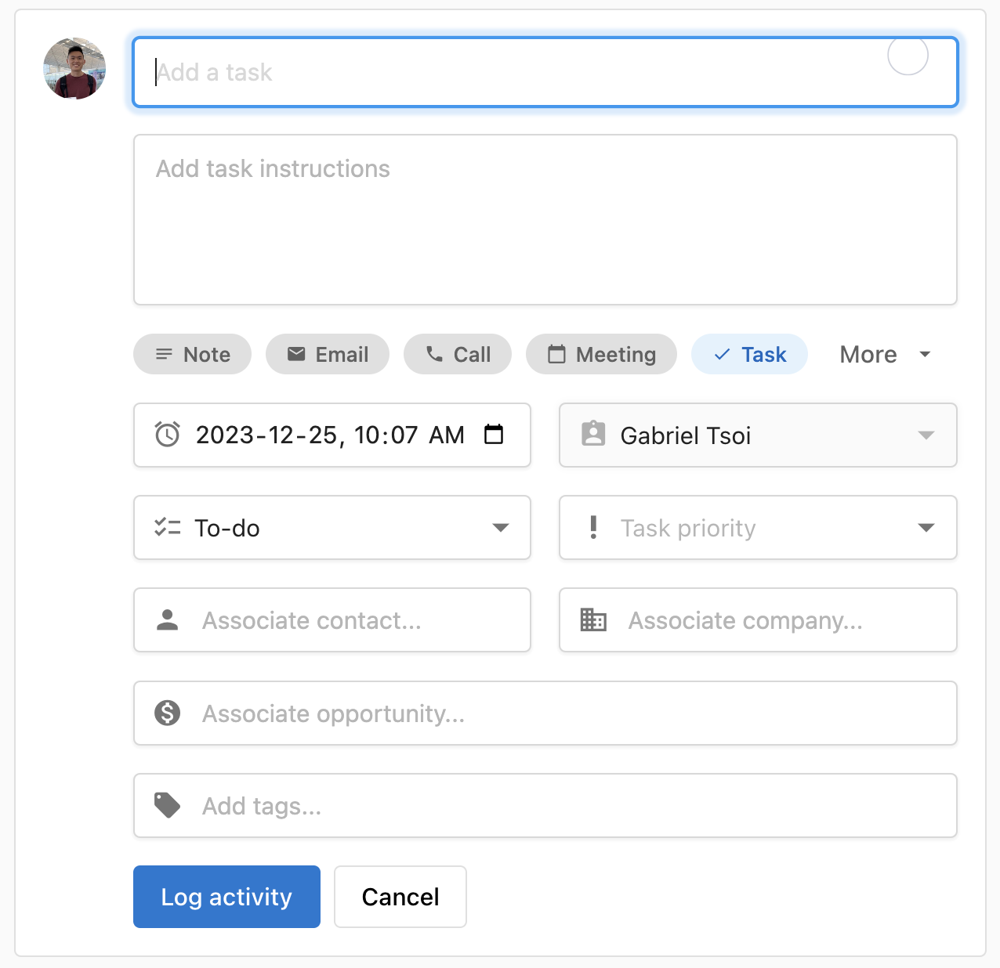
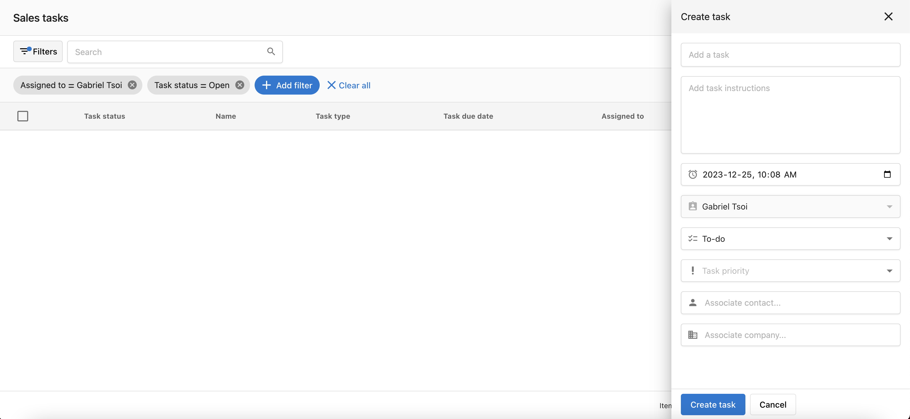

Gestionar tareas es una parte esencial de las actividades de venta en el CRM de Vendasta. Este completo sistema de gestión de tareas te ayuda a crear, hacer seguimiento, y completar actividades de venta para garantizar que nada se pierda. Las tareas se pueden crear desde múltiples fuentes, incluidos los registros del CRM, las oportunidades, y la entrada manual, lo que brinda flexibilidad en cómo organizas tu flujo de trabajo de ventas. El sistema Tasks se integra con los datos de tu CRM para proporcionar una gestión de tareas consciente del contexto que impulsa un seguimiento consistente y mejores resultados de venta.

## ¿Por qué usar tareas?

Transforma tu gestión de actividades de venta con un seguimiento de tareas organizado que garantiza un seguimiento consistente y evita las oportunidades perdidas. Las tareas eliminan el riesgo de actividades olvidadas mientras proporcionan una responsabilidad clara y un seguimiento del progreso en todo tu proceso de ventas.

## Qué incluye

- Múltiples métodos de creación de tareas desde registros del CRM, oportunidades, y entrada manual
- **Función de flujo de trabajo de tareas** para la finalización guiada de múltiples tareas en secuencia
- Integración con los perfiles de contactos y empresas
- Capacidades de creación automatizada de tareas
- Seguimiento del progreso y supervisión del estado de finalización

## Primeros pasos

1. **Navega a las tareas**
   - Accede a las tareas a través de varias secciones del CRM
   - Usa la creación de tareas desde registros de contactos o empresas

2. **Crea tu primera tarea**
   - Ve a `CRM` → `Contacts` o `CRM` → `Companies`
   - Haz clic en un registro específico para crear tareas asociadas

3. **Usa los flujos de trabajo de tareas para una finalización eficiente**
   - Selecciona varias tareas e inicia un flujo de trabajo guiado
   - Deja que el sistema te navegue por cada perfil asociado
   - Completa, reprograma, u omite tareas usando la barra de navegación superior

4. **Gestiona y completa tareas**
   - Haz seguimiento del progreso y el estado de finalización de las tareas
   - Usa las tareas para mantener actividades de venta consistentes

## Métodos de creación de tareas

Puedes crear tareas en Vendasta de varias formas diferentes:

- **Desde registros del CRM**: crea tareas directamente desde los perfiles de contactos o empresas
- **Desde oportunidades**: genera tareas asociadas con oportunidades específicas
- **Creación manual**: agrega tareas independientes para actividades de venta generales

## Crear una tarea de venta

Puedes crear tareas en Vendasta de varias formas diferentes:

### Crear tareas desde un registro del CRM

Navega a tu registro:

1. **Contacto:** en `Partner Center`, ve a `CRM` → `Contacts`
2. **Empresa:** en `Partner Center`, ve a `CRM` → `Companies`

Una vez que estés en la tabla del registro:

1. Haz clic en el nombre del registro
2. Haz clic en `Tasks` en el registrador de actividad en el medio
3. En el registrador de actividad, ingresa los detalles de tu tarea
4. Haz clic en `Log activity`

### Crear tareas desde la tabla de tareas

Navega a `Partner Center` → `CRM` → `Tasks`

1. Haz clic en `Create task`
2. Completa los detalles de la tarea
3. Haz clic en `Create`

## Flujo de trabajo de tareas: finalización guiada de tareas

La función de flujo de trabajo de tareas proporciona una experiencia guiada para completar múltiples tareas de manera eficiente. Esta herramienta te navega automáticamente por el perfil de contacto o empresa asociado a cada tarea, permitiéndote completar, reprogramar, u omitir tareas en un flujo de trabajo optimizado.

### Cómo iniciar un flujo de trabajo de tareas

1. **Navega a la página Tasks**
   - Ve a `Partner Center` → `CRM` → `Tasks`
   - Consulta tu lista de tareas pendientes

2. **Selecciona las tareas a completar**
   - Elige una o varias tareas en las que quieras trabajar
   - Usa las casillas de verificación para seleccionar las tareas que quieres incluir en el flujo de trabajo

3. **Inicia el flujo de trabajo**
   - Haz clic en el botón `Actions`
   - Selecciona `Start Task` en el menú desplegable
   - El sistema comenzará el proceso de flujo de trabajo guiado

### Experiencia de navegación del flujo de trabajo

Una vez que inicias un flujo de trabajo de tareas, el sistema te guía automáticamente a través de cada tarea seleccionada:

**Navegación automática:**
- El sistema navega a la página de perfil del contacto o empresa asociado a cada tarea
- Las tareas se procesan en el orden en que las seleccionaste
- El contexto sobre la tarea aparece en la parte superior de cada página de perfil

**Controles de tareas de la barra superior:**
Durante el flujo de trabajo, verás una barra de navegación superior con opciones para cada tarea:
- `Complete`: marca la tarea como finalizada y pasa a la siguiente
- `Reschedule`: establece una nueva fecha de vencimiento y pasa a la siguiente tarea
- `Skip`: omite esta tarea por ahora y pasa a la siguiente

**Seguimiento del progreso:**
- Consulta en qué tarea de la secuencia te encuentras actualmente
- Haz seguimiento de cuántas tareas quedan en el flujo de trabajo
- El sistema pasa automáticamente a la siguiente tarea después de cada acción

### Beneficios de usar los flujos de trabajo de tareas

**Mayor eficiencia:**
- No es necesario navegar manualmente entre las diferentes páginas de contacto/empresa
- El proceso optimizado reduce el tiempo dedicado a cambiar entre tareas
- El contexto se carga automáticamente para cada tarea

**Mejores tasas de finalización:**
- La experiencia guiada reduce la probabilidad de olvidar tareas
- El procesamiento por lotes facilita completar varias tareas
- El seguimiento claro del progreso mantiene el impulso

**Mejor organización:**
- Procesa tareas relacionadas juntas para un mejor contexto
- Mantén el enfoque en la finalización de tareas sin distracciones
- Enfoque sistemático para la gestión diaria de tareas

### Buenas prácticas para los flujos de trabajo de tareas

**Estrategia de selección de tareas:**
- Agrupa tareas relacionadas (por ejemplo, todas las llamadas de seguimiento)
- Prioriza las tareas urgentes o de alto impacto primero
- Considera agrupar las tareas por contacto/empresa para un mejor contexto

**Preparación del flujo de trabajo:**
- Revisa los detalles de la tarea antes de iniciar el flujo de trabajo
- Asegúrate de tener la información o los materiales necesarios listos
- Bloquea tiempo ininterrumpido para completar el flujo de trabajo

**Durante la ejecución del flujo de trabajo:**
- Usa la opción `Complete` cuando las tareas estén completamente finalizadas
- Usa `Reschedule` para las tareas que necesiten más tiempo o información
- Usa `Skip` con moderación, solo cuando las tareas ya no sean relevantes

### Consejos para los flujos de trabajo de tareas

- **Comienza con lotes pequeños**: empieza con 3 a 5 tareas para familiarizarte con el proceso de flujo de trabajo
- **Usa el contexto de manera efectiva**: aprovecha tener disponible el perfil completo del contacto/empresa durante la finalización de la tarea
- **Actualiza las notas de la tarea**: agrega información relevante mientras completas las tareas para mantener buenos registros
- **Planifica tu flujo de trabajo**: revisa y organiza tus tareas antes de iniciar el flujo de trabajo para lograr la máxima eficiencia

## Beneficios de la gestión de tareas

Las tareas de venta te ayudan a hacer seguimiento de tus actividades de venta en el CRM, garantizando que los seguimientos y actividades importantes se completen a tiempo. Este enfoque sistemático para la gestión de tareas mejora la consistencia de las ventas y ayuda a mantener el impulso a lo largo de tu proceso de ventas.

## Filtros de tareas predeterminados

Cuando abres la página Tasks, se carga con dos filtros aplicados de forma predeterminada:

- **Assigned to**: el usuario actualmente conectado
- **Status**: Open

Esto significa que solo verás tus propias tareas abiertas de forma predeterminada. Si tú o un miembro del equipo no pueden encontrar una tarea, el primer paso es verificar si estos filtros predeterminados la están ocultando. Haz clic en un filtro activo para borrarlo o cambiarlo.

## Vistas guardadas personalizadas

Puedes guardar tus propias combinaciones de filtros como vistas con nombre para no tener que volver a aplicarlas cada vez.

### Cómo crear una vista personalizada

1. Ve a `Partner Center` → `CRM` → `Tasks`.
2. Aplica los filtros que quieres guardar, por ejemplo, todas las tareas abiertas independientemente de a quién estén asignadas.
3. Haz clic en `Edit views`.
4. Ingresa un nombre para la vista y guárdala.

### Cómo usar una vista guardada

Las vistas guardadas aparecen como pestañas con nombre en la parte superior de la página Tasks. Haz clic en cualquier pestaña para cargar instantáneamente los filtros de esa vista.

:::note
Las vistas personalizadas son por usuario. Cada miembro del equipo guarda y gestiona sus propias vistas. Las vistas que creas no son visibles para otros usuarios.
:::
