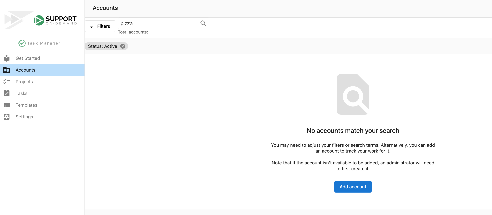
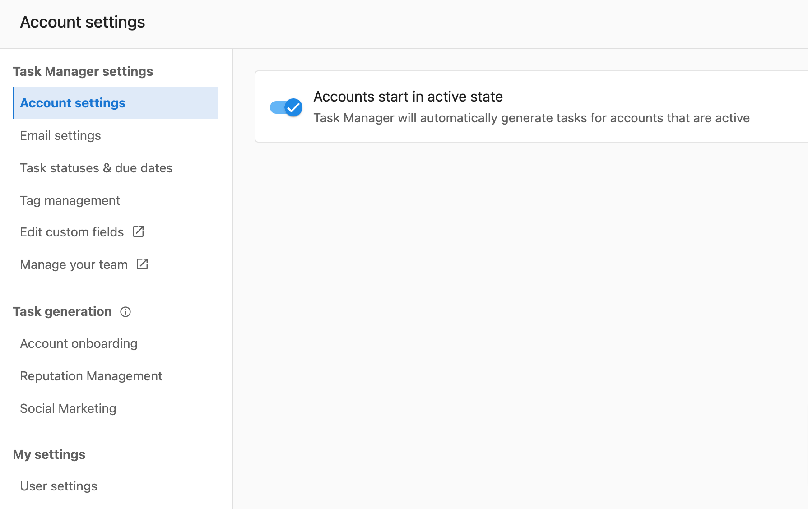
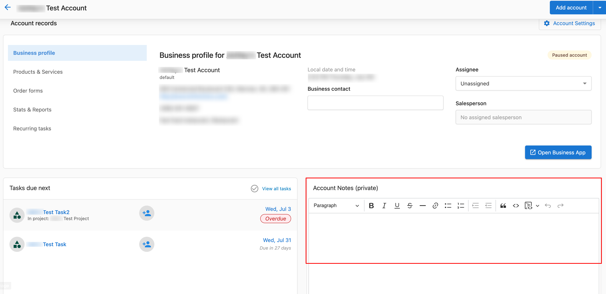
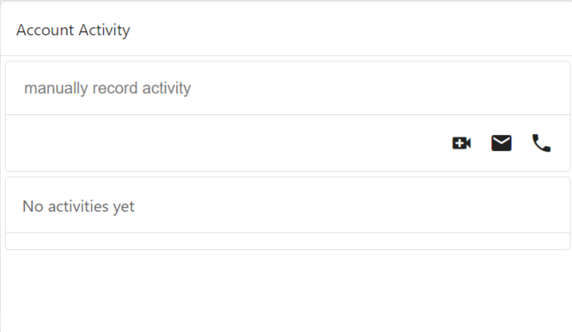
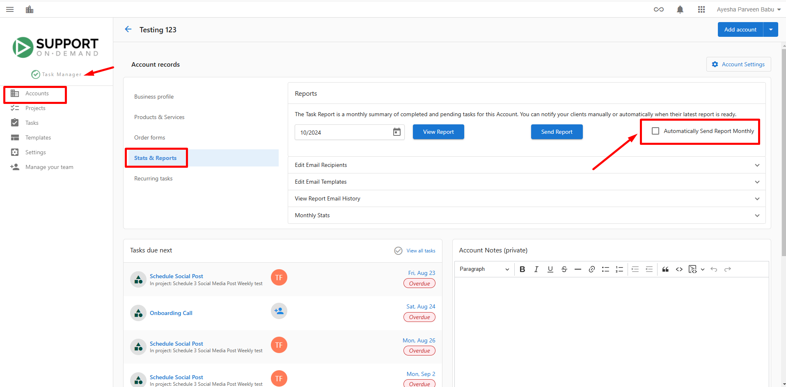

## ¿Qué es la gestión de cuentas en Task Manager?

La gestión de cuentas en Task Manager es el centro principal para organizar y hacer seguimiento de todas las cuentas de clientes para las que ofreces servicios de cumplimiento. Cada cuenta representa a un cliente y contiene toda la información esencial necesaria para gestionar sus proyectos, tareas y relaciones continuas.

## ¿Por qué es importante la gestión de cuentas?

Una gestión de cuentas efectiva en Task Manager te permite:

- Hacer seguimiento de todos los clientes con los que trabajas en un solo lugar centralizado
- Supervisar los estados de las cuentas para saber cuáles están activas, pausadas o desactivadas
- Asignar miembros del equipo como puntos de contacto principales para cada cuenta
- Registrar interacciones importantes con los clientes y mantener notas detalladas de la cuenta
- Generar informes mensuales automáticos y gestionar las preferencias de generación de informes
- Filtrar y organizar las cuentas según varios criterios para una mejor gestión del flujo de trabajo

## Qué incluye la gestión de cuentas

El sistema de gestión de cuentas de Task Manager incluye:

- **Account Status Management**: controla si las cuentas están activas, pausadas o desactivadas
- **Account Assignee System**: designa puntos de contacto principales para cada cuenta
- **Account Notes**: notas privadas visibles solo para tu equipo con detalles importantes de la cuenta
- **Client Interaction Logging**: registra llamadas telefónicas, correos electrónicos y reuniones por video
- **Automatic Report Settings**: configura las preferencias de entrega de informes mensuales
- **Account Activity Tracking**: consulta el historial completo de todas las interacciones de la cuenta

## Cómo agregar cuentas a Task Manager

Si notas que una cuenta no se encuentra en Task Manager, probablemente sea porque aún no se ha realizado ninguna acción en la cuenta. Una vez que se realiza una acción, como crear una tarea o proyecto, una cuenta se creará automáticamente en Task Manager.

También puedes crear manualmente una cuenta en Task Manager:

1. Ve a `Fulfillment` → `Task Manager` → `Accounts`
2. Si tu búsqueda no arroja resultados, haz clic en `Add Account`

:::info
De forma predeterminada, las cuentas nuevas se agregan en estado activo. Puedes cambiar este ajuste predeterminado en `Settings` → `Account settings`.
:::

## Gestión del estado de la cuenta

### Comprender los estados de la cuenta

Hay tres tipos de estados de cuenta en Task Manager:

- **Active**: una cuenta con la que estás trabajando actualmente. Los tipos de tarea seleccionados se generarán automáticamente cuando haya trabajo relevante.
- **Paused**: una cuenta con la que has dejado de trabajar temporalmente o para la que no quieres que se generen tareas automáticamente por ahora.
- **Deactivated**: una cuenta que has desactivado temporalmente por motivos de negocio. Es posible que quieras reactivarla en algún momento.

### Cómo cambiar el estado de la cuenta

Puedes cambiar el estado de una cuenta siguiendo estos pasos:

1. Ve a `Fulfillment` → `Task Manager` → `Accounts`
2. Busca la cuenta que necesitas
   - Si no ves la cuenta, es posible que debas revisar los filtros de cuenta en caso de que el filtro predeterminado esté configurado como Status: Active
3. Cambia el estado de la cuenta haciendo clic en el menú (3 puntos) a la derecha, junto a la columna de estado
4. Cambia el estado seleccionando `Activate account`, `Pause account` o `Deactivate account`

## Gestión del asignado de la cuenta

### Por qué son importantes los asignados de la cuenta

Todas las cuentas en Task Manager tienen un asignado. Los asignados de cuenta se designan comúnmente para determinar quién es el punto de contacto principal o quién gestiona el cumplimiento de la cuenta.

El campo de asignado de la cuenta se encarga de:

- Cuando un cliente hace una pregunta a través de Business App, se notifica al asignado de la cuenta
- Un indicador visual para otros agentes de quién es el punto de contacto principal
- Hacer seguimiento de cuántas cuentas gestiona un asignado a la vez para equilibrar la carga de trabajo del equipo

### Cómo asignar una cuenta

1. Ve a `Fulfillment` → `Task Manager` → `Accounts`
2. Busca la cuenta
   - Si no ves la cuenta, es posible que debas quitarte de los filtros de cuenta
3. Haz clic en el nombre en la columna `Assignee`
4. Selecciona el nuevo asignado

## Gestión de notas de la cuenta

### Por qué son importantes las notas de la cuenta

Las notas de la cuenta te ayudan a hacer seguimiento de detalles importantes sobre tus cuentas. Es posible que quieras usarlas para:

- Registrar detalles del cliente que no están cubiertos por su perfil de negocio
  - *Por ejemplo, qué pasatiempos tiene y qué solicitudes específicas hace sobre el trabajo que estás realizando*
- Destacar notas importantes que no se deben pasar por alto
  - *Por ejemplo, tienes un cliente que solo publica en redes sociales sobre un pequeño número de temas*
- Compartir comunicaciones importantes con otros miembros del equipo que trabajan en la cuenta
  - *Por ejemplo, un cliente está pasando por un momento difícil, así que usa discreción adicional al hablar con él sobre un tema*

Las notas de la cuenta aparecen en la parte superior de todas las tareas, para asegurarse de que no se pasen por alto. Estas notas solo son visibles para ti y tu equipo, así que no tienes que preocuparte de que los clientes vean lo que has escrito.

### Cómo usar las notas de la cuenta

1. Ve a `Fulfillment` → `Task Manager` → `Accounts`
2. Haz clic en el nombre de la cuenta y verás `Account notes` cerca de la parte superior de la página

3. Después de editar tus notas, haz clic en `Save`

:::info
Para que las notas sean visibles para tu cliente, deben crearse a nivel de proyecto y tarea.
:::

## Registro de interacciones con clientes

### Por qué es importante registrar las interacciones con clientes

Cuando tu equipo ha interactuado con un cliente, puede ser beneficioso registrar cualquier detalle importante que valga la pena anotar, ya sea por correo electrónico, video o teléfono. Esto facilita que cualquier persona del equipo revise las acciones recientes o vea un historial de interacciones anteriores.

### Cómo registrar la actividad de la cuenta

1. Ve a `Fulfillment` → `Task Manager` → `Accounts`
2. Haz clic en el `Account name`
   - Si no ves la cuenta, es posible que debas revisar los filtros de la página Accounts
3. Ingresa los detalles sobre la actividad en el campo `Account Activity` haciendo clic en `manually record activity`
   
   

4. Elige el tipo de actividad y regístrala seleccionando cualquiera de las siguientes opciones:
   -  - tuvo una llamada de video
   -  - envió un correo electrónico
   -  - tuvo una llamada telefónica

## Gestión de informes mensuales automáticos

### Cómo desactivar los informes mensuales automáticos

Si prefieres no enviar informes mensuales automáticos para una cuenta específica:

1. Ve a `Fulfillment` → `Task Manager`
2. Ve a la pestaña `Accounts` y elige la cuenta que quieres actualizar
3. Una vez en la cuenta, haz clic en la pestaña `Stats & Reports`
4. Ubica el interruptor llamado `Automatically Send Report Monthly` y desactívalo

Después de completar estos pasos, ya no se enviarán informes mensuales automáticos para la cuenta seleccionada.

## Preguntas frecuentes

¿Por qué no veo una cuenta en Task Manager?

Si una cuenta no se encuentra en Task Manager, probablemente sea porque aún no se ha realizado ninguna acción en la cuenta. Una vez que se realiza una acción, como crear una tarea o proyecto, una cuenta se creará automáticamente en Task Manager. También puedes agregar cuentas manualmente.

¿Cuál es la diferencia entre cuentas pausadas y desactivadas?

Las cuentas pausadas se detienen temporalmente o no quieres que se generen tareas automáticamente para ellas. Las cuentas desactivadas están desactivadas temporalmente por motivos de negocio, pero es posible que quieras reactivarlas en algún momento.

¿Los clientes pueden ver mis notas de cuenta?

No, las notas de la cuenta solo son visibles para ti y tu equipo. Los clientes no pueden ver lo que has escrito en las notas de la cuenta. Si quieres que las notas sean visibles para los clientes, debes agregarlas a nivel de proyecto y tarea.

¿Qué sucede cuando asigno a alguien a una cuenta?

El asignado de la cuenta se convierte en el punto de contacto principal y recibirá una notificación cuando un cliente haga una pregunta a través de Business App. También sirve como un indicador visual para otros miembros del equipo de quién gestiona la cuenta.

¿Cómo cambio el estado predeterminado de la cuenta para las cuentas nuevas?

Puedes cambiar el estado predeterminado de la cuenta en `Settings` → `Account settings`. De forma predeterminada, las cuentas se agregan como activas.

¿Qué tipos de interacciones con clientes puedo registrar?

Actualmente puedes registrar tres tipos de interacciones: llamadas de video, correos electrónicos y llamadas telefónicas. Cada tipo de interacción tiene su propio ícono y sistema de seguimiento.

¿Puedo filtrar cuentas por asignado?

Sí, puedes usar filtros para encontrar todas las cuentas asociadas con un asignado específico. Esto ayuda con la gestión de la carga de trabajo y la organización del equipo.

¿Dónde más aparecen las notas de la cuenta, además de en la página de la cuenta?

Las notas de la cuenta aparecen en la parte superior de todas las tareas relacionadas con esa cuenta, para asegurarse de que la información importante no se pase por alto durante la ejecución de las tareas.

¿Puedo desactivar los informes automáticos para todas las cuentas a la vez?

La documentación muestra cómo desactivar los informes automáticos por cuenta individual. Deberás ajustar este ajuste de forma individual para cada cuenta que quieras modificar.

¿Qué información debo incluir en las notas de la cuenta?

Incluye detalles del cliente que no están cubiertos por su perfil de negocio, notas importantes que no se deben pasar por alto, preferencias específicas del cliente y comunicaciones importantes que otros miembros del equipo deban conocer.

