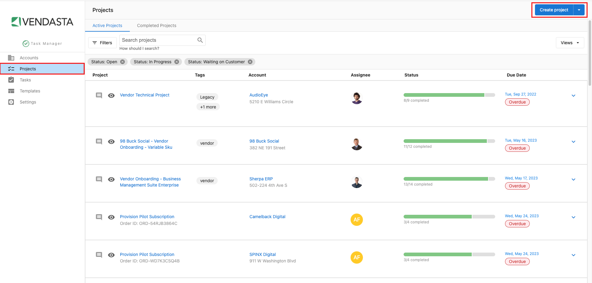
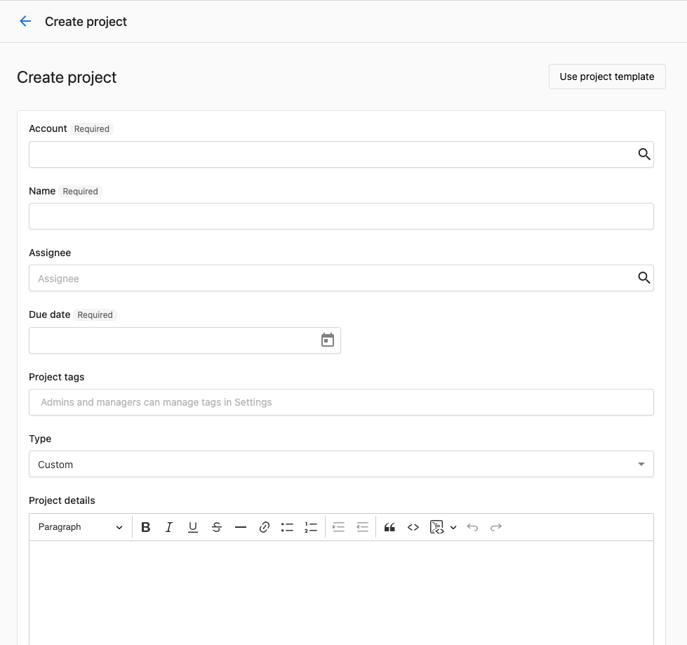
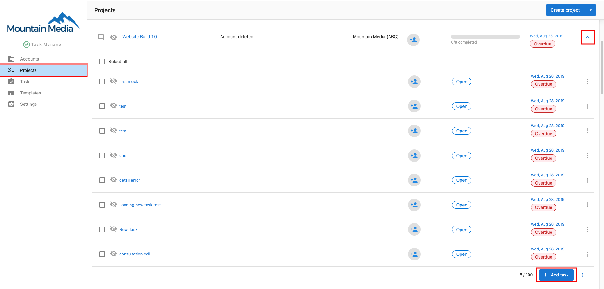
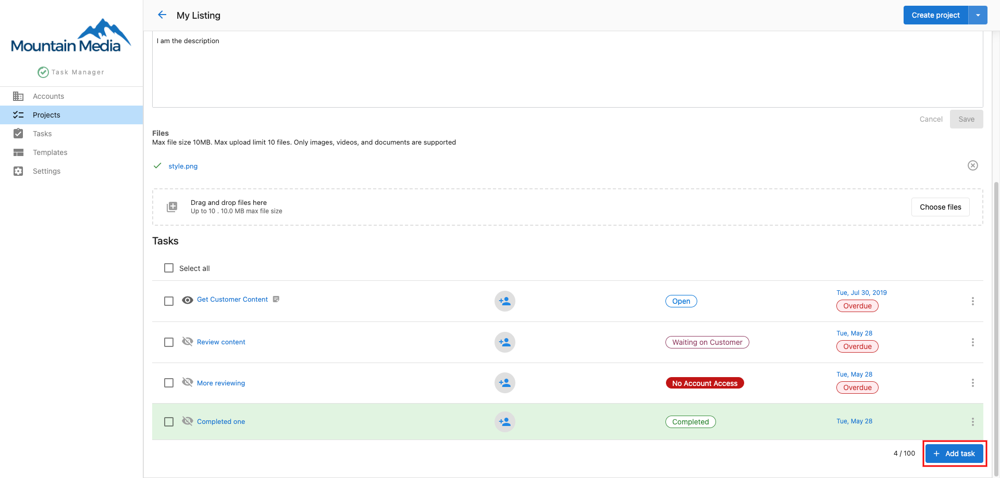
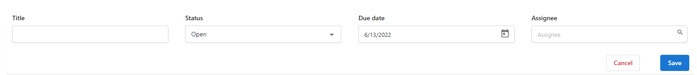

## ¿Qué es la creación y gestión de proyectos?

La creación y gestión de proyectos en Task Manager consiste en configurar espacios de trabajo organizados para los entregables de los clientes, agregar tareas específicas y coordinar a los miembros del equipo para completar el trabajo según lo previsto.

## ¿Por qué es importante la gestión de proyectos?

Una gestión de proyectos efectiva te ayuda a entregar resultados consistentes al organizar el trabajo en estructuras claras, asignar responsabilidades y hacer seguimiento del progreso hacia los plazos.

## Qué incluye la creación y gestión de proyectos

### Configuración del proyecto
- Asociación de cuenta para la organización de clientes
- Selección del tipo de proyecto (Custom o Social Calendar)
- Asignación de miembros del equipo y permisos
- Configuración de plazos y cronogramas

### Gestión de tareas
- Creación de tareas individuales con descripciones detalladas
- Asignación de miembros del equipo para tareas específicas
- Configuración de plazos y gestión de dependencias
- Seguimiento del progreso y actualizaciones de estado

### Colaboración en equipo
- Acceso y edición de proyectos por varios usuarios
- Asignación de tareas y seguimiento de responsabilidades
- Herramientas de comunicación y actualizaciones de progreso

## Cómo crear proyectos en Task Manager

### Paso 1: inicia un proyecto nuevo

1. Ve a **Task Manager** desde el menú de navegación principal
2. Haz clic en la pestaña **Projects** para acceder a tu panel de proyectos
3. Haz clic en **Create Project** para abrir el formulario de creación de proyectos

### Paso 2: configura los datos básicos del proyecto

1. **Selecciona la Account** (obligatorio): elige la cuenta de cliente a la que pertenece este proyecto
2. **Ingresa el nombre del proyecto** (obligatorio): usa un nombre descriptivo que identifique claramente el alcance del proyecto
3. **Elige el tipo de proyecto**:
   - **Custom**: para la gestión de proyectos general y la mayoría de los tipos de trabajo con clientes
   - **Social Calendar**: para proyectos de creación y publicación de contenido en redes sociales

### Paso 3: define los detalles del proyecto

1. **Elige un Assignee** (opcional): selecciona al miembro principal del equipo responsable de la supervisión del proyecto
2. **Establece la Due Date**: define cuándo debe completarse todo el proyecto
3. **Configura las opciones específicas del proyecto**:

#### Para proyectos Social Calendar:
- **Content Call**: programa una llamada para discutir la estrategia y los requisitos de contenido
- **Social Calendar Generation**: genera y programa automáticamente tareas de publicaciones sociales dentro del proyecto
- **Client Review**: requiere la aprobación del cliente antes de que el contenido se publique

#### Valores predeterminados de Social Calendar Generation

Cuando usas **Social Calendar Generation** en un proyecto Social Calendar, estos valores predeterminados están preconfigurados:

- **Modelo de IA:** **Gemini Flash Latest** (recomendado)
- **Tipo de programación:** **On a Schedule**
- **Frecuencia:** **Weekly**
- **Día de la semana:** **Monday**
- **Hora:** **9:00 AM**
- **Zona horaria:** se completa automáticamente según la zona horaria de la pyme en Business App
- **Fecha de inicio:** fecha actual
- **Fecha de finalización:** **No end date**
- **Disponibilidad:** web y móvil
- **Se aplica a:** **Social Media Manager**
:::info Configurar Client Review
**Client Review** solo está disponible para proyectos Social Calendar y requiere que **Schedule Social Posts** esté seleccionado primero. Una vez que ambos están activados y se crea el proyecto, aparece una tarea de **Client Review** en la parte inferior del proyecto. Para enviar contenido a revisión del cliente:

1. Abre la tarea **Client Review** en el proyecto
2. Haz clic en **Generate new preview**
3. Haz clic en **Send for review**

Los clientes reciben una notificación y pueden aprobar o solicitar cambios antes de que las publicaciones se activen. Si no ves la opción Client Review, confirma que Schedule Social Posts esté marcado.
:::

### Paso 4: completa la creación del proyecto

1. Agrega las tareas iniciales que quieras si deseas comenzar con entregables específicos
2. Haz clic en **Create project** para guardar tu nuevo proyecto

## Cómo agregar tareas a los proyectos

### Paso 1: accede a tu proyecto

1. Ve a **Task Manager** desde el menú de navegación principal
2. Haz clic en cualquier proyecto que se muestre en tu panel para abrirlo
3. Haz clic en el botón desplegable **Add Tasks** para comenzar a crear tareas nuevas

### Paso 2: crea tareas individuales

1. Ingresa un nombre descriptivo para tu tarea en el campo **Task Name**

2. Completa los detalles completos de la tarea en el formulario:

   - **Name**: agrega un nombre claro y descriptivo que explique qué se debe lograr
   - **Description**: incluye información detallada sobre los requisitos, entregables y cualquier instrucción especial
   - **Assignee**: selecciona al o los miembros del equipo responsables de completar esta tarea específica
   - **Due Date**: establece un plazo realista para completar la tarea que se ajuste al cronograma de tu proyecto
   - **Dependency**: opcionalmente, selecciona otras tareas que deben completarse antes de que esta tarea pueda comenzar

3. Haz clic en **Add** para guardar la tarea en tu proyecto

:::warning Las actualizaciones masivas de plazos de proyecto no son compatibles
La página Projects no admite actualizaciones masivas de plazos. Si necesitas cambiar el plazo de varios proyectos, cada uno debe actualizarse individualmente. Ten en cuenta que los plazos de las **subtareas** dentro de un solo proyecto se pueden editar de forma masiva usando la función de edición masiva en la vista Tasks.
:::

### Paso 3: organiza y gestiona las tareas

Después de crear tareas, puedes:

- **Hacer seguimiento del progreso**: supervisa la finalización de tareas a medida que los miembros del equipo actualizan su estado
- **Editar detalles**: modifica las descripciones, plazos o asignaciones de tareas si los requisitos cambian
- **Reasignar trabajo**: mueve tareas entre miembros del equipo según su disponibilidad o experiencia
- **Supervisar plazos**: usa tu panel para identificar plazos próximos y posibles retrasos
- **Gestionar dependencias**: asegúrate de que las tareas previas se completen antes de que comience el trabajo dependiente

## Gestión de flujos de trabajo de proyectos

### Organización del proyecto
- Agrupa lógicamente las tareas relacionadas dentro de los proyectos
- Usa convenciones de nomenclatura claras para una identificación fácil
- Establece cronogramas realistas que consideren las dependencias y la capacidad del equipo

### Coordinación del equipo
- Asigna tareas según las habilidades y disponibilidad de los miembros del equipo
- Comunica los cambios y actualizaciones con prontitud
- Revisa el progreso regularmente para identificar posibles problemas a tiempo

### Seguimiento del progreso
- Supervisa las tasas de finalización de tareas individuales
- Identifica cuellos de botella o retrasos antes de que afecten los plazos
- Ajusta las asignaciones o cronogramas cuando sea necesario para mantener el impulso del proyecto

## Buenas prácticas para la gestión de proyectos

### Fase de planificación
- Desglosa los entregables grandes en tareas específicas y accionables
- Involucra a los miembros del equipo en la estimación de cronogramas para una programación realista
- Considera las dependencias de tareas al configurar los flujos de trabajo del proyecto

### Fase de ejecución
- Revisa el estado del proyecto regularmente y comunícate con tu equipo
- Actualiza las descripciones de las tareas si los requisitos cambian durante el proyecto
- Usa el panel para estar al tanto de los plazos próximos

### Comunicación
- Asegúrate de que las descripciones de las tareas sean claras para que los miembros del equipo comprendan las expectativas
- Actualiza el estado del proyecto para mantener informadas a las partes interesadas sobre el progreso
- Aborda las preguntas u obstáculos con prontitud para mantener el impulso del proyecto

Al crear y gestionar proyectos de manera efectiva en Task Manager, puedes garantizar una comunicación clara de responsabilidades y plazos con tu equipo mientras mantienes flujos de trabajo organizados para los entregables de los clientes.
