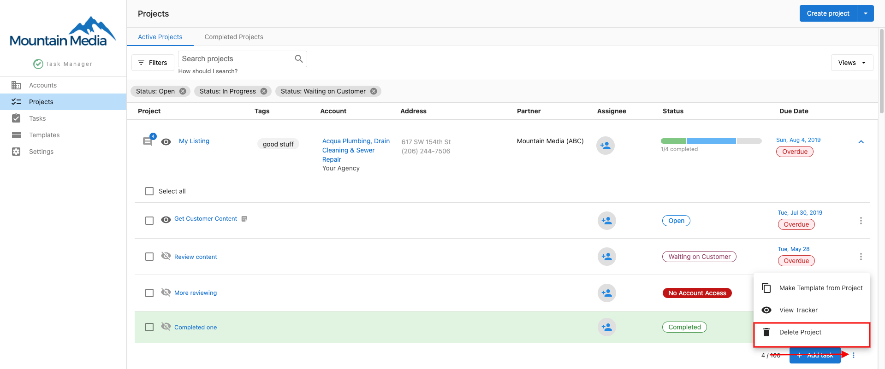
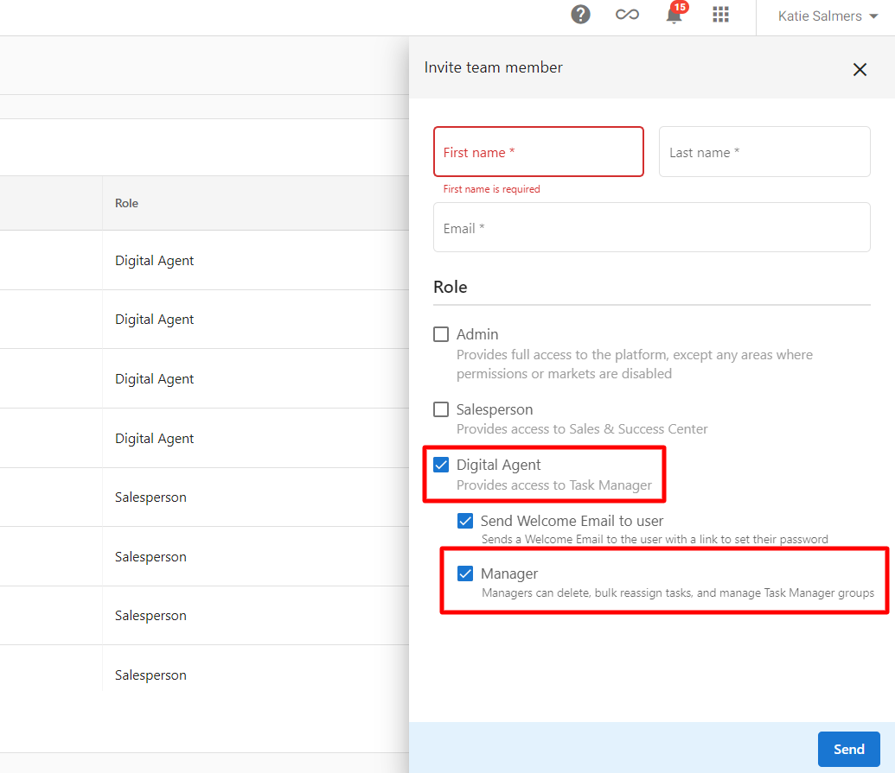
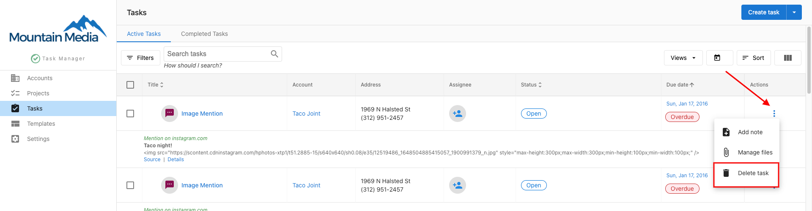

## ¿Qué es la eliminación y el archivado de proyectos?

La eliminación y el archivado de proyectos te ayudan a gestionar tu espacio de trabajo eliminando proyectos y tareas completados o innecesarios. Puedes eliminar proyectos y tareas de forma permanente o quitar el acceso de los usuarios sin eliminar los datos reales del proyecto.

## ¿Por qué es importante la limpieza de proyectos?

La limpieza regular de proyectos ayuda a mantener un espacio de trabajo organizado, mejora el rendimiento del sistema y garantiza que los miembros del equipo se enfoquen en el trabajo activo en lugar de en proyectos obsoletos.

## Qué incluye la eliminación y gestión de proyectos

### Eliminación de proyectos
- Eliminación completa del proyecto, incluidas todas las tareas asociadas
- Eliminación permanente que no se puede deshacer
- Opciones de eliminación masiva para varios proyectos

### Gestión de tareas
- Eliminación de tareas individuales dentro de los proyectos
- Eliminación de tareas sin afectar el proyecto en general
- Limpieza selectiva de tareas completadas o innecesarias

### Gestión de permisos de usuario
- Quita el acceso de un usuario a proyectos específicos
- Mantén los datos del proyecto mientras cambias el acceso del equipo
- Control granular sobre la visibilidad del proyecto

### Opciones de gestión alternativas
- Archivado de proyectos para fines de referencia
- Cambios de estado en lugar de eliminación
- Marcado de finalización del proyecto

## Cómo eliminar proyectos

### Eliminación completa del proyecto

:::warning
Eliminar un proyecto quita permanentemente el proyecto y todas las tareas asociadas. Esta acción no se puede deshacer.
:::

1. Ve a `Projects` en Task Manager
2. Ubica el proyecto que quieres eliminar en tu lista de proyectos
3. Haz clic en el ícono de `papelera` junto al nombre del proyecto
4. Confirma que quieres eliminar el proyecto de forma permanente

### Cuándo eliminar proyectos
- Proyectos creados por error
- Proyectos de prueba usados para capacitación o experimentación
- Proyectos que ya no son relevantes para tu negocio
- Proyectos duplicados que no debieron haberse creado

### Alternativas a la eliminación
Considera estas opciones antes de eliminar proyectos:
- **Marcar como completado**: cambia el estado del proyecto a completado en lugar de eliminarlo
- **Archivar**: si tu sistema admite el archivado, úsalo para proyectos que puedas necesitar consultar más adelante
- **Quitar el acceso del equipo**: quita los permisos de usuario mientras mantienes los datos del proyecto intactos

## Cómo quitar permisos de usuario

Si necesitas quitarle a un usuario el acceso a un proyecto sin eliminar el proyecto en sí:

1. Ve al proyecto específico en Task Manager
2. Haz clic en la pestaña `Permissions` dentro del proyecto
3. Busca al usuario cuyo acceso quieres quitar
4. Haz clic en el ícono de `papelera` junto a su nombre para quitar sus permisos

### Beneficios de quitar permisos
- Mantiene los datos y el historial del proyecto
- Quita el acceso de los miembros del equipo que ya no lo necesitan
- Controla la visibilidad del proyecto sin perder información
- Preserva el trabajo completado para referencia futura

## Cómo eliminar tareas individuales

Para quitar tareas específicas dentro de un proyecto sin eliminar todo el proyecto:

1. Ve al proyecto que contiene las tareas que quieres eliminar
2. Ubica la tarea específica que quieres quitar
3. Haz clic en el ícono de `papelera` junto al nombre de la tarea
4. Confirma que quieres eliminar la tarea

### Consideraciones sobre la eliminación de tareas
- Eliminar tareas puede afectar las dependencias del proyecto
- Considera el estado de finalización de la tarea antes de eliminarla
- Revisa el impacto en el cronograma general del proyecto
- Comunica la eliminación de la tarea a los miembros del equipo afectados

## Gestión del ciclo de vida del proyecto

### Flujo de finalización del proyecto
1. **Revisar el estado de finalización**: asegúrate de que todas las tareas esenciales estén terminadas
2. **Aprobación del cliente**: obtén las aprobaciones necesarias antes de cerrar el proyecto
3. **Documentación**: guarda la información importante del proyecto antes de eliminarlo
4. **Notificación al equipo**: informa a los miembros del equipo sobre la finalización del proyecto
5. **Decisión de limpieza**: elige entre eliminar, archivar o cambiar el estado

### Consideraciones de retención
Antes de eliminar proyectos, considera:
- **Requisitos legales**: algunos proyectos pueden necesitar conservarse por motivos de cumplimiento
- **Relaciones con clientes**: necesidades de referencia futura para el trabajo continuo con el cliente
- **Mejora de procesos**: el valor de los datos históricos para la optimización del flujo de trabajo
- **Fines de capacitación**: proyectos completados como ejemplos para nuevos miembros del equipo

### Cronograma de limpieza regular
Establece una rutina para la gestión de proyectos:
- **Revisiones semanales**: elimina proyectos de prueba y duplicados evidentes
- **Limpieza mensual**: archiva o elimina proyectos completados según la política de retención
- **Auditorías trimestrales**: revisa los permisos de proyecto y las necesidades de acceso del equipo
- **Revisiones anuales**: evalúa la organización general de proyectos y los procesos de limpieza

## Buenas prácticas para la eliminación de proyectos

### Antes de eliminar proyectos
- **Documenta la información importante**: guarda las comunicaciones con el cliente, los entregables finales y las lecciones aprendidas
- **Verifica las dependencias**: asegúrate de que ningún otro proyecto o proceso dependa del proyecto que vas a eliminar
- **Comunicación con el equipo**: notifica a los miembros del equipo afectados sobre la próxima eliminación del proyecto
- **Notificación al cliente**: informa a los clientes si la eliminación afecta su visibilidad o acceso

### Gestión de permisos
- **Auditorías regulares**: revisa los permisos de usuario trimestralmente para garantizar un acceso adecuado
- **Acceso basado en roles**: alinea los permisos con los roles y responsabilidades actuales del equipo
- **Consideraciones de seguridad**: quita el acceso con prontitud cuando los miembros del equipo cambien de rol
- **Documentación**: mantén registros de los cambios de permisos para fines de auditoría

### Alternativas a la eliminación
- **Actualizaciones de estado**: usa los campos de estado del proyecto en lugar de eliminarlo cuando sea posible
- **Sistemas de etiquetado**: aplica etiquetas para identificar fases del proyecto o el estado de finalización
- **Organización por carpetas**: agrupa los proyectos por estado o cliente para una mejor organización
- **Flujos de archivado**: desarrolla procesos de archivado consistentes para la retención de referencias

## Consideraciones importantes

### Acciones irreversibles
- **Eliminación permanente**: los proyectos y tareas eliminados no se pueden recuperar
- **Pérdida de datos**: se perderán todos los archivos, comunicaciones y seguimiento de progreso asociados
- **Impacto en el cliente**: la eliminación puede afectar los informes orientados al cliente y la visibilidad del proyecto

### Requisitos de permisos
- **Roles de usuario**: solo los usuarios con los permisos adecuados pueden eliminar proyectos y tareas
- **Aprobación administrativa**: algunas organizaciones pueden requerir aprobación para eliminar proyectos
- **Registros de auditoría**: mantén registros de quién eliminó qué y cuándo, para fines de responsabilidad

### Rendimiento del sistema
- **Optimización de la base de datos**: la limpieza regular mejora el rendimiento del sistema
- **Gestión del almacenamiento**: la eliminación libera espacio de almacenamiento para proyectos activos
- **Experiencia del usuario**: las listas de proyectos limpias mejoran la navegación y la productividad

Al implementar prácticas reflexivas de eliminación y archivado de proyectos, puedes mantener un espacio de trabajo organizado y eficiente, preservando al mismo tiempo la información importante y garantizando un control de acceso adecuado para los miembros de tu equipo.
