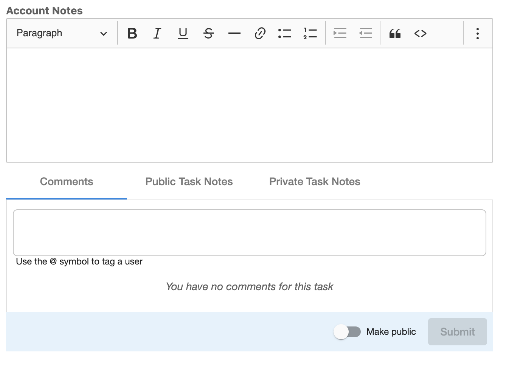
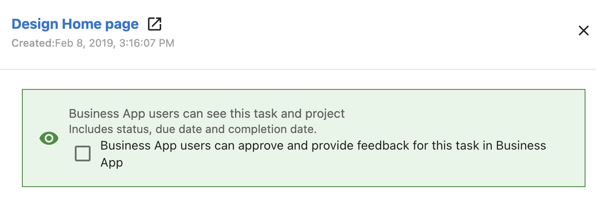

# Projects

Los proyectos en Task Manager te ayudan a organizar tareas relacionadas, asignar miembros del equipo y hacer seguimiento del progreso del trabajo con clientes. Puedes crear proyectos personalizados o usar proyectos de Social Calendar para la gestión de redes sociales, establecer plazos y compartir el progreso con los clientes a través de Business App.

## ¿Por qué son importantes los Projects?

Los proyectos brindan estructura al trabajo complejo al desglosar los entregables en tareas manejables. Puedes:

- Organizar tareas relacionadas bajo un mismo proyecto
- Asignar miembros del equipo y hacer seguimiento de las responsabilidades individuales
- Establecer plazos y supervisar el progreso en las cuentas de clientes
- Compartir actualizaciones en tiempo real con los clientes a través de la integración con Business App
- Automatizar la creación de proyectos cuando se activan productos
- Crear plantillas reutilizables para flujos de trabajo comunes

## Qué incluyen los Projects

### Tipos de proyecto

**Custom Projects**: gestión de proyectos de propósito general para cualquier tipo de trabajo con clientes. Gestión de tareas estándar, asignación de equipo y seguimiento de plazos.

**Social Calendar Projects**: para la creación y gestión de contenido de redes sociales: llamadas de contenido, programación de tareas de Social Calendar Generation y flujos de revisión del cliente.

### Funciones principales

- **Organización de tareas**: desglosa los proyectos en tareas específicas y accionables
- **Asignación de equipo**: asigna proyectos y tareas a miembros del equipo
- **Gestión de plazos**: fechas de vencimiento para proyectos y tareas individuales
- **Seguimiento de progreso**: supervisa la finalización e identifica retrasos
- **Gestión de dependencias**: secuencias de tareas en las que algunas deben completarse antes de que otras comiencen

### Colaboración con el cliente

- **Integración con Business App**: comparte el progreso del proyecto con los clientes en tiempo real
- **Visibilidad en Executive Report**: muestra el estado del proyecto en los Executive Reports orientados al cliente
- **Communications**: colabora con compañeros de equipo y clientes en el espacio de trabajo del proyecto; notificaciones automáticas por correo electrónico cuando comienza el pedido, el estado cambia a en espera del cliente, cambian los plazos o se agregan comentarios públicos

## Artículos en esta sección

- **[Create and manage projects](./create-and-manage-projects.mdx)**: crea proyectos, agrega tareas, asigna miembros del equipo
- **[Delete and archive projects](./delete-and-archive-projects.mdx)**: archiva, elimina y restaura proyectos
- **[Project templates and automation](./project-templates-and-automation.mdx)**: plantillas y creación automática de proyectos

## Cómo empezar con los proyectos

1. Ve a **Task Manager** y haz clic en la pestaña **Projects**
2. Selecciona **Create Project** y elige el tipo de proyecto (Custom o Social Calendar)
3. Asocia el proyecto con una cuenta de cliente
4. Agrega tareas, asigna miembros del equipo, establece plazos
5. Configura la visibilidad para el cliente (**Visible in Business App**) si quieres compartir el progreso

## Cómo configurar las comunicaciones del proyecto

1. Abre un proyecto o tarea en **Task Manager**
2. Agrega un comentario en la pestaña **Comments**; usa **@** para etiquetar a otro usuario
3. Activa el interruptor **Public** para que los comentarios sean visibles para el cliente
4. Haz clic en el ícono del ojo para hacer que la tarea o proyecto sea **Visible in Business App** para que los clientes puedan verlo

### Aprobación del cliente

Cuando una tarea y un proyecto son visibles en Task Manager, puedes permitir que los usuarios de Business App aprueben y den retroalimentación sobre esa tarea en Business App.

## Actualizaciones de proyectos en Executive Report

Configura los proyectos y tareas como **Visible in Business App** para que aparezcan en el Executive Report del cliente (con actualizaciones durante el período seleccionado). La tarjeta de actualizaciones del proyecto muestra qué está pasando con los proyectos y los tipos de actualizaciones realizadas.

## Preguntas frecuentes

¿Puedo reordenar las tareas de un proyecto si una o más tareas están bloqueadas?

Si una tarea del proyecto depende de una tarea bloqueada, no puedes reordenar ninguna tarea del proyecto dentro de ese proyecto. En Templates, puedes reordenar tareas incluso si algunas están bloqueadas.

¿Cómo hago que los proyectos sean visibles en el Executive Report?

Configura las tareas y proyectos como **Visible in Business App**. Si activas esto después de la creación, actualiza las notas o el estado para que aparezca en el informe.

¿Cuál es la diferencia entre los proyectos Custom y Social Calendar?

Los proyectos Custom son de propósito general. Los proyectos Social Calendar agregan funciones para redes sociales: programación de llamadas de contenido, programación de tareas de Social Calendar Generation y flujos de revisión del cliente.

¿Puedo crear proyectos automáticamente cuando se activan productos?

Sí. Crea plantillas de proyecto y asócialas con productos del marketplace en la configuración avanzada de la plantilla para que se generen proyectos nuevos cuando se activen esos productos.

¿Cómo comparto el progreso del proyecto con los clientes?

Activa **Visible in Business App** en los proyectos y sus tareas. Al menos una tarea debe ser visible para que el proyecto aparezca en la Business App del cliente.

¿Puedo eliminar proyectos y tareas?

Sí, pero la eliminación no se puede deshacer. Considera archivar en su lugar. Solo los usuarios con los permisos adecuados pueden eliminar.

¿Pueden existir tareas sin formar parte de un proyecto?

Puedes crear tareas independientes, pero las tareas sin un proyecto no se pueden compartir en Business App ni incluirse en los Executive Reports orientados al cliente.

¿Cómo previsualizo cómo se verá un proyecto para los clientes?

Usa **View Tracker** en el menú del proyecto (tres puntos junto a **+ Add task**) para previsualizar el proyecto en Business App.

¿Cuándo reciben los clientes notificaciones por correo electrónico?

Cuando comienza el pedido, cuando el estado cambia a en espera del cliente, cuando cambian los plazos y cuando se agregan comentarios públicos.

¿Pueden los clientes aprobar tareas directamente?

Sí. Activa la configuración de aprobación para una tarea para que los usuarios de Business App puedan aprobar y dar retroalimentación en Business App.

