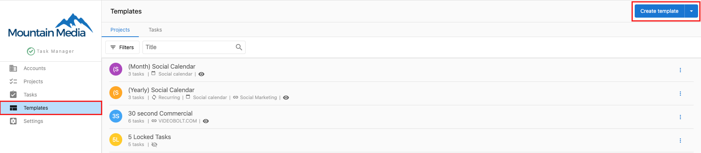
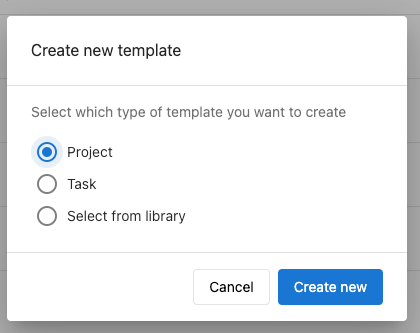
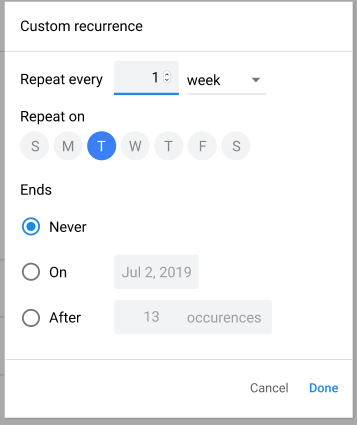
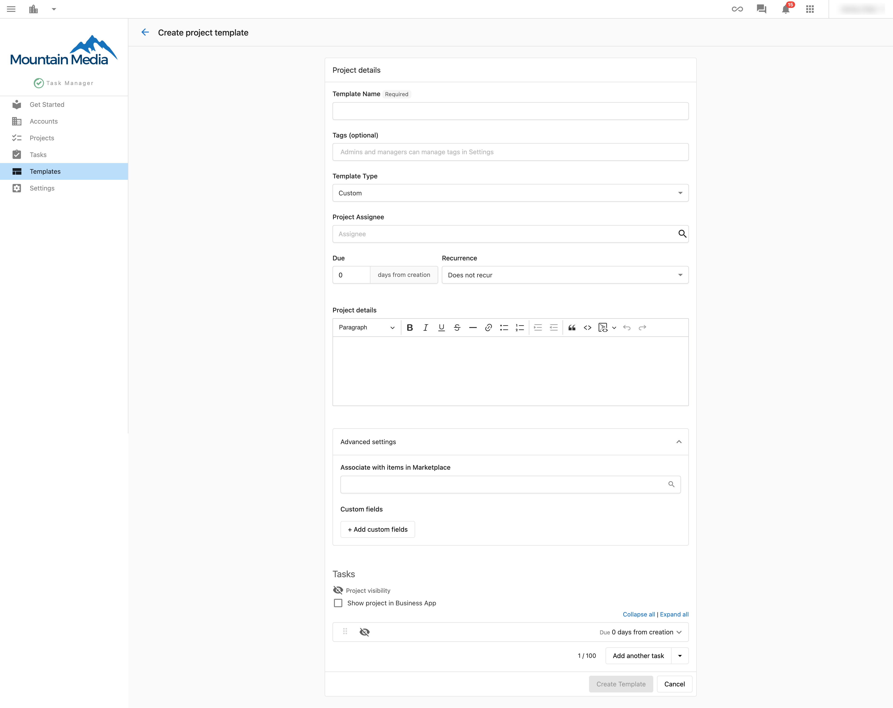

## ¿Qué son las plantillas de proyecto y la automatización?

Las plantillas de proyecto son estructuras de proyecto reutilizables que incluyen tareas, asignaciones y cronogramas predefinidos. La automatización permite que estas plantillas creen automáticamente proyectos nuevos cuando se cumplen condiciones específicas, como la activación de un producto o intervalos programados.

## ¿Por qué son importantes las plantillas y la automatización?

Las plantillas y la automatización ahorran tiempo y garantizan la consistencia al eliminar la necesidad de recrear manualmente proyectos similares. Puedes estandarizar tus procesos de flujo de trabajo y generar proyectos automáticamente cuando los clientes compran productos o servicios específicos.

## Qué incluyen las plantillas y la automatización

### Creación de plantillas
- Estructuras de proyecto reutilizables con tareas predefinidas
- Configuraciones de asignados predeterminados y cronogramas
- Campos personalizados y ajustes específicos del proyecto
- Biblioteca de plantillas para patrones de flujo de trabajo comunes

### Funciones de automatización
- Creación de proyectos activada por productos desde activaciones del marketplace
- Generación de proyectos recurrentes en intervalos programados
- Asignación automática de tareas según las configuraciones de la plantilla
- Integración con la gestión de cuentas de clientes

### Gestión de plantillas
- Organización y categorización de la biblioteca de plantillas
- Control de versiones y actualizaciones de plantillas
- Uso compartido de plantillas entre miembros del equipo
- Seguimiento y optimización del rendimiento de las plantillas

## Cómo crear plantillas de proyecto

### Paso 1: accede a la creación de plantillas

1. Ve a `Fulfillment` → `Task Manager` → `Templates`
2. Haz clic en `Create template` para comenzar a crear una plantilla nueva
3. Selecciona tu tipo de plantilla:
   - `Project`: crea una plantilla de proyecto completa con varias tareas
   - `Task`: crea una plantilla de tarea única para reutilizar
   - `Select from library`: elige entre los patrones de plantilla existentes

4. Haz clic en `Create new` para continuar con la creación de la plantilla

### Paso 2: configura los datos básicos de la plantilla

Completa los detalles generales de la plantilla:

- `Template Name` (obligatorio): elige un nombre descriptivo que identifique claramente el propósito de la plantilla
- `Tags` (opcional): agrega etiquetas organizativas para facilitar la búsqueda de la plantilla
- `Template Type`: selecciona `Custom` para proyectos generales o `Social Calendar` para flujos de trabajo de redes sociales
- `Project Assignee`: define el miembro del equipo predeterminado que se asignará a los proyectos creados a partir de esta plantilla
- `Due __ days from creation`: especifica cuántos días después de la creación debe vencer el proyecto
- `Project details`: agrega notas o instrucciones estándar que apliquen a todos los proyectos que usen esta plantilla

### Paso 3: configura los ajustes de automatización

#### Opciones de recurrencia
Configura la recreación automática de proyectos:
- `Recurrence`: elige con qué frecuencia debe recrearse automáticamente el proyecto
- `Custom intervals`: para la recurrencia `Custom`, puedes especificar opciones de programación detalladas

#### Configuración avanzada
- `Associate with Product in the Marketplace`: selecciona productos específicos que activarán la creación automática de proyectos cuando se activen en cuentas de clientes
- `Custom fields`: agrega campos especializados relevantes para los requisitos de tu flujo de trabajo

### Paso 4: define las tareas de la plantilla

Crea las tareas que se incluirán en todos los proyectos que usen esta plantilla:

- `Task Name`: proporciona nombres claros y descriptivos para cada tarea de tu flujo de trabajo
- `Assignee`: define los miembros del equipo predeterminados responsables de cada tipo de tarea
- `Due __ days from project creation`: especifica cuándo debe completarse cada tarea en relación con el inicio del proyecto

:::info
Puedes agregar varias tareas seleccionando `Add Another Task` o `Add task template`. Quita las tareas no deseadas seleccionando `Delete Task`.
:::

### Paso 5: guarda tu plantilla

1. Revisa todos los ajustes de la plantilla y las configuraciones de tareas
2. Haz clic en `Create Template` para guardar tu plantilla en la biblioteca

## Cómo configurar la creación automática de proyectos

### Automatización activada por producto

1. Ve a `Task Manager` → `Templates`
2. Selecciona una plantilla existente o crea una nueva
3. En `Advanced Settings`, haz clic en `Associate with items in Marketplace`
4. Selecciona el producto específico que debe activar la creación del proyecto
5. Guarda la configuración de tu plantilla

Cuando se active el producto seleccionado en cualquier cuenta de cliente, Task Manager creará automáticamente un proyecto basado en tu plantilla.

:::warning
Si activaste un producto en las últimas 24 horas en una cuenta, el proyecto automatizado también se creará en esa cuenta cuando configures la automatización.
:::

### Automatización de proyectos recurrentes

1. Crea o edita una plantilla de proyecto
2. Configura el ajuste `Recurrence` con la frecuencia deseada
3. Para patrones de recurrencia personalizados, selecciona `Custom` y especifica la programación detallada
4. Guarda la plantilla para activar la creación de proyectos recurrentes

## Gestión de tu biblioteca de plantillas

### Organización de plantillas
- Usa nombres descriptivos que indiquen claramente el propósito y alcance de la plantilla
- Aplica un etiquetado consistente para agrupar plantillas relacionadas
- Revisa y actualiza las plantillas regularmente según las mejoras del flujo de trabajo

### Optimización de plantillas
- Supervisa las tasas de éxito de los proyectos para diferentes plantillas
- Recopila la retroalimentación del equipo sobre la efectividad de las plantillas
- Actualiza las asignaciones de tareas y los cronogramas según los datos reales de finalización

### Uso compartido de plantillas
- Asegúrate de que todos los miembros del equipo tengan acceso a las plantillas relevantes
- Documenta los lineamientos de uso y las buenas prácticas de las plantillas
- Coordina las actualizaciones de plantillas entre los miembros del equipo

## Buenas prácticas para plantillas y automatización

### Diseño de plantillas
- Incluye todas las tareas esenciales para la entrega completa del proyecto
- Establece cronogramas predeterminados realistas según los datos históricos del proyecto
- Usa descripciones de tareas claras que funcionen para diferentes miembros del equipo

### Configuración de la automatización
- Prueba los disparadores de automatización antes de implementarlos en cuentas de clientes
- Supervisa la creación automática de proyectos para garantizar el funcionamiento correcto
- Revisa y ajusta la configuración de automatización según la retroalimentación del cliente

### Mantenimiento
- Actualiza las plantillas regularmente para reflejar las mejoras de los procesos
- Archiva las plantillas obsoletas para mantener organizada tu biblioteca
- Documenta los cambios de plantilla para que el equipo esté al tanto

Al usar de manera efectiva las plantillas de proyecto y la automatización, puedes estandarizar tus flujos de trabajo, reducir el tiempo de configuración manual de proyectos y garantizar una entrega consistente de los proyectos de clientes, manteniendo altos estándares de calidad en todo tu equipo.
