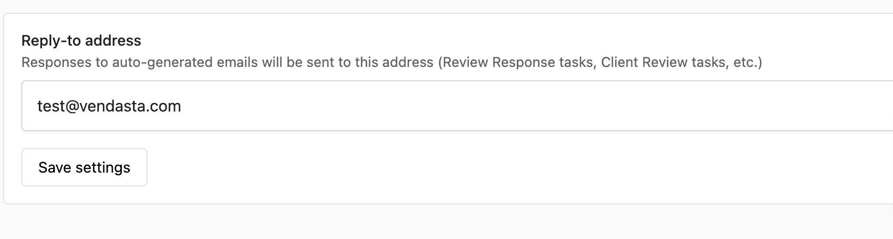
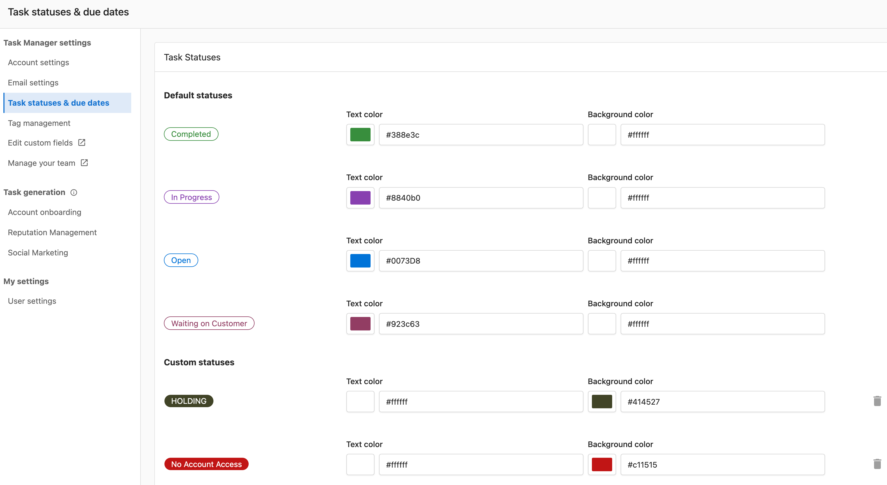
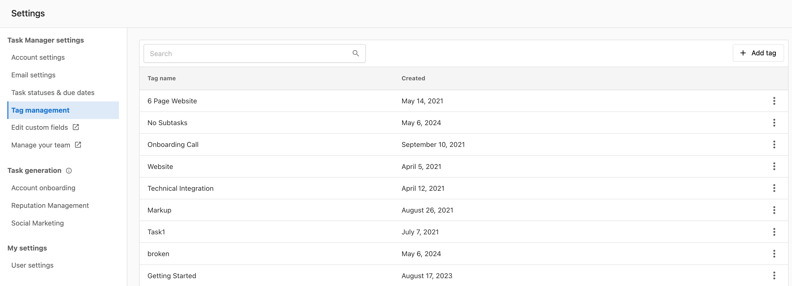
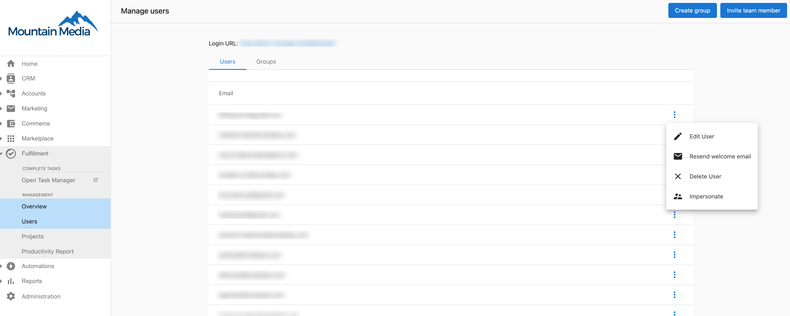
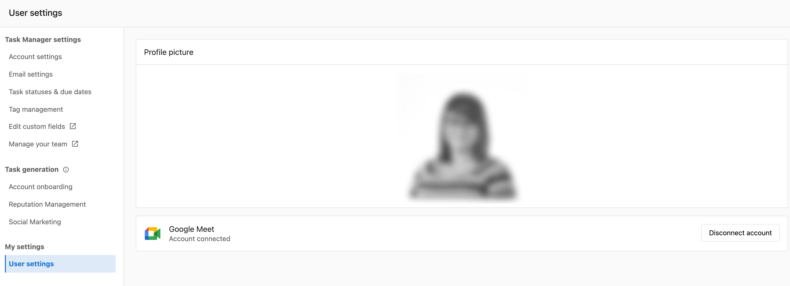
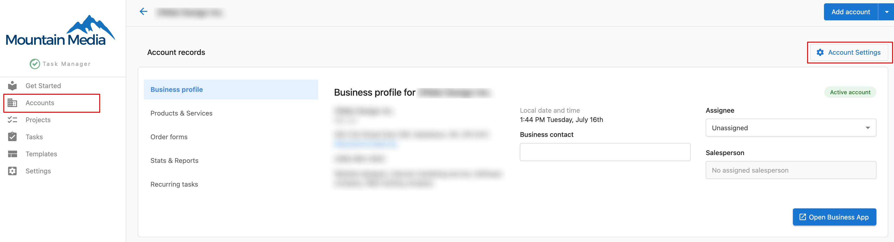

## ¿Qué es la configuración de Task Manager?

Task Manager Settings es un panel de configuración integral que te permite personalizar flujos de trabajo, automatizar procesos y mejorar la colaboración del equipo dentro de tu sistema de gestión de tareas. Puedes configurar desde las notificaciones por correo electrónico hasta los permisos del equipo y los estados de las tareas.

## ¿Por qué es importante la configuración de Task Manager?

Una configuración adecuada de Task Manager Settings garantiza que tu equipo opere de manera eficiente al:
- Estandarizar los flujos de trabajo en toda tu organización
- Automatizar procesos rutinarios de gestión de tareas
- Personalizar las notificaciones para reducir las interrupciones
- Gestionar el acceso y los permisos del equipo de manera efectiva

## Qué incluye la configuración de Task Manager

Task Manager Settings incluye siete áreas de configuración principales:
- Gestión de Company Details
- Configuración de Due Dates
- Personalización de Email Settings
- Definiciones de Task Statuses
- Sistema de Tag Management
- Controles de Team Management
- Preferencias de User Settings

## Cómo acceder a la configuración de Task Manager

Para acceder a la configuración de Task Manager:

1. Ve a `Fulfillment` → `Task Manager`
2. Haz clic en el ícono de engranaje en la esquina superior derecha de la pantalla

## Company Details

Gestiona la información de tu empresa, incluyendo nombre, dirección, número de teléfono y correo electrónico. Esta información se usa en todo Task Manager para comunicaciones e informes.

## Due Dates

Configura los ajustes de plazos para las tareas, incluyendo:
- Plazos predeterminados para las tareas nuevas
- Cómo se priorizan las tareas según los plazos
- Configuración de notificaciones para tareas próximas y atrasadas

## Email Settings

Personaliza las notificaciones y plantillas de correo electrónico para las comunicaciones relacionadas con tareas:
- Preferencias de notificación por correo electrónico
- Plantillas de correo para asignaciones de tareas, actualizaciones y finalizaciones
- Firmas de correo personalizadas para las comunicaciones de tareas

Puedes configurar la dirección de correo `Send from` de Task Manager yendo a `Fulfillment` → `Task Manager` → `Settings` → `Email Settings`.

## Task statuses

Define y personaliza los estados de las tareas para que coincidan con tu flujo de trabajo:
- Crea estados personalizados
- Edita los estados existentes
- Establece estados predeterminados para las tareas nuevas
- Configura las transiciones y automatizaciones de estado

## Tag management

Crea y gestiona etiquetas para organizar y filtrar tareas:
- Crea etiquetas personalizadas
- Edita los nombres y colores de las etiquetas
- Archiva las etiquetas no utilizadas
- Establece permisos para el uso de etiquetas

## Team management

Gestiona a los miembros del equipo y sus permisos:
- Agrega o quita miembros del equipo
- Establece permisos basados en roles
- Crea grupos de equipo para las asignaciones de tareas
- Configura los ajustes de accesibilidad

## User settings

Puedes personalizar tu experiencia en Task Manager:
- Preferencias de notificación
- Preferencias de visualización
- Vistas y filtros predeterminados
- Configuración de zona horaria

Puedes subir una foto de perfil para facilitar la identificación de los asignados de tareas de un vistazo:

1. Ve a `Fulfillment` → `Task Manager` → `Settings` → `User settings`
2. Haz clic en `Edit`
3. Arrastra una imagen al cargador o haz clic en `Upload image`

## Buenas prácticas

- **Revisa la configuración regularmente**: a medida que tu flujo de trabajo evoluciona, revisa y actualiza la configuración regularmente para mantener la eficiencia
- **Capacita a los miembros del equipo**: asegúrate de que todos los miembros del equipo entiendan cómo usar la configuración que afecta su trabajo
- **Comienza de forma simple**: empieza con la configuración básica e implementa gradualmente funciones más avanzadas a medida que tu equipo se familiarice con el sistema
- **Documenta los cambios**: mantén un registro de los cambios de configuración para hacer seguimiento de cómo afectan el flujo de trabajo y la productividad

## Preguntas frecuentes

¿Qué sucede con mis cuentas si actualizo mi General Settings en Task Manager?

Cualquier cambio solo afectará a las cuentas **NUEVAS** creadas de ahí en adelante. Las cuentas preexistentes necesitarán que los cambios se realicen a través de Account Settings.

Cuando envías un correo electrónico a un cliente a través de Task Manager, ¿de qué dirección de correo proviene?

Puedes configurar la dirección de correo `Send from` de Task Manager yendo a `Fulfillment` → `Task Manager` → `Settings` → `Email Settings`.

¿Cómo subo una foto de perfil en Task Manager?

Subir una foto de perfil puede facilitar la identificación de los asignados de tareas de un vistazo.

1. Ve a `Fulfillment` → `Task Manager` → `Settings` → `User settings`
2. Haz clic en `Edit`
3. Arrastra una imagen al cargador o haz clic en `Upload image`

¿Los cambios de configuración afectan a las tareas existentes?

La mayoría de los cambios de configuración solo se aplican a las tareas nuevas creadas después del cambio. Las tareas existentes generalmente conservan su configuración original a menos que se actualicen manualmente.

¿Puedo personalizar los estados de las tareas para diferentes tipos de trabajo?

Sí, puedes crear estados personalizados en la sección Task Statuses para que coincidan con los requisitos específicos de tu flujo de trabajo y configurar las transiciones entre estados.

¿Cómo gestiono los permisos del equipo para diferentes configuraciones?

Usa la sección Team Management para establecer permisos basados en roles que controlen qué miembros del equipo pueden acceder y modificar áreas de configuración específicas.

¿Puedo establecer diferentes preferencias de notificación para diferentes tipos de tareas?

Sí, puedes personalizar las preferencias de notificación por correo electrónico en la sección Email Settings y configurar preferencias específicas por usuario en User Settings.

¿Qué sucede si elimino una etiqueta que ya está asignada a tareas?

Antes de eliminar una etiqueta, deberías quitarla de todas las tareas asignadas o archivarla en su lugar para mantener la organización de las tareas y los datos históricos.

