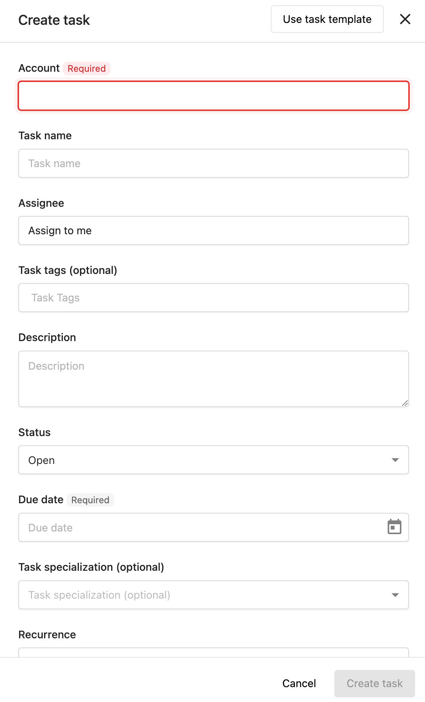

# Creating and Managing Tasks

## ¿Qué es la creación y gestión de tareas?

La creación y gestión de tareas implica tanto la creación manual de tareas para trabajo personalizado como la generación automática de tareas según la actividad de la cuenta. Este proceso optimizado garantiza que todo el trabajo con clientes se registre y organice de manera efectiva.

## ¿Por qué es importante la creación de tareas?

Una creación de tareas efectiva te ayuda a:

- **Hacer seguimiento de todo el trabajo**: asegúrate de que ninguna actividad del cliente se pase por alto
- **Automatizar tareas rutinarias**: genera tareas automáticamente para actividades comunes
- **Escalar operaciones**: gestiona más cuentas sin perder trabajo importante
- **Mantener la consistencia**: aplica los mismos procesos en todas las cuentas

## Cómo crear tareas manualmente

### Proceso de creación manual de tareas

1. Ve a `Fulfillment` → `Task Manager` → `Tasks`
2. Haz clic en `Create task`
3. Selecciona la **Account** para la que estás creando la tarea
4. Ingresa la información en todos los campos correspondientes; Due date y Account son los únicos campos obligatorios
5. Haz clic en `Create task`

### Cuándo crear tareas manuales

Crea tareas manuales para:
- Solicitudes personalizadas de clientes
- Proyectos únicos
- Trabajo específico de la cuenta
- Tareas no cubiertas por la generación automática

:::info Plazos y zonas horarias
Task Manager almacena todos los plazos como medianoche UTC−6. Cuando ves una tarea, el plazo se muestra en tu zona horaria local, por lo que el mismo plazo puede aparecer como un día calendario diferente para los miembros del equipo en zonas horarias significativamente adelantadas respecto a UTC−6. Este es el comportamiento esperado, no un error. El plazo real es el mismo para todos; solo difiere la fecha calendario que se muestra.
:::

## Cómo configurar tareas autogeneradas

Las tareas autogeneradas agilizan tu proceso de cumplimiento al crear tareas automáticamente según la actividad de la cuenta y la configuración establecida.

:::info
Esta guía cubre los tipos de tareas predeterminados. Puedes autogenerar tareas personalizadas usando plantillas de proyecto.
:::

### Autogenerar tareas para todas las cuentas nuevas

Establece la generación de tareas predeterminada para cuentas nuevas:

1. Ve a `Task Manager` → `Settings`
2. Haz clic en `Reputation AI` o `Social AI`
3. Mueve el interruptor a activado o desactivado para controlar la generación automática de tareas

### Autogenerar tareas por cuenta

Configura la generación de tareas para cuentas individuales:

1. Ve a `Task Manager` → `Accounts`
2. Selecciona la cuenta correspondiente
3. Haz clic en `Account Settings`
4. Ve a `Task generation`
5. Activa o desactiva los tipos de tarea según sea necesario

:::warning
Es posible que ciertos productos deban estar activos antes de poder autogenerar tareas en la cuenta.
:::

## Tipos de tareas disponibles para la autogeneración

### Listings Tasks
- **Propósito**: tareas que se generan cuando los listados son inexactos
- **Configuración**: configura las fuentes de listados que gestionas para los clientes en la pestaña **Listings**
- **Cuándo se generan**: cuando los datos del listado se vuelven inconsistentes o inexactos

### Mentions Tasks
- **Propósito**: tareas para menciones del negocio en la web
- **Requisitos**: Reputation AI debe estar activo
- **Configuración**: configura los tipos de menciones que se gestionarán para los clientes
- **Cuándo se generan**: cuando se menciona al negocio en línea

### Reviews Tasks
- **Propósito**: tareas para reseñas nuevas de clientes
- **Requisitos**: Reputation AI debe estar activo
- **Cuándo se generan**: cuando se publican reseñas nuevas para los negocios

### Social Posts Tasks
- **Propósito**: tareas que indican publicar en redes sociales
- **Requisitos**: Social AI debe estar activo
- **Configuración**: configura el tipo de contenido y los compromisos de publicación en cuentas individuales
- **Cuándo se generan**: según el cronograma y los compromisos de publicación

### Socialize Tasks
- **Propósito**: tareas para interacciones de clientes en redes sociales
- **Cuándo se generan**: cuando los clientes publican en las páginas y cuentas de redes sociales del negocio

## Configuración específica de la cuenta

### Ajustes de cuenta individuales

Cada cuenta puede tener configuraciones únicas de generación de tareas:

1. Ve a `Task Manager` → `Accounts`
2. Selecciona la cuenta
3. Haz clic en `Account Settings`
4. Ve a `Task generation`
5. Configura ajustes específicos para:
   - Qué tipos de tarea generar
   - Frecuencia de generación
   - Fuentes específicas a monitorear

### Requisitos de producto

Algunos tipos de tarea requieren que ciertos productos estén activos:

- **Mentions y Reviews**: requieren Reputation AI
- **Social Posts y Socialize**: requieren Social AI

## Buenas prácticas para la creación de tareas

### Creación manual de tareas
- Usa títulos de tarea claros y descriptivos
- Establece plazos realistas
- Incluye todos los detalles relevantes en la descripción
- Asigna las tareas a los miembros del equipo correspondientes
- Agrega etiquetas relevantes para la organización

### Configuración de tareas autogeneradas
- Comienza con configuraciones conservadoras y ajústalas según la carga de trabajo
- Revisa las tareas autogeneradas regularmente para garantizar la calidad
- Personaliza la configuración por cuenta según las necesidades del cliente
- Supervisa el volumen de tareas para evitar la sobrecarga

### Gestión de tareas
- Revisa la configuración de generación de tareas trimestralmente
- Ajusta la configuración según la capacidad del equipo
- Usa la edición masiva para gestionar tareas similares de manera eficiente
- Comunica los cambios a los miembros del equipo

## Preguntas frecuentes

¿Cómo funcionan las tareas autogeneradas?

Las tareas autogeneradas se crean automáticamente según la actividad de la cuenta y la configuración establecida. Por ejemplo, cuando se publican reseñas nuevas, aparecen menciones nuevas en línea o se hacen preguntas en Google Business Profile, se generarán tareas automáticamente si esos tipos de tarea están activados para la cuenta.

¿Cómo desactivo las tareas autogeneradas para cuentas específicas?

Ve a `Task Manager` → `Accounts`, selecciona la cuenta, haz clic en Account Settings, ve a Task generation, y desactiva los tipos de tarea específicos. Puedes controlar esto para cuentas individuales o establecer valores predeterminados para todas las cuentas nuevas en Settings.

¿Puedo crear plantillas de tarea personalizadas?

Aunque el sistema no detalla plantillas de creación de tareas personalizadas, puedes crear plantillas de respuesta a reseñas para diferentes calificaciones por estrellas y categorías de negocio. Para otras tareas personalizadas, deberás crearlas manualmente o usar las funciones de autogeneración para los tipos de tarea estándar.

¿Qué productos deben estar activos para las tareas autogeneradas?

Las tareas de Mentions y Reviews requieren que Reputation AI esté activo. Las tareas de Social Posts y Socialize requieren que Social AI esté activo.

¿Puedo establecer diferentes configuraciones de autogeneración para diferentes cuentas?

Sí, puedes configurar los ajustes de generación de tareas de forma individual para cada cuenta en Account Settings > Task generation, o establecer valores predeterminados para todas las cuentas nuevas en el área principal de Settings.

¿Por qué el plazo de una tarea se ve diferente para los miembros del equipo en diferentes zonas horarias?

Task Manager almacena todos los plazos como medianoche UTC−6. Cuando un miembro del equipo en una zona horaria significativamente adelantada respecto a UTC−6 ve la tarea, la conversión a su hora local puede desplazar la fecha mostrada en un día. El plazo subyacente es idéntico para todos; solo difiere la fecha calendario que se muestra en la interfaz según la zona horaria.

