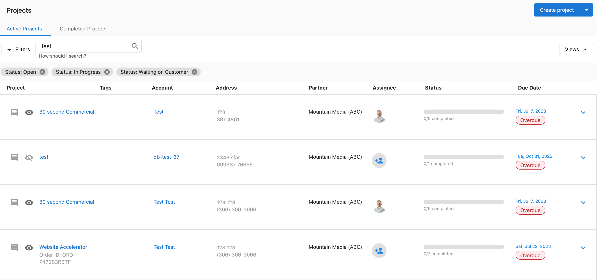
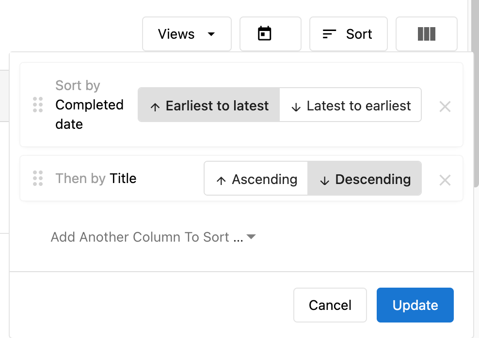
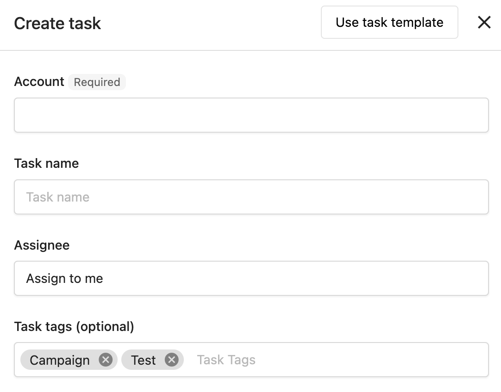
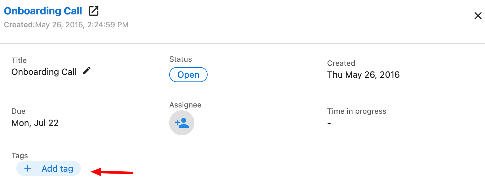
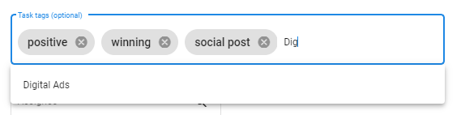

## ¿Qué es la búsqueda y organización de tareas?

Encontrar y organizar tareas implica usar las capacidades de búsqueda, ordenamiento y etiquetado de Task Manager para ubicar rápidamente tareas específicas y mantener un flujo de trabajo organizado. Estas funciones te ayudan a gestionar grandes volúmenes de tareas de manera eficiente.

## ¿Por qué es importante la organización de tareas?

Una organización de tareas efectiva te ayuda a:

- **Encontrar tareas rápidamente**: ubica tareas específicas sin desplazarte por listas largas
- **Priorizar el trabajo**: organiza las tareas por urgencia, plazo u otros criterios
- **Mejorar la eficiencia**: dedica menos tiempo a buscar y más a completar el trabajo
- **Escalar operaciones**: gestiona volúmenes crecientes de tareas sin perder el control

## Cómo usar la búsqueda mejorada

La búsqueda mejorada de Task Manager te permite encontrar tareas usando varios parámetros más allá de los nombres de las tareas.

### Parámetros de búsqueda

Puedes buscar tareas usando cualquiera de los siguientes:

- **Name**: título o descripción de la tarea
- **Account**: nombre de la cuenta del cliente
- **Contact**: persona de contacto asociada con la tarea
- **Address**: dirección del negocio
- **Order ID**: ID de pedido o proyecto asociado
- **Tags**: etiquetas personalizadas aplicadas a las tareas

### Proceso de búsqueda

1. Ve a `Task Manager` → `Projects` o `Task Manager` → `Tasks`
2. Establece los filtros que desees
3. Escribe uno de los parámetros de búsqueda en el campo de búsqueda
4. Usa comillas (por ejemplo, "ubicación centro") para buscar coincidencias exactas
5. Ajusta la configuración de ordenamiento una vez que se muestren los resultados de búsqueda
6. Para realizar otra búsqueda, borra el texto y comienza de nuevo

:::info
Usar la búsqueda restablecerá la configuración de ordenamiento. Puedes ajustarla según sea necesario una vez que se muestren tus resultados de búsqueda.
:::

### Consejos de búsqueda

- **Coincidencias parciales**: la búsqueda funciona con información parcial; no necesitas nombres o direcciones completos
- **Frases exactas**: usa comillas para coincidencias de frases exactas
- **Varios términos**: busca varias palabras clave para acotar los resultados
- **Filtra primero**: aplica filtros antes de buscar para reducir el alcance

## Cómo ordenar tareas

### Opciones de ordenamiento disponibles

1. Ve a `Fulfillment` → `Task Manager` → `Tasks`
2. Haz clic en el botón `Sort`
3. Elige una o varias columnas por las que ordenar:
   - None
   - Title
   - Status
   - Created date
   - Modified date
   - Completed date
   - Due date

4. Selecciona `Ascending` (de más antiguo a más reciente) o `Descending` (de más reciente a más antiguo)
5. Haz clic en `Update`

### Ordenamiento por varias columnas

Al seleccionar varias columnas para ordenar:
- El ordenamiento se prioriza comenzando por la primera columna seleccionada
- Las columnas se pueden reordenar para diferentes prioridades
- Ejemplo: ordenar por Title y luego por Due date

:::info
Si eliges varias columnas, el ordenamiento se priorizará comenzando por la primera columna seleccionada. Las tareas con el mismo plazo se ordenarán alfabéticamente.
:::

### Estrategias de ordenamiento comunes

- **Por plazo**: enfócate primero en las tareas urgentes
- **Por estado**: agrupa las tareas por estado de finalización
- **Por cuenta**: trabaja en un cliente a la vez
- **Por fecha de creación**: gestiona primero las tareas más antiguas
- **Por fecha de modificación**: consulta las tareas actualizadas recientemente

## Cómo usar etiquetas para la organización

Las etiquetas ofrecen una organización flexible más allá de las categorías estándar y ayudan con el filtrado e identificación.

### Agregar etiquetas a las tareas

#### Al crear una tarea nueva
Agrega etiquetas en el campo `Tags` durante la creación de la tarea.

#### A tareas existentes
1. Ve a `Fulfillment` → `Task Manager` → `Tasks`
2. Busca y haz clic en la tarea
3. Haz clic en `+ Add tag` e ingresa tus etiquetas

### Sugerencias de etiquetas

A medida que escribes etiquetas, Task Manager sugiere las etiquetas existentes que has usado antes. Puedes:
- Seleccionar entre las sugerencias existentes para mantener la consistencia
- Crear etiquetas nuevas escribiendo nombres únicos
- Usar las mismas etiquetas en tareas, proyectos y plantillas

### Estrategias de organización de etiquetas

#### Por prioridad
- `urgent`
- `high-priority`
- `medium-priority`
- `low-priority`

#### Por tipo de cliente
- `restaurant`
- `retail`
- `healthcare`
- `automotive`

#### Por tipo de trabajo
- `onboarding`
- `monthly-maintenance`
- `emergency-fix`
- `review-response`

#### Por ubicación (para clientes multiubicación)
- `location-downtown`
- `location-north`
- `location-franchise-1`

### Beneficios de las etiquetas

- **Organización mejorada**: categoriza las tareas por cliente, estado, prioridad o criterios personalizados
- **Filtrado rápido**: filtra fácilmente las listas de tareas para enfocarte en tipos de trabajo específicos
- **Clasificación consistente**: aplica las mismas etiquetas en tareas, proyectos y plantillas
- **Gestión flexible**: agrega o quita etiquetas a medida que cambien las necesidades organizativas

## Técnicas de organización avanzadas

### Combinar búsqueda, ordenamiento y etiquetas

1. **Comienza con etiquetas**: aplica etiquetas relevantes para categorizar las tareas
2. **Filtra por estado**: usa los filtros de estado para enfocarte en el trabajo activo
3. **Busca por palabras clave**: usa la búsqueda para encontrar cuentas o tipos de trabajo específicos
4. **Ordena por prioridad**: ordena los resultados por plazo o etiquetas de prioridad

### Creación de flujos de trabajo

1. **Flujo de trabajo diario**: ordena por plazo, filtra por usuario asignado
2. **Revisión de cliente**: busca por nombre de cuenta, ordena por fecha de creación
3. **Respuesta de emergencia**: filtra por la etiqueta "urgent", ordena por plazo
4. **Planificación semanal**: ordena por estado, filtra por plazos próximos

### Organización masiva

Usa la búsqueda y el filtrado para identificar grupos de tareas para operaciones masivas:
1. Busca tareas que necesiten actualizaciones similares
2. Selecciona varias tareas usando las casillas de verificación
3. Aplica ediciones masivas para estandarizar etiquetas, estado o asignaciones

## Preguntas frecuentes

¿Puedo buscar tareas usando información parcial?

Sí, la función de búsqueda mejorada te permite buscar usando coincidencias parciales para nombres, cuentas, contactos, direcciones, ID de pedido y etiquetas. Usa comillas para coincidencias de frases exactas.

¿Cómo organizo las tareas por prioridad o urgencia?

Usa etiquetas para crear tu propio sistema de prioridad (por ejemplo, "urgent", "high-priority", "low-priority") y combínalo con el ordenamiento por plazo. También puedes usar la función de edición masiva para actualizar rápidamente varias tareas con etiquetas de prioridad.

¿Qué debo hacer si no puedo encontrar una tarea específica?

Usa la función de búsqueda mejorada para buscar por nombre de cuenta, contacto, dirección, ID de pedido o etiquetas. También puedes aplicar filtros por estado, asignado o tipo de tarea, y luego ordenar los resultados por fecha de creación, plazo u otros criterios para ubicar la tarea.

¿Cómo gestiono las tareas de negocios multiubicación?

Usa etiquetas para organizar las tareas por ubicación, y aprovecha la búsqueda mejorada para encontrar tareas por dirección o palabras clave específicas de la ubicación. También puedes usar la edición masiva para aplicar cambios de manera eficiente en varias tareas relacionadas con ubicaciones.

¿Puedo guardar mis preferencias de búsqueda y ordenamiento?

La configuración de búsqueda y ordenamiento no persiste entre sesiones, pero puedes volver a aplicarla rápidamente. Considera usar estrategias de etiquetado consistentes para que el filtrado sea más rápido y confiable.

¿Cuántas etiquetas puedo agregar a una tarea?

No se menciona un límite específico de etiquetas por tarea. Usa tantas como necesites para la organización, pero mantenlas manejables y consistentes para obtener mejores resultados.

¿Las etiquetas también funcionan en proyectos y plantillas?

Sí, puedes usar etiquetas de manera consistente en tareas, proyectos y plantillas para una organización unificada. Esto crea un sistema de etiquetado coherente en todo Task Manager.

