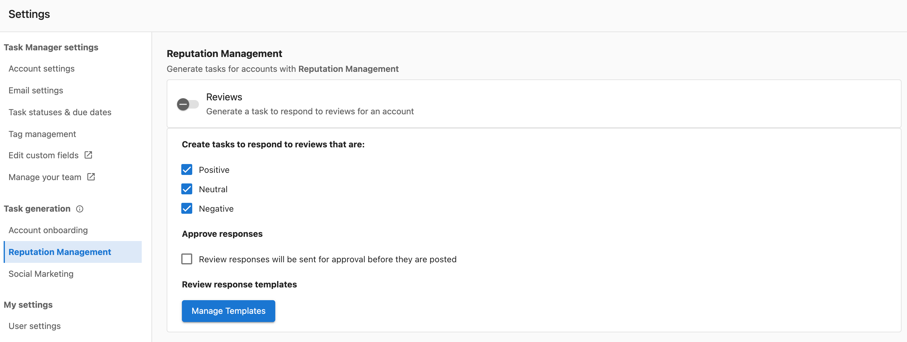
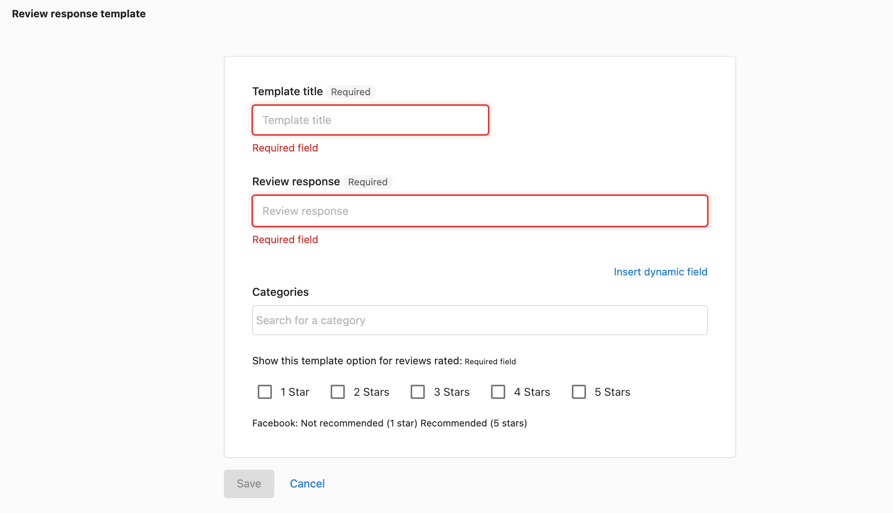

# Specialized Task Types

## ¿Qué son los tipos de tareas especializadas?

Los tipos de tareas especializadas son flujos de trabajo específicos diseñados para actividades de negocio particulares, como gestionar respuestas a reseñas, manejar credenciales de inicio de sesión y gestionar procesos de aprobación. Estas tareas tienen interfaces y procesos únicos adaptados a sus propósitos específicos.

## ¿Por qué son importantes las tareas especializadas?

Las tareas especializadas te ayudan a:

- **Gestionar flujos de trabajo específicos**: usa interfaces diseñadas para actividades comunes
- **Mantener la consistencia**: aplica procesos estandarizados en tareas similares
- **Mejorar la eficiencia**: accede a herramientas y plantillas especializadas
- **Garantizar la calidad**: usa flujos de trabajo guiados para interacciones importantes con clientes

## Review Response Tasks

Las tareas de respuesta a reseñas te ayudan a gestionar y responder a las reseñas de clientes con flujos de aprobación y respuestas basadas en plantillas.

### ¿Por qué son importantes las Review Response Tasks?

Las respuestas a reseñas son fundamentales para:
- **Relaciones con clientes**: muestran que valoras la retroalimentación del cliente
- **Reputation AI**: abordar las inquietudes de manera pública y profesional
- **Eficiencia a escala**: usar plantillas para mantener la calidad mientras ahorras tiempo
- **Aprobación del cliente**: asegurarte de que los clientes aprueben las respuestas antes de publicarlas

### Cómo solicitar aprobación para respuestas a reseñas

Antes de responder a las reseñas de clientes, es posible que necesites la aprobación del cliente:

1. Ve a `Task Manager` → `Tasks`
2. Usa filtros para encontrar las tareas de reseñas que requieren respuesta (se recomienda usar el estado Open y el filtro de reseñas)
3. Elige entre:
   - AI suggested response
   - Existing template
   - Custom response
4. Haz clic en `Request Approval`

#### Detalles del correo de aprobación

El correo de aprobación incluye:
- Saludo personalizado
- Fuente de la reseña
- Nombre del autor de la reseña
- Cuerpo de la solicitud (por ejemplo, "Please approve within 24 hours")
- Contenido de la reseña
- Firma profesional

Después de enviarlo, Task Manager:
- Registra la hora en una nota pública
- Cambia el estado de la tarea a "Waiting on Customer"

:::info
Los correos de aprobación se envían a los usuarios de Business App y destinatarios de notificaciones que tienen activado **Review Response Approval** en Business App > Settings > Notification Settings > Reputation AI.
:::

### Cómo crear plantillas de respuesta a reseñas

Las plantillas ayudan a mantener la consistencia y ahorrar tiempo al responder reseñas.

1. Inicia sesión en `Task Manager`
2. Ve a `Settings` → `Task generation` → `Reputation AI`
3. Haz clic en `Manage Templates`

4. Haz clic en `+ Add New Template`
5. Configura los ajustes de la plantilla:
   - **Title**: nombre descriptivo para la plantilla
   - **Response Content**: el texto de la plantilla
   - **Star Rating**: a qué calificaciones por estrellas aplica esta plantilla
   - **Business Categories**: restricciones de categoría opcionales
6. Haz clic en `Save`

### Cómo funcionan las plantillas de reseñas

- **Aleatorización**: las respuestas se aleatorizan según criterios para evitar respuestas repetitivas
- **Coincidencia de criterios**: las plantillas se seleccionan según la calificación por estrellas y la categoría de negocio
- **Personalización**: puedes editar las respuestas sugeridas antes de enviarlas

## Login Credentials Management

Gestiona de forma segura los nombres de usuario y contraseñas de los clientes para completar tareas.

### ¿Por qué es importante la gestión de credenciales?

El almacenamiento seguro de credenciales te ayuda a:
- **Completar tareas de manera eficiente**: accede a las cuentas de los clientes cuando lo necesites
- **Mantener la seguridad**: almacena las credenciales de forma segura dentro de Task Manager
- **Optimizar la incorporación**: recopila las credenciales durante la configuración del cliente
- **Organizar el acceso**: mantén toda la información de acceso del cliente en un solo lugar

### Cómo agregar credenciales a través de tareas de incorporación

1. Ve a `Fulfillment` → `Task Manager` → `Tasks`
2. Usa filtros y/o búsqueda para encontrar la Onboarding Task
3. En la tarea de incorporación, haz clic en el enlace `+Add Credentials`
4. Ingresa la información de inicio de sesión del cliente de forma segura

### Cómo agregar credenciales a través de Account Settings

1. Ve a `Fulfillment` → `Task Manager` → `Accounts`
2. Usa la búsqueda para encontrar la cuenta
3. Haz clic en `Account Settings`
4. Ve a `Source Settings`
5. Expande las secciones relevantes:
   - Search engines
   - Review Sites
   - Directories
   - Social Sites
6. Haz clic en `Edit Credentials` para ingresar Username y Password
7. Haz clic en `Save`

### Buenas prácticas de seguridad de credenciales

- Solo almacena credenciales cuando sea necesario para completar la tarea
- Usa el nivel de acceso más específico posible
- Revisa y actualiza regularmente las credenciales almacenadas
- Sigue las políticas de seguridad de tu organización
- Elimina las credenciales cuando ya no sean necesarias

## Approval Workflows

### Proceso de aprobación de respuesta a reseñas

1. **Crear respuesta**: redacta una respuesta en la tarea de reseña
2. **Solicitar aprobación**: haz clic en el botón "Request Approval"
3. **Correo enviado**: la solicitud de aprobación se envía a los destinatarios designados
4. **Cambio de estado**: el estado de la tarea cambia a "Waiting on Customer"
5. **Respuesta del cliente**: el cliente aprueba o solicita cambios
6. **Finalización**: publica la respuesta aprobada o realiza los cambios solicitados

### Configuración de notificaciones de aprobación

Los clientes deben activar las notificaciones en su Business App:
- Ve a Business App > Settings > Notification Settings
- Activa "Review Response Approval" en Reputation AI
- Configura las preferencias de correo electrónico

## Buenas prácticas para tareas especializadas

### Review Response Tasks
- Crea plantillas para los tipos de reseñas comunes
- Personaliza las respuestas cuando sea posible
- Solicita siempre aprobación para respuestas sensibles
- Haz seguimiento de los tiempos de respuesta y las tasas de aprobación del cliente

### Credentials Management
- Usa contraseñas fuertes y únicas al crear cuentas
- Almacena solo la información de inicio de sesión necesaria
- Documenta cualquier requisito de acceso especial
- Audita regularmente las credenciales almacenadas

## Preguntas frecuentes

¿Qué sucede cuando solicito aprobación para una respuesta a una reseña?

El correo de solicitud de aprobación se envía a todos los usuarios de Business App y destinatarios de notificaciones de esa cuenta que tienen activado Review Response Approval. Task Manager registra la hora en una nota pública y cambia el estado de la tarea a "Waiting on Customer".

¿Puedo crear plantillas de tarea personalizadas?

Puedes crear plantillas de respuesta a reseñas para diferentes calificaciones por estrellas y categorías de negocio en Settings > Task generation > Reputation AI. Para otros tipos de tareas personalizadas, deberás crearlas manualmente o usar las funciones de autogeneración para los tipos de tarea estándar.

¿Dónde se almacenan las credenciales de inicio de sesión y qué tan seguras son?

Las credenciales de inicio de sesión se almacenan de forma segura dentro de Task Manager y se puede acceder a ellas a través de las tareas de Onboarding o Account Settings. Sigue las políticas de seguridad de tu organización y almacena credenciales solo cuando sea necesario para completar la tarea.

¿Puedo personalizar el contenido del correo de aprobación?

El correo de aprobación incluye elementos estándar como saludo, fuente de la reseña, nombre del autor de la reseña y contenido de la reseña. El texto del cuerpo parece ser configurable (por ejemplo, "Please approve within 24 hours"), pero las opciones de personalización específicas no se detallan en la documentación disponible.

¿Cuál es la diferencia entre las respuestas sugeridas por IA y las plantillas para reseñas?

Las respuestas sugeridas por IA se generan automáticamente según el contenido de la reseña, mientras que las plantillas son respuestas preescritas que creas para calificaciones por estrellas y categorías de negocio específicas. Ambas se pueden personalizar antes de enviarlas y requieren la aprobación del cliente.

¿Puedo desactivar tipos específicos de tareas autogeneradas?

Sí, puedes controlar la generación de tareas tanto a nivel global (Settings > Reputation AI o Social AI) como por cuenta (Account Settings > Task generation). Cada tipo de tarea se puede activar o desactivar de forma independiente.

