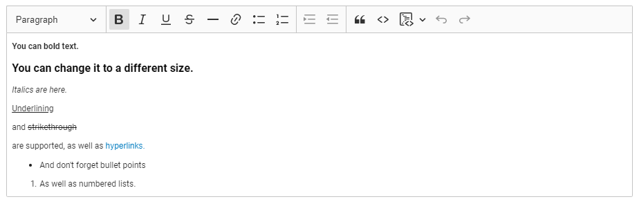
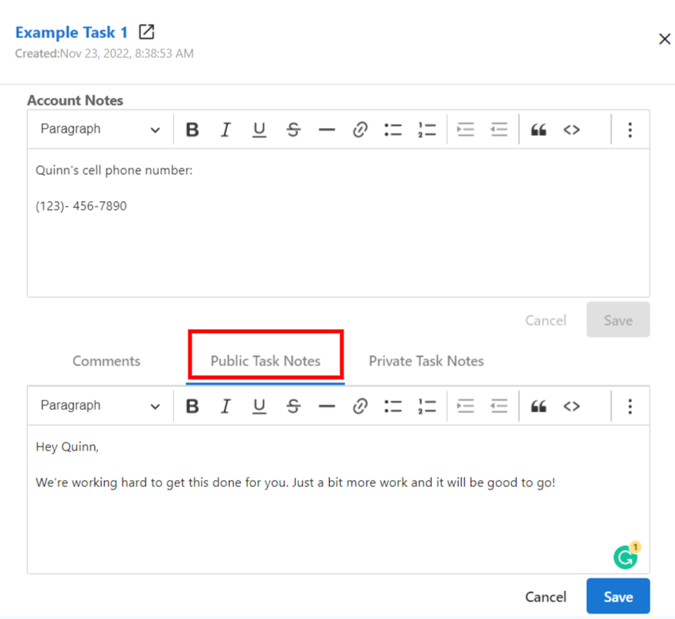
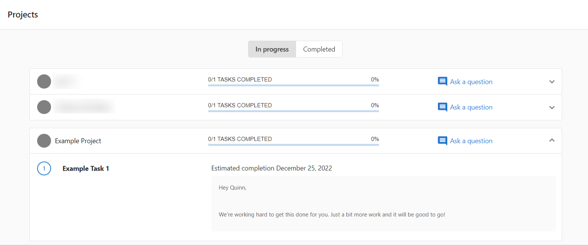
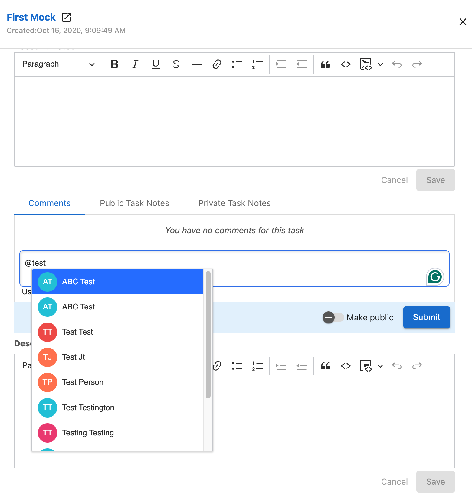
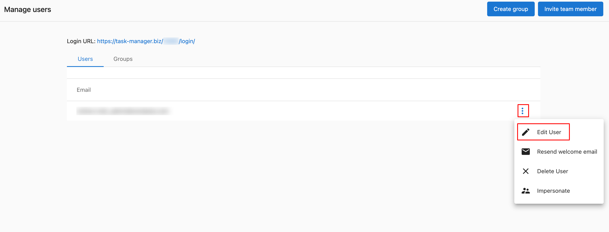
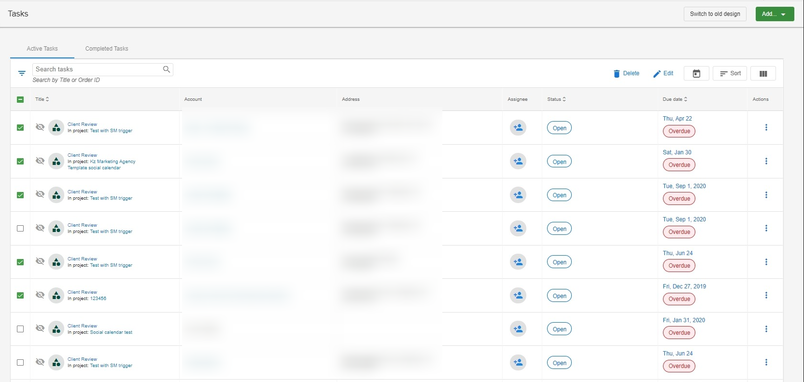
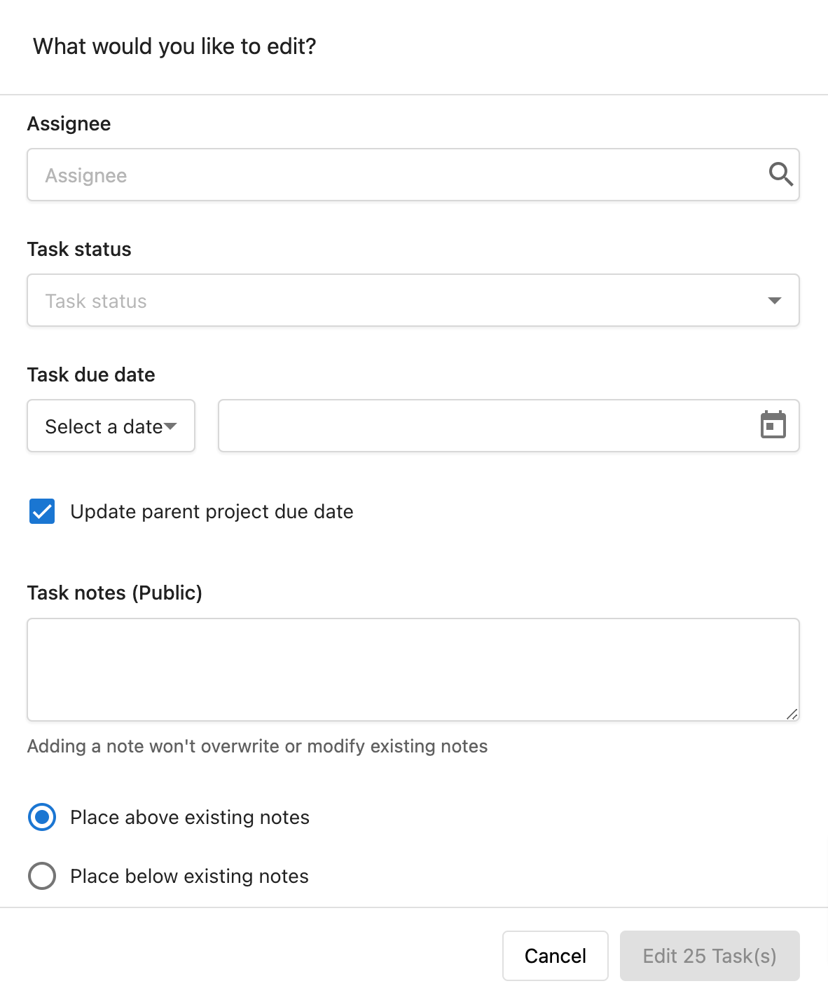
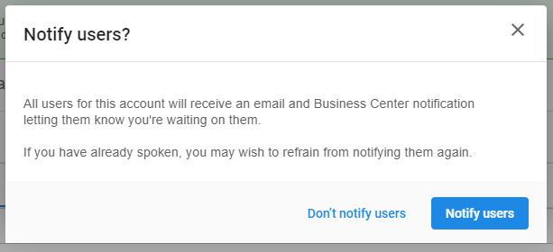

## ¿Qué es la comunicación y colaboración en tareas?

Las funciones de comunicación y colaboración en tareas permiten un trabajo en equipo efectivo y la interacción con clientes a través de las tareas. Estas herramientas incluyen formato de texto enriquecido, etiquetado de usuarios, notas públicas para clientes, flujos de aprobación y capacidades de edición masiva.

## ¿Por qué es importante la comunicación en las tareas?

Una comunicación efectiva en las tareas te ayuda a:

- **Mejorar el trabajo en equipo**: mantén informados y comprometidos a los miembros del equipo
- **Mejorar las relaciones con clientes**: comparte la información adecuada con los clientes
- **Optimizar los flujos de trabajo**: reduce los correos electrónicos y la comunicación externa
- **Mantener la responsabilidad**: haz seguimiento de las decisiones y aprobaciones dentro de las tareas
- **Escalar operaciones**: gestiona la comunicación de manera eficiente en varias tareas

## Cómo usar texto enriquecido en las notas de tareas

### Opciones de formato de texto enriquecido

Puedes dar formato a las notas de tareas y descripciones de proyectos usando:
- **Texto en negrita** para énfasis
- *Texto en cursiva* para énfasis sutil
- Hipervínculos a recursos relevantes

Esto ayuda a resaltar información importante y mantiene todos los detalles relevantes organizados dentro de las tareas.

### Buenas prácticas para el texto enriquecido

- **Negrita** para información crítica o plazos
- *Cursiva* para detalles opcionales o complementarios
- **Hipervínculos** para documentación, recursos o sitios externos relevantes
- Mantén el formato consistente en todo tu equipo

## Cómo usar notas públicas frente a privadas

### Notas públicas en Business App

Las notas públicas en tareas visibles para los usuarios de Business App aparecerán en la interfaz de Business App del cliente, en Projects. Esto mejora la comunicación con el cliente y te da control sobre la información compartida.

Las notas públicas luego aparecen en Business App:

### Cuándo usar notas públicas
- Actualizaciones de estado del proyecto
- Próximos pasos para los clientes
- Acciones requeridas del cliente
- Información general de progreso

### Cuándo usar notas privadas
- Discusiones internas del equipo
- Información sensible del cliente
- Detalles técnicos
- Discusiones de estrategia

:::warning
Si tienes notas públicas que no deseas compartir, muévelas a notas privadas antes de hacer visibles las tareas a los clientes.
:::

## Cómo etiquetar usuarios en los comentarios

### Proceso de etiquetado

1. Ve a `Fulfillment` → `Task Manager` → `Tasks`
2. Haz clic en una tarea
3. En el panel lateral, haz clic en `Comments`
4. Escribe tu comentario e ingresa `@` seguido del nombre de un miembro del equipo
5. Haz clic en el usuario que deseas etiquetar
6. Haz clic en `Submit`

### Notificaciones de comentarios

Cuando se les etiqueta, los usuarios reciben:
- **Notificación en la aplicación** con un enlace directo a la tarea
- **Aviso por correo electrónico** con el contenido del comentario (a menos que esté desactivado en su configuración de notificaciones)

### Buenas prácticas para el etiquetado de usuarios

- Etiqueta a los miembros del equipo relevantes para obtener aportes o acciones
- Usa mensajes claros y específicos al etiquetar
- No etiquetes en exceso: incluye solo a las personas necesarias
- Haz seguimiento de las etiquetas para asegurarte de que se tome acción

## Cómo usar la edición masiva para la colaboración

La edición masiva te permite actualizar rápidamente varias tareas simultáneamente, mejorando la eficiencia y consistencia del equipo.

### Requisitos previos para la edición masiva

Antes de editar tareas de forma masiva, asegúrate de tener:

1. **Account User Manager Role**: permiso para gestionar usuarios y niveles de acceso
2. **Team Member with Admin Access**: permisos administrativos para las cuentas
3. **Manager Role**: los usuarios deben estar configurados como Manager en su perfil para completar acciones masivas

### Configurar el rol Manager
1. Ve a `Partner Center` → `Fulfillment` → `Users` → `Manage Users`
2. Haz clic en el menú y en `Edit User`
3. Selecciona `Manager`

### Proceso de edición masiva

#### 1. Selecciona las tareas
- Ve a la sección Tasks
- Marca las casillas junto a las tareas que quieres editar
- Usa filtros para acotar las tareas antes de seleccionarlas

#### 2. Aplica las ediciones
- Haz clic en el botón `Edit` en la parte superior de la lista de tareas
- Elige los campos a actualizar (estado, asignado, plazo)
- Realiza tus cambios
- Haz clic en `Save` para aplicar los cambios a todas las tareas seleccionadas

#### 3. Revisa los cambios
Verifica que las ediciones se hayan aplicado correctamente y comunica los cambios a los miembros del equipo afectados.

### Buenas prácticas de edición masiva

- **Filtra primero**: usa filtros para acotar tu selección antes de la edición masiva
- **Verifica la selección**: confirma que has seleccionado solo las tareas que quieres editar
- **Comunica los cambios**: informa a los miembros del equipo afectados sobre los cambios masivos
- **Úsala regularmente**: implementa la edición masiva como parte del mantenimiento regular de tareas

:::warning
**Limitaciones de la edición masiva:**
- Es posible que algunos campos de tarea no estén disponibles para la edición masiva
- No puedes editar tareas de diferentes cuentas simultáneamente
- Los campos personalizados pueden tener requisitos o limitaciones específicas
:::

## Cómo gestionar el estado Waiting on Customer

### Configurar tareas como "Waiting on Customer"

Al configurar tareas visibles como "Waiting on Customer", puedes notificar a los clientes, quienes recibirán:
- Notificaciones de Business App
- Notificaciones por correo electrónico que los dirigen a la página Projects

### Cuándo usar "Waiting on Customer"
- En espera de la aprobación del cliente
- Se requiere información del cliente
- Decisión del cliente pendiente
- El cliente necesita completar una acción

### Proceso de notificación
1. Cambia el estado de la tarea a "Waiting on Customer"
2. Elige si notificar al cliente
3. Agrega notas públicas explicando qué estás esperando
4. El cliente recibe una notificación con un enlace a Business App

## Archivos adjuntos

Puedes adjuntar archivos a tareas y proyectos individuales en Task Manager para compartir materiales de apoyo con tu equipo.

### Qué se admite

- **Tipos de archivo**: imágenes, videos y documentos
- **Tamaño máximo de archivo**: 10 MB por archivo
- **Máximo de archivos por tarea o proyecto**: 10 archivos
- **Archivos ZIP**: no compatibles. Los archivos ZIP no se pueden subir

### Visibilidad de archivos

Los archivos adjuntos de Task Manager son visibles solo para tu equipo. **No** aparecen en la Business App del cliente, incluso si la tarea en sí está configurada como visible.

Para compartir un archivo con un cliente, usa uno de estos enfoques en su lugar:
- **Account Files**: súbelo a través de `Partner Center` → `Accounts` → `Files` → activa la visibilidad en Business App
- **Enlace de almacenamiento en la nube**: pega un enlace de Google Drive o Dropbox en una nota de tarea pública

:::info
Para la aprobación formal de contenido social, usa el [flujo de revisión de cliente de Social Calendar](#social-calendar-client-review) en lugar de archivos adjuntos.
:::

## Flujos de colaboración

### Colaboración interna del equipo
1. Usa notas privadas para discusiones del equipo
2. Etiqueta a los miembros del equipo para obtener aportes o acciones
3. Usa la edición masiva para asignar tareas a los miembros del equipo
4. Haz seguimiento del progreso a través de actualizaciones de estado

### Colaboración con el cliente
1. Usa notas públicas para actualizaciones del cliente
2. Configura las tareas correspondientes como visibles en Business App
3. Usa el estado "Waiting on Customer" cuando se necesite la acción del cliente
4. Da formato a la información importante con texto enriquecido

### Colaboración entre cuentas
1. Usa un etiquetado consistente en todas las cuentas
2. Edita de forma masiva tareas similares en varias cuentas
3. Mantén estándares de comunicación consistentes
4. Comparte plantillas y buenas prácticas

## Preguntas frecuentes

¿Qué sucede cuando etiqueto a alguien en un comentario de tarea?

Los usuarios etiquetados reciben tanto una notificación en la aplicación como un aviso por correo electrónico (a menos que hayan desactivado las notificaciones). La notificación en la aplicación incluye un enlace directo a la tarea, y el correo electrónico contiene el contenido del comentario.

¿Puedo usar formato de texto enriquecido en todas las notas de tareas?

Sí, puedes usar negrita, cursiva e hipervínculos tanto en las notas de tareas como en las descripciones de proyectos. Esto ayuda a resaltar información importante y organizar el contenido de manera efectiva.

¿Cuál es la diferencia entre notas públicas y privadas?

Las notas públicas en tareas visibles para los usuarios de Business App aparecerán en la interfaz del cliente, en Projects. Las notas privadas permanecen internas para tu equipo. Si tienes información sensible, mantenla en notas privadas.

¿Qué permisos necesito para editar tareas de forma masiva?

Necesitas tres cosas: el rol Account User Manager, Team Member with Admin Access para las cuentas relevantes, y el rol Manager en tu perfil de usuario. Sin el rol Manager, no puedes completar acciones masivas en Task Manager.

¿Puedo editar tareas de diferentes cuentas al mismo tiempo?

No, no puedes editar de forma masiva tareas de diferentes cuentas simultáneamente. Solo puedes editar de forma masiva tareas dentro de la misma cuenta a la vez.

¿Cómo me aseguro de que los clientes vean actualizaciones importantes de las tareas?

Usa notas públicas para la información que quieres que los clientes vean, configura las tareas como visibles en Business App, y usa el estado "Waiting on Customer" con notificaciones cuando se necesite la intervención del cliente. El formato de texto enriquecido puede ayudar a resaltar información importante en las notas públicas.

¿Puedo desactivar las notificaciones para los comentarios en los que me etiquetan?

Sí, los usuarios pueden desactivar las notificaciones en su configuración personal. Sin embargo, la función de etiquetado en sí seguirá funcionando; simplemente no recibirán notificaciones automáticas sobre haber sido etiquetados.

¿Qué sucede cuando edito de forma masiva las asignaciones de tareas?

Cuando editas de forma masiva las asignaciones de tareas, todas las tareas seleccionadas se asignarán al nuevo miembro del equipo. Asegúrate de comunicar estos cambios tanto al asignado anterior como al nuevo para garantizar transiciones fluidas.

