## ¿Qué es la gestión de usuarios?

La gestión de usuarios te permite crear, organizar y gestionar a los miembros del equipo que colaborarán en proyectos y tareas. El sistema incluye la creación de usuarios, la organización en grupos, la gestión de notificaciones y el control de permisos para estructurar tu equipo de cumplimiento de manera efectiva.

## ¿Por qué es importante la gestión de usuarios?

A medida que las empresas crecen, aumenta la necesidad de estructura. Las personas comienzan a especializarse, se forman equipos y el trabajo se divide. La mayoría de las agencias más grandes cuentan con jerarquías complejas de personas. La gestión de usuarios garantiza que la persona adecuada haga el trabajo adecuado, adaptando tu software de gestión de tareas a cómo funciona tu organización en el mundo real.

Task Manager funciona mejor cuando tu equipo lo usa en conjunto. Puedes ver los proyectos y tareas asignados entre sí, hacer seguimiento de las responsabilidades y asignar automáticamente tareas específicas a determinados miembros del equipo.

## Qué incluye la gestión de usuarios

### Creación y gestión de usuarios
- Crea usuarios nuevos de Task Manager con roles específicos
- Asigna permisos de Digital Agent o Manager
- Envía correos de bienvenida a los usuarios nuevos
- Actualiza los permisos de usuarios existentes

### User groups
- Crea grupos que contengan usuarios de Task Manager y otros grupos
- Estructura jerarquías de personal que coincidan con la organización del mundo real
- Filtra la página `Tasks > Overview` por grupo
- Agrega usuarios y grupos a varios grupos (relaciones de muchos a muchos)

### Sistema de notificaciones
- Notificaciones en la aplicación y alertas por correo electrónico para las asignaciones de tareas
- Preferencias de notificación personalizables para cada usuario
- Notificaciones especializadas como "Product Deactivated" y "Tasks Due Tomorrow"
- Enlaces directos desde las notificaciones a tareas específicas

### Control de acceso
- Permisos basados en roles (Digital Agent frente a Manager)
- Capacidades específicas de Manager (eliminar tareas, reasignación masiva, gestión de grupos)
- Restricciones de acceso para clientes (los clientes no pueden acceder a Task Manager)

## Cómo crear usuarios

1. Ve a `Partner Center` → `Fulfillment` → `Users`
2. Haz clic en `Invite Team Member` O busca un usuario existente para actualizar sus permisos
3. **Opción 1: invitar a un nuevo miembro del equipo**
   - Ingresa su `First name`, `Last name` y `Email`
   - Elige su `Role` como Digital Agent
   - Opcional: haz que el usuario sea manager (los Managers pueden eliminar y reasignar tareas de forma masiva, y gestionar grupos de Task Manager)
   - Opcional: envía Welcome Email to User
4. **Opción 2: actualizar un usuario existente**
   - Busca un usuario existente
   - Edita Team Member Permissions a Digital Agent/Manager

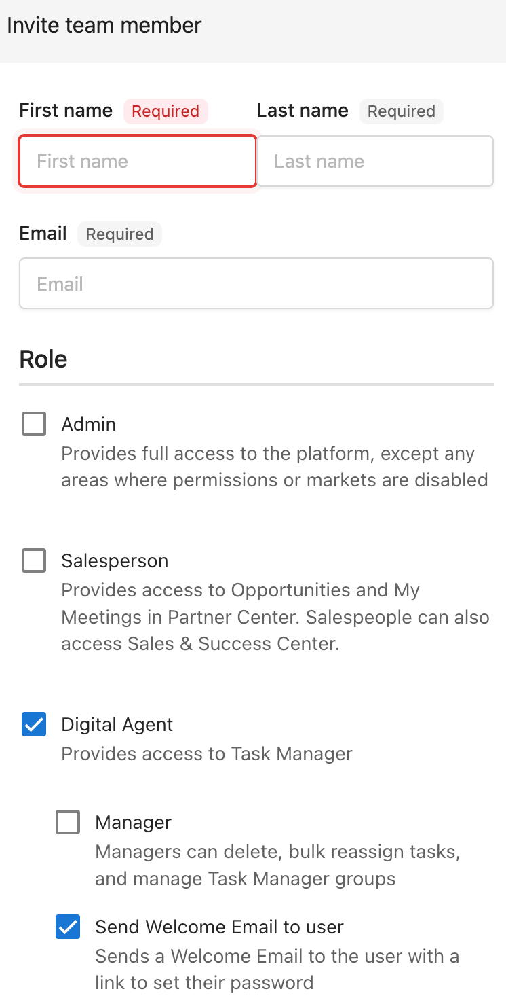

## Cómo crear y gestionar grupos de usuarios

### Crear grupos de usuarios

1. Ve a `Partner Center` → `Fulfillment` → `Users`
2. Haz clic en `Create group`
3. Ponle un nombre al grupo
4. Opcional: agrega usuarios y otros grupos
5. Haz clic en `Create group`

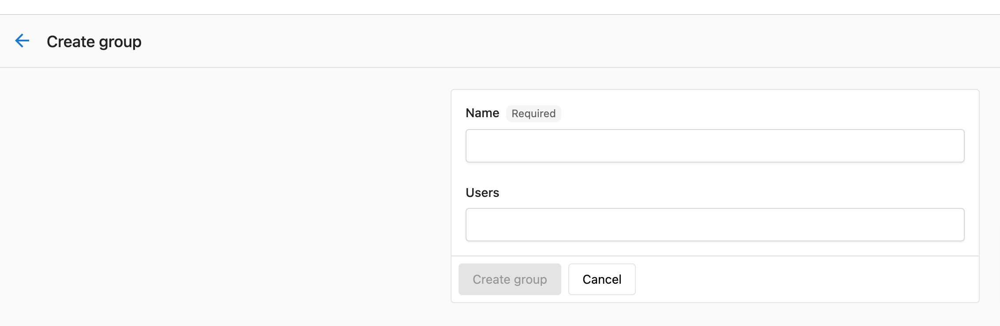

### Comprender la estructura de grupos

Los grupos pueden contener usuarios de Task Manager y otros grupos. La relación no es de uno a uno, por lo que puedes agregar cada usuario y grupo a tantos grupos como desees.

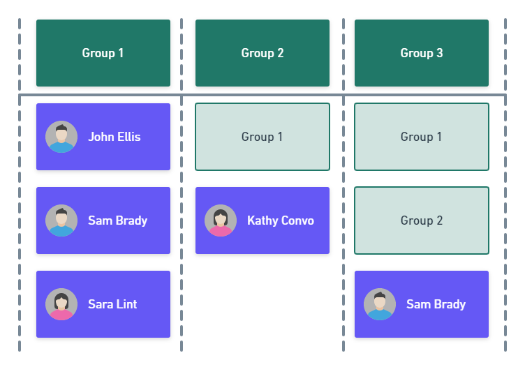

Si el Grupo 3 contiene tanto al Grupo 1 como al Grupo 2, entonces todos los miembros del Grupo 1 y del Grupo 2 formarán automáticamente parte del Grupo 3. Si quitas a un usuario directamente del Grupo 3, seguirá perteneciendo a ese grupo si forma parte del Grupo 1 o del Grupo 2.

### Agregar usuarios a grupos existentes

1. Ve a `Partner Center` → `Fulfillment` → `Users`
2. Haz clic en `Groups`
3. Haz clic en el `menú (3 puntos)` → `Edit group` junto al grupo que quieres modificar
4. Haz clic en los campos `Users` para agregar o quitar usuarios o grupos
5. Haz clic en `Edit group`

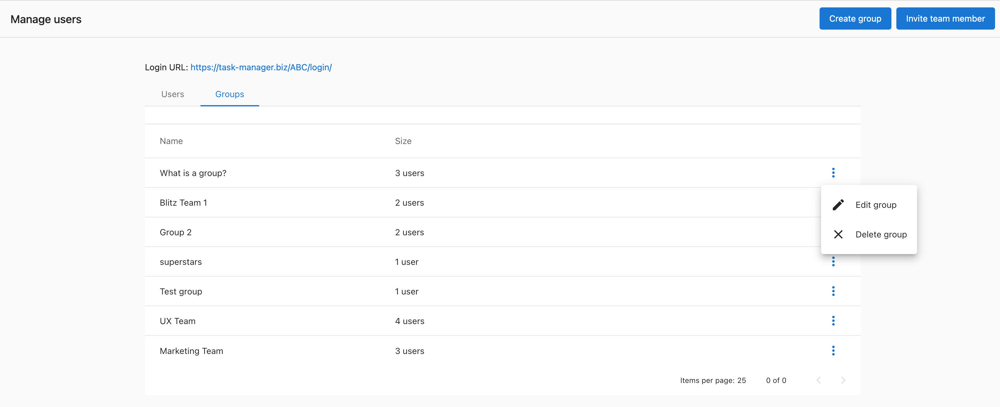

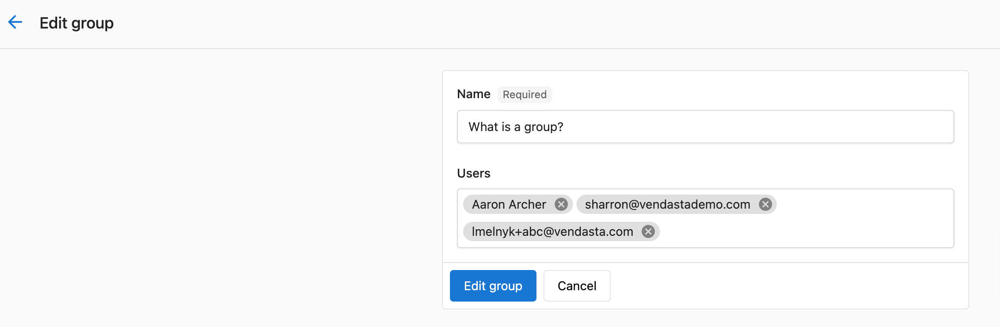

### Editar o eliminar grupos

1. Ve a `Partner Center` → `Fulfillment` → `Users`
2. Haz clic en `Groups`
3. Haz clic en el `menú (3 puntos)` junto al grupo que quieres modificar
4. Elige `Edit group` para modificar o `Delete group` para quitarlo
5. Para eliminar: haz clic en `Delete group` para confirmar la eliminación

:::warning
Si un usuario forma parte de un grupo en el campo Groups, ese usuario seguirá formando parte del grupo que estás editando. Para asegurarte de que se quite por completo, también deberás quitarlo de cualquier otro grupo listado del que forme parte.
:::

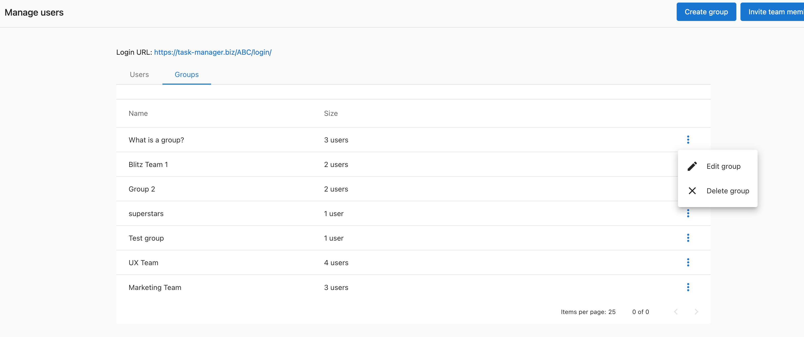

## Cómo gestionar las notificaciones de usuario

### Ajustar la configuración de notificaciones individual

Los usuarios de Task Manager pueden ajustar su configuración de notificaciones directamente dentro de Task Manager:

1. Ve a `Partner Center` → `Fulfillment` → `Task Manager`
2. Haz clic en la `campana de notificaciones` en la barra de navegación superior
3. Haz clic en el ícono de `engranaje de configuración`
4. Desplázate hasta `Task` y marca las notificaciones que deseas recibir
5. Haz clic en `Save` en la parte superior derecha de la pantalla

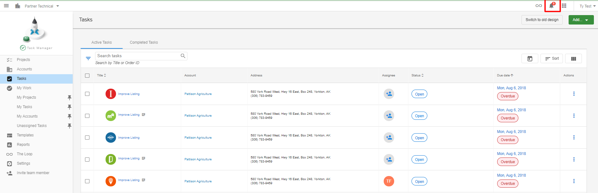

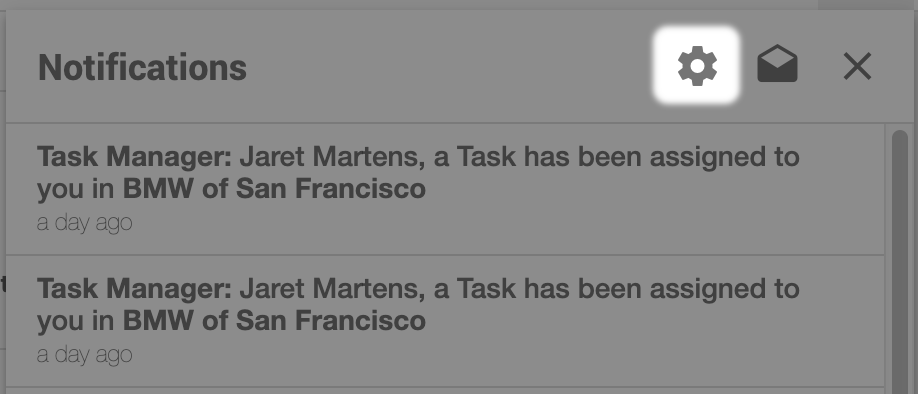

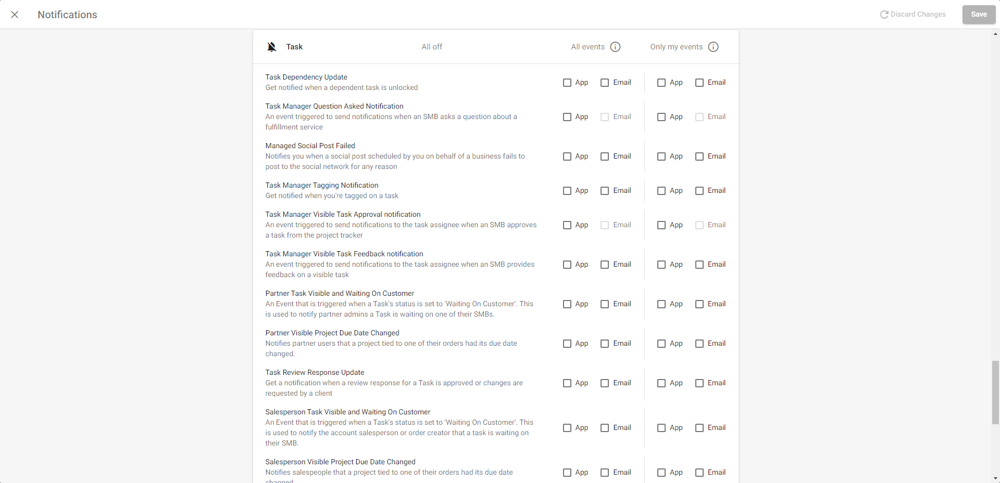

### Tipos de notificación clave

**Notificaciones esenciales de cumplimiento:**
- **Product Deactivated**: recibe una notificación cuando se desactiva un producto asociado a un proyecto. Esto ayuda a los agentes a decidir si continuar trabajando en un proyecto
- **Tasks Due Tomorrow**: cuando las tareas están dentro de las 24 horas de su plazo, se notifica al agente

**Notificaciones de asignación de tareas:**
- **Task Assignee Update**: recibe una notificación cuando se te asigna una tarea
- **Task Manager Tagging Notification**: recibe una notificación cuando te etiquetan en una tarea
- **Task Dependency Update**: recibe una notificación cuando se desbloquea una tarea dependiente

**Notificaciones de interacción con el cliente:**
- **Task Manager Visible Task Approval notification**: recibe una notificación cuando un cliente aprueba una tarea desde el rastreador del proyecto
- **Task Manager Visible Task Feedback notification**: recibe una notificación cuando un cliente da retroalimentación sobre una tarea visible
- **Task waiting for your input**: recibe una notificación cuando hay una tarea esperando tu intervención

### Gestionar la configuración de notificaciones de todo el sistema

Tanto Product Deactivated como Tasks Due Tomorrow están activadas de forma predeterminada. Cualquier usuario puede cambiar su configuración de notificaciones:

1. Inicia sesión en `Partner Center`
2. Haz clic en  → 
3. Desmarca ambas notificaciones (correo electrónico y en la aplicación) en `Task`
4. Haz clic en `Save`

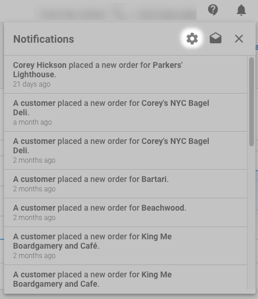

## Comprender las restricciones de acceso para clientes

**Los clientes no tienen acceso a Task Manager.** Task Manager es una herramienta de gestión de proyectos diseñada para agentes de cumplimiento y otros equipos internos. Si agregaras a un cliente como usuario de Task Manager, podría ver todas las cuentas, no solo la suya. También podría ver notas privadas y ajustar la configuración global de tareas.

Sin embargo, es posible que los clientes vean actualizaciones sobre sus proyectos de cumplimiento en Business App.

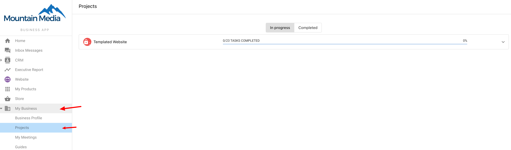

## Permisos de Manager frente a Digital Agent

### Permisos de Digital Agent
- Crear y completar tareas
- Ver proyectos y tareas asignados
- Recibir notificaciones
- Participar en actividades grupales

### Permisos de Manager (además de los permisos de Digital Agent)
- Eliminar tareas
- Reasignar tareas de forma masiva
- Gestionar grupos de Task Manager
- Acceder a funciones administrativas avanzadas

## Preguntas frecuentes

¿Pueden los clientes acceder a Task Manager?

No, los clientes no pueden acceder a Task Manager. Task Manager está diseñado solo para equipos internos de cumplimiento. Si se les diera acceso a los clientes, verían todas las cuentas e información privada, no solo sus propios proyectos.

¿Cuál es la diferencia entre un Digital Agent y un Manager?

Los Digital Agents pueden crear y completar tareas, mientras que los Managers tienen permisos adicionales, incluida la capacidad de eliminar tareas, reasignar tareas de forma masiva y gestionar grupos de Task Manager.

¿Puedo agregar un usuario a varios grupos?

Sí, la relación entre usuarios y grupos no es de uno a uno. Puedes agregar usuarios y grupos a varios grupos según sea necesario para adaptarte a la estructura de tu organización.

¿Cómo sé cuándo vencen pronto las tareas?

Activa la notificación "Tasks Due Tomorrow" para recibir alertas cuando las tareas estén dentro de las 24 horas de su plazo. Esta notificación está activada de forma predeterminada.

¿Qué sucede cuando se desactiva un producto?

Cuando se desactiva un producto asociado a un proyecto, los agentes de cumplimiento reciben una notificación de "Product Deactivated". Esto les ayuda a decidir si continuar trabajando en el proyecto asociado.

¿Puedo filtrar tareas por grupo de usuarios?

Sí, los managers pueden filtrar la página Tasks > Overview en Partner Center por grupo, lo que facilita gestionar el trabajo entre diferentes equipos.

¿Cómo funcionan las notificaciones cuando se me asigna una tarea?

Los usuarios de Task Manager reciben tanto notificaciones en la aplicación como correos electrónicos cuando se les asigna una tarea o proyecto. Al hacer clic en la notificación o el enlace del correo, se te lleva directamente a la tarea en Task Manager.

¿Qué sucede si quito a un usuario de un grupo pero está en un subgrupo?

Si un usuario forma parte de un subgrupo dentro del grupo que estás editando, seguirá formando parte del grupo principal. Deberás quitarlo de todos los grupos relevantes para eliminar por completo su acceso.

¿Puedo desactivar tipos específicos de notificaciones?

Sí, cada usuario puede personalizar sus preferencias de notificación a través de la configuración de notificaciones. Puedes elegir recibir notificaciones por correo electrónico, en la aplicación, o ambas, para diferentes tipos de eventos.

¿Cómo invito a alguien que ya tiene acceso a otras partes del sistema?

Puedes buscar usuarios existentes y actualizar sus permisos para incluir acceso de Digital Agent o Manager a Task Manager, en lugar de crear una nueva invitación.

¿Qué notificaciones reciben los vendedores sobre el cumplimiento?

Los vendedores pueden recibir notificaciones de "Tasks Due Tomorrow" para estar al tanto del trabajo próximo, y notificaciones cuando las tareas están "Waiting On Customer" para sus cuentas.

¿Los grupos pueden contener otros grupos?

Sí, los grupos pueden contener tanto usuarios individuales como otros grupos. Esto crea una jerarquía en la que todos los miembros de los grupos contenidos forman parte automáticamente del grupo principal.

