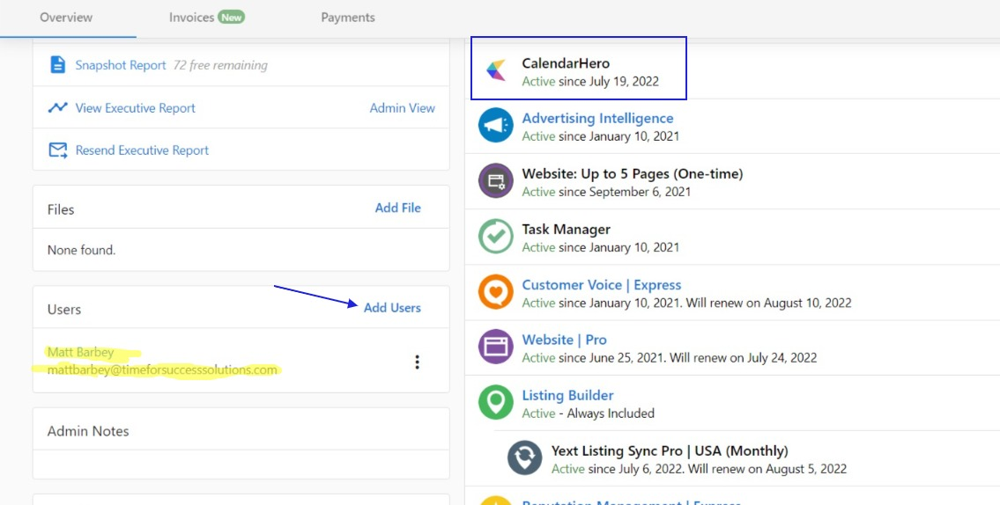
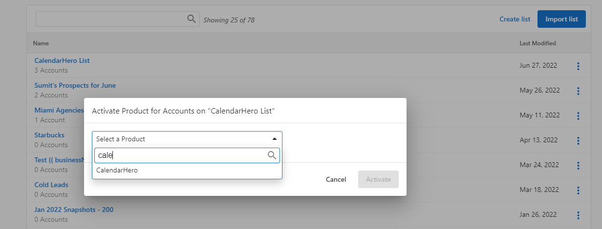
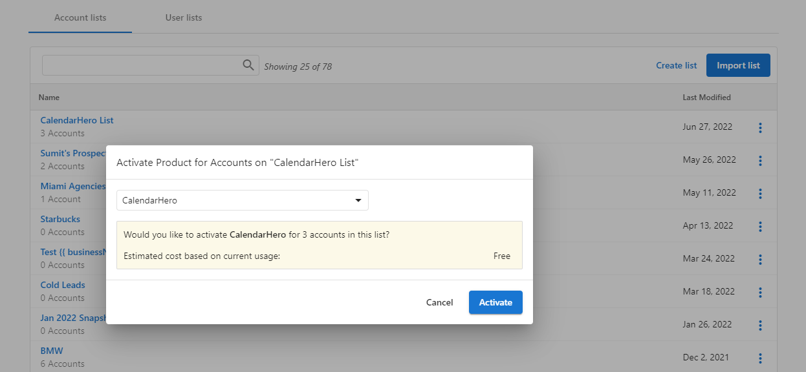

## Acceder a CalendarHero

1. Crea un nuevo usuario de Business App en Partner Center con CalendarHero activado para la cuenta.

2. El usuario inicia sesión en Business App y hace clic en `CalendarHero` en la navegación izquierda.

3. La cuenta de CalendarHero del usuario se crea automáticamente y se le dirige al panel para configurar su calendario y enlaces de reunión.

Para ser usuario de más de una cuenta de CalendarHero, cada cuenta requiere un usuario único con una dirección de correo electrónico diferente.

## Activar CalendarHero para todas las cuentas

No hay límite para cuántas versiones gratuitas de CalendarHero se pueden activar para los clientes.

1. Asegúrate de que el producto esté habilitado haciendo clic en `Start Selling` en Partner Center.

2. Crea una lista de todas las cuentas para las que quieres activar CalendarHero.

3. Haz clic en el menú de tres puntos junto a la lista y selecciona `Activate Product`.

4. Busca y selecciona CalendarHero, luego haz clic en `Activate`.

