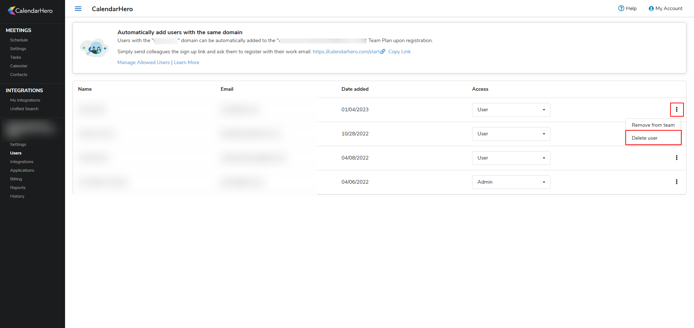

:::warning Producto heredado
CalendarHero es un producto de programación heredado. Esta documentación se mantiene como referencia histórica para partners que puedan seguir teniendo suscripciones activas de CalendarHero.
:::

CalendarHero era un producto de programación y calendario que permitía a los clientes ofrecer reservas en línea, reuniones y recordatorios a través de Business App. Admitía un plan gratuito (reuniones uno a uno, un tipo de reunión) y un plan Team (reuniones grupales, múltiples tipos, recordatorios por SMS, marca personalizada).

## ¿Qué es CalendarHero?

CalendarHero ofrecía programación en línea e integración de calendario para los clientes de Vendasta. Los usuarios podían acceder a través de `Business App` → `CalendarHero` una vez que el producto estaba activado para la cuenta. Ofrecía:

- **Plan gratuito**: reuniones uno a uno, un tipo de reunión, integraciones con Outlook y Google Calendar, incluido con la suscripción a la plataforma.
- **Plan Team**: tipos de reuniones grupales, múltiples tipos de reuniones, recordatorios por SMS, correos de confirmación y marca personalizada.

CalendarHero Free estaba incluido con la suscripción a la plataforma y se habilitaba automáticamente en cada Business App. No se requería configuración adicional. Los partners podían activarlo para muchas cuentas a la vez usando listas de cuentas y `Activate Product` en Partner Center. Consulta [Primeros pasos con CalendarHero](./getting-started.mdx) para obtener instrucciones paso a paso.

:::note Soporte
Para soporte del producto, escribe a [hello@calendarhero.com](mailto:hello@calendarhero.com).
:::

## Preguntas frecuentes

¿Cómo accede un usuario de Business App a CalendarHero?

Crea un usuario de Business App en Partner Center con CalendarHero activado para la cuenta. El usuario inicia sesión en Business App y selecciona CalendarHero en la navegación izquierda. Su cuenta de CalendarHero se crea automáticamente y puede configurar su calendario y enlaces de reunión.

¿Pueden las cuentas de CalendarHero iniciar sesión directamente en CalendarHero?

Sí. Una vez que se ha creado una cuenta de CalendarHero al iniciar sesión en `Business App` → `CalendarHero`, los clientes pueden acceder a la misma cuenta iniciando sesión directamente en CalendarHero, siempre que usen una cuenta de Google o Microsoft con la misma dirección de correo electrónico que usaron en Business App.

¿Cómo activo CalendarHero para todas mis cuentas de clientes?

Habilita el producto a través de Start Selling, crea una lista de cuentas y luego usa el menú de tres puntos junto a la lista y elige **Activate Product**. Busca y selecciona CalendarHero, luego haz clic en **Activate**.

¿Cómo reemplazo a usuarios en los asientos de CalendarHero Team?

Los administradores del plan Team gestionan a los miembros desde la [página de usuarios de CalendarHero](https://app.calendarhero.com/org/manageusers).

Una vez que se elimina un usuario, el asiento se puede asignar a un usuario nuevo haciendo que inicie sesión en Business App y acceda a CalendarHero. Ten en cuenta que eliminar un usuario lo quita de la organización y elimina permanentemente su cuenta y todos los datos asociados. Esto no se puede deshacer.

¿Por qué un usuario de CalendarHero no puede acceder a un asiento de equipo adicional?

Los asientos de equipo se asignan automáticamente cuando un usuario inicia sesión en `Business App` → `CalendarHero`, siempre que haya un asiento disponible y no se le haya asignado uno ya. Para asignar un asiento, haz que el usuario inicie sesión a través de Business App. Ten en cuenta que la suplantación (impersonation) no es compatible en CalendarHero.

¿Qué sucede cuando se cancela una suscripción de CalendarHero?

Cuando se cancela la suscripción de CalendarHero para una cuenta a través de Vendasta, las cuentas de todos los usuarios se eliminan y no se pueden recuperar.

