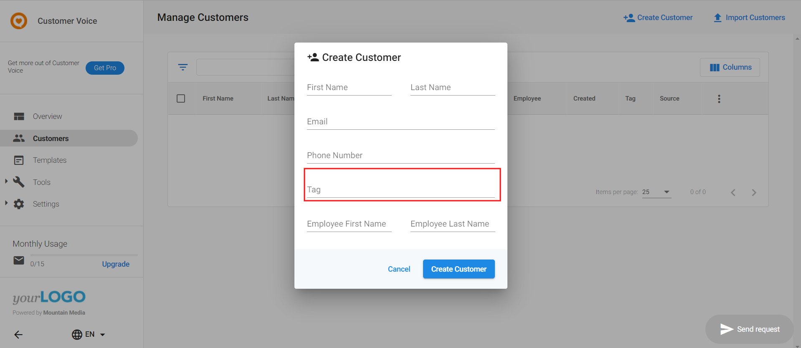
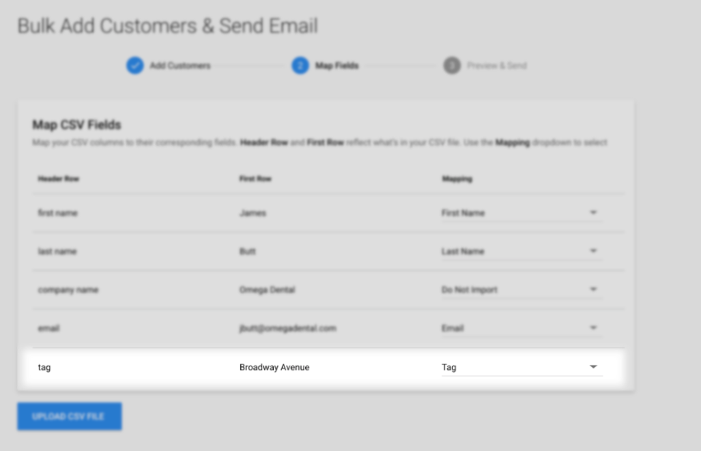
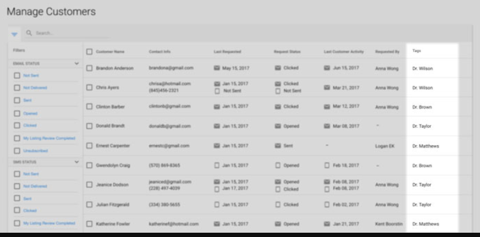

:::warning Obsoleto
Desde el 21 de febrero de 2025, Customer Voice es heredado (legacy). Usa [Reputation AI Premium](https://partners.vendasta.com/marketplace/products/RM) para reseñas y NPS por correo electrónico y SMS.
:::

La función Contact tag permite que tus clientes agreguen etiquetas a sus propios clientes. Esto les permite categorizar sus contactos según aspectos como los servicios o productos que compraron, o qué empleado los atendió. Por ejemplo, si varios médicos atienden en una sola ubicación de clínica, puedes etiquetar a los pacientes según qué médico los trató.

## Agregar una etiqueta de cliente

Al agregar un cliente al sistema, verás una opción para incluir una etiqueta.

Las etiquetas también se pueden incluir al cargar clientes de forma masiva usando un CSV.

## Filtrado

Una vez que se ha asociado una etiqueta a un contacto, se puede filtrar usando estas etiquetas en la página `Customers`. Esto permite una categorización sencilla al enviar solicitudes de reseñas.

