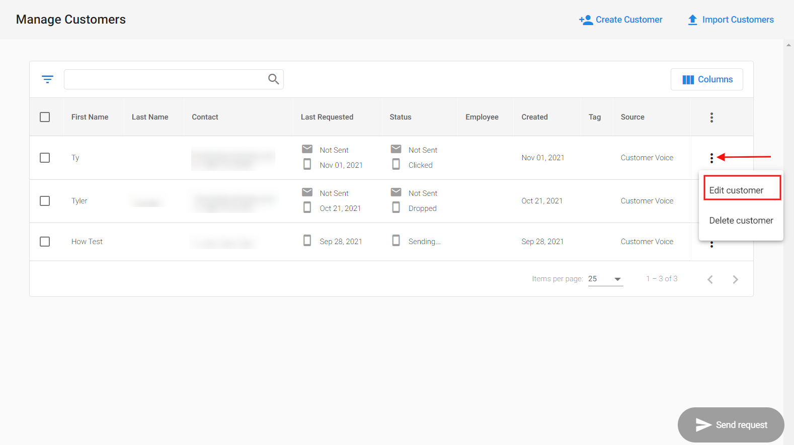
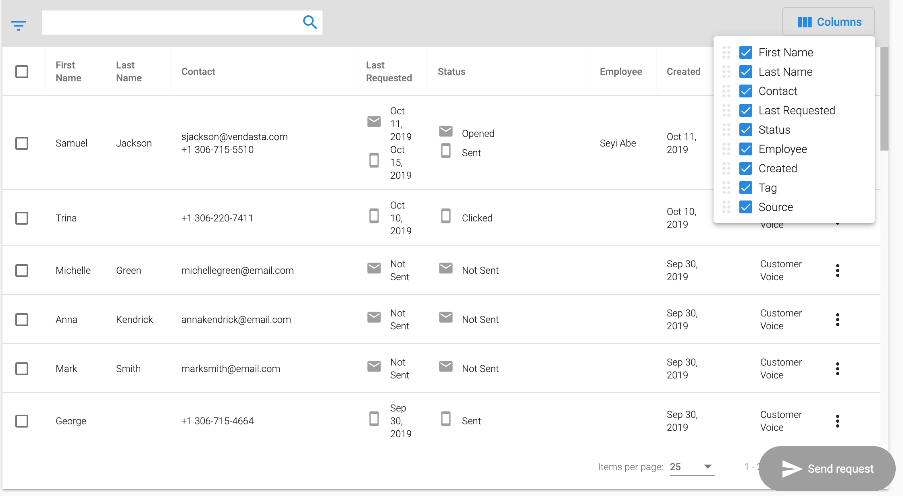

:::warning Obsoleto
Desde el 21 de febrero de 2025, Customer Voice es heredado (legacy). Usa [Reputation AI Premium](https://partners.vendasta.com/marketplace/products/RM) para reseñas y NPS por correo electrónico y SMS.
:::

## ¿Qué es la Customer Table?

La Customer Table en Customer Voice incluye una columna `Source` que muestra desde dónde se agregó un cliente nuevo, además de la capacidad de reordenar las columnas, ocultarlas y editar la información del cliente en la lista de clientes.

## ¿Por qué es importante la Customer Table?

Tienes la flexibilidad de editar el nombre y la información de contacto de tu cliente en la Customer Table. La columna Source te da la capacidad de hacer seguimiento de desde qué aplicación se agregó un cliente nuevo. También puedes personalizar la tabla reordenando las columnas o eligiendo ocultar las que no sean relevantes para tu negocio.

## ¿Cómo funciona la Customer Table?

Ve a `Customer Voice` → `Customers`.

1. Para editar un cliente, haz clic en el menú de ícono de puntos en el lado derecho de la tabla y luego elige `Edit customer`.
   

2. Para reordenar u ocultar columnas, haz clic en el botón `Columns` en la esquina superior derecha de la tabla. Puedes mostrar u ocultar columnas seleccionando la casilla junto al título de la columna en el menú desplegable. Puedes reordenar columnas haciendo clic y arrastrando el ícono de puntos junto al título de la columna.

   

<iframe src="//fast.wistia.com/embed/iframe/em8gkv736f" width="560" height="315" frameBorder="0" allow="autoplay; fullscreen" allowFullScreen></iframe>
