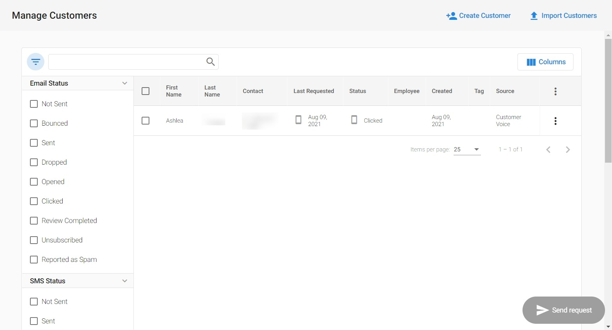

:::warning Obsoleto
Desde el 21 de febrero de 2025, Customer Voice es heredado (legacy). Usa [Reputation AI Premium](https://partners.vendasta.com/marketplace/products/RM) para reseñas y NPS por correo electrónico y SMS.
:::

Puedes ver los detalles del estado de tus solicitudes de reseña y el historial de correos en la Customer Table.

## ¿Por qué es importante ver el estado de la solicitud de reseña?

Haz seguimiento de forma rápida y sencilla de las solicitudes de reseña enviadas a un cliente individual y consulta un estado detallado del rendimiento de los correos enviados.

## ¿Cómo funciona ver el estado de la solicitud de reseña?

1. Ve a `Customer Voice` → `Customers`.
2. Haz clic en el botón `filter` , y en la columna `Email Status`, haz clic en el estado del que quieras ver los detalles.

Podrás ver la fecha y hora de cada solicitud de reseña por correo electrónico enviada a ese cliente, y las acciones que se han realizado, como apertura y clics. Si no se ha enviado ninguna solicitud, o el correo rebotó, se indicará que no hay historial de correo para ese cliente.

