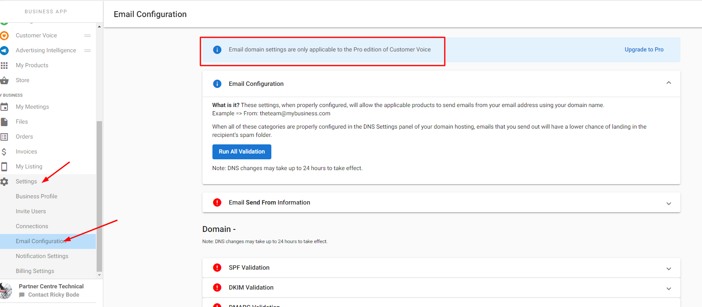

:::warning Obsoleto
Desde el 21 de febrero de 2025, Customer Voice es heredado (legacy). Usa [Reputation AI Premium](https://partners.vendasta.com/marketplace/products/RM) para reseñas y NPS por correo electrónico y SMS.
:::

Una pregunta frecuente en Customer Voice era "¿Por qué las solicitudes de reseña se envían desde @smblogin.com y cómo puedo modificarlo para mostrar/usar mi dirección de correo electrónico?"

Por ejemplo:

Para las cuentas de Customer Voice Standard, los correos electrónicos se enviaban desde noreply+businessname@smblogin.com. El nombre del negocio del cliente se sustituía automáticamente por "businessname". Los clientes podían personalizar su dominio de "envío desde" con **Customer Voice Pro**. Esto se hacía haciendo clic en `Edit Send from email` al editar una plantilla de correo electrónico.

Después de actualizar a la edición Pro, el ajuste se podía configurar en `Business App` → `Settings` → `Email Configuration`:

Para editar la información de envío, no se requería validación de dominio. Solo había que cambiar la información de envío para poder enviar solicitudes de reseña desde esa dirección de correo electrónico.
