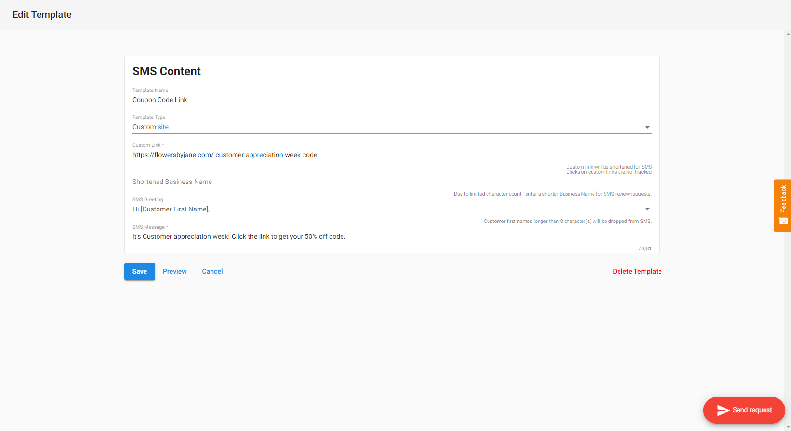

:::warning Obsoleto
Desde el 21 de febrero de 2025, Customer Voice es heredado (legacy). Usa [Reputation AI Premium](https://partners.vendasta.com/marketplace/products/RM) para reseñas y NPS por correo electrónico y SMS.
:::

## Cómo agregar enlaces personalizados a las solicitudes de reseña por SMS

1. Ve a `Customer Voice` → `Templates` → `Add New Template`
2. Selecciona `New SMS Template`, ponle un nombre a la plantilla y luego selecciona `New Custom Site template`
3. Personaliza la plantilla con tu enlace personalizado y mensaje, luego `Save`.

:::info
No se hace seguimiento de los clics en enlaces personalizados.
:::

## ¿Quién tiene acceso a esto?

Todas las **cuentas de Customer Voice Pro con un complemento de SMS activo** podían usar esta función.

## Casos de uso para enlaces personalizados

Tus clientes podían enviar un mensaje SMS a sus propios clientes con un enlace a cualquier sitio web. Esto podía incluir, entre otros:

- Enlace para recibir un código de cupón 
- Enlace para programar una cita o ver una página de confirmación de cita
- Enlace al sitio web de la empresa (por ejemplo, para promocionar una oferta)
