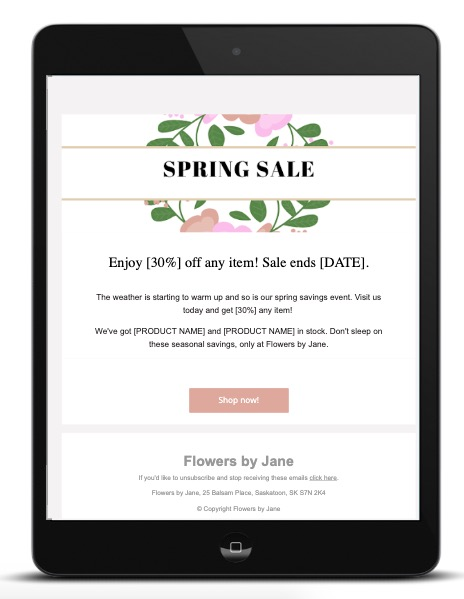
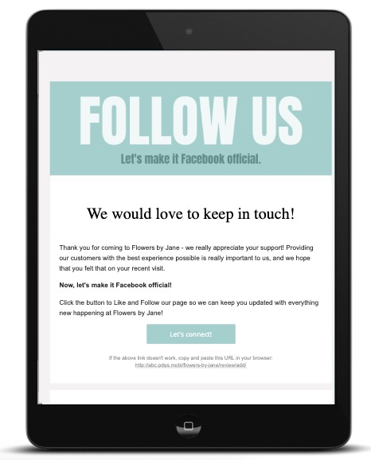
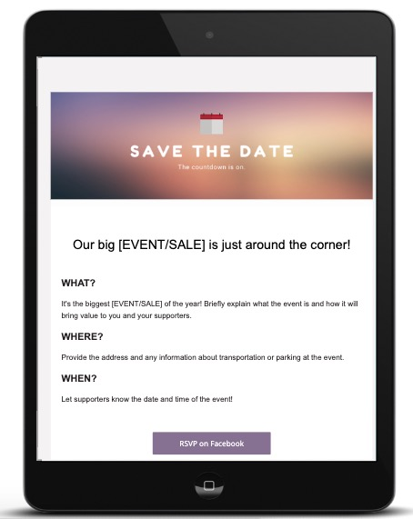

:::warning Obsoleto
Desde el 21 de febrero de 2025, Customer Voice es heredado (legacy). Usa [Reputation AI Premium](https://partners.vendasta.com/marketplace/products/RM) para reseñas y NPS por correo electrónico y SMS.
:::

Customer Voice se usaba comúnmente para enviar solicitudes de reseña, pero también admitía otros tipos de correo electrónico. Elige una de las tres plantillas a continuación para empezar a enviar correos promocionales, boletines o invitaciones a eventos.

## ¿Cómo uso estas plantillas?

1. Haz clic en el archivo .pdf que quieras enviar
2. Copia el código HTML al portapapeles (CTRL + C)
3. Abre una cuenta de [Customer Voice](https://partners.vendasta.com/manage-accounts?marketId=default&account_filters=%7B%22products%22%3A%22Customer%20Voice%3AActive%22%7D)
4. Selecciona `Templates` → `Add New Template` → `New Email Template` 
5. Ponle un nombre a tu plantilla y selecciona `Create` en `Blank Template`
6. Completa los campos requeridos
7. Haz clic en el ícono `<>` en la barra de herramientas del editor
8. Elimina el código fuente existente 
9. Pega el código fuente copiado (CTRL + V)

---

Si querías ver otras plantillas de correo electrónico en Customer Voice o tenías comentarios sobre las plantillas anteriores, podías contactar a tu vendedor asignado o escribir a [support@vendasta.com](mailto:support@vendasta.com).

## Plantillas disponibles

### Plantilla de invitación a evento

- [Descargar código HTML de Event Invitation](/files/legacy-customer-voice/email-templates/Event_Invitation_HTML_code.pdf) (40 KB)

### Plantilla de síguenos

- [Descargar código HTML de Follow Us](/files/legacy-customer-voice/email-templates/Follow_Us_HTML_code.pdf) (40 KB)

### Plantilla de oferta de primavera

- [Descargar código HTML de Spring Sale](/files/legacy-customer-voice/email-templates/Spring_Sale_HTML_code.pdf) (40 KB)
